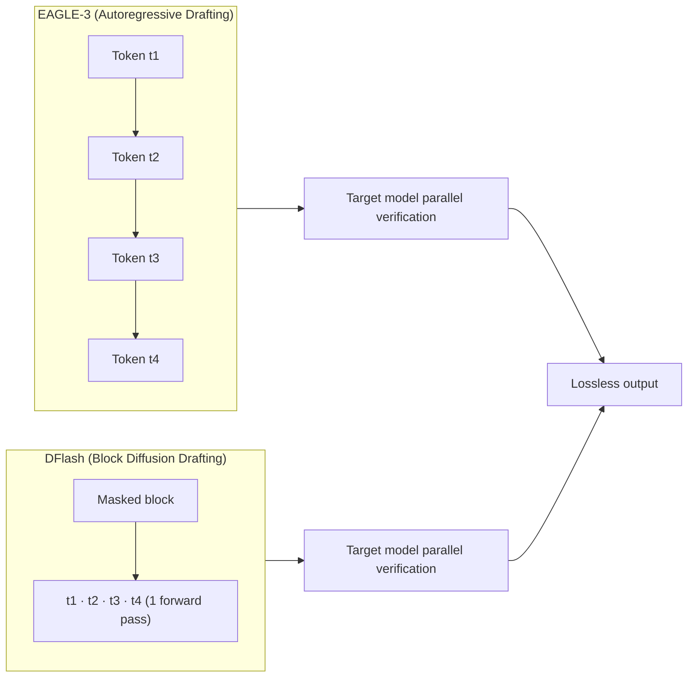

An illustration of the DFlash concept: the drafting step shifts from sequential token generation to parallel block proposal.

## Overview

In large-scale language model serving, decoding throughput is what determines both infrastructure cost and the latency a user actually feels. As long as a model generates tokens one at a time in an autoregressive loop, there is a structural ceiling: no matter how fast the GPU is, the full model must be traversed once per token. Speculative decoding is the most practical known technique for bypassing this bottleneck, yet earlier drafters were also autoregressive, which kept acceleration ratios in the 2-3x range.

On June 23, 2026, the NVIDIA Technical Blog introduced DFlash, developed by researchers at UC San Diego. DFlash applies a block diffusion model to the drafting stage of speculative decoding, proposing future tokens as a block in one forward pass rather than one at a time. Based on published figures, it achieves up to 6x lossless single-stream speedup and up to 15x serving throughput on NVIDIA Blackwell at the same latency target.

The most operationally significant property is **drop-in integration**. DFlash is supported by vLLM, SGLang, and TensorRT-LLM. On vLLM, switching from EAGLE-3 to DFlash requires only a config change - no application code modifications. This post explains how DFlash works, what the published benchmarks say, and what it means for ThakiCloud's K8s-based multi-tenant AI/ML serving platform. All numbers cited here are official figures published by NVIDIA and UCSD. We have not reproduced these results on ThakiCloud hardware, and we address that honestly in a dedicated section.

## What the Technology Does

Speculative decoding has two stages. A small draft model proposes future tokens, and a large target model verifies them in parallel, accepting the longest valid prefix. When the draft is correct, a single verification pass through the target model confirms multiple tokens. The problem is that conventional drafters are autoregressive: drafting cost grows linearly with the number of speculative tokens, which caps the throughput gains.

DFlash replaces the autoregressive drafter with a lightweight block diffusion drafter. A block diffusion model denoises a masked block of tokens all at once, combining parallel generation with an autoregressive block structure. DFlash applies this idea only to the drafting stage; verification is still handled by the trusted autoregressive target model. That separation is what preserves output quality. Standalone diffusion LLMs often trail autoregressive models in accuracy and require multiple denoising steps, but in DFlash the draft only needs to be good enough to pass verification - the final output distribution is guaranteed by the target model's parallel check. The method is therefore lossless.



The second advantage is drafting cost structure. An autoregressive drafter's cost scales with the number of speculative tokens, while a diffusion drafter generates all tokens in one parallel pass, so drafting latency stays nearly flat as the block size grows. This allows DFlash to use a deeper, more expressive draft model without increasing latency. In practice, DFlash uses a small 5-layer drafter (8 layers for Qwen3-Coder). That contrasts with earlier diffusion-drafter research (DiffuSpec, SpecDiff-2), which used large 7B-parameter drafters and capped speedup at 3-4x.

DFlash combines three techniques. First, **block diffusion drafting** predicts multiple future tokens in parallel. Second, **target hidden-state conditioning** transfers context features from the target model to the drafter via KV injection. Third, verification-friendly training improves the acceptance rate of draft blocks. Together these create the balance of small drafter, parallel block proposal, and lossless verification.

## Installation and Integration

DFlash ships checkpoints and framework support together, so adoption requires very little new code. Public checkpoints are available in the `z-lab/dflash` collection on Hugging Face; 20 checkpoints were available at announcement time. On vLLM, you swap the EAGLE-3 speculative config for the DFlash config with no application refactoring. Below is the vLLM example from the official documentation.

```bash
vllm serve Qwen/Qwen3.5-27B \
  --speculative-config '{"method": "dflash", "model": "z-lab/Qwen3.5-27B-DFlash", "num_speculative_tokens": 15}' \
  --attention-backend flash_attn \
  --max-num-batched-tokens 32768
```

Setting `method` to `dflash` in `--speculative-config` and passing the draft checkpoint path is all that changes. Because the flag structure mirrors the existing EAGLE-3 serving setup, you are effectively hot-swapping the speculative decoding method in a running vLLM deployment. SGLang and TensorRT-LLM work the same way, accepting DFlash draft checkpoints through the same speculative decoding API.

The Transformers backend supports Qwen3 and LLaMA-3.1 model families and provides a `spec_generate` interface that pairs the draft and target models.

```python
from transformers import AutoModel, AutoModelForCausalLM, AutoTokenizer

draft = AutoModel.from_pretrained(
    "z-lab/Qwen3-8B-DFlash-b16", trust_remote_code=True,
    dtype="auto", device_map="cuda:0").eval()
target = AutoModelForCausalLM.from_pretrained(
    "Qwen/Qwen3-8B", dtype="auto", device_map="cuda:0").eval()
tokenizer = AutoTokenizer.from_pretrained("Qwen/Qwen3-8B")

messages = [{"role": "user", "content": "How many positive divisors does 196 have?"}]
input_ids = tokenizer.apply_chat_template(
    messages, return_tensors="pt", add_generation_prompt=True,
    enable_thinking=False).to(draft.device)

output = draft.spec_generate(
    input_ids=input_ids, max_new_tokens=2048, temperature=0.0, target=target)
```

All code blocks above are cited from official examples published by the NVIDIA Technical Blog and MarkTechPost; they are not output captured from ThakiCloud infrastructure. DFlash throughput numbers were measured on NVIDIA Blackwell (DGX B300, 8 GPUs) with TensorRT-LLM. Our environment does not have those accelerators or checkpoints available, so we have not reproduced the results under identical conditions. All figures below therefore come from clearly attributed public sources; no self-measured numbers are included.

## Benchmark Results (Published Figures)

DFlash's speedup numbers fall into two categories, measured differently, and should be read accordingly.

**Lossless single-stream speedup.** The UCSD paper reports an average of 4.86x and a peak of 6.08x on MATH-500 for Qwen3-8B greedy decoding on the Transformers backend. Under the same conditions, EAGLE-3 achieves an average of 1.76x at tree size 16 and 2.02x at tree size 60. Task-level figures are shown in the chart below.


The chart visualizes official numbers from the UCSD DFlash paper and does not represent direct ThakiCloud measurements. GSM8K 5.15x, MATH-500 6.08x, AIME25 5.62x, HumanEval 5.14x, and LiveCodeBench 5.51x show particularly large gains on math and code reasoning tasks. MT-Bench, which allows more varied responses, is comparatively lower at 2.75x. This is consistent with the general principle that speculative decoding gains more as output becomes more predictable (higher acceptance rate).

**Throughput at a fixed latency target.** The 15x figure NVIDIA reports refers to serving gpt-oss-120b on a DGX B300 (8 Blackwell GPUs) with TensorRT-LLM, achieving over 15x the throughput of autoregressive decoding at the 500-600 tokens/second per user operating point. At the same point, DFlash is approximately 1.5x faster than EAGLE-3. In a separate NVIDIA Speed-Bench (latency speedup at the same concurrency), gpt-oss-120b shows DFlash at 2.3x vs. EAGLE-3 at 1.7x, and Llama 3.1 8B Instruct shows DFlash at 2.8x vs. EAGLE-3 at 2.2x. Across tasks the reported range extends to Gemma 4 31B at up to 5.8x (vLLM) and Qwen3 8B at 5.1x (SGLang).

In summary, "6x" is lossless single-request speedup; "15x" is serving throughput when many users are held to the same latency target. The two numbers answer different questions. To estimate what to expect in your own deployment, fix your concurrency and latency target first, then look at the figure for that operating point.

## Implications for the ThakiCloud K8s AI/ML Platform

ThakiCloud runs a stack where Kueue schedules GPUs on Kubernetes and vLLM serves models across multiple tenants. DFlash is particularly well-suited to this setup for three reasons.

First, **it is a drop-in replacement with low operational risk**. If you are already running speculative decoding with EAGLE-3, you can switch `method` and the draft checkpoint to DFlash and validate it as a canary deployment. Because it is a lossless technique - the API contract and output distribution are unchanged - tenants see the same response content; only throughput and latency improve. An optimization that does not break output consistency is rare and valuable in multi-tenant SaaS.

Second, **GPU efficiency directly translates to unit economics**. Handling more concurrent requests at the same latency target with the same GPU means lower serving cost per tenant. This matters most in environments where adding capacity is constrained, such as on-premises deployments or domestic-region GPU allocations. It aligns precisely with ThakiCloud's emphasis on on-premises deployment, cost efficiency, and self-hosting. That said, the 15x figure is a ceiling measured on Blackwell with TensorRT-LLM; expectations should be adjusted for the GPU generation and serving backend actually in use.

Third, **the gains are largest on math and code workloads**. Internal coding agents, data analysis pipelines, and tool-heavy agent workloads produce structured outputs, so acceptance rates tend to be higher. Tenants running these workloads are likely to see above-average gains from DFlash. Given ThakiCloud's focus on multi-tenant agent platforms, it makes sense to prioritize DFlash serving profiles for tenants with code and reasoning workloads.

A natural longer-term roadmap: expose speculative decoding method as a per-tenant serving profile in the vLLM Helm chart, and run a background cost measurement loop to track whether token-per-dollar actually improves after DFlash is applied. The principle of measuring rather than assuming applies to inference optimization as much as anywhere else.

## Limitations and Caveats

DFlash is not a universal solution. The headline numbers are tied to specific hardware and backends. The 15x result requires Blackwell with TensorRT-LLM; older GPU generations and other serving stacks will see smaller gains. The 6x lossless figure is single-stream greedy decoding; high-temperature sampling and conversational workloads with more varied outputs will lower acceptance rates and reduce the benefit (MT-Bench at 2.75x illustrates this).

Second, speculative decoding adds memory overhead. The draft model and its KV cache occupy GPU memory, which can create trade-offs with concurrency limits in memory-constrained multi-tenant environments. The small drafter reduces this burden but does not eliminate it.

Third, the responsibility for operational validation rests with the operator. The published figures are clearly sourced, but there is no guarantee they reproduce identically under your model, traffic, and concurrency. As noted, ThakiCloud has not reproduced these results in our environment, so we cannot verify them independently. Canary deployment with direct measurement of token cost and p50/p99 latency is required before committing to production. Finally, because block diffusion drafters are a relatively new approach, not all model architectures have checkpoints available. Check that a draft checkpoint exists for your target model before proceeding.

## Sources

- [Boost Inference Performance up to 15x on NVIDIA Blackwell Using DFlash Speculative Decoding (NVIDIA Technical Blog, 2026-06-23)](https://developer.nvidia.com/blog/boost-inference-performance-up-to-15x-on-nvidia-blackwell-using-dflash-speculative-decoding)
- [DFlash Speculative Decoding Drafts Whole Token Blocks in Parallel (MarkTechPost, 2026-06-24)](https://www.marktechpost.com/2026/06/24/dflash-speculative-decoding-drafts-whole-token-blocks-in-parallel-for-up-to-15x-higher-throughput-on-nvidia-blackwell/)
- [DFlash public checkpoint collection (Hugging Face, z-lab/dflash)](https://huggingface.co/collections/z-lab/dflash)
- [vLLM Speculative Decoding documentation](https://docs.vllm.ai/en/latest/features/speculative_decoding/)
