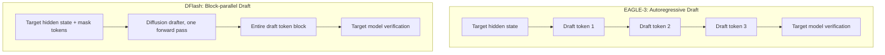

## Overview

In LLM serving, GPU time is the most expensive resource, and the step that consumes the most of it is autoregressive decoding, producing tokens one at a time, sequentially. Speculative decoding attacks that bottleneck directly. A small drafter model proposes multiple tokens ahead, and a large target model verifies all of them in a single forward pass, bypassing the sequential generation constraint.

DFlash is a new variant of speculative decoding that has been generating interest in the vLLM community. On June 24, the vLLM project account shared NVIDIA AI's announcement of DFlash support, drawing attention to a straightforward claim: swap the existing EAGLE-3 drafter checkpoint for a DFlash checkpoint in vLLM, and you get meaningfully larger speedups with no additional code changes.

This post covers what makes DFlash different from EAGLE-3, how to enable it in vLLM, and why the technique matters for organizations like ThakiCloud that self-host model serving. Performance figures are cited from NVIDIA and Red Hat's published announcements, with clear attribution. Numbers we have not reproduced ourselves are marked accordingly.

## What DFlash Is

Speculative decoding performance ultimately comes down to two things: how many tokens the drafter proposes per step (draft length), and how often those proposals are accepted (acceptance rate). The EAGLE family feeds the target model's hidden states into the drafter, which then predicts the next token autoregressively, one token per forward pass. Accurate, but the draft phase itself is broken into multiple small forward passes.

DFlash changes the approach. A small diffusion LLM drafter predicts an entire token block in a single forward pass. It still conditions on the target model's hidden states, but instead of EAGLE-3's causal attention, it uses a non-causal attention mask so each query attends simultaneously to the verifier's hidden states and to masked token embeddings. The result is that all draft tokens in the block are generated in parallel.

That block-parallel structure is the key insight. By removing the sequential dependency inherent in autoregressive drafting, DFlash can, according to NVIDIA and vLLM, achieve 2-3x larger speedups over EAGLE-3 for synchronous requests. It proposes more tokens per step without inflating draft-generation latency, which puts it closer to the original goal of speculative decoding: propose many tokens at once, fast.

The diagram below is a simplified comparison of the two approaches.



## Enabling DFlash in vLLM

The integration path between DFlash and vLLM runs through the Speculators library. Speculators is the official vLLM library for building, evaluating, and storing speculative decoding algorithms. It connects the drafter to the target model's inference path via hidden states. According to the Red Hat developer blog, DFlash support and online training were added in Speculators v0.5.0.

The practically important point is that only a checkpoint swap is required. NVIDIA states that replacing an EAGLE-3 drafter with a DFlash checkpoint in vLLM needs no code changes beyond configuration. vLLM's list of supported speculative decoding methods already includes n-gram, suffix, EAGLE, and DFlash.

Speculative decoding in vLLM is enabled with `--speculative-config` (or the equivalent Python argument). Specifying a DFlash checkpoint as the drafter looks roughly like this. Because the checkpoint is stored in the Speculators format, vLLM detects the algorithm type automatically.

```bash
# Serving a target model with a DFlash drafter (representative form)
# Exact checkpoint repo id: check the RedHatAI / NVIDIA speculator collections on HF
vllm serve <target-model> \
  --speculative-config '{"model": "<dflash-speculator-checkpoint>", "num_speculative_tokens": 8}'
```

If you go further into training or producing your own checkpoints, Speculators exposes DFlash-specific parameters: `--speculator-type dflash`, `--draft-vocab-size`, `--block-size`, `--max-anchors`, `--num-layers`, and `--target-layer-ids`. The block size (`--block-size`) is the primary knob that controls how many tokens are proposed per step.

NVIDIA has released 20 DFlash checkpoints on Hugging Face along with training recipes for both Blackwell and Hopper GPUs. That means you can pull a pre-trained drafter and attach it to vLLM immediately, and if needed, run online training on your own domain data.

> Note: The configuration examples in this post are representative forms based on vLLM's `--speculative-config` schema. For exact checkpoint repo IDs and current argument names, consult the vLLM Speculators official documentation. We did not reproduce the benchmarks below on our own hardware (Apple Silicon / MPS) due to the Blackwell/Hopper dependency, all figures are from published announcements.

## Published Performance Numbers

These are NVIDIA and vLLM's reported figures, not numbers we have reproduced ourselves.

- When serving gpt-oss-120b on NVIDIA Blackwell, inference throughput improved by up to 15x at the same interactivity level (user-perceived response speed). [NVIDIA stated]
- For Llama 3.1 8B at the same concurrency level, interactivity nearly doubled compared to the latest EAGLE-3 speculative decoding. [NVIDIA stated]
- A 2-3x larger speedup over EAGLE-3 for synchronous requests was also cited. [vLLM stated]

The "up to 15x" figure is a ceiling number for a specific model (gpt-oss-120b), specific hardware (Blackwell), and a specific operating condition (same interactivity). With smaller models, different hardware, or higher concurrency, the gain shrinks. The more conservative "nearly 2x" number reported for Llama 3.1 8B illustrates this. Do not read the 15x headline as applying to every workload.

## Implications for the ThakiCloud K8s AI/ML SaaS Platform

ThakiCloud runs a multi-tenant AI/ML platform on Kubernetes, scheduling GPUs with Kueue and serving models with vLLM. Speculative decoding is the optimization that most directly touches cost in this architecture. If the same GPU produces more tokens per second, the per-tenant unit cost falls, or the same spend supports higher concurrency.

Three reasons DFlash is interesting from ThakiCloud's perspective.

First, adoption cost is low. If you are already running vLLM with Speculators and an EAGLE-3 drafter, switching to DFlash is essentially a checkpoint replacement plus a configuration change. The serving stack does not need to be rebuilt. In a K8s environment, the natural flow is to build a new deployment with the updated drafter container image and a revised `--speculative-config`, then validate it as a canary before cutting over.

Second, the block-parallel design particularly benefits interactive workloads. For coding assistants, chat, and agent loops, where response latency directly shapes the user experience, the same-interactivity speedup translates into lower P50/P99 latency. In a multi-tenant environment, faster token throughput for one tenant means more GPU slack that can be redistributed to others.

Third, it aligns directly with our on-premises and cost-efficiency positioning. Security-sensitive customers want their models running inside their own infrastructure. Reducing the per-token cost through speculative decoding strengthens the argument that on-premises serving can be economically viable without falling back to cloud APIs. The fact that DFlash checkpoints come with recipes for both Blackwell and Hopper means there is a path to adoption even in on-premises environments that do not have the latest-generation hardware.

That said, you must measure against your own workload distribution before deploying. The 15x figure is NVIDIA's number, not ThakiCloud's. The responsible sequence is to run a canary with the model sizes and concurrency patterns we actually serve, measure real acceptance rates and speedups, and update the tenant pricing model based on those results.

## Limitations and Counterarguments

DFlash is not a universal solution. There are clear weaknesses to account for when evaluating adoption.

Speculative decoding gains are sensitive to concurrency. Under high load with batches close to full, the GPU is already saturated with verification compute, leaving less room to exploit the drafter's additional parallelism. The published figures qualify their results with conditions like "same interactivity" or "same concurrency" precisely because of this, they cannot be read as unconditional throughput improvements.

There is also significant dependence on drafter quality. If the diffusion drafter does not closely approximate the target distribution, acceptance rates fall and the cost of re-sampling rejected tokens erodes the gain. In specialized domains, a general-purpose pre-trained checkpoint may accept poorly, and bringing acceptance rates up would require online training on your own data, additional work.

Ecosystem maturity is a variable too. DFlash is a recent technique, and support only landed in Speculators v0.5.0. The published checkpoints do not cover every model that production deployments serve, and a substantial part of the reported speedup is tied to Blackwell hardware, which increases hardware dependency. Stable production adoption requires validation in your specific environment and time to build operational familiarity.

Even so, the direction is clear. Speculative decoding is no longer an optional optimization, it is becoming a baseline layer of LLM serving. DFlash advances that baseline by a meaningful step. For organizations already running vLLM and Speculators, the barrier to running a trial is low enough to be worth it.

## Sources

- [Boost Inference Performance up to 15x on NVIDIA Blackwell Using DFlash Speculative Decoding - NVIDIA Technical Blog](https://developer.nvidia.com/blog/boost-inference-performance-up-to-15x-on-nvidia-blackwell-using-dflash-speculative-decoding)
- [Dflash - Speculators Docs (vLLM)](https://docs.vllm.ai/projects/speculators/en/latest/user_guide/algorithms/dflash/)
- [Speculators v0.5.0: DFlash support and online training - Red Hat Developer](https://developers.redhat.com/articles/2026/06/04/speculators-v050-dflash-support-and-online-training)
- [Speculative Decoding - vLLM Documentation](https://docs.vllm.ai/en/stable/features/speculative_decoding/)
- [vllm-project/speculators - GitHub](https://github.com/vllm-project/speculators)
