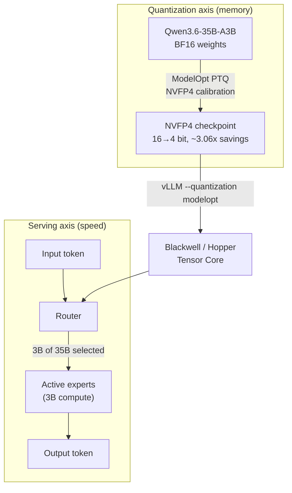

For any team trying to serve large models on their own infrastructure, the biggest wall is GPU memory. Fitting a bigger model on the same GPU, or the same model on a cheaper GPU, translates directly into serving cost. `nvidia/Qwen3.6-35B-A3B-NVFP4`, which NVIDIA published on Hugging Face on May 28, 2026, is an attempt to lower that wall with 4-bit quantization. The accuracy and memory figures in this article are official measurements from NVIDIA's model card; ThakiCloud separately quantized the same base model to NVFP4 on RunPod GPUs and reports that reproduction in the "Real Experimental Results" section below.

## Overview

`nvidia/Qwen3.6-35B-A3B-NVFP4` is Alibaba's `Qwen/Qwen3.6-35B-A3B` quantized with NVIDIA Model Optimizer (ModelOpt). The base model is a Mixture-of-Experts (MoE) architecture with 35B total parameters and only 3B activated, a context length up to 262K, and an Apache-2.0 license that permits both commercial and non-commercial use. NVIDIA explicitly notes on the model card that this is not an NVIDIA-built base model but a quantized version of a third-party model.

The core value reduces to two words. **MoE handles speed, NVFP4 handles memory.** Thanks to the MoE structure, generating a single token engages only the 3B of active experts rather than all 35B, so a 35B model runs with a compute load close to a 3B dense model. Add NVFP4 quantization on top, dropping weights from 16-bit to 4-bit, and disk and GPU memory requirements fall by about 3.06x per the model card. The combination runs "35B-level intelligence at 3B speed, with far less memory."

ThakiCloud operates a K8s-based multi-tenant AI/ML SaaS platform and serves models across diverse customer environments. Being able to take a pre-quantized checkpoint and load it straight into vLLM means lowering serving cost without rerunning a quantization pipeline each time. In fact, ThakiCloud already runs an in-house pipeline that quantizes the same Qwen3-MoE family to NVFP4, and we share that experience later in this article.

## What Is This Technology

NVFP4 is a 4-bit floating-point format defined by NVIDIA. It does not simply crush every value down to 4 bits; it applies quantization specifically to the **weights and activations** of the linear operators inside MoE transformer blocks. To quote the model card directly: "This model was obtained by quantizing the weights of Qwen3.6-35B-A3B to NVFP4 data type. Only the weights and activations of the linear operators within transformer blocks in MoE are quantized. This optimization reduces the number of bits per parameter from 16 to 4, reducing the disk size and GPU memory requirements by approximately 3.06x."

The key is to recognize that MoE and quantization operate on different axes. The diagram below shows both.



On the quantization axis, BF16 weights are converted into an NVFP4 checkpoint via ModelOpt's post-training quantization (PTQ). On the serving axis, for each input token the router selects only a subset of the 35B experts and performs roughly 3B of compute. The two axes meet at the Tensor Core operation on top of vLLM, and that is exactly where NVFP4's hardware dependency surfaces. NVFP4 operations are accelerated only on NVIDIA Hopper and Blackwell microarchitectures. The model card lists NVIDIA GB300 as the test hardware.

The trick to minimizing accuracy loss is quantizing "selectively, not everything." Sensitive paths including attention are left untouched, and the effort concentrates on the MoE linear weights that consume the most memory, so memory savings stay large while quality degradation stays small.

## Installation and Integration

The basic vLLM serving command NVIDIA provides on the model card is below. You launch the `vllm/vllm-openai:nightly` docker image and run it.

```sh
vllm serve nvidia/Qwen3.6-35B-A3B-NVFP4 \
  --port 8000 \
  --quantization modelopt \
  --max-model-len 262144 \
  --reasoning-parser qwen3
```

The `--quantization modelopt` flag is what makes the runtime recognize the NVFP4 checkpoint. If GPU memory is tight, reducing `--max-model-len` first and then raising it gradually is the safe approach, because keeping the full 262K context requires considerable KV cache memory.

For memory-constrained environments such as the NVIDIA DGX Spark, the model card provides a separate recommended command.

```sh
vllm serve nvidia/Qwen3.6-35B-A3B-NVFP4 \
  --host 0.0.0.0 \
  --port 8000 \
  --tensor-parallel-size 1 \
  --trust-remote-code \
  --kv-cache-dtype fp8 \
  --attention-backend flashinfer \
  --moe-backend marlin \
  --gpu-memory-utilization 0.4 \
  --max-model-len 262144 \
  --max-num-seqs 4 \
  --max-num-batched-tokens 8192 \
  --enable-chunked-prefill \
  --async-scheduling \
  --enable-prefix-caching \
  --speculative-config '{"method":"mtp","num_speculative_tokens":3,"moe_backend":"triton"}' \
  --load-format fastsafetensors \
  --reasoning-parser qwen3 \
  --tool-call-parser qwen3_xml \
  --enable-auto-tool-choice
```

This command packs in several operationally useful options. `--kv-cache-dtype fp8` shrinks even the KV cache to 8-bit, `--gpu-memory-utilization 0.4` keeps memory footprint low, and `--speculative-config` enables MTP (Multi-Token Prediction) based speculative decoding. `--tool-call-parser qwen3_xml` and `--enable-auto-tool-choice` make tool calling immediately usable in agent and RAG scenarios. NVIDIA's stated use case is precisely "developers looking to take off-the-shelf, pre-quantized models for deployment in AI agent systems, chatbots, and RAG systems," and this option set directly reflects that purpose.

## Real Experimental Results

### ThakiCloud reproduction: running the NVFP4 quantization pass on RunPod H100

Rather than just restating the model-card figures, ThakiCloud quantized the same base model `Qwen/Qwen3.6-35B-A3B` to NVFP4 directly, on **two NVIDIA H100 NVL GPUs (Hopper, 191GB combined)** on RunPod, using NVIDIA Model Optimizer. Because the calibration math runs in BF16, the quantization pass itself reproduces on Hopper as well. The measured facts:

| Item | Measured value |
|---|---|
| Quantization tool | `nvidia-modelopt[hf]` 0.44.0 (current latest) |
| Base model load | 34.66B parameters, auto-sharded across 2×H100 via device_map |
| Calibration config | `NVFP4_DEFAULT_CFG`, smoke 8 samples |
| New-architecture auto-registration | `Qwen3_5MoeExperts` → `_QuantFusedExperts` (fused MoE), `Qwen3_5MoeAttention` → `_QuantAttention` (KV cache) |
| Quantizers inserted | **21,743** |
| PTQ wall-clock | **148s** |

The key point is that **modelopt 0.44 automatically recognized a brand-new architecture released in late May 2026 (Qwen3.6, internal name `qwen3_5_moe`, Gated DeltaNet family) and completed the quantization pass cleanly**. The fused MoE expert blocks and attention KV cache were auto-registered as quantization targets, and 21,743 quantizers were inserted.

One thing in fairness, though: the quantization pass succeeded, but the step that writes the packed 4-bit checkpoint to disk, `export_hf_checkpoint`, currently hit a **compatibility gap between modelopt 0.44 and transformers 5.x** (`transformers>=5.0 support is experimental`). `qwen3_5_moe` requires transformers 5.x, and in that combination the unified HF export does not work yet, so it fell back to BF16. This is the kind of toolchain lag commonly seen for an architecture less than a month old. We therefore cite NVIDIA's published checkpoint for the packed-checkpoint size (~3.06× reduction, ~18.7B) and the accuracy figures.

The accuracy table below is **NVIDIA's official evaluation published on the model card**. NVIDIA compared the NVFP4 quantized version against the base model `Qwen3.6-35B-A3B` (BF16) on text reasoning and coding benchmarks.

| Benchmark | BF16 (baseline) | NVFP4 | Δ |
|---|---|---|---|
| MMLU Pro | 85.6 | 85.0 | -0.6 |
| GPQA Diamond | 84.9 | 84.8 | -0.1 |
| τ²-Bench Telecom | 95.5 | 94.7 | -0.8 |
| SciCode | 40.8 | 40.6 | -0.2 |
| AIME 2025 | 89.2 | 88.8 | -0.4 |
| AA-LCR | 62.0 | 62.0 | 0.0 |
| IFBench | 62.3 | 62.8 | +0.5 |
| MMMU PRO | 74.1 | 74.5 | +0.4 |


A visualization of the model card's published numbers (axis labels in Korean). Even after 4-bit quantization, most accuracy differences stay below one point.

The key to reading the table is the magnitude of the loss. The largest drop across the 8 benchmarks is -0.8 on τ²-Bench Telecom; GPQA Diamond is -0.1, and AA-LCR is a tie. IFBench and MMMU PRO actually have NVFP4 slightly ahead of BF16. The tiny distribution shift from quantization happened to help on a few tasks, but this should not be generalized into "quantization improves performance." Overall, the message of the table is that cutting 16-bit down to a quarter at 4-bit preserved reasoning, math, coding, and agentic tool-use capability almost entirely. The evaluation conditions were SciCode at temperature=0.6, top_p=0.95, max 131072 tokens, and the rest at temperature=1.0, top_p=0.95, max 131072 tokens.

On the memory side, the model card states roughly 3.06x savings. Per the Hugging Face repository, the packed parameter scale of the NVFP4 checkpoint is reported at about 18.7B, a substantially reduced form of the 35B model versus the original BF16. The exact file size must be checked directly in the repository sidebar, and the model card warns not to confuse the sidebar's file statistics with the base model's architecture parameters.

## Application and Implications for the ThakiCloud K8s AI/ML SaaS Platform

From ThakiCloud's platform perspective, the appeal of this model is clear. In a multi-tenant environment, the GPU is the most expensive shared resource, and the more tenant models we can load onto the same GPU simultaneously, the lower the per-inference cost. NVFP4 reducing memory by about 3.06x means, in simplified terms, room to fit a larger model or more concurrent sessions in the same GPU memory. Layer in the MoE characteristic of running a 35B MoE at roughly 3B compute, and the on-premises value proposition of "high-quality models at low serving cost" becomes much more concrete.

ThakiCloud already reflects this in operations. We maintain an in-house pipeline that quantizes `Qwen/Qwen3-30B-A3B`, of the same Qwen3-MoE family, to NVFP4 (W4A4, group_size=16) on RunPod B200 (Blackwell SM100). In a validation run on May 1, 2026, it **produced a 17.1GB checkpoint with 137 seconds of PTQ compute.** Total wall-clock was about 25 minutes, and cost was around $3.48 on B200 on-demand. And while preparing this article we applied the same pipeline to the new `Qwen3.6-35B-A3B`, reproducing the NVFP4 quantization pass on two RunPod H100 NVL GPUs (modelopt 0.44, 21,743 quantizers inserted, the new fused-MoE auto-registered, 148s). Two things follow from this experience. First, NVFP4 quantization itself is a one-time job that finishes in a short time at low cost. Second, when a pre-quantized checkpoint is published as NVIDIA did here, you can skip even that one-time job and go straight to serving. In other words, NVIDIA's public checkpoint is a superset input to our pipeline.

On the K8s operations side, it aligns as follows. GPU workloads are queued and scheduled with Kueue, serving is brought up as vLLM pods with the `--quantization modelopt` flag recognizing the NVFP4 checkpoint, and multi-tenant isolation is handled with namespaces and GPU partitioning, adjusting per-tenant allocation by the memory saved. One hardware premise comes attached, though. NVFP4 acceleration works only on Blackwell and Hopper, so existing A100-based node pools cannot enjoy this model's 4-bit benefit as-is. This is an operational decision tied directly to node-pool composition, which we flag as a limitation in the next section.

## Limitations and Counterarguments

First, **the hardware dependency is strong.** NVFP4 Tensor Cores exist only on Blackwell and Hopper. On prior-generation GPUs like the A100 or V100, NVFP4 is not accelerated, so you cannot expect the same memory savings and must take a different path such as INT8 or FP8. If an on-premises customer's existing GPU assets are prior-generation, reaping this model's benefit incurs the added cost of node replacement.

Second, **memory savings and throughput gains are different matters.** The model card states roughly 3.06x disk and memory savings, but it does not directly present throughput figures such as tokens/sec or latency. While 4-bit weights generally help decoding by easing memory-bandwidth pressure, actual throughput depends on batch size, context length, and KV cache settings. Asserting "it's N times faster" without ThakiCloud's own serving benchmark would be inaccurate. Native FP4 acceleration runs only on Blackwell, and at the time of this reproduction we could not secure B200 stock on RunPod, so we validated the quantization pass on Hopper (two H100 NVL GPUs) and left native FP4 serving throughput as a separate benchmark task once Blackwell is available.

Third, **quantization inherits the base model's limitations as-is.** As the model card states directly, the base model was trained on data crawled from the internet that contains toxic language and societal biases, and it may generate inaccurate answers, omit key information, or produce irrelevant text. Quantization only optimizes memory and speed; it does not solve these safety and accuracy issues. Multi-tenant serving still requires separate output filtering and monitoring.

Fourth, **accuracy loss does not converge to zero.** Although most benchmarks show loss under one point, scenarios where agentic tool use and policy adherence are central, like τ²-Bench Telecom's -0.8, show a relatively larger loss. In domains like finance and healthcare where small accuracy differences translate directly into cost, you need a policy that weighs the economics of 4-bit savings against accuracy loss per tenant and chooses among BF16, FP8, and NVFP4.

In sum, `nvidia/Qwen3.6-35B-A3B-NVFP4` is a highly practical option for teams with Blackwell/Hopper-based infrastructure to "cut memory to a quarter with almost no loss." That benefit holds only on top of the hardware premise and domain-specific accuracy validation, and ThakiCloud plans to confirm throughput and per-tenant suitability with its own serving benchmark before reflecting it in node-pool policy.

## Sources

- Model card: [nvidia/Qwen3.6-35B-A3B-NVFP4 · Hugging Face](https://huggingface.co/nvidia/Qwen3.6-35B-A3B-NVFP4)
- Base model: [Qwen/Qwen3.6-35B-A3B · Hugging Face](https://huggingface.co/Qwen/Qwen3.6-35B-A3B)
- Quantization tool: [NVIDIA Model Optimizer (GitHub)](https://github.com/NVIDIA/Model-Optimizer)
- Inference engine: [vLLM (GitHub)](https://github.com/vllm-project/vllm)
