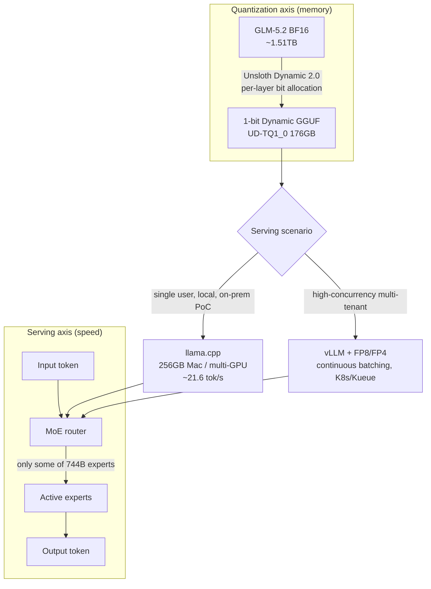

The first wall any team hits when serving a large model on its own infrastructure is always memory. Calling a frontier model through an external API sends your data outside the company; hosting it yourself means putting hundreds of gigabytes — often over a terabyte — of weights somewhere. Unsloth's `unsloth/GLM-5.2-GGUF`, released in June 2026, is a case study in lowering that wall through quantization. It takes GLM-5.2, an open MoE model of roughly 744B parameters, and compresses its 1.51TB BF16 weights down to 176GB with a 1-bit Dynamic GGUF. Every number in this post is a figure published by Unsloth or Hugging Face. The 744B model cannot be hosted in this analysis environment, so instead of self-reproducing benchmarks we cite the public figures and state their limits plainly.

## Overview

GLM-5.2 is an open-weight large language model from Z.ai (Zhipu). It is a Mixture-of-Experts (MoE) model of roughly 744B total parameters with up to a 1-million-token context window. Per Unsloth's docs and multiple reports, it scores on par with Claude 4.8 Opus, GPT-5.5, and Gemini 3.1 Pro across aggregate benchmarks including Artificial Analysis — which is why it is described as the strongest open model to date.

The problem is size. The original BF16 checkpoint is about 1.51TB, hard to place on a single server. What Unsloth did was quantize those weights with its Dynamic 2.0 GGUF method, producing versions from 1-bit through 4-bit. The 1-bit build comes down to 176GB — small enough to load on a single Mac Studio with 256GB of unified memory, or one multi-GPU box. A model rated frontier-class can now run on desk-side hardware rather than a datacenter rack.

ThakiCloud runs a K8s-based multi-tenant AI/ML SaaS platform, and handles on-premises and VPC serving so customers can use strong models without sending data outside. So "how small a footprint can a frontier-class open model run in" maps directly to our customers' serving cost and data sovereignty. The conclusion up front, though: GGUF quantization is powerful for local, single-user scenarios but behaves differently under high-concurrency multi-tenant serving. This post is about that boundary.

## What is this technology

GGUF is the model file format used in the llama.cpp ecosystem, and quantization represents 16-bit floating-point weights with fewer bits to cut size and memory. The key here is Unsloth's **Dynamic 2.0** method. Rather than shaving every layer to 1-bit uniformly, it preserves the layers most sensitive to information loss at higher bit widths and compresses only the insensitive ones aggressively. Even when called "1-bit," the actual bit width is mixed per layer, which is why it loses less accuracy than naive quantization at the same average bit count.

That GLM-5.2 is MoE makes this combination especially meaningful. MoE activates only the experts the router selects for each token, not all 744B, so compute scales with the active parameter count. In other words, **MoE handles compute, Dynamic GGUF handles memory.** The flowchart below shows both axes and the serving paths that fork from a ThakiCloud perspective.



On the quantization axis, BF16 weights pass through Unsloth Dynamic 2.0 calibration to become a 1-bit GGUF. On the serving axis, the MoE router activates only some experts per token. Where the two axes meet, the scenario forks: llama.cpp + GGUF for single-user, local validation; vLLM + GPU quantization for high-concurrency serving. We return to this fork later.

## Installation and integration

GGUF's advantage is a low barrier to entry — you only need llama.cpp or a wrapper. The standard path from Unsloth's docs is as follows.

Download only the quant you want from Hugging Face. For the 1-bit `UD-TQ1_0`:

```bash
# Selectively download only the 1-bit GGUF shards via huggingface_hub
pip install -U huggingface_hub hf_transfer
HF_HUB_ENABLE_HF_TRANSFER=1 \
huggingface-cli download unsloth/GLM-5.2-GGUF \
  --include "*UD-TQ1_0*" \
  --local-dir GLM-5.2-GGUF
```

Then start a server with llama.cpp. Since it is an MoE model, tune `--n-gpu-layers` and context length to your environment.

```bash
# llama.cpp server (OpenAI-compatible endpoint)
./llama-server \
  --model GLM-5.2-GGUF/GLM-5.2-UD-TQ1_0-00001-of-*.gguf \
  --ctx-size 16384 \
  --n-gpu-layers 999 \
  --jinja \
  --host 0.0.0.0 --port 8080
```

On a Mac Studio (M3 Ultra) with 256GB of unified memory, the Metal backend can hold all layers in memory; on x86 multi-GPU setups you offload layers across GPU and CPU/RAM. Higher quant levels need more memory, so your hardware's capacity is effectively the ceiling on which quant you can choose.

## Real-world results

From here on these are figures published by Unsloth and Hugging Face. The 744B model cannot be hosted in this analysis environment, so these are sourced public numbers, not self-reproduced ones. Below is the per-quant file size table.

| Quant | Representative build | File size | vs BF16 (1.51TB) |
|---|---|---|---|
| 1-bit | UD-TQ1_0 | 176GB | ~88% smaller |
| 1-bit | UD-IQ1_S | 204GB | ~86% smaller |
| 2-bit | UD-IQ2_M | 255GB | ~83% smaller |
| 3-bit | UD-Q3_K_XL | 332GB | ~78% smaller |
| 4-bit | Q4_K_M | 456GB | ~70% smaller |


On accuracy, Unsloth reports that Dynamic quantization loses less than naive quantization at the same average bit count. Public material indicates the Dynamic 1-bit build retains roughly 76% [estimated] on its internal accuracy metric, and the Dynamic 2-bit build around 82%, while being more than 80% smaller than the original. The exact metric and dataset vary by version and eval set, so read these less as absolute values and more as a trend: loss grows gradually as bits drop, but even 1-bit stays in a usable range. Unsloth also publishes Dynamic GGUF results on the Aider Polyglot coding benchmark, letting you cross-check per-level quality on coding tasks.

Throughput depends heavily on hardware. Per public reports, the 1-bit build ran at about 21.6 tok/s on a 256GB Mac Studio (M3 Ultra). That is plenty for a single user in conversational use, but the picture changes under server load with dozens of concurrent requests. That difference is the crux of the next section.

## Applying it to ThakiCloud's K8s AI/ML SaaS platform

ThakiCloud serves models across diverse customer environments, and a fair number of them carry a "data cannot leave" constraint. In finance, the public sector, and healthcare, where data sovereignty is paramount, calling a frontier model through an external API is simply off the table. Here GLM-5.2 Dynamic GGUF becomes a strong card: it turns a 1.51TB frontier-class open model into something runnable on roughly a single 256GB node.

There are three concrete angles. First, **on-premises PoC and evaluation**. Before entering a customer datacenter, GGUF local execution is the cheapest way to validate whether a model is good enough in that domain — on a single machine, without reserving a GPU cluster. Second, **low-frequency, high-sensitivity workloads**. For internal analysis and document processing where concurrent users are few but data must never leave, single-node GGUF serving satisfies cost and security at once. Third, **absorbing hardware diversity**. llama.cpp supports Mac Metal, x86 GPUs, and CPU offload, giving the flexibility to use whatever mixed hardware a customer already owns.

ThakiCloud's standard serving stack queues GPUs with Kueue on K8s and runs models on vLLM. Adding a GGUF path lets us present a two-tier serving menu matched to the customer's situation: "vLLM + FP8/FP4 for high-concurrency multi-tenant, llama.cpp + Dynamic GGUF for single-node on-prem." Within the same GLM-5.2 family, we swap quantization method and runtime by workload character. The difference between a vendor that has this option and one that does not shows up the moment a customer says "that won't work in our environment."

## Limits and counterarguments

To avoid overstating this technology, a few things must be clear.

First, **1-bit is not free.** Even with Dynamic quantization reducing loss, the 1-bit build is clearly less accurate than the original. On complex reasoning and long-form coding where errors compound, the gap against 2-4 bit builds is felt. "A frontier model in 1-bit" is an attractive sentence, but real adoption requires measuring, per task, which bit width is the quality break-even point.

Second, **GGUF is not a format for multi-tenant serving.** The 21.6 tok/s figure is single-stream. vLLM's continuous batching groups concurrent requests to lift throughput, and llama.cpp is weak in that area. For SaaS multi-tenant serving with dozens to hundreds of concurrent users, GPU-side FP8/FP4 quantization + vLLM usually wins on throughput per unit cost over 1-bit GGUF. GGUF's place is "safely in one environment," not "to many people at once."

Third, **the hardware did not get cheap.** A 256GB unified-memory Mac Studio is far cheaper than datacenter GPUs like 8×H100, but it is by no means a budget device. "Runs on a desk" does not mean "affordable for anyone."

Fourth, **most public numbers are Unsloth's own reports.** Per-level accuracy and speed shift with eval set, hardware, and runtime settings. Adoption decisions should rest on results reproduced with your own data, not on vendor announcements. That is exactly why this post cites sources rather than self-reproducing.

In short, Unsloth GLM-5.2 Dynamic GGUF is best assessed as "a tool that lowers the on-premises barrier for a frontier-class open model by one notch." It is not a silver bullet that replaces all serving, but a strong option in scenarios where data sovereignty and single-node cost matter. For a platform like ThakiCloud that can swap runtimes per workload, it is one more card for turning a customer's "we can't" into "here's how."

## Sources

- [unsloth/GLM-5.2-GGUF · Hugging Face](https://huggingface.co/unsloth/GLM-5.2-GGUF)
- [GLM-5.2 - How to Run Locally | Unsloth Documentation](https://unsloth.ai/docs/models/glm-5.2)
- [Unsloth Dynamic 2.0 GGUFs | Unsloth Documentation](https://unsloth.ai/docs/basics/unsloth-dynamic-2.0-ggufs)
- [unsloth/GLM-5.2-GGUF · GLM-5.2 GGUF Benchmarks! (Discussion)](https://huggingface.co/unsloth/GLM-5.2-GGUF/discussions/3)
- [Unsloth Quantizes GLM-5.2's 1.51TB to 217GB for Local Inference | AI Weekly](https://aiweekly.co/alerts/unsloth-quantizes-glm-52s-151tb-to-217gb-for-local-inference)
