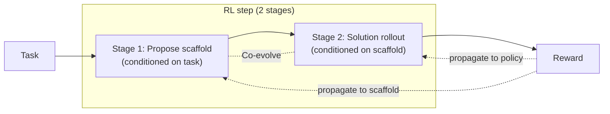

*An abstract representation of self-scaffolding reinforcement learning, where a model constructs its own training scaffold from the ground up.*

Competition among open-weight coding models has moved beyond "what benchmark score did you hit?" toward "what training method produced that score?" `Ornith-1.0`, released by DeepReinforce on June 25, 2026, is a model where the methodology itself is the headline. The reinforcement learning design lets the model **write the training scaffold that guides its own solutions** at the same time it generates those solutions.

The benchmark numbers in this post are not results we reproduced ourselves. Running a 397B model through coding benchmarks requires multi-GPU nodes and hours of inference, which we did not do for this intraday analysis. Every score cited here is **a figure stated in DeepReinforce's public materials**; values where sources differ are marked `[estimated]`. We have not fabricated any reproduction numbers.

## Overview

`Ornith-1.0` is not a single model but an open-source family specialized for coding. It spans four sizes: 9B dense, 31B dense, 35B Mixture-of-Experts (MoE), and the 397B MoE flagship. All four are MIT-licensed and immediately downloadable from the `deepreinforce-ai` namespace on Hugging Face. Quantized variants, including 9B and 35B GGUF and 35B and 397B FP8, are also available, signaling an intentional deployment spectrum from single-GPU edge to multi-node datacenter.

Two things stand out immediately from ThakiCloud's perspective: the license and self-hosting viability. MIT imposes no copyleft infection, no non-commercial clause, and no legal friction for commercial or non-commercial use. For organizations that want to run a coding agent on their own infrastructure without sending proprietary code to an external API, MIT is the cleanest possible "yes, you can."

The one-sentence summary: **Ornith-1.0 does not just learn solutions during the RL phase; it also learns the per-task training scaffold that produces those solutions.** Treating the scaffold as a learned variable rather than a fixed constant is the key divergence from other RL coding models.

The original announcement tweet described this as "the first open-source model from a US lab that codes at frontier level." We were unable to independently verify DeepReinforce's headquarters location from public sources, so this post focuses on the verifiable mechanism and public numbers rather than the geographic framing.

## What This Model Is

`Ornith-1.0` is built by applying post-training on top of pretrained base models. DeepReinforce stated it used Gemma 4 and Qwen 3.5 series as bases. This means the model was not pretrained from scratch; instead, the team applied **their own RL post-training** to strong open bases to sharpen coding capability. That structure mirrors the broader open ecosystem trend of "base as shared asset, differentiation through post-training," similar to how NVIDIA redistributes third-party models after quantization.

The model itself is a reasoning model. By default it opens assistant responses with a `<think> ... </think>` block, working through its reasoning before producing a final answer. The published serving recipe activates a reasoning parser that routes this thinking process to a separate `reasoning_content` field, alongside a tool-call parser that exposes the model's tool invocation blocks as OpenAI-style `tool_calls`. The design intent is clear: plug it straight into an existing agent loop. The maximum context length is 262,144 tokens, sized for long-horizon coding tasks that push a large repository into a single context window.

DeepReinforce is not new to RL work. Their 2025 `CUDA-L1` project used reinforcement learning to auto-optimize CUDA kernels, reporting a mean 3.12x speedup and peak gains orders of magnitude higher on multiple GPU tasks. The consistent research thread of "use reinforcement learning to make code or kernels improve themselves" runs directly into this coding model.

## The Core: Reinforcement Learning That Writes Its Own Scaffold

Most agentic RL training fixes the scaffold (prompt structure, tool-use conventions, task decomposition template) by hand and then trains the policy within it. A good scaffold raises scores; a bad one caps performance no matter how strong the policy becomes. The problem is that a different scaffold works best for each task type. Ornith-1.0 promotes the scaffold from a **fixed constant to a learned variable**.

According to DeepReinforce's description, each RL step proceeds in two stages. First, the model proposes a **refined scaffold conditioned on the given task**. Second, it **generates a solution rollout conditioned on that scaffold**. The reward propagates back through both stages: "what scaffold did you build?" and "what did you solve on top of it?" are scored together and improved together. The scaffold co-evolves with the policy.



This structure matters for two reasons. First, the bottleneck of humans hand-tuning scaffolds disappears. When the task distribution shifts, the model re-builds its scaffold on its own. Second, because the scaffold is exposed directly to the reward signal, the common failure mode of "the policy is fine but the scaffold is bad so the score never climbs" becomes correctable inside the training loop. This is in the same family as the [Loop Engineering pattern](https://thakicloud.github.io/en/llmops/) that uses external tools (compilers, tests) as reward signals, but goes one step further by adding **the scaffold itself** to the set of things receiving that reward.

## Public Benchmarks

The flagship numbers DeepReinforce published are as follows. All are from their own evaluation; none were reproduced in our environment.

| Benchmark | Ornith-1.0-397B | Comparison |
|---|---|---|
| SWE-Bench Verified | 82.4 | Claude Opus 4.8 87.6 (the only model in the comparison that exceeds it) |
| Terminal-Bench 2.1 | 77.5 | Reported as SOTA among open-source at this scale |
| SWE-Bench Pro | 62.2 `[estimated]` | Sources differ |

DeepReinforce claims top-tier performance among open-source models of comparable size on Terminal-Bench 2.1, SWE-Bench, NL2Repo, and OpenClaw. Notably, the 35B MoE is reported to outperform some larger models, which reads as MoE sparsity combined with self-scaffolding post-training raising efficiency relative to active parameter count. That said, SWE-Bench variants (Verified, Pro, original) differ substantially in scoring, and comparing numbers without confirming which variant was used is risky. That is why the SWE-Bench Pro figure is marked `[estimated]`.

More meaningful than the scores for anyone running these in production is that **the source of the scores is a publicly described mechanism**. Closed-model scores cannot be reproduced, but MIT-released weights and a published training description leave the door open for external verification.

## Installation and Serving

Ornith-1.0 is packaged to run on standard inference stacks without modification. Starting with the smallest model before validating is the right discipline for self-hosting. The 9B is designed for a single GPU and is a reasonable starting point for pipeline integration testing.

```bash
# Download weights from Hugging Face (e.g., 9B)
huggingface-cli download deepreinforce-ai/Ornith-1.0-9B \
  --local-dir ./ornith-1.0-9b
```

Because this is both a reasoning model and a tool-calling model, serving it requires both the reasoning parser and the tool-call parser to be active so that the thinking process and tool invocations arrive as structured fields rather than raw text. A representative vLLM startup looks like this; confirm the exact parser names from each model card's serving recipe.

```bash
# vLLM serving (representative form -- confirm parser names from model card)
vllm serve deepreinforce-ai/Ornith-1.0-9B \
  --max-model-len 262144 \
  --enable-auto-tool-choice \
  --tool-call-parser <see model card> \
  --reasoning-parser <see model card>
```

For the 397B MoE flagship, memory is the first wall. That is why the FP8 variant (`Ornith-1.0-397B-FP8`) ships alongside. It cuts weight memory roughly in half compared to BF16, reducing the node count and tensor parallel degree needed. The 35B MoE sits at the point where MoE's advantage of "small active parameters, large knowledge capacity" is most balanced; it is a realistic candidate for single-node multi-GPU deployment.

```bash
# 397B: FP8 variant + tensor parallelism to lower the memory wall (skeleton example)
vllm serve deepreinforce-ai/Ornith-1.0-397B-FP8 \
  --tensor-parallel-size 8 \
  --max-model-len 262144 \
  --enable-auto-tool-choice
```

## What This Means for ThakiCloud's Products

Ornith-1.0's self-scaffolding is structurally isomorphic with Paxis's self-evolving skills. Paxis is ThakiCloud's Agent-Native Cloud proof of concept, running as the agent control plane on top of the ai-platform Kubernetes infrastructure. Its core components include a Skill Harness that selects from 960-plus skills using BM25 retrieval, sandboxed isolated execution, a DAG multi-agent engine, NL Cron, MCP connectors, and self-evolving skills. Just as Ornith-1.0 proposes its own training scaffold at each RL step and exposes that scaffold to the reward signal alongside the solution, Paxis's self-evolving skill loop lets agents generate and improve their own work structure, including skill composition, execution flow, and tool-use conventions. "Elevating the scaffold to a learned variable" and "elevating the skill to an evolving artifact" are two expressions of the same design philosophy.

Paxis's self-management capability, where agents autonomously schedule their own work, track tasks, and manage sessions through DAG multi-agent coordination and NL Cron, is directly isomorphic with self-scaffolding: in both cases an autonomous agent creates and maintains the structure of its own work rather than operating inside a fixed frame handed down by a human. Paxis is built in Go 1.26 and React 19 and is LLM-agnostic, generalizing this pattern as a platform-level capability rather than tying it to any particular model. Ornith-1.0's mechanism provides a concrete precedent that can directly inform the design and improvement of Paxis's self-evolving skill harness loop.

The training and serving infrastructure for self-scaffolding models like Ornith-1.0 sits on ai-platform. ThakiCloud's ai-platform schedules GPU workloads via Kueue on Kubernetes and serves multi-tenant inference via vLLM. The Ornith-1.0 family's range from 9B to 397B MoE maps cleanly onto Kueue's layered GPU allocation: 9B for lightweight auxiliary tasks, 35B MoE as the primary serving workhorse, and 397B for dedicated high-difficulty task pools, with Kueue coordinating allocation by per-tenant priority. The MIT license and OpenAI-compatible `tool_calls` output mean any size in the family can be integrated into an existing vLLM serving pipeline by replacing the base model, which is particularly valuable for regulated environments where model sovereignty over internal code is a hard requirement.

## Limitations and Counterarguments

The biggest limitation is **asymmetric verification**. The weights and training description are public, but the benchmark numbers are self-reported and were not reproduced in our environment. SWE-Bench variants differ substantially in score, and the same model can produce different results depending on harness configuration, temperature, and retry settings. Jumping from the reported numbers to "this has caught up to frontier" is premature. Any actual adoption decision requires internal evaluation against a sample of our own codebase.

The second concern is **operational cost**. The 397B MoE scores look attractive, but self-hosting at that scale means GPU memory and node count are a real constraint. The FP8 variant helps, but "open" does not mean "free" -- it means we bear the infrastructure cost ourselves. The comparison between closed API token pricing and self-hosting node pricing only resolves in our favor at specific workload patterns, and that requires working through the numbers.

The third is **generalization of self-scaffolding**. The design is elegant, but there is no externally verified guarantee that scaffold quality holds up on unfamiliar tasks outside the training distribution. It is also plausible that the scaffold overfit to the reward signal and learned to build structures that perform well specifically on these benchmark formats. This question can only be settled when independent parties reproduce results with the public weights.

In summary, Ornith-1.0 is a model worth watching for its **method** more than its scores. The MIT open-weight release makes it a realistic candidate for self-hosted coding agents, and the self-scaffolding mechanism has ideas worth borrowing for agent training pipeline design regardless of whether you adopt the model itself. That said, all benchmark claims should be held as "announced figures" until validated through your own evaluation.

## Sources

- DeepReinforce, "Ornith-1.0: Self-Scaffolding LLMs for Agentic Coding" (2026-06): <https://deep-reinforce.com/ornith_1_0.html>
- Hugging Face model cards: <https://huggingface.co/deepreinforce-ai/Ornith-1.0-397B>, <https://huggingface.co/deepreinforce-ai/Ornith-1.0-9B>
- GitHub: <https://github.com/deepreinforce-ai/Ornith-1>
- MarkTechPost, "DeepReinforce Releases Ornith-1.0" (2026-06-25): <https://www.marktechpost.com/2026/06/25/deepreinforce-releases-ornith-1-0-an-open-source-coding-model-family-that-learns-its-own-rl-scaffolds/>
- Tech Times (2026-06-26): <https://www.techtimes.com/articles/319122/20260626/open-source-coding-model-ornith-10-writes-its-own-training-scaffold-reinforcement-learning.htm>
- DeepReinforce, CUDA-L1 (prior research): <https://deepreinforce-ai.github.io/cudal1_blog/>
