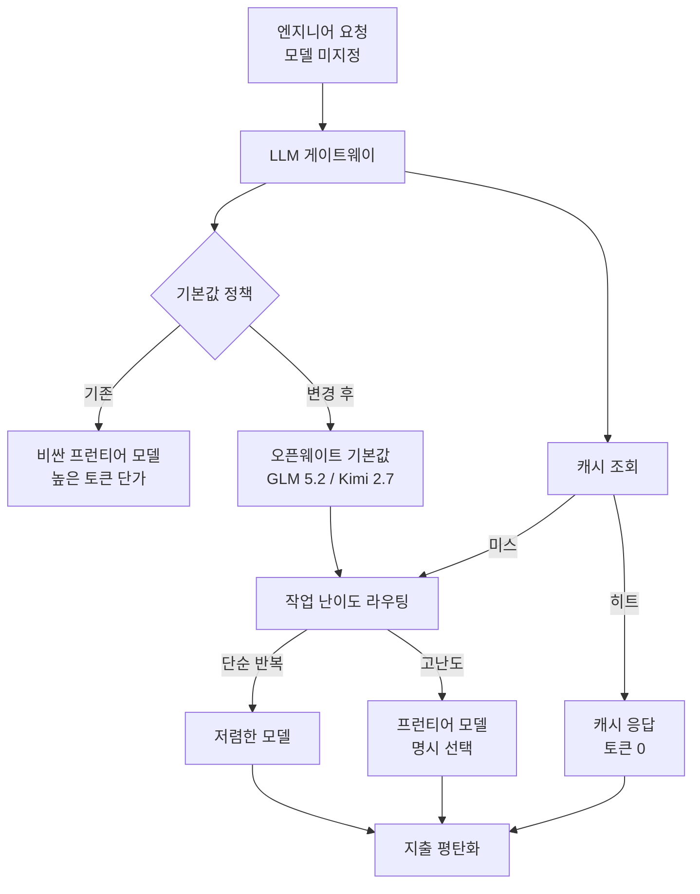

## Overview

Any organization that uses AI seriously runs into the same dilemma at some point. The more employees use LLMs, the more productivity rises, but the token bill rises exponentially alongside it. The common response is to cap usage, send alerts when the cap is exceeded, and make expensive-model usage cumbersome. Yet this approach, rather than curbing cost, adds friction to employee productivity as a side effect.

In June 2026, Coinbase CEO Brian Armstrong shared his company's different solution. In his words, it is "how to keep AI spend flat while token usage grows exponentially," and the conclusion is clear: solve it with better defaults, routing, and caching, not with friction and spend alerts. Coinbase says it cut AI spend nearly in half while token usage exploded.

ThakiCloud runs ai-platform, which serves models across diverse customer environments, so how to control inference cost is not someone else's story. Coinbase's strategy is a single company's internal policy, but inside it are LLMOps principles that apply to anyone operating model-serving infrastructure. This article lays out that strategy as it is and analyzes what it implies from a serving-platform perspective.

## The Core: Defaults, Not Friction

The starting point of Coinbase's approach is data. While trying to tighten usage caps, they discovered that 91% of employees never hit their usage caps in the first place. In other words, the culprit driving cost up was not "a handful of heavy users maxing out their caps," but a structural problem: the default behavior of overall usage pointed at expensive models.

Out of this came the slogan "Better Defaults, not Usage Caps." Engineers can still freely choose whatever model they want. The change is to the default model they land on when they specify nothing, swapping it from an expensive frontier model to a cheaper open-weight model. Coinbase says it is experimenting with making open-weight models such as GLM 5.2 and Kimi 2.7 the defaults in its own LLM gateway.

The power of this idea is that it does not fight human behavior patterns. Most users simply take the default. Change the default and, without forcing anything, the behavior of the majority shifts naturally. It is the opposite of lowering caps and adding alerts, which creates friction between users and the system. The full flow looks like this.

## Three Techniques

The cost control Armstrong laid out comes down to three axes. None is a new invention, but the key is combining all three in one place, the gateway.

First, **smarter model routing**. Rather than processing every task with the same model, each task is sent to the cheapest model capable of completing it. Simple, repetitive tasks like summarization or classification are fine with a small model, and only tasks that need complex reasoning are escalated to a frontier model. The key insight is that the highest-performance model is not always necessary. There is no reason to use an expensive model on routine tasks where frontier performance makes no difference to the result.

Second, **aggressive caching**. Redundant outputs are eliminated for repeated queries. When the same question comes in multiple times, a cached response is returned instead of calling the model every time. A cache hit uses no tokens at all, so the more repetitive the workload, the larger the savings. In environments where similar questions recur, such as code assistants or internal document queries, caching is a simple but powerful lever.

Third, **a shift to cheaper open-weight models**. For routine work where frontier performance adds no value, the work moves to open-weight models. Combined with the earlier defaults strategy, the default destination of routing itself is set to open weight. Armstrong went further, predicting that within 18 months 80% of AI workloads will move to models that are 99% cheaper, and that what defines the ceiling of AI growth will be energy and compute infrastructure, not model quality.

The three techniques reinforce one another. Routing distributes tasks to the appropriate model, caching strips out repeated calls, and open-weight defaults move the center of gravity of that distribution toward low cost. This combination is the secret behind making exploding usage and flat spend hold true at the same time.

## Implications for ThakiCloud's Products

Coinbase's strategy is the story of a single company with its own internal LLM gateway, but its principles overlap precisely with the value proposition of the multi-tenant model serving offered by ThakiCloud's **ai-platform**. ai-platform serves models with vLLM and the like on top of Kubernetes and Kueue-based GPU scheduling, and what Coinbase did at a single gateway, we can provide more deeply at the serving-platform level.

First, **routing as a platform feature**. Coinbase distributed tasks to models at the gateway. Because ThakiCloud's ai-platform serves many models simultaneously in a multi-tenant environment, it can set routing policies at the infrastructure level per tenant: "small model for simple tasks, big model only for hard ones." Because we host the models directly, the freedom of routing decisions and the transparency of cost are greater than when relying on external APIs.

Second, **the economics of open-weight serving**. The core reason Coinbase set open-weight models like GLM 5.2 and Kimi 2.7 as defaults is low cost. ai-platform specializes in serving exactly these open-weight models directly in on-premises or sovereign environments. Through consumer-GPU quantized serving, high-throughput vLLM-based inference, and multi-tenant resource isolation, lowering the per-token serving cost is our competitive edge. Free from the token pricing of external frontier APIs, the more efficiently you run open-weight models on your own infrastructure, the closer you actually get to the "99% cheaper" territory Coinbase described.

Third, **the insight that energy and compute are the ceiling**. Armstrong saw that what defines the ceiling of AI growth is energy and compute infrastructure, not model quality. This points at the same place as ThakiCloud's direction of scheduling GPU resources efficiently with Kueue and emphasizing on-premises cost efficiency. In an era where inference cost determines workloads, the serving infrastructure itself, which runs the same model cheaper and more, becomes the differentiator.

On the policy and audit side, ThakiCloud's Agent-Native Cloud **Paxis** is also relevant. Coinbase's "default policy" is in essence a policy gate applied to every request passing through the gateway. Because Paxis passes every agent action through policy gates and audit logs, it can leave a traceable record of which model was used by default for which task and where the cost arose. Cost control ultimately starts from visibility, and visibility holds when every call is recorded.

## Limitations and Counterarguments

This strategy has clear limitations too. First, the accuracy problem of routing. If the judgment that "this task is fine with a small model" is wrong, quality drops, and that loss can exceed the token savings. When a task that looks simple in fact demands subtle reasoning, the price of routing it to a cheap model comes back as a wrong result. A routing policy is not something you write once and finish; it needs continuous evaluation and correction.

Second, the scope of caching. Caching is powerful for repeated queries, but in creative or personalized work where a different context and different input come in each time, hit rates are low. Not every workload benefits equally from caching, so savings depend heavily on the nature of the workload.

Third, the quality gap of open-weight models. The forecast that "within 18 months, 80% will move to models 99% cheaper" is aggressive. It is true that open-weight models are catching up fast, but a gap with frontier models still exists in areas where high-difficulty reasoning, long context, or stability matter. Set the default to open weight, but draw the boundary of when to escalate to frontier wrong, and user experience suffers. This forecast is safer read as a direction than as a certainty.

Even so, the core lesson of the Coinbase case is robust. Cost control should be solved by changing defaults and infrastructure, not by adding friction for users. And the more you own that infrastructure, that is, the more you serve models yourself, the wider your span of control. The low-cost multi-tenant serving that ThakiCloud's ai-platform pursues is precisely that foundation of control.

## Sources

- [Brian Armstrong tweet](https://x.com/brian_armstrong/status/2070670644577280109): "How to keep AI spend flat while token usage grows exponentially" (2026-06-27)
- [Coinbase Says AI Costs Are Staying Flat As Token Usage Explodes (CryptoAdventure)](https://cryptoadventure.com/coinbase-says-ai-costs-are-staying-flat-as-token-usage-explodes/)
- [Coinbase CEO Halved AI Costs (Yahoo Finance)](https://finance.yahoo.com/markets/crypto/articles/coinbase-ceo-halved-ai-costs-130000536.html)
