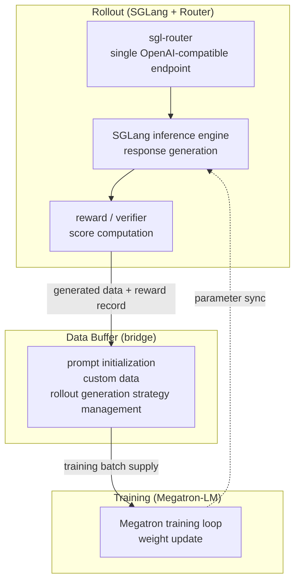

*An image evoking slime's asynchronous RL design, which decouples rollout from training to raise throughput.*

## Overview

GLM-5.2, released by Z.ai (formerly Zhipu AI) in June 2026, is an open-weight model with a 1M-token context and an MIT license. It drew attention for competing with closed commercial models on coding and long-horizon agentic tasks. But this release ships with something nearly as significant as the model weights themselves: **slime**, the reinforcement-learning infrastructure that powered the model's post-training, was open-sourced alongside it.

Most frontier models release their pretrained weights but keep private the RL pipeline that turns those weights into a genuinely useful agent. The infrastructure that connects reward design, rollout generation, and the training loop is precisely the kind of proprietary know-how that determines model quality. slime opens this entire territory. Z.ai states that not only GLM-5.2 but also GLM-5.1, GLM-5, GLM-4.7, GLM-4.6, and GLM-4.5 went through post-training on the same framework. A single framework passing through multiple SOTA-class releases means this is production-validated infrastructure, not lab code.

ThakiCloud runs a K8s-based multi-tenant AI/ML SaaS platform, serving models and running agents across diverse customer environments. So for us, "which model is good" matters as much as "what infrastructure built and operates it." As a public reference for the latter, slime is well worth examining. In this post we lay out slime's structure and design philosophy, and consider what it implies for our platform's Kueue GPU scheduling and SGLang/vLLM serving stack.

## What Is slime

slime is an **LLM post-training framework for RL scaling** built by THUDM (the Tsinghua / Z.ai lineage). The core idea is simple. Megatron-LM is good at training and SGLang is good at high-throughput inference (rollout), so let us bind the two into a single data flow. RL post-training endlessly repeats a loop of "the model generates an answer (rollout), the answer is scored, and that reward updates the model," so how smoothly you connect the generation engine and the training engine determines overall throughput.

slime decomposes this loop into three components.

- **Training (Megatron-LM)**: Handles the main training process. It reads data from the Data Buffer to update the model, and synchronizes parameters with the rollout module once training completes.
- **Rollout (SGLang + Router)**: Generates new data, including rewards and verifier outputs, and writes it to the Data Buffer. Here the sgl-router provides an OpenAI-compatible API so complex agent environments can interact with the model through a single HTTP endpoint.
- **Data Buffer**: The bridge between the two worlds. It manages prompt initialization, custom data, and rollout generation strategy.

Resource management is handled by Ray. As a result, whether training and rollout sit on the same GPUs or are split across separate GPUs can be toggled with a single flag.

## Two Execution Modes: Colocated and Disaggregated

slime's most practical design decision is that the same code supports two deployment modes.

**Colocated / synchronous mode** places training and rollout on the same GPU pool. It is enabled with a single `--colocate` flag. It is good for squeezing the most out of constrained GPU environments, with generation and training time-sharing the same resources.

**Disaggregated / asynchronous mode** separates training GPUs from rollout GPUs. Generation can keep running without waiting on training, which raises throughput. The "asynchronous agent RL" that GLM-5.2 emphasized runs on top of exactly this mode. Decoupling generation from training sharply reduces GPU idle time on workloads where each episode is long and irregular, such as multi-turn, multi-tool interactions.

This choice matters to operators. With the same framework you can run small experiments cheaply in colocated mode and push throughput in disaggregated mode for large-scale production training, enabling gradual scale-up.

## Design for Agent RL

There is a reason slime was used to train agentic models like GLM-5.x: it includes features aimed squarely at multi-turn agent workloads.

- **PD Disaggregation**: Separates prefill and decode for multi-turn and agentic workloads where the two stages have different resource needs.
- **Router session affinity**: Provides routing policy so a multi-turn agent keeps the same session, letting the multiple turns of one agent continue in a consistent state.
- **Delta Weight Sync**: In a training/inference-disaggregated setup, only the weight delta is synchronized, cutting communication cost.
- **A single OpenAI-compatible endpoint**: Thanks to the sgl-router, complex agent environments interact with the model through plain HTTP requests. There is no need to cram environment code inside the RL framework.

The last item is especially practical. If you abstract the environment of long-horizon tasks such as code editing, tool use, and multi-step problem solving into OpenAI API calls, you can connect existing agent environments to the RL training loop almost as-is. Z.ai adds an "anti-hacking" mechanism on top to suppress reward hacking, where the model exploits the reward through shortcuts on long-horizon tasks.

## Installation and Usage Overview

slime is available on GitHub ([THUDM/slime](https://github.com/THUDM/slime)), and being SGLang-native it assumes the SGLang inference stack and the Megatron-LM training stack. Day-0 support for AMD Instinct GPUs has also been published via the ROCm blog, validating operation on accelerators beyond NVIDIA.

To be honest, though, meaningfully reproducing slime's actual RL post-training loop requires a multi-GPU cluster (typically eight or more datacenter-class accelerators) and an environment with Megatron, SGLang, and Ray configured together. This post did not run a full RL training on a single-node sandbox to capture numbers. We therefore present no benchmark figures such as training throughput or convergence speed, and the production validation cases below are based on published primary sources. Not inventing arbitrary performance numbers is a principle of this blog.

Structurally, the surfaces an operator touches are clear. You set the deployment style with a mode flag such as `--colocate`, plug your own domain rollout strategy into the Data Buffer's custom data generation interface, and attach agent environments to the sgl-router endpoint. This is why the framework emphasizes versatility: because the rollout interface is fully customizable, everything from general RL algorithms to domain-specific agent training can be configured on the same skeleton.

## GLM-5.x Validation

slime is counted among the most battle-tested open RL post-training frameworks. Multiple SOTA-class releases (GLM-5.2, GLM-5.1, GLM-5, GLM-4.7, GLM-4.6, GLM-4.5) have passed through its complete training loop. GLM-5.2 stated it was post-trained with a novel async agent-RL algorithm that learns from long-horizon, multi-tool interactions on top of infrastructure that decouples generation from training. It has been reported that GLM-5.2's full post-training finished in about two days, but we leave this duration figure as [estimated] since we could not cross-verify it against primary official documentation.

The point is not the number but reproducibility. With both the model weights (MIT) and the training framework open, an organization with enough compute can retrace GLM-5.2's post-training recipe on its own domain data. This is leverage unique to an open ecosystem, impossible with closed models.

## What This Means for ThakiCloud's Products

slime's asynchronous RL design touches two distinct product layers at ThakiCloud.

From the ai-platform lens, RL training demands two concurrent workloads of fundamentally different character: rollout (inference load) and train (backpropagation load). The way slime switches between colocated and disaggregated via Ray maps cleanly onto Kueue's GPU queue model. In disaggregated mode, splitting rollout and train into separate jobs lets Kueue schedule each through its own queue, raising GPU utilization across a multi-tenant cluster and keeping compute costs down. Our serving stack already uses vLLM, so the knowledge built around continuous batching and KV-cache management transfers directly to the rollout side of an RL pipeline. The practical result is an on-premises RL pipeline that can run without exporting data off-cluster, which turns self-hosted post-training from a vague goal into a concrete product offering.

From the Paxis lens, the connection is even more direct. Paxis is ThakiCloud's agent control plane, running on top of ai-platform. Its core includes a Skill Harness that selects from 960-plus skills via BM25, a self-evolving skill loop, sandboxed execution, and an HKE knowledge engine. A framework like slime becomes the learning backend for that self-evolving loop. By generating rollouts from customer-domain data, scoring them with a reward signal, and updating skills through reinforcement learning, Paxis's domain agents improve continuously with use. The sgl-router's OpenAI-compatible endpoint acts as the glue that attaches Paxis's MCP connectors and existing tool environments to the RL loop with minimal friction. The two products interlock: ai-platform supplies the GPU queues and on-premises RL pipeline, and Paxis consumes that pipeline as the engine for skill evolution.

This is closer to a roadmap than a shipped feature. Even so, the structural alignment between the ai-platform stack (K8s, Kueue, vLLM) and Paxis's self-evolving skill architecture on one side, and what slime actually assumes on the other, shows this is not a forced fit.

## Limitations and Counterarguments

slime is not a silver bullet. Let us state a few realistic constraints clearly.

The biggest barrier to entry is **compute and operational complexity**. Standing up Megatron + SGLang + Ray simultaneously and orchestrating training/rollout across multiple GPUs is by no means lightweight. This is not a tool a single GPU or a small team can casually run, and RL post-training itself demands an infrastructure investment comparable to pretraining. There is a considerable gap between "the framework is open" and "we can run RL post-training."

Second, **the difficulty of RL post-training**. Reward design, reward-hacking prevention, and training stability are intrinsic hardships the framework does not solve for you. slime provides infrastructure only; a good reward function and a stable training recipe remain the user's responsibility. That Z.ai separately emphasized anti-hacking is itself evidence of how tricky this area is.

Third, **the limits of our verification scope**. This post analyzed the structure based on slime's public documentation and reporting; we did not directly reproduce the full RL training loop to measure throughput. Therefore claims like "GLM-5.2-class training in a few days" are not facts we independently confirmed. Anyone considering adoption must first pilot with a small model and small task in colocated mode to measure the actual cost in their own environment.

Even so, an event where the model weights and the training framework open together is rare transparency in the open-LLM ecosystem. For a platform like ThakiCloud that operates infrastructure directly, the set of options that grant control all the way down to the post-training stage, beyond merely using someone else's model, has grown.

## Sources

- [THUDM/slime - GitHub](https://github.com/THUDM/slime)
- [slime: An SGLang-Native Post-Training Framework for RL Scaling - LMSYS Org](https://www.lmsys.org/blog/2025-07-09-slime/)
- [GLM-5.2: Built for Long-Horizon Tasks - Hugging Face Blog](https://huggingface.co/blog/zai-org/glm-52-blog)
- [Day-0 Support for the SGLang-Native RL Framework slime on AMD Instinct GPUs - ROCm Blogs](https://rocm.blogs.amd.com/artificial-intelligence/slime/README.html)
