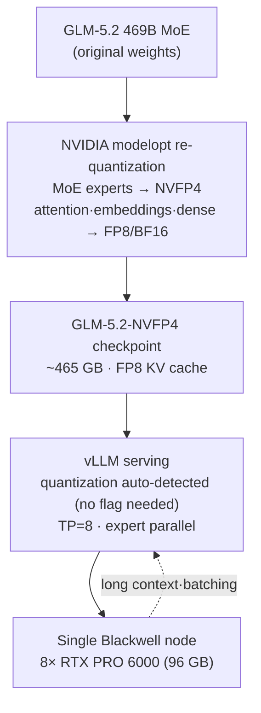

## Overview

Serving a 469B MoE model on your own infrastructure used to be synonymous with a multi-node GPU cluster. The [vLLM project](https://recipes.vllm.ai/zai-org/GLM-5.2) and the [GLM-5.2-NVFP4 checkpoint](https://huggingface.co/nvidia/GLM-5.2-NVFP4) published by NVIDIA change that assumption, bringing the requirement down to a single node. A recipe now exists for loading a 469B model on one eight-GPU Blackwell node and serving it directly with vLLM.

This post dissects that recipe. The background on the NVFP4 format itself was covered in an earlier post, [Cutting LLM Serving Costs in Half on Blackwell GPUs with NVFP4](https://thakicloud.github.io/ko/llmops/nvfp4-blackwell-llm-serving-quantization/), so here the focus is narrower: how do you actually bring up one specific frontier model? We walk through the quantization structure, the official vLLM serving command, and a deterministic memory sizing calculation based on public figures, then draw out what this means for ThakiCloud ai-platform operations.

One thing to be clear about upfront: the work in this post did not involve running the model on actual Blackwell hardware. We did not have access to that hardware for this session, so model serving was not performed. Instead, we cite verified figures from the official model card and use those to compute memory sizing deterministically. No benchmark numbers were fabricated.

## What Is GLM-5.2-NVFP4

GLM-5.2-NVFP4 is a checkpoint of GLM-5.2 with weights and activations quantized to the NVFP4 data type, ready for direct inference with vLLM and SGLang. The key detail is that this is **mixed precision**, not "everything at 4 bits."

In NVIDIA's modelopt re-quantization approach, only the MoE expert linear layers drop to NVFP4. Shared experts, attention, embeddings, and the initial dense layers stay in FP8 or BF16. The KV cache uses FP8. The strategy is to preserve precision where it matters most while aggressively compressing the MoE experts, which account for the majority of the parameters.

The full serving stack looks like this:



In the community, a variant called `GLM-5.2-NVFP4-REAP-469B` is also circulating. This applies REAP pruning and targets contexts beyond 250K tokens, combining DeepSeek Sparse Attention with MTP speculative decoding. Variants running on 4x RTX PRO 6000 (SM120) and 3x DGX Spark with pipeline parallelism have both been published.

## Installation and Integration

The vLLM serving command given in the official NVIDIA model card is as follows. The validated configuration is a single node with 8x RTX PRO 6000 Blackwell GPUs (96 GB each) and tensor parallelism 8.

```bash
vllm serve nvidia/GLM-5.2-NVFP4 \
  --tensor-parallel-size 8 \
  --enable-expert-parallel \
  --reasoning-parser glm45 \
  --tool-call-parser glm47 \
  --enable-auto-tool-choice \
  --kv-cache-dtype fp8_e4m3 \
  --served-model-name glm-5.2-nvfp4
```

Several things stand out.

- **No `--quantization` flag.** vLLM auto-detects the quantization scheme from the checkpoint, so operators do not need to specify the format manually.
- **`--enable-expert-parallel`**: Distributes MoE experts across GPUs using expert parallelism. Combined with TP, this spreads the 469B model across all 8 cards.
- **`--kv-cache-dtype fp8_e4m3`**: Keeps the KV cache in FP8, preserving headroom for longer contexts and larger batches.
- **`--reasoning-parser glm45` / `--tool-call-parser glm47`**: Parses GLM-series reasoning tokens and tool-call formats. Thinking mode is enabled by default.

The minimum vLLM version required to run this checkpoint is best confirmed in the discussion thread on the model card. NVFP4 auto-detection and the expert parallel path were stabilized in relatively recent versions of vLLM.

## Experiment Results

As noted above, model serving was not performed directly (no Blackwell GPU available). Instead, **memory sizing was computed deterministically from public figures alone**. The inputs are three verified facts: 469B parameters, the publicly stated NVFP4-mixed checkpoint size of approximately 465 GB, and the 8x 96 GB node configuration.


The calculations come out as follows.

- At BF16, 469B weights require approximately 938 GB. At FP8, approximately 469 GB.
- The publicly stated NVFP4-mixed checkpoint is approximately 465 GB, **nearly identical to a pure FP8 checkpoint (469 GB).** A purely 4-bit approach would theoretically reach around 234 GB, but because only the MoE experts are quantized to 4 bits here, the footprint does not drop that far.
- Loading 465 GB of weights onto a node with 8x 96 GB = 768 GB total leaves roughly 303 GB for KV cache and activations. VRAM utilization is approximately 60.5%.

One point worth being honest about: **the real benefit of NVFP4-mixed is not "half the storage."** Looking at the weight footprint alone, it is similar to FP8. The actual gains come from two sources. First, Blackwell tensor cores offer higher NVFP4 compute throughput. Second, the FP8 KV cache creates headroom for longer contexts and larger batches. In other words, the value of this checkpoint is not "smaller" but "faster and longer on a single node." The common marketing claim of "half the memory at 4 bits" does not apply directly to this case.

## Implications for ThakiCloud Products

This recipe has direct implications for the ThakiCloud **ai-platform** - the AI/ML infrastructure layer built on Kubernetes and Kueue-based GPU scheduling that provides vLLM serving and multi-tenant isolation.

- **Single-node frontier serving simplifies scheduling.** When a 469B model fits on one node (TP=8), the inter-node communication overhead and batching complexity of multi-node distributed serving disappear. From Kueue's perspective, this becomes a clean resource unit of "one node with 8 GPUs," making GPU allocation and reclamation straightforward in a multi-tenant environment.
- **Well suited for on-premises and sovereign deployments.** In customer environments subject to government security requirements or data export restrictions, being able to self-host a frontier-class model on a single on-premises node is a meaningful differentiator. You can run a 469B model on your own infrastructure without any external API dependency.
- **VRAM headroom translates to multi-tenant throughput.** The calculated 303 GB of remaining KV and activation budget converts into longer contexts or larger batches. More concurrent requests can be served from the same node, which directly improves the per-GPU cost efficiency of a multi-tenant SaaS offering.
- **Auto-detected quantization standardizes operations.** Because vLLM detects the format automatically, different quantized checkpoints can be deployed through the same serving template. The ai-platform serving manifest does not need to branch per model.

Low serving cost is not just an infrastructure virtue - it is product competitiveness. A configuration that loads a frontier model on one node and keeps 40% of VRAM free for throughput headroom directly reduces the per-GPU TCO presented to customers.

## Limitations and Caveats

The biggest limitation belongs to this post itself. There are no measured benchmarks. Token throughput, latency, and accuracy regression figures require an actual Blackwell node to produce. The numbers here are sizing calculations based on a public checkpoint size, not runtime measurements.

Second, the quality impact of mixed-precision quantization requires separate validation. Dropping MoE experts to 4 bits may introduce accuracy regression on some tasks. Rather than trusting the model card evaluation figures at face value, running regression tests in your actual application domain is the right approach.

Third, there is a hardware dependency. This recipe assumes Blackwell. On the Hopper generation (H100), which lacks NVFP4 tensor cores, the same checkpoint does not deliver the same benefits. This configuration is a practical option only for organizations that have already adopted Blackwell or are planning to do so. In environments with a large existing H100 footprint, FP8 remains the realistic baseline.

## References

- [nvidia/GLM-5.2-NVFP4 Model Card (Hugging Face)](https://huggingface.co/nvidia/GLM-5.2-NVFP4)
- [GLM-5.2 vLLM Recipe](https://recipes.vllm.ai/zai-org/GLM-5.2)
- [GLM-5.2-NVFP4-REAP-469B SM120 Serving Recipe (0xSero/glm-5.2-sm120)](https://github.com/0xSero/glm-5.2-sm120)
- [GLM-5.2 469B DGX Spark Pipeline Parallel Serving (bird/GLM-spark)](https://github.com/bird/GLM-spark)
