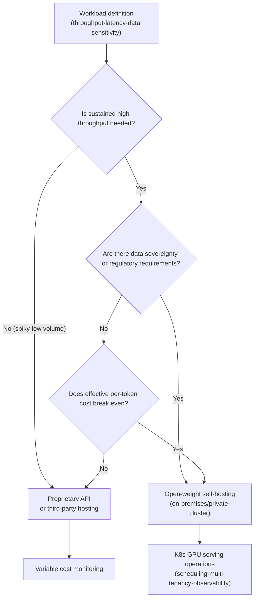

The mid-2026 open-weight landscape can be summarized in a single sentence: **the gap has narrowed, and it is no longer widening.** OpenRouter's June roundup finds that open-weight models maintain roughly a 3-to-6-month capability lag behind frontier labs, yet that interval is not growing. If that assessment holds, the real organizational decision is no longer "which model is the most capable?" It is "where should this workload run, and at what cost?"

At ThakiCloud we operate model serving on top of a Kubernetes-based AI/ML SaaS platform, so we read this shift through the lens of **self-hosting economics** rather than through a model catalog. Once open-weight quality reaches frontier-grade for a given task, self-hosting stops being an ideological choice and becomes a cost calculation. This post uses the leading open-weight models of mid-2026 to examine where the break-even point forms, and how to make that decision operationally viable on Kubernetes.

## The Gap Is No Longer Widening: The Mid-2026 Open-Weight Landscape

The facts first. The four models below are cross-validated across multiple independent sources, including Artificial Analysis, Hugging Face model cards, and each lab's own announcements. We did not rely on a single benchmark.

| Model | Size (total / active) | License | AA Intelligence Index | Notes |
|---|---|---|---|---|
| DeepSeek V4 Flash | 284B / 13B (MoE) | MIT | ~40 | SWE-bench Verified 79.0%, 1M context |
| GLM-5.2 (Z AI) | 753B | MIT | 51 | Top open-weight, top-4 overall |
| MiniMax M3 | 428B / 23B (MoE) | Community license | 44 | Native multimodal, 1M context |
| NVIDIA Nemotron 3 Ultra | 550B / 55B (MoE) | OpenMDW | 48 | US-built open model, 300+ tok/s |

Several observations stand out. **GLM-5.2** scores 51 on the Artificial Analysis Intelligence Index, placing it first among open-weight models and in the top tier overall including closed models. Notably, the top closed models, Fable 5, Opus 4.8, and GPT-5.5, still occupy the very top positions in the same ranking. This means the claim that "open-weight has surpassed the frontier" is an overstatement. The more precise formulation is that **the frontier has stopped pulling away**. The gap closed not because the leader stopped, but because the challengers got close enough.

**DeepSeek V4 Flash** is regarded as the first open-weight model ready to drop directly into coding-agent pipelines. Its SWE-bench Verified score of 79.0% sits just 1.6 points below the Pro variant in the same family, while pricing comes in at approximately $0.14 per million input tokens and $0.28 per million output tokens. **MiniMax M3** is the only model in this group with native multimodal capability (images and video), giving it an edge on workloads such as UI automation and screenshot-to-code. **Nemotron 3 Ultra** is NVIDIA's US-built open model unveiled at Computex 2026, offering throughput exceeding 300 tok/s alongside an enterprise-friendly license.

One caveat is worth flagging. The OpenRouter source piece includes geopolitical commentary suggesting that US export controls deactivated certain closed models, creating an opening that helped GLM-5.2 rise. However, public benchmark rankings at the same point in time still show those closed models at the top. The causal claim has not been independently verified. This post therefore cites only the verifiable model, performance, and pricing facts, and does not engage with speculative causal interpretations.

## Recalculating Cost: Total Operating Cost, Not Cost per Token

When open-weight quality reaches frontier grade, the framing of cost conversations changes. The old question was "how much performance do we sacrifice in exchange for lower spend?" The new question is **"where is the cheapest place to obtain the same intelligence?"** And that question cannot be answered by reading a per-token pricing table alone.

Three cost modes need to be distinguished.

First, **proprietary APIs**. These carry no operational burden and provide immediate access to top-tier performance, but the cost is variable and scales linearly with usage, and data leaves your boundary. This model suits low-volume or bursty workloads, or cases where state-of-the-art performance is a hard requirement.

Second, **open-weight models with third-party hosting**. The weights are public, but inference runs on an external provider's infrastructure. Per-token prices are substantially lower than closed alternatives, which is the primary point the open-weight roundup emphasizes. However, billing is still usage-based and data governance depends on the provider.

Third, **open-weight models with self-hosting**. You pull the weights and serve them on your own (or on-premises) GPUs. The cost structure shifts from variable to **fixed (GPU amortization plus operations)**. The critical variable is the break-even point. Once sustained throughput is high enough, dividing the fixed cost by the token volume yields an effective per-token cost that undercuts any API price point. For organizations with regulatory or data-sovereignty requirements, keeping data inside the boundary is not a cost trade-off but a precondition.

The most common mistake in this decision flow is **collapsing stages two and three into a single line from a pricing table**. The real cost of self-hosting is not the weight download fee (which is zero for open-weight models). It is GPU procurement, the serving stack, scheduling, observability, and operational staff. "Open-weight is free" is therefore only half true. The model is free, but **the operations are not.** How cheaply and reliably you can run those operations is the actual substance of self-hosting economics.

## Product Implications for ThakiCloud

The self-hosting economics of open-weight models are precisely the problem ThakiCloud addresses with two products.

**Through the ai-platform lens (infrastructure and serving).** ThakiCloud's ai-platform manages model serving on Kubernetes. What actually lowers the break-even threshold in practice is infrastructure efficiency. Kueue-based GPU job scheduling reduces idle time on expensive accelerators, while high-throughput serving engines such as vLLM combined with quantization techniques (FP8, NVFP4, and similar) extract more tokens per second from the same hardware. When effective per-token cost drops, the break-even in the decision flow above becomes achievable at lower sustained throughput. A multi-tenant architecture lets multiple workloads share a GPU pool, spreading fixed costs across teams. On-premises and sovereign deployment satisfies data-sovereignty requirements without a cost penalty, which matters particularly in environments with strict domestic compliance or security mandates. In short, ai-platform productizes the rightmost stage of the diagram above: **Kubernetes GPU serving operations**.

**Through the Paxis lens (agent economics).** Low-cost serving does not stop at infrastructure savings; it unlocks agent economics. When frontier-grade coding performance becomes available for a few cents per million tokens (as with DeepSeek V4 Flash), the token consumption of multi-step agentic workflows finally becomes affordable. ThakiCloud's Paxis is an Agent-Native Cloud control plane running on top of ai-platform. It selects from over 960 skills using BM25 retrieval, executes them in isolated sandboxes, and routes every action through policy gates and audit logs. Cheaper serving (ai-platform) lowers the per-call cost of agent invocations, which means the same budget can support deeper DAG-style multi-agent orchestration. Self-hosting economics, in other words, do not just reduce infrastructure spend; they directly expand the design space available to the agent layer running on top.

## Limitations and Counterarguments

The following pushes back against the optimism in this post.

First, self-hosting is not always cheaper. The break-even analysis assumes sustained, high throughput. For low-volume or irregular traffic, fixed costs cannot be recovered and the API is the cheaper option. Any comparison that omits GPU amortization, power, cooling, and staff makes self-hosting look less expensive than it is.

Second, benchmark figures carry uncertainty intervals. The Artificial Analysis Intelligence Index scores and SWE-bench results cited here are measurements from specific evaluation environments and do not map exactly to real-world workload performance. Independent replication of newly released model benchmarks may be limited in the early weeks after an announcement, so direct evaluation on your own workloads before deployment is necessary.

Third, licenses and provenance must be verified. "Open-weight" is not a uniform category. MIT (DeepSeek, GLM), community license (MiniMax), and OpenMDW (Nemotron) carry different rights for commercial redistribution and fine-tuning. The country of origin of a model and its data policy can also determine whether adoption is permissible under a given regulatory environment.

Fourth, the model landscape ages quickly. The table above is a snapshot from mid-2026 and will be outdated within months. The underlying principle, however, does not change with the names. **Now that open-weight models have reached frontier-grade quality, the self-hosting break-even becomes increasingly favorable for workloads with high cost pressure or strong data-sovereignty requirements.** Models change; this direction does not.

## Sources

- [The Open Weight Models that Matter: June 2026 - OpenRouter Blog](https://openrouter.ai/blog/insights/the-open-weight-models-that-matter-june-2026/)
- [GLM-5.2 is the new leading open weights model on the Artificial Analysis Intelligence Index](https://artificialanalysis.ai/articles/glm-5-2-is-the-new-leading-open-weights-model-on-the-artificial-analysis-intelligence-index)
- [NVIDIA Nemotron 3 Ultra released - Artificial Analysis](https://artificialanalysis.ai/articles/nvidia-nemotron-3-ultra-released)
- [DeepSeek V4 Flash - OpenRouter](https://openrouter.ai/deepseek/deepseek-v4-flash)
- [GLM-5.2 is probably the most powerful text-only open weights LLM - Simon Willison](https://simonwillison.net/2026/jun/17/glm-52/)
