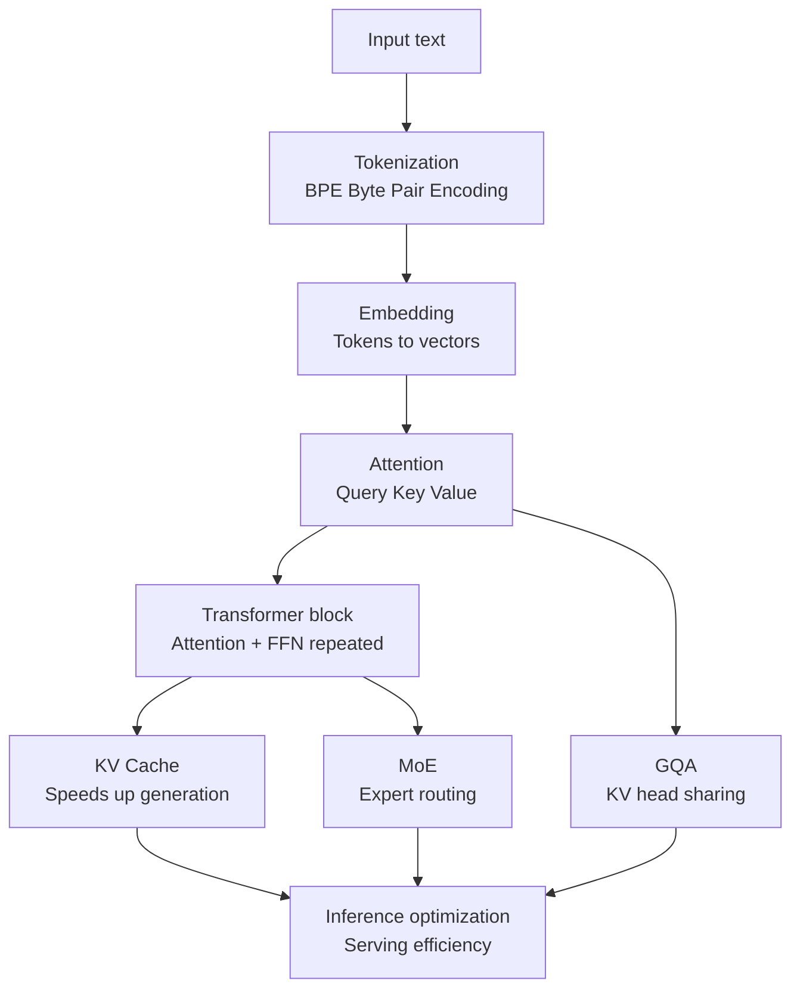

## Overview

If you operate LLM serving long enough, you eventually hit an odd spot. You've deployed vLLM, you monitor GPU utilization, you tune batch sizes, and yet you still can't put into words why a given request occupies this much KV cache, or exactly what GQA trims away to save memory bandwidth. You know how to operate the tools, but the principles underneath stay blurry. That gap forces optimization to run on intuition, and it leaves you unable to reason about root causes when something breaks.

A learning resource that takes this problem head-on is [amitshekhariitbhu/llm-internals](https://github.com/amitshekhariitbhu/llm-internals). It's a step-by-step repository that strings together blog posts and videos in a deliberate order, starting from tokenization and moving through attention, transformer architecture, KV cache, and inference optimization. The original author is Amit Shekhar, and the topics are arranged to build a single coherent mental model rather than leaving readers with a pile of disconnected one-off tutorials.

ThakiCloud operates ai-platform, which serves models across diverse customer environments on Kubernetes. Most of what determines serving cost and latency traces back to the internals this repository covers. So this post isn't just a resource pointer: it walks through why each topic becomes a direct, usable weapon for an infrastructure engineer.

## What This Resource Actually Is

llm-internals isn't a framework you run code with, it's a **learning path**. It follows the pipeline an LLM goes through from receiving input to producing the next token, presenting the concepts needed at each stage alongside external references, in order. The core value lies in the curriculum design itself: deciding what needs to be understood, and in what sequence, for the full picture to click into place.

The main topics the repository covers follow this flow:



This order matters because later topics don't make sense without the earlier ones. The KV cache only means something once you know what the Key and Value in attention actually are, and GQA only shows "what's being shared" once you understand the head structure of multi-head attention. The repository's value isn't the depth of any single article, it's the sequencing that never breaks this dependency chain.

## A Closer Look at the Core Topics

### Tokenization: Where Everything Starts

LLMs don't work directly with letters or words, they process tokens. Most modern models use some variant of BPE (Byte Pair Encoding), which builds a vocabulary by repeatedly merging byte pairs that frequently appear together. Tokenization looks trivial, but from a serving standpoint it's a direct cost driver. The same sentence can produce very different token counts depending on the language and the tokenizer, and token count directly maps to KV cache occupancy and compute. The fact that non-English text (Korean, Arabic, and similar languages) tends to consume more tokens than English is something you have to account for when estimating serving costs.

### Attention: Query, Key, Value

The heart of the transformer is self-attention. Each token gets projected into three vectors. Query represents "what am I looking for," Key represents "what do I offer," and Value represents "what I actually deliver." The attention score is computed as the dot product of Query and Key, then passed through scaling and softmax to produce a weighted sum over Value.

```
Attention(Q, K, V) = softmax( (Q · Kᵀ) / √d_k ) · V
```

The formula itself is simple, but the fact that attention computation grows as O(n²) with sequence length n is what gives rise to nearly every optimization technique that follows. This is the origin point for why long context is expensive, and why serving infrastructure is so sensitive to context length.

### Transformer Blocks and the KV Cache

A transformer stacks multiple layers of blocks, each combining attention with a feed-forward network (FFN). In autoregressive generation, tokens are produced one at a time, and recomputing the Key and Value of every prior token at each step would be wasteful. The **KV cache** solves this by storing already-computed Keys and Values and reusing them, which speeds up generation.

The catch is that this cache consumes memory. Cache size scales roughly with `2 × number of layers × number of KV heads × head dimension × sequence length × batch size`. Long contexts and many concurrent requests can blow this number up fast. This structural pressure is exactly why vLLM's PagedAttention manages the KV cache in pages: to reduce fragmentation.

### MoE and GQA: Structural Changes for Efficiency

**Mixture of Experts (MoE)** splits the FFN into multiple experts, and a router activates only a subset of experts per token. Total parameter count is large, but the actual compute per token stays small. In exchange, serving has to deal with new challenges: expert parallelism, routing imbalance, and memory placement.

**Grouped-Query Attention (GQA)** is a middle ground between multi-head attention (MHA) and multi-query attention (MQA). In MHA, every head has its own Key/Value; in MQA, all heads share a single Key/Value. GQA groups heads into a handful of clusters and shares KV within each group. The result is a **reduction in KV cache size and memory bandwidth** with minimal quality loss. Understanding GQA clarifies why recent open-weight models adopt this structure, and why it shifts your memory budget at serving time.

## Why This Knowledge Matters for Infrastructure Engineers

None of the topics above are academic curiosities, they are direct causes of serving cost. Understanding the KV cache size formula lets you predict how concurrent request count and context length collide with GPU memory. Understanding GQA lets you explain why one model handles more requests than another on the same GPU. Understanding MoE prepares you for why expert-parallel placement complicates scheduling.

Without this knowledge, the usual response to an incident is to see "out of memory" and repeatedly reach for the expensive fix: cut the batch size blindly, or throw more GPUs at it. An engineer who understands the internals has finer levers available: KV cache paging, context length caps, quantization, and choosing a GQA-based model.

## Implications for ThakiCloud's Products

ThakiCloud's **ai-platform** delivers multi-tenant, vLLM-based inference on top of Kubernetes and Kueue GPU scheduling. The internals covered in this post translate directly into operational levers.

- **KV cache**: Using PagedAttention and the KV cache size formula as a basis, we set per-tenant context length caps and concurrency budgets. Predicting cache occupancy lets us push throughput up without over-committing GPU memory.
- **GQA and quantization**: To fit more requests on the same hardware, we prioritize open-weight models that adopt GQA, combining it with quantization to target low serving costs in on-premise and sovereign environments.
- **MoE serving**: MoE models that require expert parallelism get separate treatment in Kueue queue design and node placement, planned for in advance.

From an agent perspective, ThakiCloud's Agent-Native Cloud, **Paxis**, is well suited to accumulating this kind of internal knowledge as a team asset. Because Paxis treats skills as first-class resources, a recurring judgment call like "compute the KV cache budget" can be hardened into a verified skill, reused inside an isolated sandbox, and tracked through audit logs. It becomes a channel for turning serving know-how, which otherwise tends to live only in individual engineers' heads, into procedural knowledge the whole organization owns.

## Limitations and Counterarguments

The biggest weakness of this resource is the fate of any curated repository. Because it's built by stitching together external blog posts and videos, links can go stale or disappear, and the notation and depth vary from source to source. There's also no guarantee that the latest architectural shifts (new attention variants, for instance) get folded in right away.

There's also still a gap between conceptual understanding and real-world operation. Memorizing the KV cache formula doesn't hand you the actual throughput number on a specific GPU. Real benchmarking, profiling, and workload-specific tuning all require separate hands-on experience. This learning path is genuinely valuable as a starting point for building an accurate mental model, but it isn't, by itself, the endpoint of serving optimization. Understanding the principles has to be followed by validation against real traffic.

## Sources

- [amitshekhariitbhu/llm-internals (GitHub)](https://github.com/amitshekhariitbhu/llm-internals)
- Original recommending tweet: Dan Kornas, "Stop learning LLM internals from random one-off tutorials"
