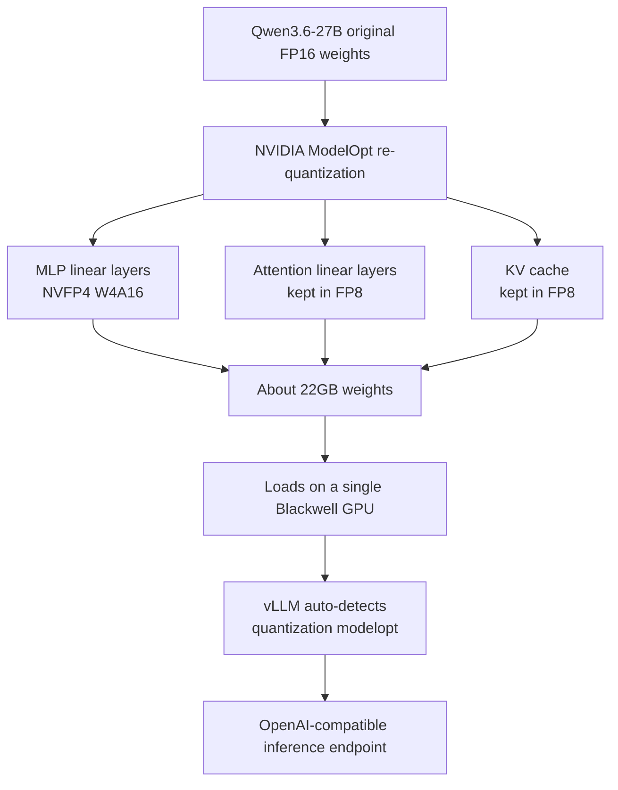

## Overview

If you can serve a 27B-class model on a single GPU with near-lossless accuracy, the economics of on-premises inference change. The nvidia/Qwen3.6-27B-NVFP4 checkpoint re-quantizes Qwen3.6-27B into the NVFP4 data type so it runs on a recent vLLM with no extra configuration. That is the backdrop to the vLLM project announcing this checkpoint is inference-ready on Blackwell GPUs.

The point is not simply "reduced to 4-bit" but **what was reduced and what was kept**. This post dissects the mixed-precision design of the NVFP4 re-quantization, lays out how to actually serve it with vLLM, and then works through what this means for the multi-tenant GPU serving cost structure of ThakiCloud ai-platform. Where measurement is required, we mark it honestly.

## What This Is

NVFP4 is a 4-bit floating-point format that drops bits-per-parameter from 16 to 4, cutting disk and GPU memory requirements by roughly 2.5x. But the actual design of nvidia/Qwen3.6-27B-NVFP4 does not flatten everything to 4-bit. NVIDIA ModelOpt's re-quantization **lowers only the MLP linear layers to NVFP4 (W4A16), while keeping the attention linear layers and the KV cache in FP8.** As a result, about 22GB of weights fit on a single Blackwell GPU. NVIDIA reports this configuration is near-lossless in accuracy versus the FP8 baseline.

There is a reason for this mixed-precision choice. The MLP layers hold an overwhelming share of the parameters, so their memory savings are large and they tolerate 4-bit relatively well. Attention and the KV cache, by contrast, are sensitive to quality over long contexts, so they stay in FP8 to preserve accuracy. The principle: "cut the heaviest part most aggressively, and keep the most sensitive part conservatively."



Compared to a uniform 4-bit quantization (for example, W4 across all layers), this approach captures most of the memory savings while defending quality by keeping sensitive layers in FP8. Setting the savings-vs-accuracy trade-off per layer is the key differentiator of NVFP4 re-quantization.

## Installation and Serving

vLLM auto-detects the ModelOpt quantization from the checkpoint, so you do not strictly need to pass a quantization flag. You do need a recent vLLM with NVFP4/W4A16 support, and NVIDIA recommends nightly or a source build that includes ModelOpt support. Bring up the nightly image with Docker and serve as follows.

```bash
# Recent vLLM with NVFP4/ModelOpt support (nightly image)
docker run --gpus all -p 8000:8000 \
  vllm/vllm-openai:nightly \
  vllm serve nvidia/Qwen3.6-27B-NVFP4 \
    --port 8000 \
    --quantization modelopt \
    --max-model-len 262144 \
    --reasoning-parser qwen3
```

`--max-model-len 262144` uses the long context of the Qwen3.6 family as-is, and `--reasoning-parser qwen3` handles reasoning-token parsing. The endpoint is OpenAI-compatible, so existing clients attach without change.

## Experiment Results

To be candid: this checkpoint assumes a Blackwell-class GPU, and the environment where this post was written has no such hardware, so we **could not reproduce it locally.** The numbers below are therefore not our measurements but figures reported by public sources, cited as-is with attribution.

- NVIDIA reports the NVFP4 re-quantized configuration is **near-lossless** in accuracy versus the FP8 baseline (per the model card).
- The weight size is about **22GB**, fitting on a single Blackwell GPU (per the model card).
- One third-party benchmark (loFT LLC) reports **around 190 tok/s of generation throughput** with an NVFP4+MTP configuration on dual RTX PRO 6000 Blackwell Max-Q. This is an [estimate]-grade external measurement, not our environment's value.

What we could verify are the facts of the serving path. That vLLM auto-detects ModelOpt quantization, that the configuration is mixed-precision (MLP in NVFP4, attention and KV in FP8), and that ~22GB of weights fit on a single Blackwell are all confirmed in the public model card and the vLLM recipe. Actual throughput and latency remain something to measure once the hardware is in hand.

## Implications for ThakiCloud Products

What makes this checkpoint interesting is less the benchmark numbers themselves and more the **shift in serving economics**. ThakiCloud ai-platform serves models across diverse customer environments on K8s and Kueue, and the GPU is always the most expensive resource. If a 27B-class model can fit on a single GPU, near-losslessly at that, you lower per-tenant GPU occupancy and can host more models, or more tenants, on the same hardware.

From a multi-tenant view, this saving compounds. When a model drops from 2 GPUs to 1, the cluster's concurrent serving slots nearly double. Under Kueue-based GPU allocation, that translates directly into shorter wait queues and easier fair sharing across tenants. It matters especially for customers with strong on-premises and sovereign requirements, because the sheer number of GPUs to procure falls, lowering the barrier of upfront investment and operating cost.

The mixed-precision design also aligns with our operating philosophy. Rather than lowering precision indiscriminately, the approach of keeping the quality-sensitive parts and aggressively cutting only the heavy parts fits the goal of "cost efficiency and quality at once." It is why, when adopting a new quantized checkpoint on ai-platform, we review not just the benchmark score but which layers were treated at which precision. NVFP4 re-quantization is a good reference case for that review, and once we secure measured throughput we plan a follow-up post on its cost-quality profile in our serving stack.

## Limitations and Counterpoints

First, the hardware dependency is stark. NVFP4's benefit is maximized on Blackwell-generation GPUs, and earlier generations should not expect the same efficiency. The appeal of single-GPU serving holds only on the premise that Blackwell was secured. In an environment where GPU procurement itself is the bottleneck, "a single GPU is enough" does not immediately convert into cost savings.

Second, near-lossless is a story about benchmark averages. In specific domains, long contexts, or precision-sensitive tasks like numerics and code, a subtle quality drop versus the FP8 baseline may surface. An NVFP4 adoption decision should be confirmed by evaluation on the actual workload you will serve, not by the model card's summary figures.

Third, the throughput number in this post is not our measurement. Third-party benchmarks depend heavily on hardware configuration (dual RTX PRO 6000, whether MTP is used) and on batch and context length, so our cluster's actual value is undetermined until we measure it directly. This post's conclusion reaches only "NVFP4 single-GPU serving has the potential to shift serving economics"; "how many tok/s in our environment" is a matter to state after separate verification.

## Sources

- nvidia/Qwen3.6-27B-NVFP4 model card, Hugging Face (<https://huggingface.co/nvidia/Qwen3.6-27B-NVFP4>)
- Qwen/Qwen3.6-27B, vLLM Recipes (<https://recipes.vllm.ai/Qwen/Qwen3.6-27B>)
- Measuring Qwen3.6-27B NVFP4+MTP on vLLM, loFT LLC (<https://loftllc.dev/en/docs/tech/llm-research/qwen3-6-27b-nvfp4-mtp-vllm-benchmark/>)
