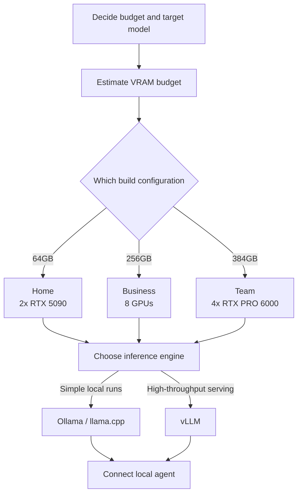

Over the past few days a project has quietly made the rounds on developer timelines. It is the "Personal AI Computer": instead of renting a cloud API, you assemble an AI machine at home or in the office and run open-weight models entirely on hardware you own. The guides go up to 384GB of VRAM, which naturally raises a very practical question: at that capacity, which models can actually run locally? This article is written for engineering leaders and ML platform teams evaluating on-premise AI infrastructure, and for data scientists who want to run models locally. We use calculation to confirm how VRAM decides which models are feasible, and cover what changes when you scale a single personal machine into organization-grade serving, alongside ThakiCloud's ai-platform perspective.

Let me state the conclusion up front. The feasibility of local AI is mostly decided by a single variable: VRAM. And what a personal build proves is that it is "technically possible," not that "an organization can operate it as-is." That gap is precisely why on-prem serving platforms exist.

## What Is This Technology

The repository at the center of the discussion is `autonomous-ai/autonomous-computer`, an open-source guide released under the MIT license for building an AI computer at home from scratch. Its distinguishing trait is that it does not explain by prose alone. Each build ships with a bill of materials (BOM) carrying prices and purchase links, 3D files (STL and STEP) so you can print or machine the chassis, a wiring diagram, BIOS tuning values, and step-by-step assembly photos. The software side runs from installing the operating system and NVIDIA drivers, through three inference engines (Ollama, vLLM, and llama.cpp), all the way to connecting a local agent.

Three configurations are offered.

- **Home**: 2x RTX 5090, 64GB total VRAM
- **Business**: an 8-GPU configuration, roughly 256GB total VRAM
- **Team**: 4x RTX PRO 6000 Blackwell, 384GB total VRAM

The philosophy the project keeps emphasizing is "Own your intelligence." A model you rent from the cloud can vanish overnight when a policy changes or a service shuts down, whereas a model running in your own home cannot. It is a stance about securing data sovereignty and control at the hardware level, and it aligns squarely with the growing appetite for on-prem.

The overall flow looks like this.

## VRAM Decides Feasibility

Which model runs locally comes down, effectively, to VRAM alone. The rule of thumb the community has settled on is clear. At FP16 (half precision) you need about 2GB per billion parameters; at INT4-class quantization (Q4) about 0.5GB; and on top of that you add 15 to 20 percent for the KV cache, activations, and framework overhead. In other words, at Q4 the minimum VRAM is roughly "parameter count (B) x 0.5 x 1.2."

Applying that formula to representative model sizes gives the table below. These values include the 20 percent overhead.

| Model size | VRAM at Q4 | VRAM at Q8 |
|---|---|---|
| 8B | 5GB | 10GB |
| 32B | 19GB | 38GB |
| 70B | 42GB | 84GB |
| 122B | 73GB | 146GB |
| 235B | 141GB | 282GB |
| 405B | 243GB | 486GB |

This calculation is not an arbitrary invention; it cross-checks against published guides. Running Llama 3 70B at Q4_K_M is reported to require about 40 to 43GB, matching the computed 42GB. A 122B-class model such as Qwen 3.5 122B is said to need 70 to 81GB at Q4, and the computed 73GB falls within that range. Llama 3.1 405B comes in at 243GB at Q4, exactly matching the table. For reference, Q4_K_M is the community standard that is practically indistinguishable from Q8 for most tasks, with perplexity rising only about 0.2 to 0.5 versus FP16.

## What Each Build Actually Runs

Overlay the computed VRAM requirements on the capacity lines of the three build configurations and the picture sharpens.

A model runs on a given configuration when its bar sits below that configuration's capacity line. In summary:

- **Home (64GB)**: comfortably handles 70B at Q8 and 122B at Q4. That is enough for personal experiments and coding assistance for a small team.
- **Business (256GB)**: can push a 235B-class model close to Q8, and is well suited to keeping several mid-sized models resident at once for routing.
- **Team (384GB)**: loads 405B at Q4 (243GB) and still has 141GB to spare. That headroom is what actually absorbs the KV cache of long contexts and concurrent requests.

There is one point that is easy to miss here. The numbers in the table are only "the minimum needed to load the weights." In real use, as context length and the number of concurrent users grow, the KV cache balloons faster than linearly and eats into the VRAM budget. A configuration where 405B "barely fits" and one where it "serves with room to spare" are entirely different stories.

## Implications for ThakiCloud

What the Personal AI Computer proves is powerful but also limited, because it holds only within the premises of a single machine, a single user, and manual operation. The moment you scale that "one machine at home" to organization size, an entirely different set of problems appears, and that is exactly the territory ThakiCloud's **ai-platform** addresses.

The ai-platform queues and schedules GPUs with Kueue on top of Kubernetes, and serves models multi-tenant with vLLM. In a personal build one person monopolizes four GPUs, but in an organization multiple teams and multiple models compete over the same GPU pool. What is needed then is tenant isolation, fair queuing, priority-based scheduling, and observability of usage and cost. The manual decision of a personal build to "load only this model for now" is what the platform automates through policy and a scheduler.

The economics point the same way. If the "Own your intelligence" of a personal build is the logic of securing data sovereignty and control through hardware, the ai-platform realizes that same logic at organization scale. On-premise and sovereign deployment, low unit serving cost, and data control through self-hosting carry particular weight in customer environments that must meet domestic regulatory requirements. Raising the utilization of GPUs like the RTX PRO 6000 class, which an individual can hardly justify, by sharing them across many workloads is also something only a platform can do.

If you are running agents on top of local models, ThakiCloud's **Paxis** perspective overlaps as well. Paxis is an Agent-Native Cloud control plane that runs on the ai-platform, executing skills in isolated sandboxes and passing every action through a policy gate and audit log. Attach your own control plane to a model running on your own hardware, and the personal build's philosophy of "owning intelligence" extends into organization-level governance.

## Limits and Counterarguments

Before embracing the romance of the personal build, some realities deserve attention.

First, the cost and operational burden of the hardware itself. A configuration of four RTX PRO 6000 Blackwell cards carries substantial upfront CAPEX, and power, heat, noise, and maintenance follow continuously. A single machine is also a single point of failure.

Second, there are clearly cases where the cloud still makes sense. Bursty workloads with uneven usage, tasks that genuinely require the latest frontier model, and low-latency global services are hard to serve from a single on-prem box. The break-even for on-prem holds only on the premise of "steadily high utilization."

Third, Q4 quantization is not free. On average the quality loss is negligible, but on precision-sensitive tasks such as coding or mathematics the degradation can surface. And as noted, long contexts and high concurrency drain the VRAM budget through the KV cache, creating a situation where "the weights fit but serving does not."

In the end, the Personal AI Computer is an excellent starting point and a powerful proof of concept. But for an entire organization to enjoy the control a single personal machine offers, in a stable way, it needs a platform layer on top that adds isolation and scheduling, observability and governance. Answering the question the personal build poses ("can you own your intelligence?") at organization scale is the problem on-prem AI platforms are solving.

## Sources

- [autonomous-ai/autonomous-computer (GitHub)](https://github.com/autonomous-ai/autonomous-computer)
- [Autonomous Computer: Build Your Own Home AI (writeup)](https://pasqualepillitteri.it/en/news/4998/autonomous-computer-build-home-ai-locally)
- [Best Local AI Models by VRAM: 8GB to 384GB (2026)](https://www.modemguides.com/blogs/ai-infrastructure/best-local-ai-models-by-vram-2026)
- [GPU Memory Requirements for LLMs (Spheron)](https://www.spheron.network/blog/gpu-memory-requirements-llm/)
- [Build an AI PC in 2026: Complete Hardware Guide (Local AI Master)](https://localaimaster.com/blog/ai-pc-build-guide)
- Originally shared by [@tom_doerr, Personal AI Computer build guides](https://x.com/tom_doerr)
