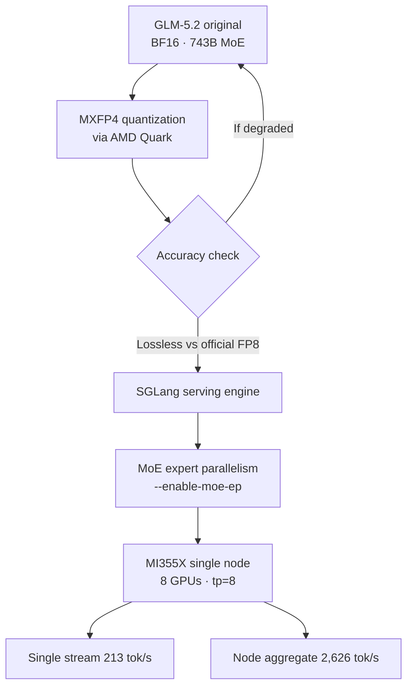

Last week a benchmark result spread quickly across developer timelines. It claimed that GLM-5.2 was served on a single AMD MI355X node at 2,626 tokens per second, and at a cost more than twice as low as Blackwell. Taken at face value, the numbers sound like the usual "our hardware is fast" marketing, but what makes this case interesting is something else entirely. It is the combination of running a 743B-scale MoE model, not on NVIDIA but on AMD GPUs, compressed down to roughly 4-bit precision without losing accuracy.

This post is written for engineering leaders evaluating on-premises and multi-cloud serving, ML platform teams weighing GPU vendor choices, and data scientists who need to work out the serving economics of large open-weight models. We will first check exactly what the original source measured, then break down why MXFP4 quantization and SGLang's MoE parallelism were decisive, and finally lay out where ThakiCloud's ai-platform stands in relation to this trend.

Here is the conclusion up front. The real message of this benchmark is not "AMD is fast." It is that **the serving stack, the quantization format and the inference engine, is starting to break open the hardware vendor lock-in**. And that exact point where the lock-in breaks open is precisely why on-premises serving platforms exist.

## What This Technology Is

This result comes from three pieces fitting together: the model, the hardware, and the serving stack that bridges the two.

**The model: GLM-5.2.** This is an open-weight MoE model released by Z.ai (formerly Zhipu), with roughly 743B total parameters and about 39B parameters active per token. Its context length reaches 1 million tokens (1M), and it is regarded as particularly strong at frontend coding tasks. Because the total parameter count is huge while only 39B parameters are active, it is a textbook example of a large sparse model: heavy to store, light to actually run.

**The hardware: AMD Instinct MI355X.** This is AMD's newest data center accelerator, and its strength is the large memory capacity per GPU, which lets you fit a large model onto fewer GPUs. This case was measured on a single node configuration (8 GPUs, tensor parallelism tp=8). For reference, memory usage per GPU at FP8 is about 89GB, roughly half of the approximately 175GB required at BF16.

**The serving stack: MXFP4 quantization (AMD Quark) plus SGLang.** This is where the core of the story lies. The original BF16 GLM-5.2 was converted to the **MXFP4** format (a 4-bit microscaling floating-point format) using AMD's quantization toolkit, **Quark**, and the original source states that this conversion was lossless relative to the official FP8 quantization, with no accuracy degradation. For the inference engine, they chose **SGLang**. The reason is clear: among the frameworks tested, SGLang was the one that natively supported MXFP4, and it was able to properly drive MoE parallelism, distributing experts across GPUs with the `--enable-moe-ep` option and routing tokens between them over NVLink/NVSwitch.

The full pipeline looks like this:

There are two ways this differs from the conventional approach. First, the quantization format is MXFP4, not FP8. Cutting bits further usually destabilizes accuracy, but the microscaling approach assigns a separate scale to each small block, which is designed to preserve quality even at roughly 4-bit precision. Second, all of this ran outside the CUDA ecosystem entirely, on AMD ROCm.

## The Actual Benchmark Results

The numbers published by the original source (Wafer.ai) fall into two categories. Since the workload conditions differ, they need to be looked at separately.

**Single-stream latency scenario.** For a single request with 10k input tokens and 1.5k output tokens, it produced **213 tokens per second**. This corresponds to the situation of one user feeding in a long context and receiving the answer as a stream.

**Node-aggregate throughput scenario.** Under conditions of 20k input tokens, 1k output tokens, and a 60% cache hit rate, it processed 2.4 requests per second (2.4 rps) while delivering an aggregate throughput of **2,626 tok/s per node**. TTFT (time to first token) was kept under 5 seconds throughout. This is closer to the conditions of production serving, where many requests are pushed in concurrently.

The cost claim goes like this. Wafer.ai states that this MXFP4 configuration costs **more than twice as low as Blackwell**, meaning throughput per dollar is more than double. In a separate analysis, SemiAnalysis (InferenceX) reported that, under a different SGLang FP8 configuration, MI355X is **up to 40% cheaper per million tokens** than B200. Since the two figures come from different quantization formats and workloads, it is more accurate to read them not as a direct comparison but as "multiple independent sources pointing in the same direction, namely MI355X's cost competitiveness." The cost index in the chart above visualizes Wafer.ai's "more than 2x" claim, and we note that it is a relative indicator, not an absolute price.

One caveat is needed here. These numbers are not something we reproduced by securing an actual MI355X node ourselves; they are the measurements published by the original source. We do not have physical access to an MI355X, so we were unable to independently reproduce these results, and every figure in this post is therefore a cited value. We plan to cover a same-conditions reproduction separately once we have the hardware.

## Why MXFP4 and SGLang Were Decisive

What matters more than the hardware in this result is the choice of serving stack. There are three reasons.

**First, 4-bit quantization fits a large MoE model onto fewer GPUs.** Loading 743B parameters at BF16 requires memory on the order of hundreds of GB. Dropping to MXFP4 drastically reduces weight memory, so the same model can fit onto fewer GPUs, into a smaller node. A large share of serving cost is determined by "how many GPUs does it take to hold this model," so near-lossless 4-bit quantization translates directly into unit cost.

**Second, MoE parallelism keeps computation limited to the active parameters.** In an MoE model, only a small number of experts are activated per token. SGLang's `--enable-moe-ep` scatters the experts across GPUs and routes each token to the right expert over a high-speed interconnect. The key to throughput is preserving, at the level of hardware placement, a structure that computes only the 39B active parameters rather than the full 743B.

**Third, the fit between format and engine is what breaks the vendor lock-in.** This is the quiet conclusion behind this achievement. Once an engine that natively supports MXFP4 (SGLang) and a toolkit that losslessly converts to that format (AMD Quark) were both in place, production-grade serving became viable on ROCm rather than CUDA. As the serving stack becomes more standardized, "which vendor's GPU" stops being a performance question and becomes a matter of availability and price. This is the shift that hands negotiating power back to the buyer.

## Implications for ThakiCloud's Products

This case connects directly to the strategy behind ThakiCloud's **ai-platform**. ai-platform is a Kubernetes-based AI/ML SaaS infrastructure that serves models across diverse customer environments and schedules GPU resources through Kueue. From that vantage point, this result carries three implications.

**Multi-vendor serving is no longer a performance compromise.** In the past, the assumption that "you cannot get good performance without NVIDIA" effectively foreclosed vendor choice. The GLM-5.2 MI355X case is evidence that assumption is shaking. If ai-platform abstracts vLLM and SGLang as serving backends and can schedule NVIDIA and AMD nodes together on top of that abstraction, customers can route requests to whatever available hardware is cheapest for a given workload. In a multi-tenant cluster, that flexibility translates directly into serving cost competitiveness.

**Quantization is a first-class platform concern.** Near-lossless low-bit formats like MXFP4 make it possible to hit the same SLA with fewer GPUs. For on-premises customers, especially domestic public sector and financial environments where data sovereignty and self-hosting are required, the sheer number of GPUs that can be procured is itself a constraint. Lossless quantization lets you run a bigger model within that constraint, so it is a natural direction for ai-platform to absorb toolchains like Quark as a standard stage of its serving pipeline.

**Cost efficiency is the core argument for on-premises proposals.** The question ThakiCloud hears most often when proposing on-premises and sovereign cloud deployments is "so how much cheaper is it." Independent benchmarks showing more than 2x cheaper than Blackwell and up to 40% cheaper than B200 can serve as evidence that hardware diversification, on top of the right serving stack, actually lowers real TCO. Naturally this depends on reproducing the result in the customer's own environment, and that reproduction capability itself is the value the platform provides.

## Limitations and Counterarguments

For balance, here are the reasons not to over-trust this result.

**First, the benchmark is a snapshot of specific conditions.** The 2,626 tok/s figure comes from a specific workload: 20k input, 1k output, 60% cache hit rate. Throughput will change substantially under workloads with short prompts and heavy generation, or with low cache hit rates. The gap between the single-stream 213 tok/s and the node-aggregate 2,626 tok/s already shows that sensitivity.

**Second, the MXFP4 "lossless" claim holds only within its tested scope.** The original source says it is lossless relative to official FP8, but this is most likely measured against a specific evaluation set. The impact of 4-bit quantization can differ by task, coding, math, long context, and so on, so before adopting it in production you need to measure quality degradation directly against your own evaluation set.

**Third, the operational maturity of the ROCm ecosystem remains a variable.** A benchmark holding up is a different matter from stable production operation. A gap with the CUDA ecosystem still exists in driver, kernel, and library compatibility, and in the maturity of incident-response tooling. Judging total cost of ownership by hardware unit price alone can miss the cost of operational staffing and downtime.

Even so, the direction is clear. Standardization of the serving stack is widening hardware choice, and the beneficiaries of that shift are serving platforms, and their customers, that can escape vendor lock-in and pick the optimal hardware for each workload. ThakiCloud's ai-platform is aimed at exactly that point.

## Sources

- Wafer.ai, "Performance per dollar is getting faster and cheaper": <https://www.wafer.ai/blog/glm52-amd>
- SemiAnalysis InferenceX, "AMD MI355X GLM-5 Inference: Up to 40% Cheaper per Million Tokens than B200 on SGLang FP8": <https://inferencex.semianalysis.com/blog/mi355x-glm5-fp8-sglang-40-cheaper-than-b200>
- LMSYS, "Win on TCO: How AMD Instinct MI355X Achieves Cost-Competitive Distributed Inference Through SGLang with MoRI": <https://www.lmsys.org/blog/2026-05-28-mori/>
- GLM-5.2 model card (743B / 39B active, MoE, 1024K context): <https://recipes.vllm.ai/zai-org/GLM-5.2>
