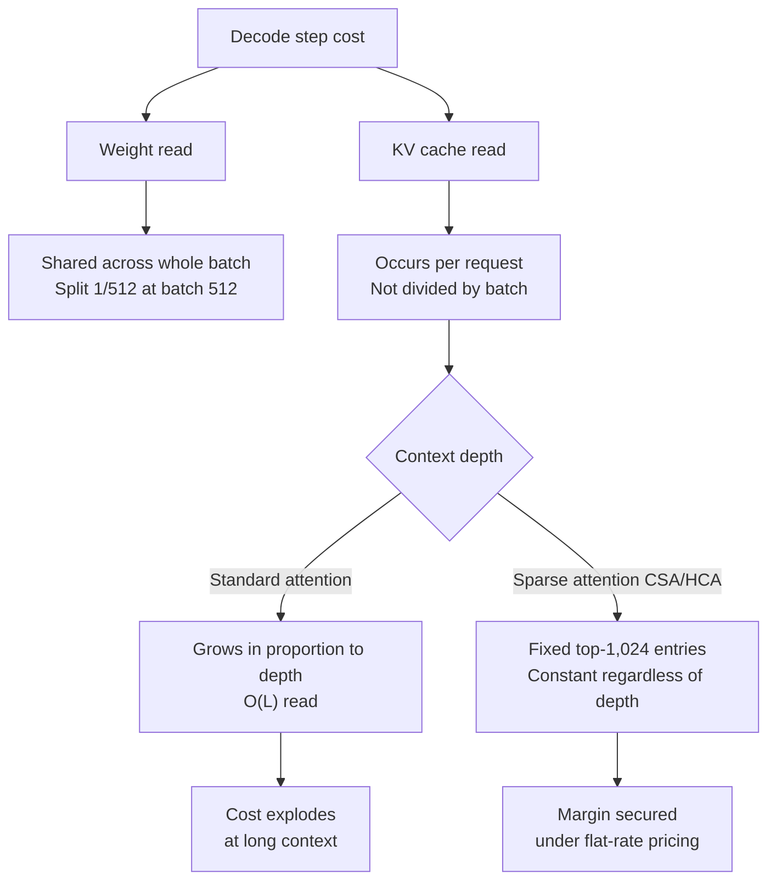

## Overview: The Paradox of an 8x Larger Model Being 5x Cheaper

An interesting question has been making the rounds in the inference infrastructure community lately. DeepSeek V4 Flash, a 284B-total-parameter model, prices its output tokens roughly 5x cheaper than the 35B Qwen3.6-35B-A3B. Looking at the actual pricing, input tokens for both sit at a similar level around $0.14/M, but output tokens run $0.18-0.28/M for DeepSeek V4 Flash versus $1.00-1.49/M for Qwen3.6.

There is something even stranger. In terms of active parameters per token, Qwen3.6 uses 3B and DeepSeek V4 Flash uses 13B. By compute alone, Qwen is actually 4x lighter, yet market pricing runs in the opposite direction. The intuition that parameter count equals cost gets broken twice in a row here.

This article dissects that paradox at three levels: first, why the dominant term in decode cost is memory reads rather than compute; second, the structural tension between KV cache depth and flat-rate pricing; and third, what emerges when we directly calculate the optimal serving shape on 8xH100 with a roofline model. For an operator like ThakiCloud that serves models directly in customer environments, this structure translates directly into cost competitiveness, so we also lay out the practical implications.

## Confirming the Architecture Facts of Both Models

Let's start by pinning down the specs precisely.

DeepSeek V4 Flash is a 284B-total / 13B-active MoE model. The router selects the top-6 among 256 routed experts plus 1 shared expert. Attention is a hybrid stack combining CSA (Compressed Sparse Attention) and HCA (Heavily Compressed Attention), reading only the top-1,024 compressed KV entries per query pass. According to official materials, at a 1M context this brings inference FLOPs per token down to 27% and KV cache down to 10% compared with V3.2. The checkpoint is a mixed format, with MoE experts in FP4 and the rest in FP8.

Qwen3.6-35B-A3B is a 35B-total / 3B-active MoE model (256 experts, 8 routed + 1 shared). Attention is a hybrid of Gated DeltaNet linear attention layers and full attention layers (2 KV heads, head dim 256). Native context is 262K, extended to 1M via YaRN. At an FP8 checkpoint it comes to roughly 35GB, which fits on a single H100.

In short, both are state-of-the-art, efficiency-oriented designs. What makes this comparison more interesting is that Qwen is not expensive because it is some naive dense model.

## The Real Structure of Decode Cost: A Roofline Model

Token generation (decode) is bound by memory bandwidth, not compute. A first-order approximation of decode step time looks like this.

```text
T_step = (bytes of weight to read + Σ per-request KV read bytes) / memory bandwidth
throughput = batch_size / T_step
```

The two terms here have completely different characters.

Weight reads are shared across the batch. Reading the weights once per step is shared by every request in the batch. At a batch size of 512, the per-token weight cost drops to 1/512. This is why MoE's total parameter count becomes "nearly free at large batch sizes."

KV reads, by contrast, are per-request. Each request must read its own context's KV cache, and this cost does not get divided as the batch grows. It scales linearly as context gets deeper.

So once the batch is large enough and context is long enough, the dominant cost term shifts from weight to KV reads. Yet API pricing is flat per token regardless of context depth: a request with 32K of history and one with 500K of history pay the same output price. From a serving operator's perspective, a model that can keep KV reads bounded regardless of depth is the one that generates margin under a flat-rate regime.



## 8xH100 Serving Shape: A Numeric Comparison

Let's now actually put both models on 8xH100 (SXM5, 80GB HBM3 per card, 3.35TB/s per card, 640GB total, 26.8TB/s aggregate). We set the hourly cost at roughly $20 on an on-demand basis.

The modeling assumptions are as follows. Qwen3.6 has roughly 35GB of FP8 weights; assuming 10 of its 40 hybrid layers are full attention layers, per-token KV is about 10KB [Est.] (2 KV heads x 256 dim x 2 for K/V x 10 layers x 1 byte). DeepSeek V4 Flash has an effective weight of roughly 150GB [Est.] with FP4 experts plus FP8 dense; stored KV, based on the official claim of 10% versus V3.2, comes to about 3.5KB per token [Est.], while decode-time reads are a constant roughly 4MB per request per step via the top-1,024 entries.

### The Serving Shape Differs From the Start

Qwen3.6's optimal shape is 8 independent replicas (DP8). Since the model fits on a single card, there is no inter-GPU communication at all, leaving roughly 38GB of KV budget per card. This is the typical serving shape for a design oriented toward local hosting.

DeepSeek V4 Flash requires all 8 cards to be grouped as a single TP/EP unit. In exchange for the all-to-all communication this introduces, roughly 490GB of KV budget is shared across the whole batch.

### Throughput Calculations by Context Depth

Here are the roofline calculation results (actual achieved throughput is typically 50-60% of these figures, and EP communication and prefill are not included).

At 8K context, the Qwen cluster runs about 76k tok/s and DeepSeek V4 Flash about 90k tok/s, roughly comparable. Once communication overhead is factored in, Qwen is effectively ahead. This means at short context, the smaller model is hardware-cheaper or on par.

At 32K the gap starts to open up. Qwen's per-request KV read grows to 320MB, dropping it to about 31k tok/s, while DeepSeek V4 Flash holds at about 90k tok/s since its KV read is still constant. That's roughly a 3x difference.

At 256K, Qwen's per-request KV reaches 2.56GB, and the storage ceiling caps per-card batch size at 14, dropping it to about 5.3k tok/s. DeepSeek V4 Flash runs about 45k tok/s, an 8.5x difference.

At 1M, Qwen must read 10GB per request at every step, dropping it to about 1.2k tok/s with a ceiling of 24 concurrent sessions. DeepSeek V4 Flash runs about 11k tok/s with 64 concurrent sessions, a gap approaching 10x.

Converted to dollars, at 32K it's Qwen $0.18/M versus DeepSeek V4 Flash $0.06/M; at 1M it's Qwen $4.6/M versus DeepSeek V4 Flash $0.5/M. Across the tens-to-hundreds-of-K range that is the average depth for agentic workloads, the cost gap widens to 3-10x, which lands in exactly the same order of magnitude as the observed API price difference (roughly 5x).


One thing worth stating honestly: there is up to a 40x discrepancy across public sources on DeepSeek V4 Flash's stored KV per token (the vLLM recipes' claim of "10% versus V3.2" conflicts with the KV table in some deployment guides). The calculation above adopts the former, which is closer to a primary source, and we want to stress that the conclusion rests on the direction of scaling, the structure by which the gap widens with depth, rather than on the absolute values.

## Three Things the Calculation Reveals

First, Qwen's bottleneck is not KV storage but KV reads. Thanks to Gated DeltaNet, storage (roughly 10KB per token) is already excellent. The problem is that the O(L) reads of the full attention layers repeat at every decode step. DeepSeek V4 Flash keeps storage small and also locks reads down to a constant.

Second, the batch absorbs the weight reads of MoE's 284B. At a large batch, per-step weight reads are fixed at roughly 150GB, which comes to 0.3GB per token when split across 512 tokens. Qwen's DP8, by contrast, has each card read its own 35GB independently, aggregating to 280GB per step across the cluster. The 8x difference in total parameters reverses in effective reads.

Third, even though Qwen is hardware-cheaper at short context, its market price is 5x higher. That is quantitative evidence that the price sheet does not reflect physical cost. DeepSeek runs its 1st-party API at massive traffic volume and passes the cost savings from infrastructure optimizations, dedicated kernels (deep_gemm_mega_moe, FP4 indexer cache), prefill/decode disaggregation, MTP, and a 98% cache-hit discount, straight into pricing. Qwen3.6-35B, whose design is itself oriented toward local/single-GPU use, has its API serving mostly handled by third parties running a general-purpose vLLM stack; when traffic density is low, GPU idle time has to get folded into the price, pushing quotes up. Market price is a function of demand density and optimization level, not of physical cost.

## Implications for ThakiCloud's Product

This analysis connects directly to the decisions ThakiCloud's ai-platform faces every day. When serving models on customer GPUs in on-prem and sovereign cloud environments, what determines per-token cost on the same hardware is not model size but serving shape. As the calculations above show, effective throughput can differ by several multiples on the same 8xH100 depending on the choice between DP8 and a TP/EP group, the KV cache dtype, and the max-model-len setting. ai-platform makes it standard process to configure vLLM serving parameters, on top of K8s- and Kueue-based GPU scheduling, to match the workload profile (average context depth, concurrent session count), and this article's roofline model is the starting point for that sizing.

There is also an agent-workload angle. In Paxis (ThakiCloud's Agent-Native Cloud), agents generate long histories and repeated tool calls, which is exactly the kind of traffic that pushes KV depth deep. The practical conclusion of this analysis is that the combination of a model that stays strong at deep context and a prefix-cache infrastructure is what governs agent economics. Low serving cost (ai-platform) is what produces agent unit economics (Paxis).

## Limitations and Counterarguments

Let's state the limitations of this analysis explicitly. First, roofline is an upper-bound model. Actual throughput typically comes in at 50-60% of these figures due to kernel efficiency, EP all-to-all communication, and interference between prefill and decode, while speculative techniques such as MTP push throughput back up in the other direction. Second, DeepSeek V4 Flash's KV figures conflict across public sources, so we have kept the [Est.] label. Third, the number of full attention layers in Qwen3.6 is an estimate based on the public config, and the absolute values shift if the hybrid ratio differs. Fourth, quality is a separate axis: DeepSeek V4 Flash trails V4 Pro on complex multi-step reasoning, so choosing a model on cost alone would be the wrong conclusion. This cost analysis only answers the question of which serving shape is economical at a given, fixed level of required quality.

## References

- [vLLM Recipes: DeepSeek-V4-Flash](https://recipes.vllm.ai/deepseek-ai/DeepSeek-V4-Flash)
- [vLLM Recipes: Qwen3.6-35B-A3B](https://recipes.vllm.ai/Qwen/Qwen3.6-35B-A3B)
- [DeepSeek API Docs: Models & Pricing](https://api-docs.deepseek.com/quick_start/pricing)
- [OpenRouter: DeepSeek V4 Flash](https://openrouter.ai/deepseek/deepseek-v4-flash)
- [OpenRouter: Qwen3.6 35B A3B](https://openrouter.ai/qwen/qwen3.6-35b-a3b)
- [Qwen Official Blog: Qwen3.6-35B-A3B](https://qwen.ai/blog?id=qwen3.6-35b-a3b)
- [Spheron: Deploy DeepSeek V4-Flash on GPU Cloud](https://www.spheron.network/blog/deploy-deepseek-v4-flash-gpu-cloud/)
