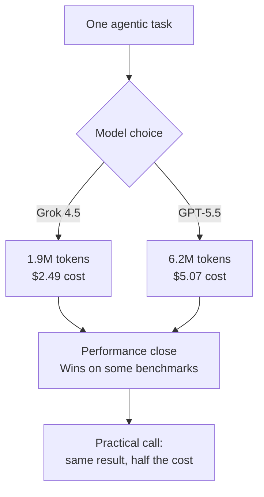

For the past several quarters, the frontier model race has been fought over a point or two on a benchmark chart. Then, on July 8, 2026, SpaceXAI's Grok 4.5 release changed the question being asked. If a model's performance sits close to Opus 4.8 and GPT-5.5, the question that matters next is not "who is smarter" but "who finishes the same job for less." This piece is for engineering leaders and AI teams who run infrastructure and pay the model bill every month. Using Grok 4.5's published numbers, we look at where model economics are heading, and what that means for a multi-tenant inference platform like ThakiCloud's.

## Overview: From a Benchmark Race to an Economics Race

Grok 4.5 comes from SpaceXAI, part of the xAI family, and is available immediately through Grok Build, Cursor, and the xAI console. Elon Musk called it an "Opus-class model," and on several benchmarks it does edge out Opus 4.8 and GPT-5.5. But the most striking part of this release is not the performance, it is the price tag. Grok 4.5 costs $2 per million input tokens and $6 per million output tokens. Compare that to GPT-5.5 and GPT-5.6, priced at $5 input and $30 output for a comparable tier, and Grok 4.5 comes in at roughly a fifth of the output cost.

Why this pricing structure matters becomes clear once you break it down to the level of an actual unit of work. Benchmark scores mean something on a leaderboard, but what determines the invoice is tokens actually consumed per task, multiplied by the unit price. And this is exactly where Grok 4.5 opens up a large gap.

## What This Model Is: Performance Close, Cost Far Apart

Let's be honest about performance first. Grok 4.5 does not lead on every benchmark. Here are the published numbers as reported:

- On Terminal Bench 2.1, Grok 4.5 scores 83.3%, essentially tied with GPT-5.5's 83.4%.
- On the Coding Agent Index, it scores 76, matching GPT-5.5 running in the Codex environment.
- On DeepSWE 1.1, it scores 53%, well behind GPT-5.5's 67%.
- On Artificial Analysis's Intelligence Index, it scores 54, close to GPT-5.5's 55.

In short, Grok 4.5 stands shoulder to shoulder with top-tier models on coding and terminal-agent work, but still trails on the harder software engineering benchmark (DeepSWE). Grok 4.5 is not "the model that beats everything." It is "the model that handles most real-world tasks near the top tier."

This is where economics enters the picture. Below are the published numbers for a single real agentic task.

- Cost per task: $2.49 for Grok 4.5 on Grok Build, versus $5.07 for GPT-5.5 on Codex.
- Average tokens consumed per task: 1.9 million for Grok 4.5, versus 6.2 million for GPT-5.5.

If performance differs by a few percentage points, cost differs by more than double, and token consumption by more than triple. That looks like a single line in a benchmark table, but in an operation processing thousands of tasks a day, it changes the order of magnitude on the monthly bill.

## Why This Shift Matters Now

The signal from this release is simple. As frontier performance converges toward a common ceiling, the deciding factor in model choice is shifting from "the most intelligent model" to "intelligent enough, at a lower price." As The Decoder pointed out, once benchmark gaps narrow this much, the gap itself may stop mattering much for real-world choices.

This view lines up precisely with a principle we covered in an earlier post. Most agentic work is not a creative hard problem, it is a structured task: classification, summarization, routing, rendering. The quality of this kind of work is governed more by code-level guardrails than by model intelligence. If that is true, routing structured tasks to a cheaper model and reserving the top-tier model for genuinely hard reasoning is the rational move. Grok 4.5 widens the field of "cheap but smart enough" options available for that routing.

At the same time, there is a point worth flagging. Consuming a third of the tokens per task is not only a matter of unit price, it may also mean the model finishes the same job in fewer round trips. That works in favor of latency and throughput too. Still, this figure comes from one specific benchmark environment (Grok Build versus Codex), so it needs to be confirmed with your own measurements on your own workload.

## Implications for ThakiCloud's Products

ThakiCloud's ai-platform is a multi-tenant inference platform, serving models to a range of customer environments on top of K8s and Kueue-based GPU scheduling. A release like Grok 4.5 matters to us on two levels.

The first is model routing economics. We already split model tiers by the nature of the work: cheap tiers for exploration and classification, mid tiers for implementation and review, top tiers for architecture and complex reasoning. When a model appears that gets close to frontier performance at less than half the price, the coverage of the "cheap but smart enough" tier expands, and the range of situations requiring the top-tier model shrinks. The outcome is the same quality at a lower total cost. The key is that this decision has to be made from actual output quality measured by code, not from human intuition.

The second is the cost logic of on-premises and sovereign environments. For customers who cannot move data outside their own environment, such as Korean public sector, financial, or NIS-mandated deployments, self-hosting is a precondition. In these environments GPU capacity is finite, so a model that consumes fewer tokens per task lets the same hardware handle more concurrent requests. Token efficiency is not just an API billing issue, it is also a real throughput issue for on-prem clusters. Low serving cost is exactly where ai-platform is competitive, and a token-efficient model amplifies that edge directly.

Third, from an agent perspective, this connects to Paxis. Paxis is the Agent-Native Cloud control plane running on top of ai-platform, executing skills in isolated sandboxes and routing every action through policy gates and audit logs. Agent economics ultimately come down to "the model cost of finishing one task," and a low-cost, high-efficiency model improves the unit economics of each agentic workflow. This confirms once again the thesis that cheap serving is what makes agent economics work.

## Limitations and Counterarguments

Before getting too optimistic, it is worth looking at the other side. First, most of these numbers come from the vendor and early analysis outlets. Metrics like Terminal Bench or the Coding Agent Index do not correlate perfectly with real production workloads. As the 53% versus 67% gap on DeepSWE 1.1 shows, top-tier models still hold the advantage on hard problems. If teams push hard reasoning onto a cheap model purely because it is cheap, the cost of retries and failure recovery can rise enough to flip the total cost equation.

Second, the efficiency figure of 1.9 million tokens per task was measured in one specific harness (Grok Build). It may not reproduce in a different agent framework or a different prompt structure. Plugging a vendor-published number directly into your own invoice is risky, and it needs to be verified through your own A/B measurement on a golden set.

Third, Grok 4.5 is not an open-weight model, it is a closed model served through an API. That means it cannot be deployed directly in on-prem environments where data sovereignty is the whole point. Sovereign customers still need a self-hostable open-weight model, and Grok 4.5's economics story is limited to cloud API workloads.

In conclusion, Grok 4.5 is a striking illustration of a broader trend: once frontier performance converges, the next battlefield is economics. Rather than chasing another point or two on a benchmark, the teams that win this phase are the ones who actually measure cost per task and token efficiency on their own workload, and route models based on that data. Automating that measurement and that routing is the work we do every night.

## Sources

- [Introducing Grok 4.5 · Cursor](https://cursor.com/blog/grok-4-5)
- [SpaceXAI releases Grok 4.5, which Elon describes as an 'Opus-class model' · TechCrunch](https://techcrunch.com/2026/07/08/spacexai-releases-grok-4-5-which-elon-describes-as-an-opus-class-model/)
- [Grok 4.5 is so cheap compared to Fable 5 and GPT 5.5 that benchmark gaps may not matter much · The Decoder](https://the-decoder.com/grok-4-5-is-so-cheap-compared-to-fable-5-and-gpt-5-5-that-benchmark-gaps-may-not-matter-much/)
- [Grok 4.5 (high): Intelligence, Performance & Price Analysis · Artificial Analysis](https://artificialanalysis.ai/models/grok-4-5)
