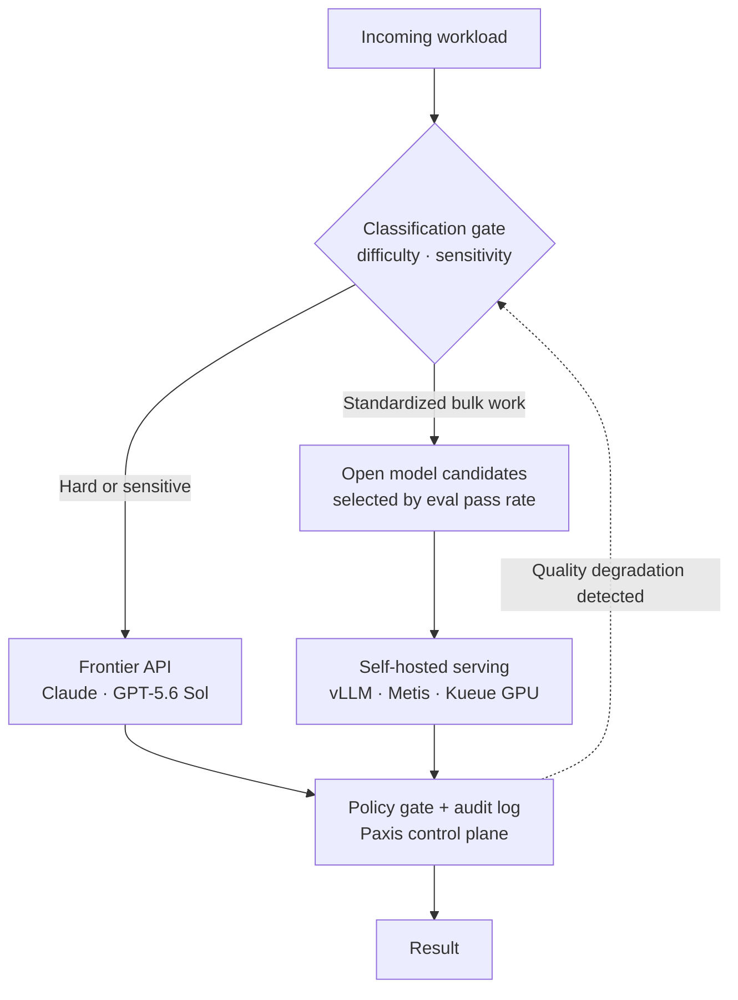

Over the past few weeks, the conversation in the AI industry has shifted from "who is smarter" to "who is cheaper." The most telling scene came from Microsoft. The very company that put OpenAI on the trajectory it now rides has started routing the tens of thousands of weekly AI requests inside Excel and Outlook to its own models instead of OpenAI's and Anthropic's. Microsoft's AI chief Mustafa Suleyman did not hide the reasoning. "Anthropic is extremely expensive. Our goal is to reduce that cost and eventually eliminate it," he said.

This post is written for engineering leaders, AI teams, and the decision makers who own inference cost for their own services. It explains why the cost war unfolding right now is not transient noise but a structural shift, lays out a migration playbook for moving frontier API spend to open models and self-hosting, and finally explains where ThakiCloud sits as the control plane that actually runs that migration.

## What has changed

A single company's decision does not make a trend. But several signals pointing the same direction have stacked up within a few weeks.

First, Microsoft's detour was precise. The hardest, rarest tasks still go to frontier models, while only the tedious, high-volume work, things like email replies, thread summaries, and simple spreadsheet formulas, is being reclaimed for its own models. This matters because that tedious bulk work is exactly where the money actually flows ([SiliconANGLE report](https://siliconangle.com/2026/07/07/microsoft-reportedly-ditching-openais-anthropics-ai-models-favor-cut-costs/)).

Second, US companies are moving toward Chinese open models to escape pricing. According to CNBC, Chinese models handled more than 30 percent of US enterprise AI usage on one major routing platform, peaking at 46 percent, a sharp jump from an average of 11 percent a year earlier. Costs are 60 to 90 percent lower, and on some agentic benchmarks the gap to the top US models has narrowed to within a single point ([CNBC report](https://www.cnbc.com/2026/07/07/chinese-ai-models-costs-us-openai-anthropic.html)).

Third, a signal of oversupply has surfaced. Meta announced it is preparing a cloud business to sell "surplus" AI compute, effectively turning the admission that it built too much into a business model ([CNBC report](https://www.cnbc.com/2026/07/01/meta-stock-cloud-ai-compute.html)).

Fourth, the market reacted. In late June, more than a trillion dollars in market capitalization vanished from semiconductor and AI-related stocks within days, and Wall Street began asking whether this enormous spending could actually be recouped (roughly $1.3 trillion by Reuters' tally, unverified, for reference only).

What these signals share is not that frontier models got worse. If anything, their performance keeps improving. The problem is that even the biggest customers no longer accept the premise of using the best model for every task and paying the top price for it.

Pricing itself is also falling fast. OpenAI's recently released GPT-5.6 Sol prices at roughly $5 per million input tokens and $30 per million output tokens, a sharp drop in per-token cost from the previous generation ([CNBC report](https://www.cnbc.com/2026/07/08/openai-expanding-gpt-5point6-ai-model-release-ending-government-limits.html)). That means the frontier labs are now in a price war with each other too. The front line has shifted from an intelligence war to a value war.

## Why now

The cost war is breaking out now because of how workloads are distributed.

Break down what agents handle in a given day and the character splits clearly. On one side sits genuinely hard reasoning: ambiguous design decisions, subtle debugging, breaking down a problem nobody has seen before. On the other side sits standardized, high-volume work: classification, routing, summarization, spec checking, replies in a fixed format. By count, the latter overwhelmingly dominates.

The financial assumption of the frontier labs was simple: that enterprises worldwide would process billions of these small requests forever on expensive models. That endless river of tokens was the basis propping up the frontier companies' lofty valuations.

But the quality of standardized work is governed more by guardrails than by model intelligence. Output formats drift not because the model lacks capability, but because the format was requested in prose instead of being enforced. When length caps, allowed value sets, rendering specs, and pass criteria are enforced by code, that work comes out reliably even from far cheaper open models. The moment "good enough" becomes achievable for a fraction of the price, reclaiming that river of bulk work becomes the rational move. That is exactly the call Microsoft made.

## From frontier to open: the migration playbook

So how do you actually move this river. Switching models on impulse is risky. A reliable migration goes through five steps.

First, classify the workload. Split each request along two axes: difficulty and sensitivity. Keep hard or sensitive tasks on frontier, and mark only the standardized, high-volume work as a migration target.

Second, evaluate substitution candidates. For each task marked for migration, score open-model candidates against real data. The key here is a pass rate computed by code, not a human impression. Run actual outputs through the spec checks, and drop any candidate that falls short of the threshold.

Third, configure routing. Define, in one place, the rules for which model handles which task type. That single source of truth is what makes it easy to swap or roll back models later.

Fourth, self-host the open model. Deploy the selected open model on your own infrastructure using a serving engine like vLLM. This is the step where on-premises deployment, data sovereignty, and unit-cost advantages are actually realized.

Finally, verify and roll back. After migration, keep measuring quality, and if the pass rate slips, move that specific task back to frontier. A migration without a rollback path is not a migration, it is a gamble.

On X, one developer shared that this approach took their monthly API spend from $60,000 down to $12,000 on open models, roughly an 80 percent cut. The original post was access-restricted and could not be independently verified, so the figure should be treated as unverified, for reference only. That said, the scale of the savings is consistent with the verified data: the 60 to 90 percent lower per-token cost of Chinese open models, and the price cuts happening between the frontier labs themselves, point in the same direction.

## Implications for ThakiCloud's products

The playbook is conceptually clear, but running it in practice requires two things: infrastructure to serve open models cheaply, and a control plane to choose the model per task while guaranteeing safety through policy and audit. ThakiCloud provides both pillars together through two products.

### ai-platform: low-cost serving infrastructure

ai-platform is Kubernetes-based AI/ML serving infrastructure. It schedules GPUs with Kueue, serves open models with vLLM, and supports multi-tenant isolation and on-premises deployment. Step four of the migration playbook, deploying a selected open model on your own infrastructure to bring down unit cost, happens at this layer. For customers who cannot send data outside their own boundary, such as government agencies or regulated industries, sovereign deployment is decisive, a requirement that frontier APIs cannot satisfy to begin with.

### Paxis: the Agent-Native Cloud that executes the migration

Paxis is the agent-native control plane running on top of ai-platform. Just as a conventional cloud treats virtual machines and databases as first-class resources, Paxis treats skills, tools, policies, and audit logs as first-class resources. From the migration playbook's perspective, the most important part is model routing. Paxis uses `models.yaml` as a single source of truth to cross-route Claude, OpenAI, Ollama, Kimi, MiniMax, and ai-platform's own vLLM serving (Metis) from one place. This maps directly onto steps three and five of the playbook described above: assigning a model per task type, and rolling a task back to frontier the moment quality slips is a judgment call made at this layer.

Beyond that, Paxis provides a skill harness that selects among more than 960 skills using BM25, isolated sandbox execution, a wiki-based knowledge engine, DAG multi-agent orchestration, and MCP connectors with automatic OAuth reconnection. Every agent action passes through a policy gate and an audit log. In other words, you can switch to cheaper models while still tracking exactly what was processed by which model.

The relationship between the two products can be summarized in one sentence. Low-cost serving (ai-platform) is what makes an agent's economics (Paxis) work. Without infrastructure that can run open models cheaply, routing rules remain a plan on paper; without routing and policy, cheap serving becomes an uncontrollable risk. Turning migration into a real business requires both pillars at once. Note that Paxis is still at the proof-of-concept stage, and its interfaces and schemas may change quickly.

## Limitations and counterarguments

Ending this story on pure optimism would not be honest. The counterarguments are clear.

First, quality gaps still exist. Where open models have closed the distance is standardized tasks and some agentic benchmarks. On breaking down never-seen problems or subtle reasoning over long context, frontier still leads. Trying to move everything to open models means paying back, in failure costs on hard tasks, everything you saved on bulk work. The core of migration is not wholesale replacement but precise classification.

Second, self-hosting is not free. API calls hand the operational burden to the lab, while self-hosting means taking on GPU procurement, serving optimization, and incident response yourself. Once you factor in upfront capital expenditure and operations headcount, API calls can actually be cheaper at small traffic volumes. The break-even point depends on traffic scale and utilization.

Third, widely circulated benchmark numbers should not be taken at face value. While preparing this post, certain benchmark tables and figures could not be traced to a verifiable original source and were left out of the body. Model comparisons should be judged only by results measured directly against your own workload. Someone else's benchmark is a starting point, nothing more.

Fourth, routing itself adds complexity. A system that moves between multiple models is harder to debug and observe than a single-model system. That is exactly why policy gates and audit logs are not optional, they are required.

Even so, the direction is clear. Now that even Microsoft refuses to pay frontier prices for every task, the real question is who will keep paying that price. The ability to precisely migrate bulk workloads to open models, and to control that migration safely, will be a core competency of AI operations for years to come. ThakiCloud is positioned to provide that migration on both fronts, infrastructure and control plane, together.

## Sources

- [Microsoft reportedly ditching OpenAI's, Anthropic's AI models to cut costs (SiliconANGLE)](https://siliconangle.com/2026/07/07/microsoft-reportedly-ditching-openais-anthropics-ai-models-favor-cut-costs/)
- [Chinese AI models gain ground with US companies on cost (CNBC)](https://www.cnbc.com/2026/07/07/chinese-ai-models-costs-us-openai-anthropic.html)
- [Meta plans cloud business to sell AI compute (CNBC)](https://www.cnbc.com/2026/07/01/meta-stock-cloud-ai-compute.html)
- [OpenAI expands GPT-5.6 Sol access and pricing (CNBC)](https://www.cnbc.com/2026/07/08/openai-expanding-gpt-5point6-ai-model-release-ending-government-limits.html)
