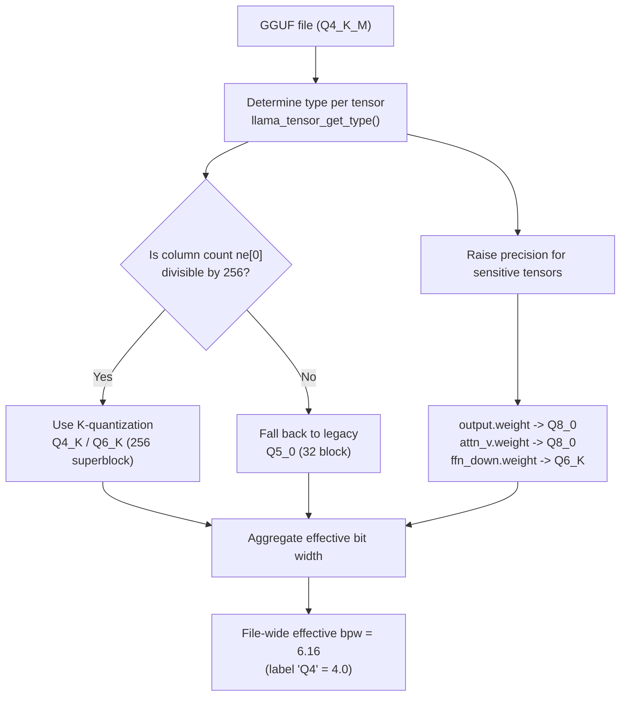

## Overview

If you have ever run an LLM locally, you have probably seen labels like `Q4_K_M`, `Q5_K_M`, or `Q8_0`. Most people stop at "Q4 means 4 bits, so it must be the smallest and fastest" and simply download the file and run it. But that label hides more than it reveals. Few people have actually opened a file labeled `Q4_K_M` and checked, tensor by tensor, whether it is really filled with 4-bit data.

This post is for engineering leaders, practitioners responsible for inference cost, and teams looking to serve models on-premises. We downloaded the GGUF file for Qwen2.5-0.5B-Instruct at several quantization levels, measured the actual file sizes, and fully dissected one `Q4_K_M` file tensor by tensor. The result was quite different from intuition. We explain why understanding this gap matters for serving cost and quality, and what it means for ThakiCloud's inference infrastructure.

To state the conclusion up front: in this model's `Q4_K_M` file, tensors that were genuinely 4-bit K-quantization (Q4_K) accounted for only 6.1 percent of total weight capacity, and the file's effective bit width was not 4 but **6.16 bits**. The label was, in effect, almost a lie.

## What Is This Technology

GGUF is a single-file model format used in the llama.cpp ecosystem. A single file bundles metadata (architecture, tokenizer, hyperparameters) together with the quantized weights of every tensor. The key point is that **each tensor can use a different quantization type**. So a file-level label like `Q4_K_M` only indicates the "dominant type," not that the entire file is that type.

llama.cpp's quantization types broadly fall into two families. One is the **legacy family** (Q4_0, Q5_0, Q8_0), which groups 32 weights into one block. The other is the **K-quantization family** (Q4_K, Q5_K, Q6_K), which groups 256 weights into one superblock. Because K-quantization further subdivides and stores scales and minimums within the superblock, it delivers better quality than legacy at the same bit width. The `K` in `Q4_K_M` refers to this K-quantization, and `M` denotes the "medium" preset that raises some sensitive tensors to higher precision (Q6_K).

Looking a bit closer at the superblock structure reveals why K-quantization is more efficient. For example, Q4_K packs 256 weights into 144 bytes. Of that, the pure 4-bit values take up 256 x 4 bits = 128 bytes, and the remaining 16 bytes are metadata that splits the superblock into 8 sub-blocks and re-quantizes each sub-block's scale and minimum to 6 bits. In other words, the values themselves are 4 bits, but by keeping the scales that reconstruct them finely grained, error is reduced. This contrasts with legacy Q4_0, which keeps only one scale per 32 weights. So the actual bit width of Q4_K is 144 x 8 / 256 = 4.5 bits, slightly more than pure 4 bits, but with much more stable quality.

There is one decisive constraint here. **K-quantization can only be used when a tensor's number of columns (`ne[0]` in ggml terms) is divisible by 256.** This is because the superblock operates in units of 256. If this condition is not met, llama.cpp silently falls back to the legacy family (mostly Q5_0). This one rule explains the entire result of today's experiment.



## Setup and Integration

The experiment can be reproduced without any extra dependencies. The Hugging Face API returns actual byte counts for file size, and you can read tensor types directly with the `gguf` reader.

```bash
# 1) Install the reader and downloader
pip install gguf huggingface_hub

# 2) Download just one Q4_K_M file (under 500MB since it's a 0.5B model)
hf download Qwen/Qwen2.5-0.5B-Instruct-GGUF \
  qwen2.5-0.5b-instruct-q4_k_m.gguf --local-dir ./gguf
```

Here is the code for opening the downloaded file's tensor types. The GGUF header embeds each tensor's name, dimensions, and ggml type integer directly, so aggregating just these values tells you exactly what the file is actually filled with.

```python
from collections import Counter
from gguf import GGUFReader

r = GGUFReader("gguf/qwen2.5-0.5b-instruct-q4_k_m.gguf")
hist = Counter()
for t in r.tensors:
    hist[t.tensor_type.name] += 1
    # Check the actual type of a few representative tensors
    if t.name in ("token_embd.weight", "output.weight",
                  "blk.0.attn_v.weight", "blk.0.ffn_down.weight",
                  "blk.0.attn_q.weight"):
        print(f"{t.name:26s} {t.shape} -> {t.tensor_type.name}")
print(dict(hist))
```

Bytes per block come straight from ggml's definitions. For example, Q4_K stores 256 weights in 144 bytes, so 4.5 bits per weight; Q6_K stores 256 in 210 bytes, so 6.5625 bits per weight; legacy Q5_0 stores 32 in 22 bytes, so 5.5 bits per weight. Summing (element count / block size) x bytes per block for every tensor gives you the exact effective bit width of the file.

## Actual Experiment Results

First, file sizes. Here are the measured values for the same model downloaded at 7 quantization levels, compared against the fp16 original (1266MB).

| Quantization | File Size | vs. fp16 |
|---|---|---|
| Q2_K | 415.2 MB | 32.8% |
| Q3_K_M | 432.0 MB | 34.1% |
| Q4_0 | 428.7 MB | 33.9% |
| **Q4_K_M** | **491.4 MB** | **38.8%** |
| Q5_K_M | 522.2 MB | 41.2% |
| Q6_K | 650.4 MB | 51.4% |
| Q8_0 | 675.7 MB | 53.4% |

Something odd already jumps out here. The difference between Q2_K (415MB) and Q4_0 (429MB) is just 14MB. We cut the bits in half, yet the file barely shrank. And `Q4_K_M` (491MB) is actually larger than pure 4-bit `Q4_0` (429MB). Looking at the names alone, this makes no sense.

The real reason becomes clear once you open the `Q4_K_M` file tensor by tensor. Here is the type distribution across its 291 tensors.

| Actual Type | Tensor Count | Nominal bpw | Share of Weight Capacity |
|---|---|---|---|
| Q5_0 | 133 | 5.5 | 54.9% |
| Q8_0 | 13 | 8.5 | 30.1% |
| Q6_K | 12 | 6.5625 | 8.8% |
| Q4_K | 12 | 4.5 | 6.1% |
| F32 (norm/bias) | 121 | 32.0 | 0.1% |


Despite the `Q4_K_M` label, genuine 4-bit K-quantization (Q4_K) accounted for only **6.1 percent** of total weight capacity. Instead, the 5.5-bit legacy type Q5_0 took up more than half (54.9 percent), and the 8.5-bit Q8_0 consumed 30 percent. Calculating the file's overall effective bit width gives **6.16 bits**, more than 1.5 times the 4 bits the label implies.

Checking representative tensors one by one makes the pattern clear. Here are the measured types:

- `token_embd.weight` (896 x 151936) -> **Q5_0**
- `output.weight` (896 x 151936) -> **Q8_0**
- `blk.0.ffn_down.weight` (4864 x 896) -> **Q6_K**
- `blk.0.attn_v.weight` (896 x 128) -> **Q8_0**
- `blk.0.attn_q.weight` (896 x 896) -> **Q5_0**

Do you see the pattern? Tensors carrying K-quantization (Q4_K, Q6_K) appeared only where the column count `ne[0]` was 4864, as with `ffn_down`. 4864 is divisible by 256 (19 x 256). Most other tensors, however, have `ne[0]` of 896, and 896 is not divisible by 256 (3.5 x 256). So these tensors could not use K-quantization at all and all fell back to legacy Q5_0. Layer this together with precision boosts (Q5_0, Q8_0) on quality-sensitive tensors like embeddings, output, and attention value, and you get a file labeled `Q4_K_M` whose actual substance is chunks of 5.5 to 8.5 bits.

Here is exactly where the effective bit width of 6.16 comes from. This file contains a total of 630 million weights subject to quantization, stored in roughly 485MB of bytes. 485,452,288 bytes x 8 / 630,167,424 weights = 6.16 bits per weight. Add about 6MB of file metadata and alignment padding, and it matches the actual file size of 491MB exactly. The fact that the calculation matches the file size is also evidence that the tensor type readout was accurate.

This also explains the two odd points in the file size table. Q2_K (415MB) is only barely smaller than Q4_0 (429MB) because, in this small model, the embedding and output tensors take up a large share of total weights, and they stay at high precision regardless of the quantization level. No matter how much you lower the bits, a fixed cost sits at the floor and does not shrink. And `Q4_K_M` is larger than pure 4-bit `Q4_0` because the `M` preset paid for pulling sensitive tensors up to Q6_K and Q8_0 in file size. The label's number is lower, but the effective bit width is actually higher.

To summarize, this experiment demonstrated three facts through measurement. First, a file-level label only indicates the dominant type and does not guarantee the effective bit width. Second, in small models whose hidden size is not a multiple of 256, K-quantization is largely disabled, widening the gap between label and substance. Third, in small models the embedding and output tensors take up a large share of total capacity, so keeping them at high precision significantly dilutes the savings that "4-bit quantization" is supposed to deliver.

## Implications for ThakiCloud Products

This experiment only dissected one small model, but its lesson carries straight through to production serving infrastructure. ThakiCloud's ai-platform serves models to diverse customer environments on top of Kubernetes and Kueue-based GPU scheduling. In that context, "which quantization to choose" is not a matter of taste, it is a decision that determines GPU memory allocation, batch size, and ultimately cost per token.

Trusting the label as-is throws off capacity planning. If you assume `Q4_K_M` means "4 bits, so a quarter of the original" and allocate GPU memory accordingly, you will find, as in the experiment above, that it actually takes up around 40 percent of the original, and batch slots run out faster than expected. This matters especially in multi-tenant serving, where many small models must be packed tightly onto a single node. There, the difference between measuring the effective bit width and simply trusting the label directly translates into how many models a node can hold. This is exactly why we verify GGUF files tensor by tensor when building serving images. For customers who require self-hosted, on-premises, or sovereign deployment in particular, this habit of measuring rather than assuming becomes a genuine cost advantage.

Making this verification itself a repeatable task is where Paxis comes in. Paxis is ThakiCloud's Agent-Native Cloud control plane running on top of ai-platform, treating skills, tools, policies, and audit logs as first-class resources. If today's experiment, downloading a GGUF file, aggregating tensor types, and flagging a warning when effective bit width exceeds a threshold, is registered as a single skill, it runs in an isolated sandbox and every result passes through policy gates and audit logs. Instead of having someone manually open a file every time a new model lands in the registry, a validated skeleton runs automatically. This is how the economics that low-cost serving (ai-platform) creates and the orchestration (Paxis) that makes that serving safely repeatable fit together.

## Limitations and Counterarguments

A few things should be made explicit.

First, these results are close to an extreme case specific to Qwen2.5-0.5B, whose hidden size is 896. In larger models whose hidden size is a multiple of 256 (for example, 4096 or 8192), K-quantization applies normally, and `Q4_K_M`'s effective bit width lands much closer to the label, around 4.8 bits.

In other words, the correct lesson is not "the label is always a lie," but that "the gap between label and substance varies greatly with model architecture, and is larger for smaller models."

Second, a larger file size is not necessarily a bad thing. Keeping embedding and output tensors at high precision is a deliberate choice to prevent quality collapse in small models. In other words, this `Q4_K_M` is not a "badly made" file, but a reasonable result of automatically raising precision to protect quality in a small model. The cost simply does not show up in the label.

Third, this post only measured file structure and capacity, not actual inference quality (perplexity, benchmark scores). The relationship between bit width and quality requires a separate experiment, which we leave as the topic of a future post. What we can say here is only an operational principle: do not plan capacity and memory around the label, measure it.

The difference between just clicking run on a local model and knowing what is actually inside the file comes down to exactly this habit of measurement. Five minutes spent checking the numbers behind the label can change the accuracy of your entire serving cost plan.

## Sources

- Qwen2.5-0.5B-Instruct-GGUF model repository: [huggingface.co/Qwen/Qwen2.5-0.5B-Instruct-GGUF](https://huggingface.co/Qwen/Qwen2.5-0.5B-Instruct-GGUF)
- llama.cpp quantization documentation: [github.com/ggml-org/llama.cpp](https://github.com/ggml-org/llama.cpp/blob/master/tools/quantize/README.md)
- File sizes, tensor type distributions, and effective bit widths were measured directly from actual files downloaded from the repository above.
