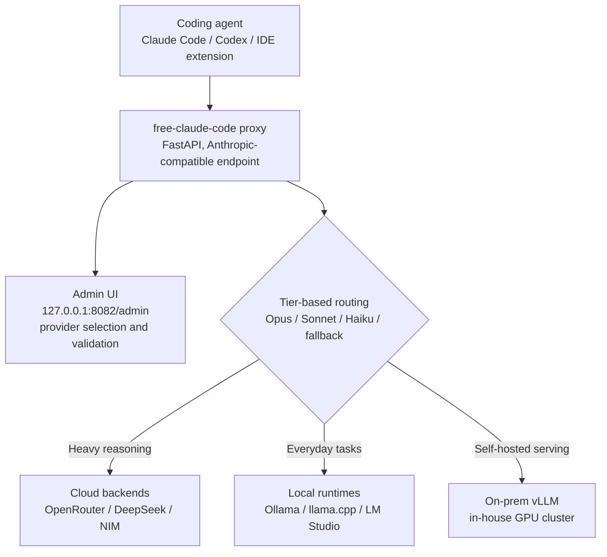

## Overview

Claude Code and Codex have become the most widely used coding agents inside terminals and IDEs over the past year. The problem is that both are tightly coupled to their respective cloud APIs, Anthropic and OpenAI. For teams that cannot let source code leave the building under internal policy, teams working in air-gapped networks, or teams already serving open-weight models on their own GPUs, that coupling becomes a hard wall.

This piece is for engineering leaders weighing the operating cost and data sovereignty of coding agents, and for practitioners looking to serve models on-premise. We examined `free-claude-code`, an open source proxy that has been getting attention in developer communities recently, directly from its repository. The project is known for a somewhat provocative pitch about "killing the subscription," but the technically interesting part is elsewhere. It preserves the user experience of a proven agent, Claude Code, while swapping out only the model behind it for your own infrastructure.

To put it plainly upfront: the core value of this proxy isn't "free," it's "isolation." Separating the agent UI from the model backend lets you move the same workflow onto an open model running on in-house GPUs. We look at why that separation matters from the standpoint of running on-premise AI infrastructure, and at the limitations that come with it.

## What This Tool Is

`free-claude-code` is a local proxy server built on FastAPI. It exposes an endpoint compatible with the Anthropic API, so the Claude Code CLI, Codex CLI, VS Code extensions, JetBrains ACP, and even some chatbots mistake it for a genuine Anthropic server and connect to it directly. From the agent's point of view nothing has changed; only the model actually handling the request gets swapped out behind the scenes.

The breadth of supported backends is what stands out about this project. According to the repository, it supports 24 providers across cloud and local, switchable from the Admin UI, spanning cloud APIs like NVIDIA NIM, OpenRouter, and DeepSeek alongside local runtimes like LM Studio, llama.cpp, and Ollama. In other words, you can point it at a commercial API or at an open model running on your own GPU.

The routing structure is more than a simple switch, too. Internally, Claude Code splits work across three model tiers depending on the situation: Opus, Sonnet, and Haiku. Heavy reasoning goes to Opus, everyday tasks go to Sonnet, and light exploration goes to Haiku. `free-claude-code` lets you map each of these three tiers, plus fallback traffic, to a different backend model. Streaming, tool use, and reasoning support are preserved within the range of what the target model supports. This tier-based routing lines up exactly with a principle already in use inside ThakiCloud: send exploration to a cheap model, implementation to a mid-tier model, and reserve the expensive model for architectural judgment calls.

The overall request flow looks like this.



The difference from the existing approach is clear. Until now, running a coding agent on an open model meant either forking the agent itself or hand-building a different API shim for every model. This proxy collapses that translation layer into one place, leaving the agent untouched while only the model changes.

## Installation and Integration

The repository offers two installation paths. One is downloading and running the install script in a single command.

```bash
curl -fsSL "https://github.com/Alishahryar1/free-claude-code/blob/main/scripts/install.sh?raw=1" | sh
```

This script provisions `free-claude-code` itself along with `uv` and Python 3.14. If Claude Code and Codex aren't already installed, it installs them too, which means Node.js needs to already be in place since that step requires npm. Running the same command again acts as an update.

If you prefer a manual install, you can clone the repository directly and prepare the environment file instead.

```bash
git clone https://github.com/Alishahryar1/free-claude-code.git
cd free-claude-code
cp .env.example .env
pip install uv
```

Once the proxy is running, open the local-only Admin UI in a browser to pick providers and validate the connection.

```text
http://127.0.0.1:8082/admin
```

From this screen you enter each provider's key, check the connection status, and decide which model goes into the Opus, Sonnet, Haiku, and fallback slots. Once that's set, all you need is to point Claude Code's API base address at this proxy. From there you keep using the Claude Code commands you're used to, but the actual inference happens on the backend you specified.

## How It Actually Works, and What We Verified

For this analysis we checked the repository's public documentation and install script directly to verify the commands and structure above. We did not, however, measure actual inference latency or accuracy across all 24 backends. A meaningful serving benchmark needs to be run against an open model actually loaded on your own GPU, and the environment used to write this piece had no local GPU, so we could not carry out a full round-trip measurement across every backend. To avoid inventing numbers, we left unverified latency or throughput figures out of this piece.

What we can verify structurally is nonetheless clear. Because the proxy exposes an Anthropic-compatible endpoint, the agent has no need to know what the backend actually is. As long as that contract holds, switching the backend from Ollama to an in-house vLLM deployment is just reassigning one slot in the Admin UI. No agent reinstall, no workflow change required. This switching cost being close to zero is the real strength of this architecture.

We should also record the sober fact on quality. Coding quality when connected to an open model is not the same as with Anthropic's top-tier model. In particular, gaps against the leading commercial model can show up in long tool-call chains or complex refactoring. So it's more accurate to think of this proxy not as "a free tool that keeps the quality" but as "a tool that lets your team choose the tradeoff between quality and sovereignty for itself."

## Implications for ThakiCloud's Products

The question this tool raises lines up directly with problems ThakiCloud is already addressing through two products.

First, from the **Paxis** angle. Paxis is ThakiCloud's control plane for the Agent-Native Cloud, treating skills, tools, policy, and audit logs as first-class resources. The separation between agent UI and model backend that `free-claude-code` demonstrates is a small-scale version of the direction Paxis is heading. In Paxis, model routing for coding agents doesn't have to be picked by hand in a local Admin UI by each individual; it can be governed by an organization-wide policy gate. Which team's requests go to which backend, whether code from a sensitive repository is forced through an in-house model only, all of that gets recorded as policy and audit logs. If a proxy changes individual productivity, Paxis takes that same principle and lifts it to organizational governance. Add MCP connectors and isolated sandbox execution on top, and even external tool calls fall inside the scope of control.

Second, from the **ai-platform** angle. The fact that this proxy supports Ollama and llama.cpp as local runtimes means, in the end, that someone has to serve that open model reliably. Ollama on a personal laptop is fine for a demo, but it can't handle the load of an entire team running a coding agent all day. ThakiCloud's ai-platform schedules GPUs on K8s and Kueue and serves open models in a multi-tenant environment with vLLM. Route coding agent traffic through this serving layer, and you can run a team-scale on-premise coding agent without the ceiling of individual hardware. Low serving cost and the ability to handle air-gapped environments become the competitive edge here.

The two lenses complement each other. When ai-platform serves open models cheaply and reliably, Paxis governs the agent traffic on top of it with policy and audit. Low-cost serving is what makes the agent economical, and governance is what turns that economy into something an organization can trust.

## Limitations and Counterarguments

First, the terms of service issue needs to be said plainly. Using clients like Claude Code or Codex in a way that circumvents a paid subscription can run into conflict with each service's terms of use. The use case this piece considers meaningful is strictly the on-premise scenario of routing traffic to your own open models or a legitimately contracted API backend, not unauthorized bypass of a paid service. Any organization adopting this needs to check each client's terms of service first.

Second, the attack surface widens. A proxy, by definition, sits in a position to intercept all traffic between agent and model, meaning your source code and full prompts. An untrustworthy proxy configuration can become a code leak path. The benefit only holds if you run it inside your own infrastructure, in an auditable way. This is exactly why Paxis's policy gates and audit logs matter.

Third, there's a quality and maintenance burden. As noted above, coding quality on open models differs from the top commercial model, and supporting 24 backends also means being that much more exposed to upstream API changes. When Anthropic or any individual provider changes its API contract, the proxy has to keep up. Loading an organization's core workflow entirely onto maintenance at the level of a personal project is risky.

To sum up, `free-claude-code` is worth more when read as "an open source experiment separating a coding agent's model layer" than under the banner of "free Claude Code." When that separation meets on-premise serving, it opens a realistic path to running a team-scale coding agent while keeping data sovereignty intact. What ThakiCloud is building with ai-platform and Paxis is exactly the work of letting an organization walk that path safely.

## Sources

- free-claude-code repository: [github.com/Alishahryar1/free-claude-code](https://github.com/Alishahryar1/free-claude-code)
- Install script: [scripts/install.sh](https://github.com/Alishahryar1/free-claude-code/blob/main/scripts/install.sh)
