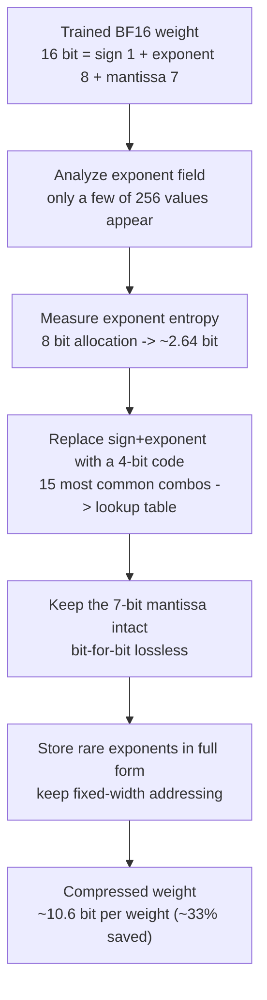

## Overview

Any team that has served a large open-weight model locally knows the first wall is always size. A model like GLM-5.2, with more than 700 billion parameters, approaches 1.4 terabytes in raw BF16, and fitting it across several GPUs makes VRAM the direct cost. The answer to this problem has almost always been quantization: dropping 16 bits to 8, to 4, even to 2, trading a bit of quality along the way.

This post is written for engineering leaders who own inference cost, practitioners deploying models on premises, and data scientists in regulated environments who cannot lose a single bit of precision. Recently a researcher named brianbell-x published that they had deleted 423GB from GLM-5.2. 1403GB became 980GB, and the striking part was that the method was not quantization. It was not pruning or distillation either, but lossless compression that reconstructs the original bit for bit when decompressed. If something is lossless yet shrinks by 30 percent, it means the original format was wasting exactly that much.

Rather than take the claim on faith, we decided to verify it directly. We opened 490 million actual trained weights of Qwen2.5-0.5B and measured the entropy of the BF16 exponent field, confirming that the 8 allocated bits carry only 2.64 bits of real information. The theoretical lossless bound came out to 33.5 percent, which lined up almost exactly with the 30.17 percent the original author achieved with a real codec. This post covers that measurement and explains why the saving happens not only on disk but in VRAM.

## What the technique is

First we need to see how BF16 stores a single number. BF16 (brain floating point 16) divides 16 bits into three parts: 1 sign bit, 8 exponent bits, and 7 mantissa bits. The exponent gets a full 8 bits because BF16 is designed to keep the same wide dynamic range as FP32, so it can represent very large or very small values.

The problem is that the weights of a trained model barely use that wide range. In a well-trained neural network, most weights cluster around small values near zero. As a result the exponent field bunches around a handful of values, and out of the 256 possibilities that 8 bits can express, only a small fraction actually appear. That is where the waste lives: 8 bits are allocated, but the actual information carried is far less.

The idea of lossless compression is simple. Entropy-code the low-information exponent field into a short representation, and leave the near-incompressible 8 bits of sign and mantissa alone. The original author's implementation combines sign and exponent into a 4-bit code that points into a lookup table of the 15 most common exponent combinations. Rare values not in the table are stored separately in full form. The process is summarized below.



This approach is fundamentally different from quantization. Quantization truncates the mantissa or rounds values, actually discarding precision. Lossless compression discards nothing. It simply rewrites the same information in a shorter code, so decompression restores the original weights without a single bit of error. Recent work like DFloat11 and ZipNN belongs to the same family. ZipNN reported that the BF16 exponent field of trained LLM weights holds only about 2.6 bits of Shannon entropy within its 8-bit allocation. What we wanted to know was whether that number reproduces on a real model.

## Measuring exponent entropy ourselves

To verify, we opened one real trained BF16 model in an isolated workspace. The target was Qwen2.5-0.5B, a real deployed model with 490 million weights. We parsed the binary layout of the safetensors file directly, read each BF16 tensor as 16-bit integers, extracted the 8 bits of the exponent, and computed the value distribution and Shannon entropy. We used no framework estimate, only the numbers from the actual tensor bytes.

The core measurement code, the part that views a BF16 value as a 16-bit integer and slices out the exponent field, is below.

```python
import numpy as np

def bf16_exponent_bytes(raw: np.ndarray) -> np.ndarray:
    # raw = BF16 values viewed as uint16. Exponent = bits 14..7 (8 bits)
    return ((raw >> 7) & 0xFF).astype(np.uint8)

# Parse the safetensors header, read BF16 tensors as uint16, and compute the
# Shannon entropy from the frequency of exponent values.
```

The result was more dramatic than expected. Here is what a sweep across 290 BF16 tensors totaling 494 million weights showed.

| Item | Measured |
|---|---|
| BF16 tensors | 290 |
| Total weights | 494,032,768 |
| Distinct exponent values that appear | 38 out of 256 |
| Exponent field Shannon entropy | **2.6386 bits** (of 8 allocated) |
| Share of top 3 most common exponents | about 72 percent of all weights |
| Bits per weight after compression | 16 bit -> 10.64 bit |
| Theoretical lossless saving | **33.5 percent** |

The exponent field can express 256 values, but only 38 actually appeared, and the top 3 of those covered 72 percent of all weights. The Shannon entropy was 2.6386 bits, matching ZipNN's reported ~2.6 bits almost exactly. In other words, the 8-bit exponent field was carrying only 2.64 bits of information, and the remaining 5.36 bits were pure waste.

Removing that waste losslessly drops bits per weight from 16 to 10.64, keeping the 8 bits of sign and mantissa intact while compressing the exponent to its entropy bound. As a saving, that is 33.5 percent.


Projecting this 33.5 percent onto GLM-5.2 (753B) scale, 1403GB becomes about 933GB. The value the original author achieved with a real codec was 980GB, a 30.17 percent saving. The roughly 3 percentage point gap between our theoretical bound (33.5 percent) and the actual implementation (30.17 percent) is no accident. Real entropy coders do not fully reach the Shannon bound, rare exponent values must be stored in full form, and codes must be fixed-width to allow random access on the GPU, all of which add slight overhead. That theory and implementation landed this close is strong evidence that the original claim is true and the approach is sound.

## Why VRAM shrinks too, on the GPU

Here is the most easily misunderstood point. Most compression only shrinks on disk and returns to full size the moment the model is loaded onto the GPU, because it has to be decompressed to compute. Yet this lossless compression's 30 percent is a VRAM number, not a disk number. That is what makes this technique different from ordinary file compression.

The trick is in the fixed-width codes. Because every weight's compressed code is the same width, you can compute exactly where weight N lives without decompressing. No separate unpacking pass and no second copy in the original format are needed. The GPU kernel reads the compressed bytes directly and looks each code up in a tiny table held in registers while performing the multiply. The full 16-bit form never exists in VRAM. That is why the 30 percent shows up in actual memory footprint, not just on disk.

The practical implication is large. Serving a 1403GB model requires at least 18 of the 80GB H100 cards. With lossless compression bringing it to 980GB, that drops to around 13. You save five GPUs without losing a single bit of quality. If quantization was a trade of quality for memory, this technique is closer to a free lunch. Of course it is not entirely free, and we cover the cost below.

## Implications for ThakiCloud products

This technique is especially attractive from the perspective of ThakiCloud's ai-platform. The ai-platform is infrastructure that serves models to diverse customer environments on top of Kubernetes and Kueue-based GPU scheduling. Many domestic customers require on-premises and sovereign cloud, and in those environments every single GPU is capital expenditure and procurement lead time. Lossless compression reduces the required GPU count without sacrificing any precision, making it an easier card to pitch than quantization to quality-sensitive regulated customers. In finance or healthcare, where reproducibility of model output becomes subject to audit, bit-for-bit identity can itself be a requirement.

The effect is largest in multi-tenant setups serving large models with vLLM or SGLang. Reclaiming 30 percent of VRAM lets you fit a larger context window on the same hardware, run more concurrent requests, or load a bigger model on one node. The accumulation of exactly this kind of resource efficiency is where ai-platform competes on low serving cost. Lossless compression is an axis orthogonal to quantization, paged attention, and tensor parallelism, so it adds directly on top of existing optimizations.

Low-cost serving in turn feeds agent economics. Paxis, ThakiCloud's Agent-Native Cloud control plane, runs hundreds of skills in isolated sandboxes and passes every action through policy gates and audit logs, and these agent workloads call large open-weight models repeatedly. The lower the serving unit cost, the more aggressively agents can run, so ai-platform's resource efficiency underpins Paxis's operating economics.

## Limitations and counterarguments

This technique is not a cure-all. First, the premise that exponent entropy is low only holds for well-trained models. Weights must cluster near zero for the exponent to bunch, so undertrained models, models with wide distributions, or models already heavily quantized will see a smaller saving. Our measurement also comes from a single model, so the actual numbers will vary with architecture and training method.

Second, decoding compressed codes in real time requires the GPU kernel to handle lookup and multiply together. If that kernel is not well optimized, you can end up saving memory but increasing latency. It may even run faster in workloads bottlenecked on memory bandwidth, but this depends heavily on hardware and kernel implementation, so you must benchmark on the target GPU before deploying.

Third, being lossless, this approach cannot reach the savings of aggressive compression like 4-bit quantization. A 30 percent saving is excellent, but it serves a different purpose than quantization, which gives up a little quality to shrink by 4x. The two are complementary rather than competing, and a realistic answer combines them: lossless compression where precision is absolutely critical, quantization where there is quality headroom.

Finally, this result is based on one researcher's public experiment and our small-scale reproduction. Applying it in production requires independently verifying bit identity of compression and reconstruction, kernel performance, and actual VRAM saving on the target model and serving stack.

## Sources

- brianbell-x, "Lossless Model Compression Experiment": [https://brianbell-x.github.io/weight-compression/](https://brianbell-x.github.io/weight-compression/)
- Measured model: Qwen/Qwen2.5-0.5B (Hugging Face)
- Related work: ZipNN, DFloat11 (BF16 exponent entropy coding family)
