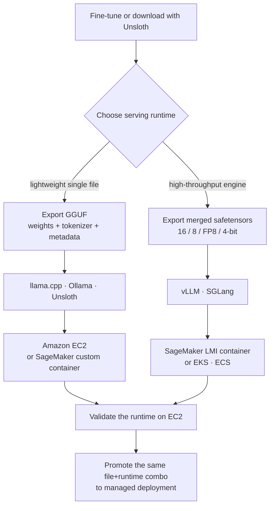

## Overview

There are already plenty of posts on how to quantize a model. GPTQ, AWQ, GGUF, Unsloth Dynamic; a recipe to shrink a 16-bit model to 4-bit is a few searches away. Yet the point where teams actually stall is what comes next. Where exactly do you put that 4-bit file, and how? Do you launch it directly on an EC2 instance, wrap it in a SageMaker endpoint, or drop it into a pod on the EKS cluster you already run? There is no single answer, but there is a map that branches on the format of the model file.

This post is written for platform engineers deploying open-weight models on their own infrastructure and for practitioners designing inference cost. AWS recently published a guide with Unsloth, "Deploying quantized models on Amazon SageMaker AI with Unsloth," that organizes this deployment decision into four patterns. We dissect the core logic of that guide, explain why the model file format decides the runtime and the runtime in turn decides the AWS service, and connect this way of thinking to how infrastructure like ThakiCloud, which does multi-tenant serving on Kubernetes, is designed.

One thing to state up front: the command examples here are paths verified in the AWS official guide and Unsloth docs, and we have not invented any benchmark numbers. Our verification environment is Apple Silicon, so we could not actually run and reproduce the CUDA-dependent Unsloth quantization and vLLM serving locally. This post is therefore not an experiment report but a structural analysis of a verified guide.

## Why quantization matters again at deployment

Quantization is usually discussed only as a matter of training or inference speed. But the AWS guide points out that at the deployment stage, quantization changes three things at once. First, the instance decision. As a large model becomes practical to run on a smaller GPU or even a CPU, the required instance tier itself drops. Second, the startup and storage profile. Smaller model files move and store faster, which helps cold starts and scale-out. Third, deployment flexibility. You can pick a smaller model for cost-sensitive inference and a higher-precision export for quality-sensitive inference.

Unsloth's strength is that it ties fine-tuning, running, exporting, and deploying into a single workflow. In particular, Unsloth Dynamic v2.0 quantization lets you run and fine-tune quantized LLMs while preserving accuracy as much as possible, and quantization-aware training (QAT), built in collaboration with PyTorch, is reported to recover much of the accuracy lost to naive 4-bit quantization. In other words, you can choose precisely where on the quality-versus-size trade-off to sit before deployment.

## Format decides the runtime, runtime decides AWS

The core insight of the guide is: do not start the deployment decision from "which service should I use." Instead, start from "which file format should I export to," and the rest follows naturally. There are two branches.

One is GGUF. GGUF is a single-file format that bundles weights, tokenizer, and metadata together, and lightweight runtimes such as llama.cpp, Ollama, and Unsloth use it. On AWS this branch maps to Amazon EC2 or a SageMaker AI custom container. It is the path for when you want to validate lightly and keep direct control.

The other is merged safetensors. Merging and exporting 16-bit, 8-bit, FP8, or 4-bit weights with Unsloth lets you run on high-throughput engines like vLLM and SGLang, which maps to SageMaker AI Large Model Inference (LMI) containers, EKS, or ECS. It is the path for production serving where throughput and scale matter. The branch is summarized below.



## Setup and integration

The workflow the guide lays out has four steps. Fine-tune or download a model in Unsloth, export it in the format that matches your target runtime, validate the runtime on EC2 or locally, then promote the same file and runtime combination straight into a managed deployment. The phrase "same file and runtime combination" matters here, because if the format or engine differs between validation and production, unexpected behavior creeps in.

Exporting from Unsloth branches by target runtime. The GGUF path looks like this.

```python
# Export GGUF (llama.cpp / Ollama / EC2 path)
model.save_pretrained_gguf(
    "qwen-merged-gguf",
    tokenizer,
    quantization_method="q4_k_m",
)
```

The merged safetensors path targets vLLM or SGLang.

```python
# Export merged safetensors (vLLM / SGLang / SageMaker LMI path)
model.save_pretrained_merged(
    "qwen-merged-16bit",
    tokenizer,
    save_method="merged_16bit",  # or merged_4bit, etc.
)
```

The exported merged model can be validated for serving directly with vLLM.

```bash
# Validate serving on EC2 or locally
vllm serve ./qwen-merged-16bit --port 8000
```

For container-based deployment, AWS Deep Learning Containers (DLCs) provide optimized Docker environments across EC2, EKS, and ECS. The vLLM DLC in particular is tuned for high-performance inference and natively supports tensor parallelism and pipeline parallelism across multiple GPUs and nodes. That is, a configuration validated on a single EC2 instance flows smoothly into an EKS pod using the same runtime for horizontal scaling.

## Implications for ThakiCloud products

This deployment map overlaps directly with the design philosophy of ThakiCloud's ai-platform. The ai-platform serves models on top of Kubernetes and Kueue-based GPU scheduling, and the principle the AWS guide states, that format decides runtime and runtime decides infrastructure, is not tied to any specific cloud. The split of GGUF for lightweight validation and edge deployment versus merged safetensors for vLLM-based high-throughput serving applies identically whether it is AWS EKS or on-premises Kubernetes. If anything, for ThakiCloud, which has many customers requiring on-premises and sovereign cloud, standardizing the deployment path by file format and runtime rather than binding to a specific managed service is more advantageous for portability.

In practice, the ai-platform can combine the tensor parallelism and pipeline parallelism the vLLM DLC provides with Kueue queuing to run multi-tenant. It can pick a different-precision export per customer, assigning 4-bit merged models to cost-sensitive workloads and FP8 or 16-bit to quality-sensitive ones. If you use Unsloth's QAT to recover accuracy even at 4-bit, the point at which you win both low serving cost and quality widens. This fine-grained matching of format and runtime is exactly the background to ai-platform competing on low serving unit cost.

This low-cost serving in turn feeds agent economics. Paxis, ThakiCloud's Agent-Native Cloud control plane, runs skills in isolated sandboxes and calls large open-weight models repeatedly, so if you quantize a fine-tuned domain model with Unsloth and put it on the ai-platform, Paxis agents can consume it cheaply. Format-based deployment standardization is itself the structure that lowers the unit cost of agent workloads.

## Limitations and counterarguments

As a deployment map this guide is clear, but there are caveats. First, actual quality and throughput vary greatly with the combination of quantization method and runtime. How much accuracy a 4-bit merged model retains on vLLM, or whether tensor parallelism actually gives linear scaling on a specific model, must be measured directly on the target model and hardware; the guide's generalities alone cannot tell you.

Second, the convenience of managed services comes at the cost of expense and lock-in. SageMaker LMI containers reduce operational burden, but in environments with strong on-premises requirements, running the same runtime yourself on EKS or your own Kubernetes may be better for control and cost. The AWS guide being a good map is separate from the judgment of porting that map to your own infrastructure, which is each team's own call.

Third, as noted above, this post is a structural analysis without local reproduction. Before actual adoption you must export the target model with Unsloth, serve it on vLLM, and confirm per-format latency, throughput, and accuracy with your own benchmarks.

## Sources

- AWS Machine Learning Blog, "Deploying quantized models on Amazon SageMaker AI with Unsloth": [https://aws.amazon.com/blogs/machine-learning/deploying-quantized-models-on-amazon-sagemaker-ai-with-unsloth/](https://aws.amazon.com/blogs/machine-learning/deploying-quantized-models-on-amazon-sagemaker-ai-with-unsloth/)
- Unsloth Documentation: [https://unsloth.ai/docs](https://unsloth.ai/docs)
- AWS, "Deploy LLMs on Amazon EKS using vLLM Deep Learning Containers"
