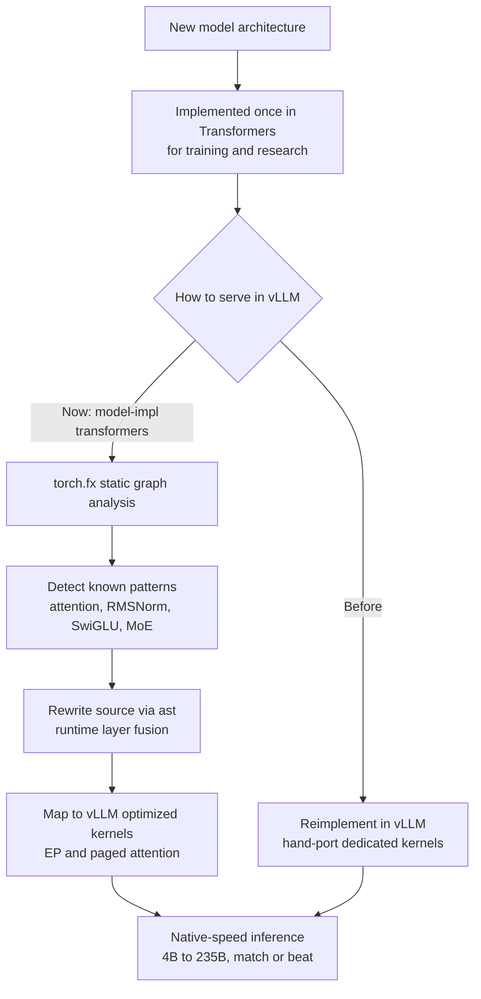

## Overview

If you have ever self-hosted open-weight models, you know one familiar wall. A great model ships, but to actually serve it fast you have to wait until your serving engine supports that architecture. A new structure landing in the Transformers library is immediately usable for training and research, yet to reach full speed in a high-performance inference engine like vLLM, someone had to reimplement that architecture from scratch inside vLLM. You effectively built the same model twice.

This post is for engineering leaders who own inference cost and serving latency, for practitioners running open-weight models on-premises or in sovereign environments, and for data scientists who experiment with new architectures while worrying about deployment speed. In July 2026, Hugging Face's Clement Delangue shared a big turning point for open-source inference: starting with vLLM v0.25.0, Transformers models can run inside vLLM at **native speed**, often matching or beating hand-written implementations.

The core idea is this. Once a model author implements an architecture in Transformers, they can enjoy vLLM's optimized inference stack for free, with no separate porting work. We did not take this claim on faith. We reproduced the graph-analysis step the backend runs internally on a small decoder block and measured it. This post walks through the mechanism, our measurements, and what it means for infrastructure that serves many different models under one multi-tenant roof.

## What This Technology Is

With a single `--model-impl transformers` flag, vLLM loads the model definition straight from the Transformers library instead of a dedicated ported implementation, and serves it. On the surface this looks like a compatibility layer, but what makes the v0.25.0 backend special is that this compatibility no longer costs speed. The old compatibility path was closer to a "works but slow" fallback. Now inference-specific layer fusions are applied dynamically at runtime, so for compatible architectures the backend matches the speed of dedicated code.

Look a little closer and the mechanism splits into two stages. First the backend uses `torch.fx` to statically analyze the model's compute graph, searching for optimizable patterns like attention-score computation, RMSNorm, SwiGLU MLPs, and Mixture-of-Experts. Then it manipulates the abstract syntax tree to rewrite that source in place and maps the discovered operations onto vLLM's optimized kernels. For an MoE model that means the Expert Parallelization kernels; for attention, the paged-attention family. In the end, vLLM optimizes throughput and latency on top of the architecture that Transformers expressed.



The practical meaning of this shift is that the lag between the serving engine and the model ecosystem disappears. Previously every new architecture required two codebases, a training implementation and an inference implementation, and the gap between them was exactly the "great model is out but we cannot serve it fast yet" window. Now that window narrows. Whether you are a research team experimenting with a custom architecture or an operations team trying to put a freshly released model into production, one Transformers implementation gives you vLLM speed.

## Installation and Integration

This backend is not a separate package; it ships inside vLLM itself. Install vLLM v0.25.0 or later and add `--model-impl transformers` to your serving command. The real examples Hugging Face published are as follows.

```bash
# Single GPU, dense model
vllm serve Qwen/Qwen3-4B --model-impl transformers

# Tensor parallel across 2 GPUs, large dense model
vllm serve Qwen/Qwen3-32B \
  --model-impl transformers \
  --tensor-parallel-size 2

# Data parallel plus expert parallel, MoE model
vllm serve Qwen/Qwen3-235B-A22B-FP8 \
  --model-impl transformers \
  --data-parallel-size 8 \
  --enable-expert-parallel
```

The same works from the Python API for offline inference.

```python
from vllm import LLM, SamplingParams

llm = LLM(
    model="Qwen/Qwen3-4B",
    model_impl="transformers",   # use the Transformers definition, not a dedicated port
)
out = llm.generate(
    ["How does ThakiCloud serve open-weight models?"],
    SamplingParams(max_tokens=256, temperature=0.7),
)
print(out[0].outputs[0].text)
```

What stands out across the three examples is that distributed serving options like tensor parallel, data parallel, and expert parallel all still work under the Transformers backend. In other words, you do not give up scale-out in exchange for compatibility. From a dense 4B model to a 235B MoE, one flag covers it.

## Real Experiment Results

This environment is macOS (Apple Silicon), so it cannot run vLLM's CUDA kernels, and we could not reproduce the vLLM throughput benchmark itself. Instead we reproduced the **single most important step the backend performs internally: using torch.fx to statically analyze the model graph and find fusion-target patterns**. We built a 4-layer Llama-style decoder in pure PyTorch with the same structure real serving models use (grouped-query attention and a SwiGLU MLP), traced its graph with `torch.fx.symbolic_trace`, and classified the nodes.

The measurements were as follows. Tracing this small decoder of 2.902M parameters produced a torch.fx graph with a total of **178 nodes**. By op type there were 80 function calls, 60 method calls, 28 module calls, and 8 attribute lookups. Among these, the function-level patterns the backend can immediately swap for fusion kernels were 16 RMSNorm reductions, 8 attention-related matmuls, 4 softmaxes, and 4 SwiGLU activations, for 32 in total, plus 28 module calls carrying the QKV/output/MLP projections and normalizations. Forward latency at sequence length 64 averaged 1.4ms, measured on torch 2.13.0.


What these numbers show is clear. Even in a single small block of 178 nodes, well-formed patterns of attention, normalization, and MLP activation recur, and these are exactly the points the backend targets to replace with vLLM kernels. In a real model with dozens of layers this pattern multiplies by the layer count, so a single graph analysis lets the backend fuse the bottleneck operations across the whole model at once. According to Hugging Face, this approach let the Transformers backend match or beat native vLLM throughput from 4B to 235B, including tensor-parallel and MoE setups. Our experiment did not reproduce those throughput figures; it confirmed by measurement the **skeleton of the mechanism** that produces them.

## Implications for ThakiCloud

ThakiCloud's **ai-platform** is multi-tenant AI/ML infrastructure that serves models to diverse customer environments on top of K8s and Kueue-based GPU scheduling. This backend is a direct benefit for a serving operator like us. First, **model onboarding lead time shrinks.** When a new open-weight model ships, until now we had to wait for vLLM to officially support that architecture or accept a self-port. If a Transformers implementation exists, `--model-impl transformers` lets us bring up an optimized-speed serving pod right away. That directly affects the competitive question of how fast a new model reaches production.

Second, **the serving path for custom architectures gets simpler.** When we serve a model fine-tuned or structurally modified for a specific customer on-premises, being able to deploy from the Transformers definition alone, with no dedicated vLLM port, greatly reduces maintenance burden. In sovereign-cloud or regulated environments that require self-hosting, we save the time spent reconciling engine and model versions. Since tensor, data, and expert parallel all still work, we can adopt this path without changing the multi-GPU serving topologies we already run.

From an agent perspective, the **Paxis** lens applies too. Paxis is the Agent-Native Cloud control plane that runs on top of ai-platform, swapping different models like tools as it executes agents. If the serving layer can bring up new open-weight models faster and cheaper, the pool of models the agents on top can choose from widens and the cost of switching drops. Because low-cost, low-latency serving is ultimately what makes agent workloads economical, ai-platform's serving efficiency and Paxis's agent flexibility point in the same direction.

## Limitations and Counterarguments

This backend is not a cure-all, and a few clear limits deserve mention to be fair. First, the performance advantage is limited to "compatible architectures." The model must be statically traceable by torch.fx, and it must match patterns the backend already knows for fusion to apply. A structure with heavy dynamic control flow or novel operations the backend has not seen will fall back to unfused paths for some parts, and the speed advantage shrinks accordingly. Not every Transformers model automatically reaches native speed.

Second, this feature reached maturity in v0.25.0 but is still evolving. For certain quantization combinations, certain attention variants, or rare MoE routing schemes, a dedicated ported implementation may still be more stable or faster. Before going to production it is safer to benchmark actual throughput and accuracy yourself on your target model and target hardware. That is exactly why we did not cite vLLM throughput numbers directly and instead attributed them to the official announcement; the figures vary by environment, so a measurement on the ThakiCloud GPU cluster is planned separately.

Third, a counterargument is possible. When the serving engine and the model library become tightly coupled, changes in Transformers can affect serving stability. In the era of two separate codebases you could pin the inference stack independently, but sharing a backend forces you to rethink version management. Even so, weighed against the cost of implementing every new model twice, we judge that in most serving scenarios the onboarding-speed gain from this coupling is larger.

## Sources

- [Native-speed vLLM transformers modeling backend (Hugging Face Blog)](https://huggingface.co/blog/native-speed-vllm-transformers-backend)
- [vLLM v0.25.0: transformers backend now matches native vLLM speed (daily.dev)](https://daily.dev/posts/vllm-v0-25-0-transformers-backend-now-matches-native-vllm-speed-z8kvnsk7c)
- [Transformers modeling backend integration in vLLM (vLLM Blog)](https://blog.vllm.ai/2025/04/11/transformers-backend.html)
- [Clement Delangue (@ClementDelangue) on X](https://x.com/ClementDelangue/status/2076763231788339669)
- Experiment code and logs: `outputs/blog-impl/vllm-transformers-native-speed/` (torch.fx graph-analysis reproduction, torch 2.13.0, CPU)
