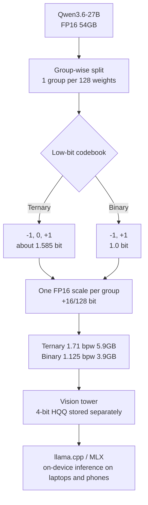

## Overview

Attempts to run large models on small devices mostly go one of two ways. One is to train a small model from scratch, and the other is to compress a large model's weights after the fact. The latter has always hit the same wall. Below 4-bit, short benchmarks look fine, but quality collapses on longer reasoning tasks like math or coding.

On July 14, 2026, PrismML released Bonsai 27B, which addresses this wall head-on. Bonsai 27B is not a newly trained model. It leaves Qwen3.6-27B as is and represents only the weights in low-bit form. The architecture is unchanged. Two variants were released under Apache 2.0, and the ternary build reportedly keeps 94.6% of the original quality at 5.9GB, while the 1-bit build keeps 89.5% at 3.9GB.

This post reads Bonsai 27B from ThakiCloud's perspective of serving low-bit models in a multi-tenant setting. We go in order through how the compression works, why memory rather than storage capacity is the real constraint, and what practical implications this trend carries for our inference infrastructure. Up front: all benchmark figures below are numbers PrismML has published, not values ThakiCloud has reproduced independently.

## What Bonsai 27B Is

Bonsai 27B is a low-bit representation of Qwen3.6-27B. Applied to a multimodal model composed of about 24.8B language weights, 0.46B in the vision tower, and 2.5B in embeddings and the LM head, it converts the entire set of matrix-heavy components to low-bit. This includes embeddings, attention projections, MLP projections, and the LM head, while only a tiny tail of parameters such as normalization and scale stay at high precision. The vision tower is kept separately at 4-bit HQQ and is only loaded when there is image input.

The two variants differ in character. Ternary Bonsai 27B represents weights with three values, `{-1, 0, +1}`, giving an effective 1.71 bit and an ideal size of 5.9GB. 1-bit Bonsai 27B uses only two values, `{-1, +1}`, giving an effective 1.125 bit at 3.9GB. Context is supported up to 262K tokens, and this stays practical because about 75% of Qwen3.6-27B's attention is linear.

## How the Compression Works

The core idea is simple. Each weight is stored as a single code, and every group of 128 weights shares one FP16 scale. The actual weight is reconstructed as the product of the group scale and the code, in the form `w_i = s_g · t_i`.

Tracing the bit accounting makes the storage cost clear. One ternary value carries `log2(3) ≈ 1.585` bits. Adding one FP16 scale per 128 values adds `16/128` bits, bringing the total to about 1.71 bits, roughly a 9.4x reduction versus FP16. Binary is 1 bit per value itself, and with the same scale overhead it comes to `1 + 16/128 = 1.125` bits, roughly a 14.2x reduction.

An interesting contrast appears here. The commonly named "4-bit" Qwen3.6-27B Q4_K_XL build actually averages 5.2 bits, and the "2-bit" IQ2_XXS actually averages 2.8 bits. The name and the real average bit count differ. Bonsai is also different from BitNet. BitNet trains from scratch at low bit to avoid collapse, but Bonsai compresses an already-trained model after the fact. PrismML claims it avoided collapse without retraining, but the details of this claim rely on the published technical documentation.

## Reported Benchmark Results

PrismML stated it evaluated 15 benchmarks in thinking mode on H100 using EvalScope and vLLM. The table below shows those reported figures. To emphasize again, these numbers are values the provider has published, not values ThakiCloud has reproduced, and independent reproduction requires separate verification.

| Build | Effective bpw | Size | Thinking Average | vs. FP16 |
|---|---|---|---|---|
| Qwen3.6-27B FP16 | 16.0 | 54GB | 85.07 | baseline |
| Q4_K_XL (4-bit) | 5.2 | 17.6GB | 84.99 | 99.9% |
| IQ2_XXS (2-bit) | 2.8 | 9.4GB | 72.73 | 85.5% |
| Ternary Bonsai 27B | 1.71 | 5.9GB | 80.49 | 94.6% |
| 1-bit Bonsai 27B | 1.125 | 3.9GB | 76.11 | 89.5% |

Breaking it down by category shows the compression does not create uniform loss. Math holds up relatively well, from 95.33 at FP16 to 93.40 for ternary and 91.66 for 1-bit. Agent tasks and tool calling, in contrast, drop sharply from 80.00 to 74.01 for ternary and 66.03 for 1-bit, and vision falls from 72.61 to as low as 59.57 for 1-bit. Instruction following also loses significantly, from 78.47 to 65.74 for 1-bit.

The contrast PrismML emphasizes is the selective collapse of existing sub-4-bit builds. IQ2_XXS keeps 88.93 on short-answer tasks like MMLU-Redux but collapses to 57.5 on AIME26 and 56.4 on LiveCodeBench. The point is that short benchmarks mask this collapse. This observation itself is a practical insight that anyone who has worked with low-bit quantization would recognize.

## Memory Is the Binding Constraint

Reading the Bonsai 27B release purely by its size numbers misses the point. The conditions for fitting a model on a phone are much stricter than storage capacity alone. iOS limits a single app to roughly half of physical memory, so a 12GB iPhone actually exposes only about 6GB. This is why the 3.9GB build matters.

The second budget is the KV cache. Because only 16 of 64 layers have a growing full-attention cache, it costs about 64KiB per token at FP16. Filling the full 262K window costs about 17.2GB, and using a 4-bit KV cache brings this down to about 4.3GB. No matter how much the model weights are reduced, a longer context will consume memory through the KV cache, so low-bit weights and a low-bit KV cache need to go together.

PrismML also says it measured the quality impact of cache compression. Against its own FP16-KV baseline, Ternary Bonsai showed an output forward-KL of 0.0011 nats on MATH-500, while Q4_K_XL showed 0.0146. At 100K tokens, using an FP16 cache, 1-bit peaks at about 11.6GB and ternary at about 14.7GB. In other words, even after shrinking the weights, long contexts require lowering cache precision as well for the model to actually fit on a device.

## Throughput and Speculative Decoding

Generation is bound by memory bandwidth. The fewer bytes read per step, the more tokens per second. Prefill, on the other hand, is compute-bound, so the compression effect is relatively smaller there. The throughput PrismML released shows exactly this property.

| Platform | Build | tg128 (generation) | pp512 (prefill) |
|---|---|---|---|
| M5 Max | Binary | 66.4 | 874 |
| M5 Pro | Ternary | 26.2 | 393 |
| iPhone 17 Pro Max | Binary | 11.0 | 111 |
| H100 (CUDA) | Binary | 104.8 | 2755 |

PrismML also shipped a DSpark drafter trained specifically for the Bonsai 27B target. On H100 with a draft depth of k=4, it reports an accepted length of tau=3.6 for the binary target, that is 143.8 tok/s, a 1.37x speedup. Verification is lossless, so the output distribution stays identical. However, on Apple silicon the drafter is disabled by default at batch size 1.

Execution itself is standard. You can run a llama.cpp server or generate directly with llama-cli, and an MLX path is also provided. Tool calling uses the OpenAI-style `tools` array as is, and the response comes back as `choices[0].message.tool_calls`. Thinking mode is enabled by default and can be toggled per request.

## What This Means for ThakiCloud

Low-bit serving touches both of ThakiCloud's products.

**ai-platform lens (infrastructure and serving).** ThakiCloud's ai-platform serves open-weight models across a variety of customer environments. What Bonsai shows is the possibility of putting 27B-class quality on a single 24GB GPU along with a 4-bit KV cache. This directly affects multi-tenant density. If more tenants can run on the same GPU, or the same SLA can be met with a smaller card, serving cost goes down. This matters especially for on-premises and sovereign deployments. Domestic public sector and regulated industries require self-hosting that keeps data from leaving the premises, but hardware budgets are limited. Lowering both model weights and the KV cache to low-bit together enables denser packing in a GPU pool scheduled with Kueue, which feeds directly into the cost efficiency and resource density we have emphasized. That said, low-bit is not always the answer. If a workload is agent- or tool-calling-centric, quality loss is significant as shown in the limitations section below, which calls for routing that varies precision by workload.

**Paxis lens (agents and edge).** Paxis is the Agent-Native Cloud control plane that runs on top of ai-platform, treating Skills, Tools, Policies, and Audit Logs as first-class resources. A model that runs on a phone at 3.9GB opens the door to on-device agents where privacy is sensitive. A setup where the prompt never leaves the device is useful for regulatory compliance and offline workflows. From Paxis's point of view, it is a natural fit to run such local models inside sandboxed, isolated execution while passing every action through policy gates and audit logs. Low-bit on-device inference creates the economics for edge agents, and Paxis is the layer that governs that execution.

The two lenses complement each other. Low-cost serving (ai-platform) creates the economics for agents (Paxis).

## Limitations and Counterpoints

The biggest caveat is the source of the benchmarks. All the figures above are PrismML's own evaluations, and there is no independent reproduction yet. The argument pointing out IQ2_XXS's selective collapse is persuasive, but the benchmarks that show Bonsai's advantage are also self-measured by the same provider. A fair judgment needs third-party reproduction.

The unevenness of the quality loss also matters in practice. The 1-bit build's agent and tool-calling score is only 66.03. Tool-calling accuracy at this level is risky for production agent pipelines. Vision at 59.57 and instruction following at 65.74 are similarly large drops, which means 1-bit is effectively limited to simple text reasoning and privacy-first on-device use. Paths that need quality should move up to ternary or higher precision.

Phone performance numbers also need careful reading. The iPhone tok/s figures are enough for short interactions but slow for long generations. Heat, battery, and sustained throughput are not visible in the benchmark table. The white paper reportedly measured 672 tokens per 1% of iPhone battery, but real-world latency and sustained performance are separate concerns.

Finally, the core claim of avoiding collapse without retraining relies on method details in the published documentation. The license is Apache 2.0, but the license inheritance relationship with the Qwen3.6 base needs verification before commercial deployment. In summary, Bonsai 27B is a genuine practical advance in low-bit quantization, but adoption decisions should be made together with workload-specific quality requirements and independent reproduction.

## ThakiCloud Independent Reproduction

In the limitations above we noted that no independent reproduction existed yet. We ran one. The intended reader is an infrastructure engineer weighing a self-hosted low-bit pipeline. The short version is that PrismML's released 1-bit model genuinely works, but the compression method itself cannot be reproduced, because it was never disclosed.

We first extracted and read all three whitepapers in full. What is public is the storage format, the inference kernels, and the benchmarks. The algorithm for assigning 1-bit weights without retraining while avoiding collapse appears nowhere. The 8B whitepaper explicitly calls it "proprietary Caltech intellectual property." The method is sealed.

We then loaded their released `Bonsai-1.7B-unpacked` (their 1-bit weights materialized back to FP16) with stock tooling. Every 128-weight group used exactly one scale, and perplexity on a fixed passage was 3.492, essentially identical to the same base Qwen3-1.7B at FP16 (3.507). The released model is real and near lossless.

By contrast, reproducing naively from the public format alone (textbook BWN binarization) collapses completely at the same 1.125 bits. A 4-bit control confirms the harness is sound.

| Variant | bpw | Perplexity | vs FP16 |
|---|---|---|---|
| Qwen3-1.7B FP16 | 16 | 3.507 | 1.00x |
| PrismML 1-bit (their method) | 1.125 | 3.492 | 0.995x, lossless |
| Naive binary (public format) | 1.125 | 2,109,839 | 601,600x, collapse |
| 4-bit control | 4.125 | 4.209 | 1.14x, intact |

A sealed method can still be predicted. Because we hold their actual 1-bit weights, we paired them with the base weights and reverse-engineered a fingerprint. Their signs agreed with the base only 71.6% of the time, meaning about 28% of signs were flipped, whereas naive binarization preserves every sign. Their group scales were also 2.26x larger than the naive mean. That is the fingerprint of error compensation that minimizes layer output error rather than per-weight error, the GPTQ family. Since sign agreement is far above the 50% of chance, the base is unmodified Qwen, consistent with their "no retraining" claim.

We implemented that prediction to test it. A hand-written error-compensated binary quantizer (GPTQ family) recovered about 10x of the naive collapse. The direction was right. Yet even after recovery a large gap to FP16 remained, and simply enlarging the scale by 2.26x made things worse, which tells us the larger scale only helps when coupled with sign optimization. Textbook error compensation is necessary but not sufficient. Reaching their lossless 1-bit needs salient-weight handling or residual schemes beyond it, and that is exactly the part they withheld.

One caveat: this perplexity is a coarse signal on a short passage, measured on small models. Full category retention (tool use, vision) would require building their custom kernels, serving the 27B, and running the whole benchmark suite, which we leave as separate work. Still, to "does 1-bit actually work" the answer is yes, and to "can public materials reproduce that quality" the answer is no. That gap is the value of the technology.

## Sources

- [prism-ml/Bonsai-27B-gguf (Hugging Face)](https://huggingface.co/prism-ml/Bonsai-27B-gguf)
- [PrismML Releases Bonsai 27B (MarkTechPost)](https://www.marktechpost.com/2026/07/14/prismml-releases-bonsai-27b-1-bit-and-ternary-builds-of-qwen3-6-27b-that-run-on-laptops-and-phones/)
- [PrismML Bonsai 27B docs](https://docs.prismml.com/models/bonsai-27b)
