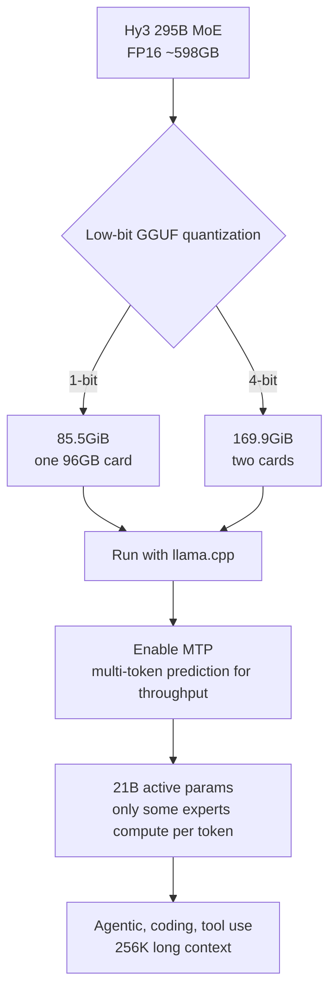

## Overview

The first wall a team hits when serving a large model on its own infrastructure is not compute, it is memory. Loading a 295B model in FP16 requires roughly 598GB of weights resident in GPU memory, which barely fits across eight H100 80GB cards. That is why flagship open-weight models have always sat in an awkward place: released, but hard for us to actually serve.

The 1-bit and 4-bit GGUF builds of Hy3 that Tencent Hunyuan released on July 14, 2026 aim squarely at this point. They compress a 295B MoE model into low-bit form so it runs on a single card, and the weights ship under Apache 2.0. On X, Tencent introduced it as a "flagship-scale 295B model that can be served on a single GPU," mentioning llama.cpp and MTP together.

This post reads the Hy3 quantized builds from ThakiCloud's perspective as a team that serves low-bit models in a multi-tenant setting. We walk through what the compression actually changes, why the phrase "single GPU" needs to be read carefully, and what this trend means for our on-prem inference infrastructure. To be clear up front: the size and performance figures below are all values reported by Tencent and the community, not numbers ThakiCloud reproduced.

## What This Is

Hy3 is a Mixture-of-Experts model with 295B total parameters, but only about 21B activate to process a single token. It supports a long 256K-token context and targets agentic tasks, coding, and tool use. What is new here is not a new model but a low-bit GGUF representation of the existing Hy3 weights. Two variants were released.

The 1-bit build reduces the model from roughly 598GB to 85.5GiB. At that size, the weights fit on a single 96GB-class card. The 4-bit build occupies 169.9GiB and must span two cards, but in exchange it holds much closer to the original quality as reported. Both builds run with llama.cpp and are designed to enable MTP (Multi-Token Prediction) to raise token generation throughput.



The MoE structure is what makes this compression especially attractive. Of the 295B, only 21B worth of experts actually participate in the computation for each token, so the compute itself is on the order of a 21B dense model. The bottleneck lies entirely in "where do you keep all the expert weights resident." Low-bit compression attacks exactly that residency cost.

## Why "Single GPU" Needs Careful Reading

This is the phrase in the marketing that is easiest to misread. "Served on a single GPU" is true, but the single GPU here means a device with 128GB-class unified memory. Think DGX Spark, a 128GB Mac Studio, or Strix Halo. If you pictured a single 16GB RTX 3060, that expectation is off.

This distinction matters because the practical math changes completely. Loading 85.5GiB of weights requires at least a 96GB card, and once you add KV cache, activation memory, and the attention state of a long context, real-world headroom shrinks further. A workload that actually fills a 256K context is tight even on a 128GB-class device. "One card" refers to physical slot count, not to cheap hardware.

Even so, this release is meaningful because the point of comparison is an eight-card H100 node. If the multi-GPU node that FP16 serving used to require is replaced by a single high-capacity card, the power, floor space, and interconnect complexity all drop sharply. The absolute cost does not fall so much as the shape of the required system becomes fundamentally simpler.

## 1-bit vs 4-bit: What You Gain and What You Lose

The two builds represent different choices. The 1-bit build is optimized for pushing the model onto minimal hardware. The 85.5GiB size is the result of extreme compression, and it accepts a corresponding quality loss versus the original. The 4-bit build demands nearly twice the memory at 169.9GiB, but community reports say it holds nearly to original performance.

A practical decision rule falls out here. In agentic workflows where tool calls and long reasoning chains stack up, small quality regressions accumulate and tend to break the final result. Short question-answering looks fine even at 1-bit, but in autonomous multi-step agent work the extra margin of 4-bit acts as a safety buffer. If the hardware budget allows, favoring 4-bit for agent serving is the reasonable default.

The mention of MTP fits into this context too. Multi-token prediction proposes and verifies several tokens from a single forward pass, raising the throughput of the memory-bandwidth-bound decoding stage. Because low-bit models have smaller weights, they free up relative memory bandwidth headroom, which pairs well with throughput techniques like MTP.

## Installation and Serving Perspective

Since these are llama.cpp-based GGUF files, the serving flow itself is familiar. You fetch the GGUF, load it with llama.cpp, enable the MTP option, and expose it as an OpenAI-compatible server. Conceptually the structure looks like this.

```bash
# Load the 1-bit GGUF build (conceptual example, check the release repo for exact filenames/flags)
./llama-server \
  --model hy3-295b-1bit.gguf \
  --ctx-size 262144 \
  --n-gpu-layers 999 \
  --draft-max 4          # MTP-style multi-token prediction
```

If you want to prioritize throughput at FP8 or higher precision instead, the community has also documented a path that serves across multiple cards using vLLM or SGLang with Expert Parallelism. The low-bit GGUF path targets single-node serving on minimal hardware, while the vLLM path targets throughput and concurrent user count.

We did not actually download the 85.5GiB build and run inference for this post. The hardware requirement of 96GB or more unified memory falls outside the scope of this drain environment. Accordingly, the figures above are all values reported by Tencent and the community, and we honestly note the absence of reproduction. Anyone evaluating adoption should include a step of confirming quality and throughput with their own benchmarks on the target hardware.

## Implications for ThakiCloud Products

This release matters especially from the perspective of ThakiCloud's **ai-platform**. ai-platform schedules GPUs with K8s and Kueue and serves models across diverse customer environments centered on vLLM. A flagship-scale model running on a single high-capacity node means the node placement unit for multi-tenant serving becomes simpler. Instead of scheduling premised on eight-card H100 nodes, treating a single 128GB-class card as one serving unit makes Kueue's queue management and priority allocation far more predictable.

In the on-prem and sovereign AI context, this trend is even more direct. Customers who cannot send domestic data outside must run models on their own hardware, and an 8-GPU node is a high barrier in procurement, floor space, and power. If a flagship model can be served on a single 128GB-class device, the hardware threshold for sovereign deployment drops noticeably. That said, verifying whether the low-bit quality loss is acceptable for the customer workload is a responsibility we must own.

From an agent-workload perspective, this connects to **Paxis** as well. Paxis is the Agent-Native Cloud that runs on top of ai-platform, executing skills in isolated sandboxes and passing every action through policy gates and audit logs. If a model specialized for agents and tool calls like Hy3 can be served at low hardware cost, the per-run cost of agents comes down, which in turn means more autonomous workflows can be run economically. Low-cost serving is the structure that creates agent economics.

## Limitations and Counterarguments

The biggest counterargument is the reality of "single GPU." A 96GB to 128GB-class unified-memory device is still expensive and not truly mainstream hardware. Reading this release as "now anyone can run 295B on a laptop" is a misunderstanding. More precisely, it is "a workload that required a multi-GPU node has come down to a single high-capacity card."

Second, the quality loss of the 1-bit build can be fatal depending on the workload. The benchmark summaries say "close to the original," but that is usually measured against 4-bit or on short-task-heavy evaluations. How 1-bit holds up under long reasoning chains and precise, repeated tool calls in agentic tasks is confirmed only on real workloads.

Third, these figures have not yet been broadly and independently verified. They rely on reports from Tencent and the early community, and until reproduction results across varied hardware and tasks accumulate, treating them cautiously is the safer stance. We too will use the published numbers only as a starting point when evaluating adoption, taking our own measurements on the target environment as canonical.

Even so, the direction itself is clear. The move of the serving unit for flagship open-weight models from a multi-GPU node to a single high-capacity card is a welcome signal for any infrastructure that deals with on-prem and sovereign AI.

## Sources

- [Tencent Hunyuan, Hy3 1-bit and 4-bit release (X)](https://x.com/TencentHunyuan/status/2076953120765280284)
- [tencent/Hy3 (Hugging Face)](https://huggingface.co/tencent/Hy3)
- [Tencent Hy3 GGUF 1-bit 4-bit Single GPU (explainX)](https://explainx.ai/blog/tencent-hy3-gguf-1-bit-4-bit-single-gpu-llama-cpp-july-2026)
- [Hunyuan Hy3 Quantized Release analysis (Remio)](https://www.remio.ai/post/tencent-hunyuan-hy3-quantized-release-1bit-single-card-deployment-4bit-near-full-performance)
- [Deploy Hunyuan Hy3 with vLLM & Expert Parallelism (Spheron)](https://www.spheron.network/blog/deploy-hunyuan-3-gpu-cloud/)
