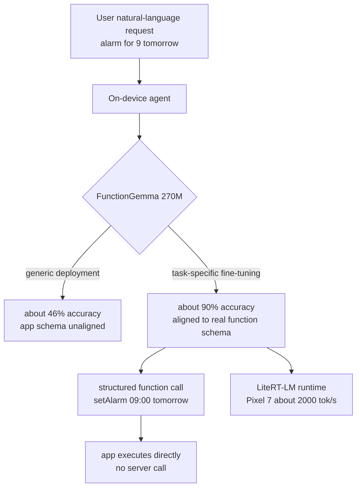

## Overview

The notion that small models are not smart held on for a long time. So practitioners threw almost every task at large models, paying for it with latency, cost, and the risk of data leaving the device. But if you scope the task very narrowly, the story changes. Give up generality and tune a small model to do exactly one thing well, and within that narrow domain there is no longer a reason to call a large model.

"From 46% to 90%: Fine-Tuning Tiny LLMs for On-Device Agents," presented by Cormac Brick, a Principal Engineer at Google AI Edge, targets exactly this point. Fine-tuning the 270M-parameter FunctionGemma to a specific agent task raised accuracy from 46% to 90%, which is both the title and the thesis of the talk. This model is reported to deliver roughly 2,000 tokens per second of prefill throughput on a Pixel 7. All of it happens inside the phone, with no server call.

This post reads that talk from the perspective of ThakiCloud, which operates multi-tenant inference infrastructure. We look at why a small specialized model makes sense on-device, what fine-tuning actually changes, how a runtime like LiteRT-LM simplifies deployment, and what practical meaning this trend carries for our serving infrastructure and agent platform. The accuracy, throughput, and duration figures cited below are all reported values from the talk and related coverage, not figures reproduced by ThakiCloud.



The video above is Cormac Brick's full original talk. The analysis below is grounded in that talk and public reporting.

## What the technology is

FunctionGemma is a 270M-parameter model in the Gemma family specialized for function calling. Function calling is the core behavior of an on-device agent, because it turns a user's natural-language request into a structured tool call the app can execute. Converting "set an alarm for 9 a.m. tomorrow" into a call like `setAlarm(time="09:00", date="tomorrow")` is an example. As long as this conversion is accurate, there is no need to summon a general-purpose model of billions of parameters.

The problem is that a generically deployed small model has low accuracy on a specific app's tool schema. The 46% the talk cites is exactly that point. This is where fine-tuning enters. Tune the model narrowly to the target app's actual function schema and request patterns, and the same 270M model rises to 90%.

## From 46% to 90%: what fine-tuning does

Understanding the nature of this gap matters. A large model reasons its way through even an unfamiliar schema thanks to vast general knowledge. A small model lacks that slack. But concentrate it on a narrow distribution, and within that distribution it becomes nearly as accurate as a large model. Fine-tuning is less about injecting new intelligence into the model and more about steering the capacity it already has toward the target task.

According to the talk, this fine-tuning finishes in a remarkably short time. Related coverage reports that training completes in about 21 minutes. Thanks to the small scale of 270M, training itself is light and manageable even on consumer hardware. This carries direct implications for data science practice. It means an operating model where each app and each tool set has its own small specialized model, each trained briefly, is realistic. Instead of covering every app with one giant general-purpose model, you keep several specialized models sliced finely by task.

This idea also touches a principle we have held in our batch content work. A specialized solution that fills a validated, narrow skeleton beats a high-degree-of-freedom general solution for average quality. Fine-tuning a small model implements that principle at the model level.

## What on-device gives you: latency, privacy, offline, cost

The talk emphasizes on-device for four reasons.

Latency drops. Because the request does not round-trip the network, the function-call conversion finishes instantly inside the phone. For a UI where the agent must react to user actions in real time, this difference is decisive.

Privacy holds. The user's requests and personal data never leave the device. In sensitive contexts like health, finance, and messaging, the very fact that data does not go to a server becomes a product requirement.

It works offline. The agent functions even without a network. A cloud model is helpless when the connection drops; an on-device model is not.

Cost disappears. Because inference happens on the device, there is no per-token API billing. The heavier the app's usage, the larger this saving.

## LiteRT-LM and the deployment stack

Training a small model and deploying it to countless devices are separate problems. The talk presents LiteRT-LM as the deployment runtime. LiteRT-LM is a runtime that lets you put models like Gemma 4 onto a wide range of hardware from mobile to embedded systems. Combine it with AI Core, the talk explains, and you can drive on-device agent skills.

The key is that a path exists to deploy one model consistently across diverse hardware. Without the labor of re-fitting a trained specialized model to each device's accelerator, the runtime absorbs that heterogeneity. This is the practical condition that lifts on-device agents from experiment level to product level.

## What this means for ThakiCloud products

The trend of on-device specialized models can look like a signal in the opposite direction to us, operators of cloud serving, but it actually carries direct implications for both products.

**ai-platform lens.** The rise of small specialized models shifts the focus of serving infrastructure. ThakiCloud's ai-platform provides K8s and Kueue based GPU scheduling, multi-tenant isolation, and on-premises serving. The question on-device fine-tuning poses here is not "if everything moves on-device, is the server unnecessary?" It is the opposite. To train a separate specialized model briefly for each app, you need infrastructure that runs those training jobs at low cost and at scale. A workload that repeats a 21-minute fine-tune of a 270M model across hundreds of tool sets is exactly what infrastructure that queues GPUs with Kueue and isolates by tenant targets. Training on the server, inference on the device is the natural conclusion.

At the same time, not every organization is satisfied by device inference alone. When larger context or more complex reasoning is needed, a server model still steps in. And for organizations reluctant to send source data to an external cloud, on-premises serving and self-hosting become important. Being competitive on low serving cost is the key to holding on to those organizations.

**Paxis lens.** The essence of FunctionGemma is turning natural language into a structured tool call. This is a miniature of what Paxis does. Paxis is ThakiCloud's Agent-Native Cloud, which selects from over 960 skills via BM25, runs them in isolated sandboxes, and passes every action through policy gates and audit logs. If an on-device agent handles function calls for a narrow tool set on the phone, Paxis handles tool routing over a far wider skill space in the cloud. The two layers do not compete; they complement. A layered structure emerges where lightweight local intent interpretation is handled by the device, and work requiring complex multi-agent orchestration and auditing is handled by Paxis.

## Limitations and counterarguments

This approach has clear limits too.

First, the price of specialization is generality. That model that lifted 46% to 90% is strong only on the narrow task it was trained on. Change the tool schema or move to a new app domain and you have to fine-tune again. In an environment where apps and tools change often, the maintenance burden grows accordingly.

Second, whether 90% is enough depends on the task. Getting a function call wrong means executing a wrong action, so in domains where the cost of failure is high, a 10% error can be fatal. In that case you need a dual structure where a server model verifies the on-device result.

Third, the figure of 21 minutes of training depends heavily on scale and hardware. The real operating cost including data preparation, schema alignment, and evaluation cannot be judged by training time alone. The talk's impressive numbers should be taken as values under well-arranged conditions.

Fourth, on-device deployment faces device fragmentation. Even if LiteRT-LM absorbs the heterogeneity, actual per-device performance and memory constraints still demand individual verification.

Even so, the direction of running a small specialized model on the device is persuasive. It is the point where the four benefits of latency, privacy, offline, and cost hold simultaneously. For us, this trend is not a signal that the server becomes unnecessary, but one that makes us redraw where the division between training and inference should sit.

## Sources

- [From 46% to 90%: Fine-Tuning Tiny LLMs for On-Device Agents - Cormac Brick, Google (YouTube)](https://www.youtube.com/watch?v=-TiET_K-E_g)
- [Google's Cormac Brick on Tiny LLMs for On-Device Agents - StartupHub.ai](https://www.startuphub.ai/ai-news/ai-research/2026/google-s-cormac-brick-on-tiny-llms-for-on-device-agents)
- [Fine-tune FunctionGemma 270M for Mobile Actions - Google AI for Developers](https://ai.google.dev/gemma/docs/mobile-actions)
