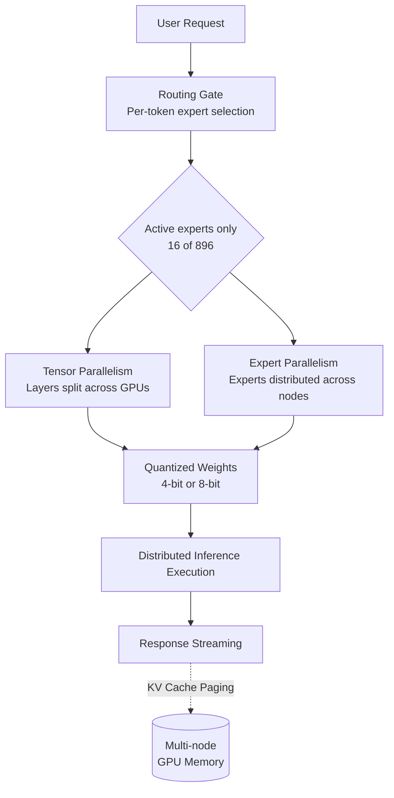

## Overview

On July 16, 2026, China's Moonshot AI released Kimi K3. With a total of 2.8 trillion parameters, it is the largest open weight model released to date. Multiple outlets described this release as the moment the open weight camp reached frontier level performance.

What drew the most attention was the frontend. On a benchmark from the AI evaluation platform Arena that measures the ability to build web interfaces, Kimi K3 ranked first, and in blind tests developers reportedly preferred Kimi over Anthropic's Fable 5 and OpenAI's GPT-5.6 for frontend coding. Moonshot demonstrated this with a demo that built a 3D open world game inside a web browser using Three.js and WebGPU.

Rather than repeating the benchmark rankings, this post focuses on the question that comes next. Open weight means anyone can run this model on their own infrastructure. So what does it actually take to serve a 2.8 trillion parameter model in practice. Since ThakiCloud treats on-premise model serving for client environments as a core capability, we read this release through the eyes of an operator.

## What Is Kimi K3

Kimi K3 is a Mixture of Experts, or MoE, model. It has a total of 2.8 trillion parameters, but not all of them activate when processing a single token. According to public information, it activates 16 of a total of 896 experts, and the number of active parameters actually used in computation is estimated at around 50 billion [estimated]. Moonshot has not officially disclosed the active parameter count.

Structurally, two innovations were introduced. One is Kimi Delta Attention (KDA), and the other is Attention Residuals (AttnRes). Moonshot explains that these two together improve both efficiency and reasoning quality. The context length is 1 million tokens, a design choice that reads as targeting long context agent workloads.

Some caution is warranted on licensing. The previous generation, the Kimi K2 series, was released under a modified MIT license in July 2025, but K3's license terms themselves had not been finalized or disclosed at the time of this writing. Moonshot calls K3 open and has announced that it will release the full set of weights by July 27, 2026, but as of publication, the official checkpoints had not yet appeared on Moonshot's Hugging Face organization account. Anyone considering actual adoption should verify the final license text and the state of weight availability directly.

## Why This Release Matters

It is no longer rare for an open weight model to outperform top closed models on a narrow task. But claiming that spot in an area working developers use every day, frontend coding, and doing so with the largest publicly released weights in the world, carries different weight. It signals that an alternative to being locked into closed APIs purely for performance reasons now exists, one that organizations can operate themselves.

Frontend and UI generation in particular is an area where you can immediately see the result with your own eyes. This is also the context behind Moonshot's emphasis on what it calls vision in the loop, a cycle in which the model looks at what it generated and corrects it. The claim is that this loop is especially useful for visual tasks such as game development, UI design, and computer aided design. It goes a step beyond generating code as text alone, treating the rendered output itself as feedback.

## What It Actually Takes to Serve 2.8 Trillion Parameters

This is where the operator's domain begins. There is considerable distance between the fact that a model is open weight and the fact that you can serve it yourself.

Memory comes first. Loading all 2.8 trillion parameters at their original precision requires several terabytes of GPU memory. That is beyond what a single GPU, or even a single server packed with multiple GPUs, can handle, which means distributed serving across multiple nodes is a given. The MoE structure does ease the burden somewhat. Since only a subset of experts activate per token rather than the whole model, the actual computation stays close to the scale of the active parameters. Even so, every expert's weights must remain resident in memory so they can be called at any time, so the storage burden still tracks the total parameter count.

That is why two techniques are close to mandatory for realistic self hosted serving. One is quantization. Lowering the weights to 8 bit or 4 bit precision cuts memory usage and significantly reduces the number of GPUs required. The other is parallelism. Tensor parallelism splits the model's layers across multiple GPUs, and for MoE models, expert parallelism additionally distributes the experts across multiple devices. The serving path looks like this.

Here is the core point. Open weight means the weights are free, not that serving is free. Running a model of this scale reliably on your own infrastructure requires a multi-node GPU cluster, a quantization pipeline, a distributed inference engine, and a scheduling and observability layer that ties all of it together. This is exactly where a platform's value shows up.

## Implications for ThakiCloud Products

This release makes the case for two ThakiCloud products at once.

First, from the infrastructure angle: ai-platform. ThakiCloud's ai-platform is Kubernetes based AI/ML infrastructure that provides GPU scheduling through Kueue, multi-tenant isolation, distributed serving, and observability. For a client organization that wants to serve a massive open weight model like Kimi K3 on its own infrastructure, this layer is not optional, it is the precondition. Managing GPU resources across multiple nodes through policy, and packaging quantized, parallelized serving into something that is actually operable, is what determines whether adoption is even feasible in the first place. In a sovereign environment where data cannot leave the organization, being able to run a frontier grade open weight model on your own infrastructure is by itself a compelling case for adoption.

Second, from the agent angle: Paxis. Kimi K3's strength in frontend coding and visual generation connects directly to coding agents. Paxis is ThakiCloud's Agent-Native Cloud, treating skills, tools, policies, and audit logs as first class resources. It runs skills inside isolated sandboxes, orchestrates multiple agents as a DAG, and routes every action through policy gates and audit logging. For an organization that wants to operate a vision in the loop coding agent, one that generates code, checks the result, and corrects itself, inside a secure execution boundary, this kind of control plane is essential. When a powerful open weight coding model meets a secure agent execution environment, the result is a practical coding agent running on your own infrastructure.

The two perspectives complement each other. Low cost self hosted serving (ai-platform) is what makes it economically viable to run agents continuously (Paxis), and a strong agent workload (Paxis) is what gives that serving infrastructure (ai-platform) a reason to exist.

## Limitations and Counterarguments

Setting the excitement aside, a few points deserve a sober look.

First, at the time of this writing the full set of weights may not yet be completely released, and the final license terms have not been confirmed. A benchmark score and a model you can actually obtain and run commercially are two different things. Anyone evaluating adoption should base the decision on the actually released weights and license text, not on announcement materials.

Second, ranking first on a benchmark does not mean superiority in every situation. The frontend preference test is a relative evaluation on a specific task, and how the model performs on your own actual workload needs to be verified directly. Assuming someone else's reported ranking applies to your own results is risky.

Third, the total cost of self hosted serving is far from small. When you account for the GPUs, power, and operational staff required to run a 2.8 trillion parameter model across multiple nodes, using a closed API may actually be cheaper for organizations with low traffic. The real advantage of open weight is not unconditional low cost, it is data sovereignty, avoiding vendor lock-in, and the potential for cost control at sufficient scale. Calculate your own traffic scale and data requirements first, then decide.

## Sources

- [China's Moonshot AI releases Kimi K3, the largest open-source model ever (VentureBeat)](https://venturebeat.com/technology/chinas-moonshot-ai-releases-kimi-k3-the-largest-open-source-model-ever-rivaling-top-u-s-systems)
- [Moonshot AI Releases Kimi K3: A 2.8 Trillion Parameter Open MoE Model With Kimi Delta Attention (MarkTechPost)](https://www.marktechpost.com/2026/07/16/moonshot-ai-releases-kimi-k3-a-2-8-trillion-parameter-open-moe-model-with-kimi-delta-attention-and-1m-context/)
- [China's open-weight Kimi model stuns AI world with frontier-level results (Axios)](https://www.axios.com/2026/07/16/moonshot-kimi-ai-china-model-openai-anthropic)
- [China's Moonshot throws down the gauntlet with Kimi K3 (SiliconANGLE)](https://siliconangle.com/2026/07/16/chinas-moonshot-throws-gauntlet-kimi-k3-worlds-largest-open-weights-model/)
