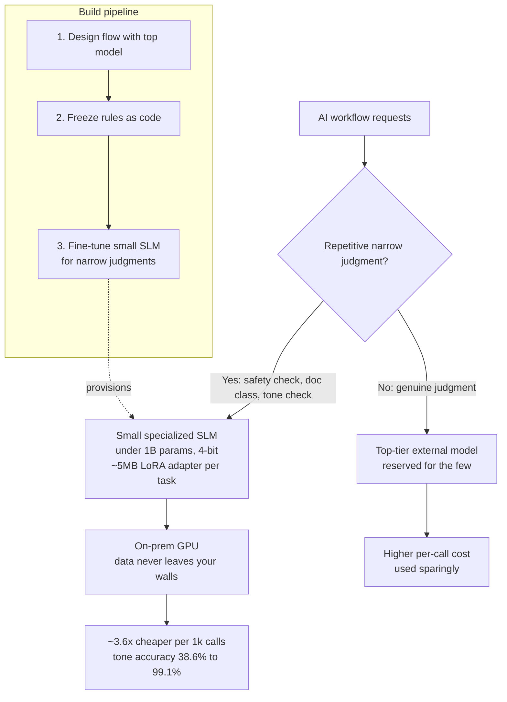

## The bottom line first

A large share of what you spend on AI does not go toward the model being clever. It goes toward **the same decision repeated thousands or tens of thousands of times a day**: "is this request safe?", "which category does this document belong to?", "is the tone of this sentence appropriate?" When you call a top-tier external model for that repetitive work every time, cost scales with volume and sensitive data leaves your walls on every call.

ThakiCloud's proposition is simple: **peel off only that repetitive work into small specialized models running on your own infrastructure (on-prem)**, and reserve the expensive top-tier model for the few tasks that truly require judgment. We verified that this actually works — by measurement, not prediction — and published the whole thing. This post frames that cost story in the language of decision-makers.

## Why this matters now

The moment you put generative AI into real operations, three things grow at once. **Cost** rises linearly with call volume. **Data exposure** happens every time you call an external API. And **lock-in** to a specific external model vendor deepens. All three are risks executives want to control.

Here is the key. When you break down what your AI actually does, most of it is **narrow, repetitive adjudication**, and genuine creative judgment is the minority. Yet today both are handed to the same top-tier model without distinction — like assigning simple document sorting to your highest-paid expert.

## Our approach: repetitive work onto specialized models, on-prem

The method has three steps. First, design the workflow with a large model. Second, freeze whatever can be reduced to rules as code. Third, take only the **narrow repetitive decisions that genuinely need a language model and train a small specialized model (under one billion parameters, 4-bit)** for them. That work then runs on a single commodity on-prem GPU, and the top-tier model is spent only on what truly matters.

The ThakiCloud platform productizes exactly this workflow. It **fine-tunes the small specialized model as a managed service** (without you having to wrangle GPU infrastructure) and **serves it on your own on-premises hardware**. The experiment in this post is the evidence that the pattern works; the platform is what makes it repeatable and operable.

*Route repetitive narrow judgments to a small on-prem specialized model to cut per-call cost and keep data in-house, and reserve the top-tier model for the few tasks that need real judgment. Each specialized model is a ~5MB attachment per task, so multiple tasks swap onto one shared base model.*

## What we measured

To avoid overstatement, we measured and published every number. The environment is a single GPU, with no external API calls at any stage of training or inference — the entire pipeline stays inside your own infrastructure. That is what data sovereignty looks like in practice.

**Cost.** On-prem, the small specialized model handled 1,000 calls at roughly **3.6× lower cost** than a top-tier external API. That figure is single-stream; batching the way real operations do widens the gap further.

**Quality.** On narrow repetitive decisions, the small model leapt. Korean tone classification rose from 38.6% before training to 99.1% after; news categorization went from near-random to over 80%. When re-checked on real sentences never seen in training, it still agreed with the true answer at about 88% on safety decisions and 89% on categorization.

**Economics.** Each specialized model is produced as a small attachment of about 5 megabytes per task. Its quality nearly matches retraining the entire model from scratch (99.1% vs 96.9%) at roughly 1/300th the size, and you can swap multiple tasks onto one shared base model. A single small model even handled four repetitive tasks at once. Operationally, this translates directly into "more work on less hardware."

## The limits, stated honestly

One point we state plainly: on a general task the top-tier model already did well, hastily adding specialized training actually made it worse. In other words, this approach is **not something you apply to any task, but to repetitive, narrow tasks chosen deliberately**. Knowing where to apply it and where not to is exactly where a platform and expertise earn their keep. We publish the good results and the bad ones together.

## For the decision-maker, in summary

First, a large share of your AI operating cost is leaking into repetitive work, and that part can be cut structurally. Second, the way to cut it is to peel that repetitive work off into small specialized models running on-prem, which secures cost savings and data sovereignty at the same time. Third, the ThakiCloud platform delivers this as a managed service, so you adopt it without personally shouldering the complexity of GPU infrastructure and model training.

The full experiment code and measured results are public and reproducible: [github.com/sylvanus4/tiny-skill-distill](https://github.com/sylvanus4/tiny-skill-distill). We are happy to assess, with you, which of your AI workloads to move onto specialized models and how much that would lower your cost.
