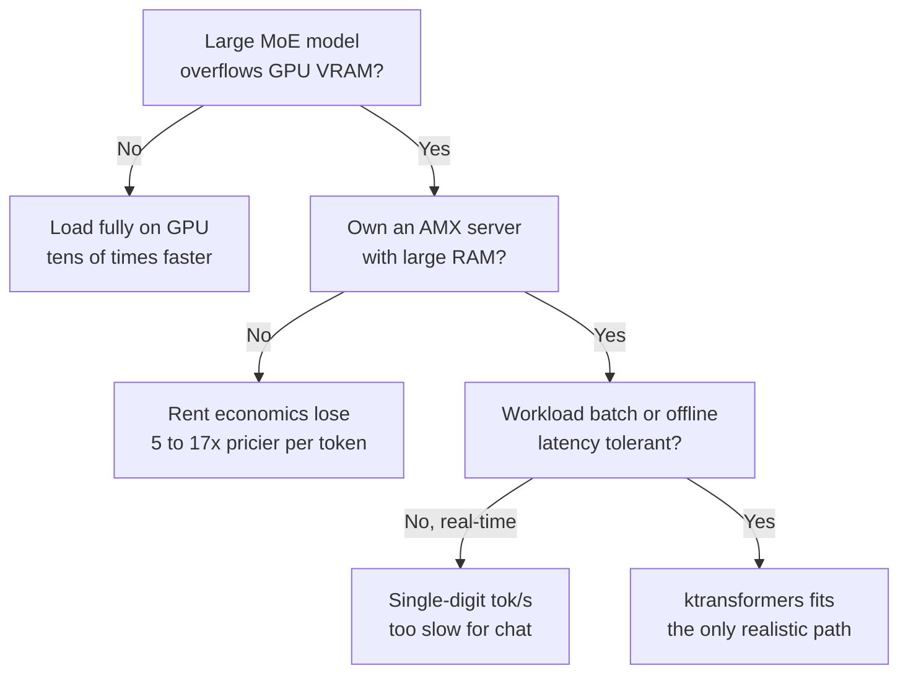

This post is for engineers weighing whether to self-host an MoE model, and for infrastructure leads who have to decide how far to trust the current wave of tweets claiming "run a giant model on a single GPU." The short version: the ktransformers trick is real and it works. But the viral phrases "28x" and "a $400K rack on a single 24GB card" each rest on a hidden assumption. Here is what those assumptions are, based on measurements from two separate GPU rentals on RunPod.

## What made it go viral

The idea behind ktransformers (kvcache-ai/ktransformers, Apache 2.0, 17k stars), released by Tsinghua's MADSYS lab, boils down to one sentence. In an MoE model, keep only the experts that are actually being called near the GPU, and park the experts that sit idle most of the time in CPU memory, pulling them in only when needed. With this layout, DeepSeek-V3 and R1 reportedly run on 24GB of VRAM with a 139K context, up to 28x faster than the standard setup.

The trick itself is almost embarrassingly simple. That is exactly what made it suspicious. The only way to know whether this was a genuine free lunch, or whether a hidden bill was waiting somewhere, was to pull the numbers ourselves.

## Experiment design: isolating the mechanism with a smaller model

DeepSeek-V3 is 671B, so it will not fit on a 24GB card. We used Qwen3-30B-A3B (30B total, 3.3B active) as a proxy model, a scaled-down member of the same family (MLA plus fine-grained MoE). The goal was not to reproduce the vendor's 671B numbers, but to isolate whether "offloading experts to CPU" actually pays off as a mechanism, and if it does, to break down where that payoff comes from.

We split the measurement into two stages. First, we tested the mechanism itself on an off-the-shelf AMD box. Second, we separately measured the Intel AMX kernel that ktransformers claims is the source of its performance.

## Stage 1: measuring the mechanism on a commodity 4090 plus AMD

We rented an RTX 4090 (24GB) paired with an AMD Ryzen 9 7950X and 188GB RAM on RunPod. This is where the first hidden assumption showed up immediately. ktransformers' CPU expert kernel is optimized for Intel AMX instructions, and this AMD CPU has no AMX. So instead of ktransformers' own kernel, we measured the mechanism cleanly using llama.cpp's `--n-cpu-moe` (experts on CPU, attention and KV cache on GPU), which implements exactly the same trick.

We quantized Qwen3-30B-A3B to Q4 and compared decode speed across three layouts.

| Layout | Decode speed |
|---|---|
| Entire model on GPU (full-GPU) | 261.5 tok/s |
| Experts on CPU, attention on GPU (mechanism) | 12.0 tok/s |
| Everything on CPU (CPU-only) | 7.4 tok/s |

Two things stand out here. The mechanism is 1.62x faster than pure CPU. Moving attention to the GPU genuinely pays off. But when the model fits entirely in VRAM (Q4 is 18GB, which fits in 24GB), full-GPU beats the mechanism by 22x. In other words, if the model fits on the GPU, offloading experts to CPU is a net loss. This trick only matters at the moment the model overflows VRAM. In that case, "it runs at all, even at 12 tok/s" is the value, not raw speed.

## Stage 2: the real multiplier from the Intel AMX kernel

To face the AMX kernel head on, the claimed source of the 28x, we needed a Sapphire Rapids-generation Xeon. After spinning up several H100 pods on RunPod and checking their CPUs, we landed a host with an Intel Xeon Platinum 8470 (AMX bf16/int8/tile support), 208 vCPUs, and 1TB RAM.

The kt_kernel package bundles kernels for every backend, so within the same process we could run the AMX kernel and the AVX2 kernel side by side on identical BF16 weights. We measured MoE forward passes at DeepSeek-V3 scale (256 experts, hidden dim 7168) on both kernels.

| Kernel (identical BF16, decode) | Speed |
|---|---|
| AMX (AMXBF16_MOE) | 145.5 tok/s |
| AVX2 (AVX2BF16_MOE) | 105.5 tok/s |

The AMX kernel was 1.38x faster than AVX2. A clear win, but nowhere near 28x. Using INT8-only tile operations could widen that gap further (we limited this round to a same-precision BF16 comparison due to cost), but a single kernel alone does not produce a 28x speedup.

## Decomposing the "28x"

Putting the two experiments together shows how the vendor's 28x is actually composed. That number is not kernel magic, it is a comparison of the whole system against llama.cpp's pure-CPU execution. Broken down, it looks like this.

Moving attention and the KV cache to the GPU is by far the biggest lever. On the commodity AMD box, this layout alone produced a 1.62x gain over pure CPU, and once the model fits on the GPU, that gap widens to 35x. On top of that, the AMX expert kernel adds roughly another 1.4x over AVX2. INT8/INT4 quantization and pipeline optimizations stack on top of that. Each individual factor is a modest multiplier, but under specific conditions these multiply together into a double-digit speedup. Those conditions are: the model overflows VRAM, the CPU supports AMX, and the comparison baseline is pure-CPU llama.cpp.

## The truth behind "$400K to 24GB"

This phrase does not eliminate memory, it relocates it. Our pods each had 188GB and 1TB of system RAM respectively. Running DeepSeek-V3 at Q4 requires roughly 380GB of DRAM on the CPU side. The expert weights do not disappear, they simply move from VRAM to system RAM. So the accurate description is "one 24GB GPU plus a large-RAM server." An expensive GPU has been traded for cheap RAM, not a reduction in total memory demand. That is a different picture from a single consumer 24GB card replacing an entire data center rack.

## So how many tok/s, really, and at what cost

The experiments above decomposed the mechanism, but they left out the two numbers practitioners actually care about: how fast does a genuinely large model run, and how much money does this actually save. So we re-measured in the exact configuration where ktransformers actually makes sense: a many-core server CPU (Intel Xeon Platinum 8570, AMX support, 224 cores), 2TB of system RAM, local NVMe, and a single GPU. The model is Qwen3-235B-A22B (Q4, roughly 130GB), which fits neither on a 24GB card nor on a single 80GB card. This is the case where offloading is not optional, it is required.

First, the hardware claim checks out. Offloading all experts to CPU brings GPU memory usage down to just 11GB. A 235B-class model uses only 11GB of GPU memory. That fits not just on 24GB, but on a 12GB card. The picture of "run a 671B-class model on a big server with a single 4090" genuinely holds.

The problem is speed. Loading the same model entirely onto 2xA100 80GB gives 51.5 tok/s of decoding, comfortably enough for real-time conversation. But the offloaded state, with experts on CPU, is a completely different world. We measured this two independent ways, and both landed in single digits. Running llama.cpp end to end gives 1.2 tok/s. Measuring only the expert computation with ktransformers' actual AMX kernel (kt_kernel) gives 3.8 tok/s at BF16. Even putting some experts on the 24GB GPU only nudges this from 1.2 up to 1.5.

Why can't switching kernels break out of single digits. Because the fundamental bottleneck is computing 22B of active parameters on the CPU for every single token. The AMX kernel really is about 1.3x faster than AVX2, but that multiplier cannot clear the wall. The 8 to 15 tok/s ktransformers has publicly reported (for the larger DeepSeek-V3) stacks INT4 quantization, GPU expert placement, and pipelining all together, and even that figure is a batch-throughput number, not interactive serving speed.

This number flips the conclusion. Using RunPod's actual rental prices, the cost per million tokens works out as follows.

| Configuration | Hardware | Per hour | Decode | Per million tokens |
|---|---|---|---|---|
| Full-GPU | 2xA100 80GB | about $3 | 51.5 tok/s | about $16 |
| Offload | AMX server + 1 GPU | about $3 | about 2 to 4 tok/s | about $80 to $280 |

On a rental basis, offloading costs 5x to 17x more per token. It is not, in any sense, a tool for cutting cloud operating costs. And on top of that, a large AMX server itself is not cheap. RunPod does not even offer a "cheap 4090 plus large AMX server" combination, so AMX only comes bundled with data-center GPUs.

So the one place where the economics do work out is on premises, on a server you already own. If you already have a large Xeon server running, dropping a $1,600 4090 into that sunk cost to run a 671B-class model in batch is overwhelmingly cheaper than buying two new A100s worth $30,000. It is not a tool for cutting operating cost, it is a tool that, on hardware you already have, shifts the boundary between "this runs" and "this does not run." And its use case is not real-time serving, it is batch, offline, and latency-tolerant work like agents.

## So should you adopt it

Start by checking whether all three of these hold. Do you already own (or can you cheaply acquire) a large AMX server with a large amount of RAM. Is the model you want to run a large MoE (V3, R1-class) that genuinely overflows GPU VRAM. And is the workload latency-tolerant, batch or offline or agent-style, rather than real-time response. If all three are true, ktransformers becomes the only realistic path to running that model without buying an expensive multi-GPU setup. If even one is off, the answer changes. If you need real-time conversation, offloading's single-digit tok/s is not enough, and if the model fits on a GPU, just loading the whole thing onto the GPU is, without question, tens of times faster.

Here is that decision laid out as a single flow.

In our view, the real value of ktransformers is neither "28x" nor "cheap serving." It is a single matter of accessibility: a team that cannot buy or rent multiple GPUs can now run a 671B-class MoE model at all, using a large server it already has plus a single GPU. It should be read not as a speed champion or a cost-cutter, but as a batch tool that lowers the barrier to entry.

## Reproduction details

All three experiments were run on RunPod, and total GPU cost came to about $15. The bench harness (llama.cpp `--n-cpu-moe`, the kt_kernel AMX/AVX2 kernel comparison, and the 235B end-to-end measurement) and the raw result JSON are all public. If you want to reproduce this yourself or verify the numbers, see [github.com/sylvanus4/ktransformers-moe-offload-bench](https://github.com/sylvanus4/ktransformers-moe-offload-bench) (Apache-2.0). The remaining candidate for verification is standing up ktransformers' full serving stack with INT4 quantization, GPU expert placement, and pipelining all turned on, to measure exactly how high batch throughput can actually climb.
