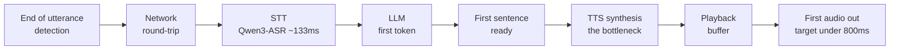

Anyone who has built a real-time voice agent runs into the same wall. Once the delay between the user stopping speaking and the agent making its first sound grows even a little, the conversation starts to feel off. Yet the moment you ask "which stage of my stack is slow," the answer does not come easily. End-of-utterance detection, network round-trip, speech-to-text (STT), the LLM's first token, and text-to-speech (TTS) are chained together, and each vendor's SDK only shows you the numbers for its own segment. This post covers an open tool we built, voice-latency-budget, to diagnose that entire chain at a glance, along with the results of measuring its self-hosting scenario on actual GPUs. This post is written for infrastructure and AI engineers who want to serve a real-time voice agent themselves. The short version: in GPU self-hosting, the latency bottleneck was not the LLM, as one might commonly assume, but concurrency design and TTS choice.

## Why We Need a Latency Budget Framing

Research shows that when two people talk, the gap between one person finishing speaking and the other responding converges to a median of about 200 milliseconds regardless of language (Stivers et al., 2009, PNAS). For a real-time voice agent to feel "human," the time from end-of-utterance to the first response sound needs to be close to that range, and in practice, staying under sub-second, that is, under 800 ms, is a common target. This number roughly matches the targets vendors publish too. Deepgram cites under 300 ms, Vapi cites under 500 ms.

The question is how to split that total budget. If the network eats 40 ms round-trip, STT takes 300 ms, and the LLM's first token takes 500 ms, the budget is already blown. It is hard to judge by gut feeling which stage to cut for the biggest gain. So we built a calculator that shows the cumulative timeline, the bottleneck, and whether you land within a natural conversational range the moment you enter each stage's expected latency. It runs entirely client-side, with no server and no API key, and your inputs never leave the browser. We aimed for a public-good tool that does not promote any particular product.

The tool covers seven stages: end-of-utterance detection, network round-trip, STT, LLM first token, first sentence ready, TTS synthesis, and playback buffer. Each stage's slider hint carries a typical range pulled from public material from 2025 through 2026, and when a bottleneck exceeds that range, the tool surfaces a recommendation. You can start from a preset, overlay two configurations in comparison mode, and see a rough p95 under load as well.

The seven stages form a chain, and the sum of these delays has to fit inside the target budget for the conversation to feel natural. In the flow below, the stage that actually ate up the most budget was non-streaming TTS.

## How the Numbers Change Once You Self-Host

You can get a rough sense of a managed streaming API's latency range from documentation. But "what number do we actually get when we put the engine we really use on a GPU" is something you cannot know without measuring it directly. So we took the exact stack we had been running locally on a MacBook for development and put it on a RunPod H200 (141GB) to measure it. The engines were Qwen3-ASR-1.7B for STT, VoxCPM2 and Qwen3-TTS-1.7B for TTS, and the latest Qwen3.5-9B for the LLM.

First, a note on how we kept costs down. If you re-download tens of gigabytes of models and CUDA wheels on every GPU pod, the expensive GPU sits idle waiting for the download and you get charged for it. So we downloaded the virtual environment and weights onto a single network volume exactly once (67 gigabytes), then had the GPU pod mount that volume and benchmark without re-downloading. We guaranteed that the pod and volume would be fully deleted afterward using a finally block plus a name-based safety net for teardown. Total cost including debugging was about 17 dollars, and no resources leaked.

## Measurement Results: The Bottleneck Was Neither the LLM Nor STT, But TTS

Here are the numbers we measured on the H200, on a single-request basis.

| Engine | Model | Latency (single) | Real-Time Factor (RTF) |
|---|---|---|---|
| STT | Qwen3-ASR-1.7B | 133 ms / 10s audio | 0.013 |
| TTS | VoxCPM2 (non-streaming) | 673 ms / sentence | 0.149 |
| TTS | Qwen3-TTS-1.7B (non-streaming) | 6778 ms / sentence | 1.205 |

STT was not a stage worth worrying about. Qwen3-ASR transcribes 10 seconds of audio in 133 ms. A real-time factor of 0.013 is effectively instant. The real story was in TTS. On the same H200, VoxCPM2 synthesized the same Korean sentence in 0.67 seconds, while Qwen3-TTS took 6.8 seconds. On the same card, VoxCPM2 is nearly ten times faster. And it matters that both engines are non-streaming. Because the entire sentence has to be synthesized before the first sound comes out, even VoxCPM2's 0.67 seconds is not "100 ms streaming TTFA" but "first sound after 0.67 seconds." VoxCPM2 did drop from multi-second on local MPS down to 0.67 seconds on GPU, but that does not mean it became streaming. To build a real-time turn, you need to switch to a streaming TTS or synthesize in short sentence chunks. Making this exact point visible as a number was the reason we built this tool in the first place.

## An Honest Gap: The LLM Got Stuck on This Host

We were unable to obtain vLLM serving numbers for Qwen3.5-9B this time. The cause was not performance but an infrastructure version mismatch. As of July 2026, the latest vLLM pulls in a torch built for CUDA 13, and the driver on the H200 host we were assigned was CUDA 12.8, so the engine refused to start, saying the driver was too old. Downgrading torch to a 12.8-compatible build then broke vLLM's compiled kernels, and routing through transformers instead threw errors in the multimodal generation path. Each engine wants a different torch, and fixing one breaks the other, a classic dependency conflict. Getting clean vLLM numbers would require a host with a CUDA 13 driver. We entered an estimate into the calculator's LLM slider and marked it explicitly as an estimate. Hitting an outdated driver while trying to serve the latest model on the latest stack is also a realistic pitfall of self-hosting, so we are writing it down plainly rather than hiding it.

## How to Set This Up for Serving

Translating the measurements into a recipe looks like this. STT is fine as-is with Qwen3-ASR. For TTS, choose VoxCPM2, the one that is ten times faster of the two engines, but bring the first sound forward with streaming or sentence chunking. Qwen3-TTS's non-streaming 6.8 seconds cannot be used as-is for a real-time turn. Serve the LLM with vLLM on a host with a CUDA 13 driver. Put all three engines on the same node to eliminate network hops, and use sentence-level streaming that kicks off TTS the instant the first sentence is ready. Our local MacBook stack is for development, not a serving system, and the calculator's local preset is explicitly labeled "not suitable for real-time."

We published this whole process so it can be reproduced. The calculator opens directly in a browser, and the benchmark harness bundles volume creation, download, GPU benchmarking, and full teardown into a single script. We have also archived the raw measurement JSON and a serving guide in the repository. We hope this gives a starting point for anyone who wants to talk about self-hosted voice stack latency with numbers instead of gut feeling.

- Calculator: [voice-latency-budget](https://sylvanus4.github.io/voice-latency-budget/)
- Repository, benchmark harness, and serving guide: [github.com/sylvanus4/voice-latency-budget](https://github.com/sylvanus4/voice-latency-budget)
