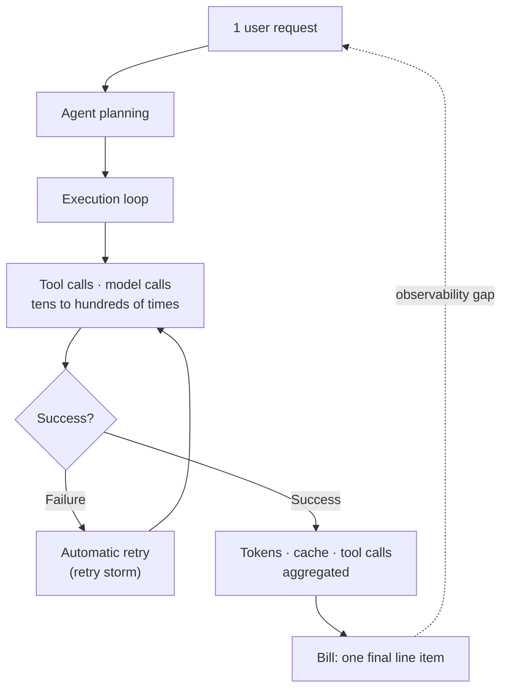

This piece is written for platform and infrastructure engineers rolling out Claude Code or AI agents across an organization, and for finance and procurement owners who have to explain next month's AI bill. The short version: the flood of AI cost news over the past month is not really a story about "AI being expensive." The real problem is that the bill doesn't explain what it's actually for. In an agent architecture, a single user request can fan out into dozens or hundreds of model calls, tool executions, and automatic retries on failure, and the final dollar amount alone gives you no way to tell which loop leaked the money. We think this observability gap is the real source of the pain the market is feeling right now.

## Overview

If you had to sum up the news from late June through July 2026 in one line, it would be this: using frontier models indiscriminately for every task is unsustainably expensive, and it's hard to even trace where that cost is coming from. The clearest illustration was dramatic. A user in Korea first saw a charge attempt of roughly 2.5 billion won, then one for roughly 25 billion won. No money actually left the user's account, since the charge exceeded the card's limit, but the fact that an abnormal figure was pushed all the way to the card authorization stage, not just displayed as a UI glitch, is what gives the incident its weight.

Around the same time, news broke at other levels of the stack. An AI cost auditing firm reviewed the bills of 60 companies and alleged significant overcharging, several large enterprises began splitting frontier-model usage across cheaper models depending on the task, and reports emerged that companies in the US and Europe were migrating to Chinese open-weight models to cut costs. Interestingly, model vendors themselves began responding in a way that essentially conceded the point, that running the top-tier model on everything, all the time, isn't sustainable. Stories from several different directions were converging on the same spot.

## What Happened Over the Past Month

The first issue to surface was the reliability of the billing system itself. According to ZDNet Korea, a charge to a Korean university student started at roughly $1.66 million and then jumped tenfold to roughly $16.62 million. Anthropic later explained that the auto-recharge amount had been set to an abnormally high figure by mistake, but the user maintained that he had never configured auto-recharge in the first place, so why that setting existed remains unexplained. The detail that the user sent more than fifteen emails to multiple departments and only received an automated reply four days later says more about the gap in the response system than about the technical error itself.

The second issue was the observability of agent costs. According to AI Times and The Information, cost-auditing startup Vaudit reviewed roughly $34 million in bills across 60 companies and claimed that about $1.7 million of it was overcharged. A large share of what it reviewed was Claude Code usage, and companies including Panasonic, HP, and Honda were named as clients. The patterns Vaudit pointed to included calls made on a cheap model but billed at a premium model's rate, charges for jobs that never actually completed, and repeated automatic retries after failures, what it called a retry storm. Two caveats are worth stating clearly here. First, Anthropic pushed back, saying it does not bill for incomplete requests or error responses and that it has seen no evidence of widespread overcharging. Second, Vaudit is a commercial auditing firm that takes a cut of any refunds it wins, so these figures are best read as one party's findings rather than an independent audit. In other words, this is currently a standoff between an auditor's allegations and a vendor's denial.

The third was how the market responded. The Information reported that companies had started splitting workloads by task, routing simple classification, summarization, and transformation jobs to cheaper models, complex coding and agentic work to frontier models, and repetitive high-volume jobs to open-weight or self-hosted models. The Financial Times reported that DoorDash, Siemens, and Airbnb had adopted DeepSeek or Moonshot-family models to cut costs. Business Insider reported that even Anthropic's own platform executives acknowledged that shadow IT, business units adopting AI tools on their own without coordination, had driven runaway AI spending at some companies, though their prescribed fix was task-level model selection and centralized cost governance rather than usage bans or blanket budget caps. Pricing policy itself kept shifting too. Whether the latest high-performance models were included in subscriptions, and when usage-based billing would kick in, was adjusted repeatedly, and promotional deadlines kept getting extended. One example: the free tier for Claude Fable 5 was reportedly extended through July 19. For procurement teams, the bigger headache wasn't performance, it was not being able to predict next month's bill.

## Why Agent Costs Go Unobserved

There's a single thread running through all three strands of news. In agent workloads, the distance between what the user sees and what the bill records has grown too large. A traditional API call was one request, one response, one line of cost. A coding agent or agent SDK, by contrast, expands a single instruction into planning, tool calls, file edits, verification, and automatic retries on failure. That expansion happens somewhere the user never sees, and the bill records only the sum of it, in one line.

In this structure, most of the points where cost leaks out sit outside the user's field of view. A retry loop quietly runs and inflates the call count, an intermediary cloud provider sits between the actual model usage and the final billing record and creates drift between the two, and one misconfigured setting, like auto-recharge, can push an abnormal amount all the way to the card authorization stage. The three stories may look unrelated, but they're all different faces of the same observability gap. That's why setting a monthly cap per user isn't enough on its own. What's actually needed is an instrumentation layer that captures per-model cost, per-session tokens, cache tokens, tool call counts, failure and retry costs, and day-over-day anomaly rates centrally, at the moment each call happens. Without observability there's no control, and without control the bill will always be the document that surprises you after the fact.

## Implications for ThakiCloud's Products

This is a problem that two of ThakiCloud's products each target from a different angle. Because the infrastructure lens and the agent lens complement each other here, we apply both to this topic.

**The ai-platform lens: owning repetitive workloads is the answer.** The market has arrived at a clear conclusion. Running even trivial tasks on frontier models is unsustainably expensive, and self-hosting an open-weight model is the economical choice for repetitive, high-volume work. ThakiCloud's ai-platform is Kubernetes-based AI/ML infrastructure built for exactly that gap. It queues GPUs with Kueue to push utilization higher, serves open-weight models through vLLM, and separates usage and billing by department through multi-tenant isolation. Where usage-based API pricing produces unpredictable bills, self-hosting builds a structure on top of a fixed GPU cost where the unit price doesn't spike even as usage grows. Unlike external usage-based pricing that keeps shifting, on-premises and sovereign deployments turn cost predictability itself into an asset. And the fact that data never leaves the organization is an additional value for organizations facing heavy domestic regulatory and security requirements.

**The Paxis lens: making every agent action auditable.** The core of the observability gap was the agent loop, and that is precisely the territory Paxis addresses. Paxis is ThakiCloud's Agent-Native Cloud control plane, running on top of ai-platform, that treats Skills, Tools, Policies, and Audit Logs as first-class resources. Which skill an agent invoked, through which tool, how many times, and in which sandbox it ran, all of it is captured in an audit log. In this structure, a retry storm can't quietly inflate a bill: the retry loop shows up directly in the audit trail, and policy gates block calls that cross a threshold. A design that selects from more than 960 skills using BM25, runs them in isolated sandboxes, and routes every action through policy and audit is a structural answer to exactly the problem of not being able to tell, from the bill alone, which loop generated the cost. Low-cost serving through ai-platform makes agents economical, and action-level observability through Paxis makes that economics predictable. That's how the two lenses fit together.

## Limitations and Counterarguments

In the interest of balance, let's state the counterargument clearly. First, frontier models aren't automatically wasteful. According to the Wall Street Journal, companies like Shopify believe that for complex coding and multi-step agent work, a frontier model's higher price can be justified if it saves enough engineering time. Spotify and Twilio, by contrast, are weighing more carefully whether a marginal performance gain justifies the added cost. The takeaway isn't "abandon frontier models," it's "split the workload by task difficulty." Self-hosting isn't a universal answer either. Pushing tasks that require the highest level of reasoning down to open-weight models degrades quality, and it introduces a new operational burden of GPU operations, model updates, and security patching.

Second, the overbilling figures cited in this piece are not settled facts. Vaudit's claims come from a commercial auditing firm, and Anthropic has denied them, so the accurate reading right now is that the two sides' positions are in direct conflict. In the 25-billion-won billing incident too, no money actually changed hands, and no technical explanation for why the auto-recharge setting existed has been made public. The conclusion we draw from this news isn't aimed at any particular vendor. It's a principle: in the agent era, whichever vendor you use, cost observability and governance need to be secured on the user's side. Choosing a good model and governing that model are two separate problems, and the news of the past month simply exposed the fact that the latter has been an empty seat all along.

## Sources

- ZDNet Korea, "Korean User Hit With 25 Billion Won Payment Request, Anthropic Billing Error Controversy" (2026-07-09)
- ZDNet Korea, "Anthropic's 25 Billion Won Charge Turns Out to Be an Auto-Recharge Configuration Error" (2026-07-16)
- AI Times, "Anthropic Faces 'AI Overbilling' Controversy, Charged for Failed Jobs Too" (2026-06)
- The Information, report on enterprises adopting AI cost controls and model diversification (2026-06-23)
- Financial Times, "Companies turn to Chinese AI models to cut costs" (2026-07)
- Business Insider, "Anthropic Official Warns Against 'Wrong' AI Cost Response" (2026-07-15)
- The Wall Street Journal, "Meet the Companies Shelling Out for Top AI Models" (2026-07)
