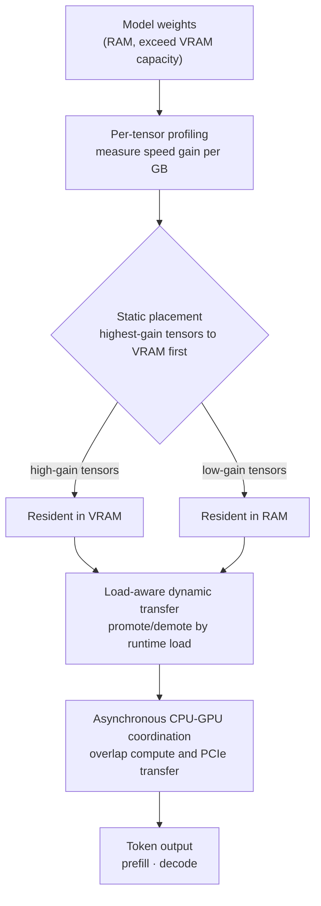

This post is for engineers weighing whether to self-serve a large model on a single consumer GPU, and for infra owners deciding how much to trust the "run 120B on 24GB" tweets going around. Up front: the core idea of ATSInfer (arXiv:2607.10183), released by researchers at Nanjing University, is simple and persuasive. Where prior offloading moved things in chunks at the granularity of a "layer" or an "expert," ATSInfer slices down to **individual tensors**. That said, the headline "up to 3.29x" rests on a few premises, and the code is not yet public. We did not reproduce an RTX 4090 running a 120B-class model here, so every number in this post is a **value reported by the paper**, stated as such.

## Overview

Anyone who has run a local LLM hits the same wall: if the model weights are larger than GPU memory, the overflow spills to CPU memory. llama.cpp's `-ngl` flag (how many layers to place on the GPU) does exactly this. The problem is that it cuts only at **layer granularity**. A single layer mixes tensors of very different character (attention weights, FFN weights, normalization params), yet they are handled all-or-nothing: either the whole thing goes to the GPU or it stays on the CPU.

Why this chunked placement loses is simple. The same 1GB in VRAM might make one tensor 10x faster and another only 2x faster. VRAM is a scarce resource, and chunked cuts prevent you from picking the tensors with the highest gain per GB. ATSInfer targets exactly this. It profiles each tensor's CPU and GPU performance and fills VRAM starting from the tensors with the **highest speed gain per GB**. If the recent ktransformers was an "expert-level" trick that pushes MoE experts to the CPU (see our [related post: reproducing the ktransformers 28x](/en/llmops/ktransformers-moe-offload-28x-validation/)), ATSInfer is the finer, "tensor-level" generalization. Notably, it applies to dense models, not just MoE.

## What is this technology

ATSInfer is a hybrid CPU-GPU inference system built as an extension to llama.cpp in roughly 15,000 lines of C++. As the name says, "Automated Tensor Scheduling" is the core, and three mechanisms interlock.

**First, static tensor placement.** Before loading the model, it benchmarks how much each tensor speeds up on the GPU, then places tensors on the GPU in order of "most speed returned per GB of VRAM used." This is close to a knapsack optimization and directly exploits the tensor-level heterogeneity that chunked placement ignored.

**Second, load-aware dynamic transfer.** Static placement alone is not enough. During real inference, load shifts moment to moment with batch size, context length, and concurrency. ATSInfer promotes a given tensor from RAM to GPU, or demotes it, based on the runtime situation. If static placement is the starting line, dynamic transfer is changing lanes while driving.

**Third, asynchronous CPU-GPU coordination.** It overlaps CPU compute, GPU compute, and the PCIe transfer that connects them. A naive implementation leaves the GPU idling while it waits on CPU work or data movement; this coordination layer fills that idle time. The paper reports this raises average GPU SM (streaming multiprocessor) utilization by about 70%.

## Results the paper reports

Again: the numbers below are **values reported by the paper**, not something we reproduced. ATSInfer's code is not yet public (even the tweet chatter said "researchers, please share the code with the llama.cpp team"), and a 120B-class model plus an RTX 4090 is hard to reproduce in the sandbox behind this post. So instead of reproduction, we focus on **structural analysis and implications**.

The paper's headline: versus existing hybrid systems (including llama.cpp's layer-level offloading), prefill (throughput to first token) improves by up to 1.94x, and decode (tokens generated per second) by up to 3.29x.

The setup is an RTX 4090 (24GB) and RTX 3060 system with 64GB RAM, and the validated models are:

- Llama 3.1-70B (INT4)
- Qwen3-Next-80B-A3B (INT4)
- Qwen3.5-122B-A10B (INT4)
- GPT-OSS-120B (MXFP4)

So the central claim is running a 122B-parameter model (an MoE with far fewer active parameters) on a single 24GB card. Read two things separately here. First, "3.29x" is a **maximum** under specific conditions, not an average across every model and batch. Second, the gain fundamentally comes not from "fitting what didn't fit into the GPU" but from "making the unavoidable CPU-GPU traffic smarter." The physics that PCIe bandwidth is the bottleneck stays the same, so ATSInfer's contribution is using that bandwidth without waste and reducing GPU idle time.

## Implications for ThakiCloud products

ThakiCloud's **ai-platform** is an AI/ML infrastructure that serves models across diverse customer environments on Kubernetes and Kueue. Tensor-level scheduling like ATSInfer aligns with a trend we watch closely.

First, **the economics of on-premises and sovereign environments.** In settings where data cannot leave the premises, such as domestic public-sector and financial customers, models must run on owned GPUs. If a few consumer GPUs can carry a mid-to-large model instead of a rack of eight H100s, initial CAPEX drops dramatically. What ATSInfer's experiments show is that the premise "if VRAM is short you must simply buy more GPUs" can be substantially relaxed through tensor placement optimization. The cost, of course, is reduced throughput, so it is unsuitable for latency-critical workloads. Judging that trade-off per workload is the job of our serving layer.

Second, **coupling with multi-tenant scheduling.** ATSInfer's "load-aware dynamic transfer" is tensor movement within a single node, but the idea holds at cluster scale too. When Kueue queues and allocates GPU resources, a policy that decides which request to handle at which precision and offloading profile based on load is an area we already think about. Just as tensor-level profiling squeezes resource gains within a node, the cluster scheduler does the same across nodes.

Third, **redefining the cost-quality curve.** In our [ktransformers reproduction post](/en/llmops/ktransformers-moe-offload-28x-validation/) we showed by direct measurement that headline figures like "28x" rest on hidden premises. ATSInfer's "3.29x" deserves the same lens. Not a marketing number, but the value that emerges on our customers' actual models, actual batches, and actual SLAs, is what we verify. Competitiveness at low serving cost ultimately comes from accumulating exactly this kind of verification.

## Limits and counterarguments

The biggest limit is **the code being unreleased.** Whether the paper's numbers reproduce, and whether they hold on other hardware and models, can only be checked once code appears. A 15,000-line C++ extension is also a nontrivial maintenance and upstream-merge task. A fork that never merges falls behind upstream changes over time and loses value.

Second, **the condition-dependence of the gains.** The effect of tensor-level placement depends heavily on CPU performance, RAM bandwidth, and PCIe generation. The paper's experiments assume 64GB RAM; if RAM is short, there is no room to keep tensors on the CPU at all. On PCIe 3.0 systems, transfer likely becomes the bottleneck and shrinks the gain substantially ([estimate], the paper does not spell out a generation-by-generation comparison).

Third, **the inherent ceiling on decode optimization.** Decode is a memory-bound task. However well you schedule, weights outside VRAM must be accessed somehow every token, so it is inevitably slower than pure VRAM residency. What ATSInfer does is "minimize how much slower," not "eliminate the slowdown." Building the opposing case: for production serving that truly needs low latency and high throughput, using a GPU that holds the whole model in VRAM is still the right call. ATSInfer shines in the development, evaluation, and small-batch regime where you cannot afford that GPU, or do not need it.

Even so, the direction has clear value. Squeezing resource utilization through software rather than adding hardware fits a platform like ours particularly well, one that treats on-prem, cost-efficiency, and self-hosting as its weapons. Once the code is public, we plan to fold it into our serving benchmarks and measure the real numbers ourselves.

## Sources

- ATSInfer paper: [arXiv:2607.10183, Automated Tensor Scheduling for Hybrid CPU-GPU LLM Inference on Consumer Devices](https://arxiv.org/abs/2607.10183)
- Related post: [A $400K rack on 24GB? We reproduced the ktransformers 28x](/en/llmops/ktransformers-moe-offload-28x-validation/)
