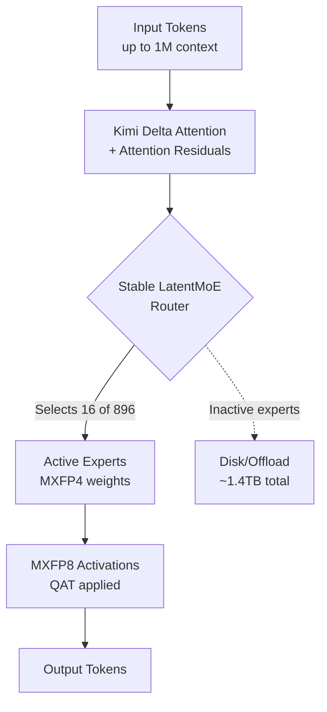

Whenever a new model arrives, the first thing that catches our eye is a single table. Looking at benchmark scores lined up side by side, we quickly conclude "this model is better than that one." Yet in July 2026, the moment Moonshot AI released Kimi K3, the largest open-weight model in history, a controversy emerged that puts the brakes on this habit. The scores are clearly top-tier, but suspicion that it might be "overfitted to the benchmarks" followed immediately.

This article first lays out the confirmed facts about what Kimi K3 is, then moves on to how we should read its dazzling scoreboard, and finally to what operators need to verify before putting this model into an actual product. For an infrastructure company like ThakiCloud, which serves and operates models across multiple customer environments, this question is not an academic curiosity but the adoption decision itself. If we trust a single score line and deploy a 2.8 trillion parameter model on-premises, only to find it falls short of expectations in real work, the cost lands squarely on us and our customers.

## What Is Kimi K3

Kimi K3 is a large-scale Mixture-of-Experts (MoE) model released by Moonshot AI on July 16, 2026. Its total parameter count is 2.8 trillion, making it the first open-weight model to enter the 3-trillion-parameter class. However, this 2.8 trillion is the total size, and in actual inference it uses a sparse structure that activates only 16 out of 896 experts, so not all parameters run for every token. Missing this point easily leads to the misconception that "the full 2.8 trillion runs at once."

The architecture incorporates several new elements. Moonshot calls this the Stable LatentMoE framework, and explains that it supports a 1 million token context through Kimi Delta Attention (KDA) and Attention Residuals (AttnRes). On top of this, components such as Quantile Balancing for expert allocation, Per-Head Muon optimization, SiTU activation, and Gated MLA have been added. The company claims these improvements led to roughly a 2.5x scaling efficiency gain over the previous K2. Since this figure is the announcer's own claim, it is safer to read it as a reference value until third-party reproduction emerges.

From a serving standpoint, the most practically significant part is quantization. K3 handles weights in MXFP4 and activations in MXFP8, and applied quantization-aware training (QAT) starting from the supervised fine-tuning (SFT) stage. As a result, the weight storage capacity for the entire 2.8 trillion parameter model has been reduced to about 1.4TB, roughly a quarter of the approximately 5.6TB that FP16 weights would have required. Still, 1.4TB remains a large number. The full weights are scheduled to be released on July 27 under a modified MIT license.

Below is a simplified diagram of K3's inference path.

## What the Benchmarks Say

Looking at the scores alone, Kimi K3 is certainly impressive. At release, K3 recorded 93.5% on GPQA Diamond, the highest result among open-weight models publicly available at the time. It scored 88.3% on Terminal-Bench 2.1, and topped SWE Marathon and Program Bench, which measure sustained coding sessions, as well as BrowseComp and OmniDocBench. This suggests it is particularly strong in long-horizon agent tasks and coding.

However, it is not first place across every metric. K3 trailed Anthropic's Fable 5 on FrontierSWE and HLE-Full, and is assessed as roughly third place, behind Fable 5 and GPT-5.6 Sol, on demanding composite agent-and-coding evaluations. This is summarized below.

| Benchmark | Kimi K3 Standing | Notes |
|---|---|---|
| GPQA Diamond | 93.5% | Best among open-weight models at release |
| Terminal-Bench 2.1 | 88.3% | Terminal agent tasks |
| SWE Marathon / Program Bench | Leading | Strength in long coding sessions |
| BrowseComp / OmniDocBench | Leading | Browsing and document understanding |
| FrontierSWE / HLE-Full | Trails Fable 5 | Gap at the highest difficulty level |
| Composite agent/coding | Around 3rd place | Behind Fable 5 and GPT-5.6 Sol |

The market reacted sharply to the announcement. Several outlets covered the immediate aftermath of the K3 release by comparing it to the earlier DeepSeek shock, reporting that a massive Chinese-origin open model put pressure on U.S. semiconductor-related stocks. In other words, this model was not an event confined to technical documentation, but one to which the capital markets responded.

## But Can We Trust the Benchmarks

This is where the core argument of this article begins. The fact that a score is high and the fact that this score is reproduced in our own work are two different things. Immediately after K3's release, opinions circulated on X suggesting "Moonshot may have overfit to the benchmarks." Vercel's Guillermo Rauch remarked, based on internal evaluation, that K3 ranked at the top on cybersecurity tasks and showed "raw IQ beyond the surface scores," which is intriguing precisely because it relies on a proprietary evaluation rather than a public benchmark. This is a signal that public leaderboard scores and private evaluation results can diverge.

Similar criticism came from the security and evaluation industry as well. One outlet pointed out that the Kimi K3 case exposes the limits of AI benchmark leaderboards. Leaderboard scores easily induce optimization toward a specific test set, and if distributions similar to the benchmarks are mixed into the training data, the score can be inflated beyond the model's true generalization ability. Developer Simon Willison noted that shaking a model with non-standard tasks, such as "draw a pelican," rather than widely used standard benchmarks, remains a valid approach, a point that reiterates the value of held-out evaluation in a situation where public benchmarks are easily contaminated.

Suspicion of overfitting does not necessarily mean cheating. A massive model may genuinely be strong at a particular capability. The point is different. Public scores alone do not let us distinguish whether this is true generalization or a result polished to fit the leaderboard. And this distinction turns into a cost the moment the model is put into an actual product.

## What Operators Need to Verify

Therefore, the adoption decision must come not from the leaderboard, but from held-out evaluation in our own hands. In practice, we recommend the following sequence.

First, prepare a private evaluation set made up of actual tasks from our own domain. It should be drawn from customer data that was presumably not exposed during training, and we must own both the correct answers and the grading criteria. Public benchmarks are merely a reference ceiling.

Second, run candidate models side by side on the same harness. Unless conditions such as prompts, tools, token budget, and temperature are standardized, we cannot tell whether a score difference comes from a difference in model capability or a difference in setup. The leaderboard pitfall that BankInfoSecurity pointed out ultimately stems from mismatched conditions.

Third, look at consistency over long sessions rather than single-shot accuracy. The fact that K3 was strong on SWE Marathon is a useful hint, but whether that holds up over a 20-step task in our own workflow must be verified separately.

Fourth, record failure modes. There are reports that K3 tends to act immediately rather than asking clarifying questions in ambiguous situations, a habit that can lead to silent failures in automated pipelines. This does not show up in accuracy tables, but it can be fatal in operations.

## Implications for ThakiCloud's Products

This discussion directly touches both of ThakiCloud's products.

First, from the ai-platform perspective. Serving 1.4TB of MXFP4 weights on-premises means GPU memory, interconnect, and expert offload strategies all need to be designed together. ThakiCloud's ai-platform provides the foundation for putting such massive open models into customer environments through K8s and Kueue-based GPU scheduling, vLLM-family serving, and multi-tenant isolation. For customers for whom external APIs are simply not an option in the first place, whether due to National Intelligence Service requirements or data sovereignty, the option of running a 2.8 trillion parameter open model on their own infrastructure carries significant value in itself. That said, as emphasized above, which model to serve must be decided by domain evaluation on the customer's side, not by the leaderboard.

Next, from the Paxis perspective. Paxis is the Agent-Native Cloud control plane running on top of ai-platform, treating Skills, Tools, Policies, and Audit Logs as first-class resources. The theme of this article, model adoption verification, is precisely the problem that Paxis's policy gates and audit logs are designed to target. Before attaching a new model to an agent workflow, enforcing via policy whether it has passed held-out evaluation, and leaving an audit log of which model made which decision in actual operation, can suppress the impulse to "trust it because the score is high" at the system level. Moving the benchmark-trust problem from human discipline to a platform gate is exactly the value Paxis provides.

## Limitations and Counterarguments

This article is not intended to disparage K3. The fact alone that a 3-trillion-parameter-class open-weight model has emerged, and that it has reached the top tier on several capability metrics, is itself a major advance. The suspicion of overfitting is still circumstantial, and it may largely resolve once the full weights are released on July 27 and independent reproduction evaluations accumulate.

The opposite argument also deserves respect. The counterargument that "if we wait for perfect verification, we will never adopt any model" is realistic. So the conclusion of this article is not "do not trust it," but "do not use the leaderboard as the basis for the adoption decision." Use public scores as a filter for narrowing candidates, and make the final judgment based on held-out evaluation and operational observation in our own domain. As massive open models pour out at intervals of just a few weeks, without this discipline we will find ourselves dragged around by whatever scoreboard happened to appear most recently.

## Sources

- [Moonshot AI Releases Kimi K3: A 2.8 Trillion Parameter Open MoE Model With Kimi Delta Attention and 1M Context - MarkTechPost](https://www.marktechpost.com/2026/07/16/moonshot-ai-releases-kimi-k3-a-2-8-trillion-parameter-open-moe-model-with-kimi-delta-attention-and-1m-context/)
- [Kimi K3 Model Overview: 2.8T Parameters, MXFP4 Quantization - Hugging Face](https://huggingface.co/blog/ResterChed/kimi-k3-model-overview-mxfp4-quantization-open-wei)
- [China's 2.8-trillion-parameter Kimi K3 - Tom's Hardware](https://www.tomshardware.com/tech-industry/artificial-intelligence/moonshot-releases-2-8-trillion-parameter-kimi-k3)
- [Kimi K3 Highlights Limits of AI Benchmark Leaderboards - BankInfoSecurity](https://www.bankinfosecurity.com/kimi-k3-highlights-limits-ai-benchmark-leaderboards-a-32264)
- [Kimi K3, and what we can still learn from the pelican benchmark - Simon Willison](https://simonwillison.net/2026/Jul/16/kimi-k3/)
- [Guillermo Rauch on internal evals (X)](https://x.com/rauchg/status/2078647648307880209)
