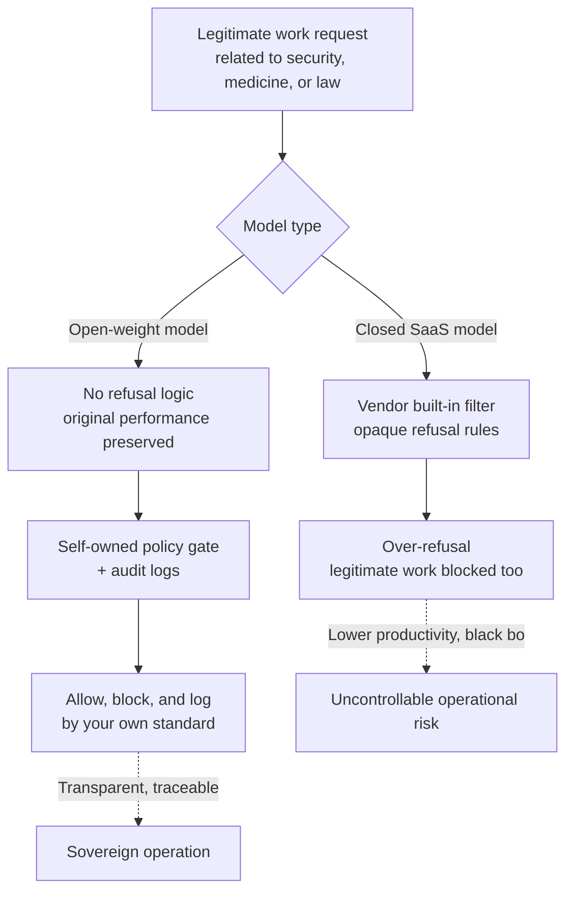

Most security practitioners have had this experience at least once: you paste a penetration-testing script into a chatbot to get it reviewed, and all you get back is "I can't help with this request." Even though the work is a legitimate defensive effort to find and fix a vulnerability, the model shuts the door the moment it hears "cybersecurity." In July 2026, the release of Kimi K3, a new model from the open-weight camp, put this exact issue back at the center of debate. One investor claimed K3 fixed several security bugs that closed coding tools had refused to touch because of their "cyber guardrails." That specific claim is unverified, but the question underneath it is real: **who should hold the power to decide what a model refuses?**

This piece works through that question using Kimi K3 as a concrete case. We start with the phenomenon of over-refusal, lay out the confirmed facts about the design choice that put K3 at the center of this debate, then move to what open weights actually hand off to operators, and finally to how a company like ThakiCloud, serving models across many customer environments, should handle that burden. The conclusion up front: a model without guardrails doesn't eliminate the problem. It **hands the problem to you.**

## What Over-Refusal Is

Over-refusal happens when a model, in trying to block dangerous requests, also blocks legitimate ones along with them. Safety filters are inherently imprecise. "Write code that exploits this vulnerability in our system" (an attack) and "I want to reproduce this vulnerability in our system to verify a patch" (a defense) share almost identical surface vocabulary. When a filter can't tell the two apart, it errs on the safe side and refuses both.

The problem is that this refusal carries real operational cost. Legitimate work that necessarily involves sensitive vocabulary, a security team's vulnerability analysis, a hospital's clinical decision support, a law firm's case review, gets caught in the filter more often than not. On top of that, the refusal logic in closed SaaS models is usually opaque. Why a request was refused, which rule it tripped, how to phrase it to pass, none of that is documented; it just lives somewhere inside the vendor's servers. Operators end up entrusting their workflow to a black box they cannot control.

There's another layer on top of this. Some closed services, when they detect a sensitive topic, quietly reroute the query to a smaller or more constrained model. The user thinks they're calling the same named model, but they're actually getting a downgraded response. That breaks performance consistency, and because it happens invisibly, it erodes both reproducibility and trust at the same time.

## The Debate Kimi K3 Started

Kimi K3 is a large-scale Mixture-of-Experts model that Moonshot AI released on July 16, 2026. At 2.8 trillion total parameters, it's the first open-weight model to cross the 3-trillion-parameter class, and it supports a one-million-token context window along with native multimodality. The full weights are scheduled for release on July 27; we covered the architecture and the benchmark-trust issues that matter for adoption in more depth in [a separate post](https://thakicloud.com/tech-blog/en/llmops/kimi-k3-benchmark-trust-overfit/).

This piece focuses elsewhere. What multiple outlets flagged as K3's defining feature is that it ships with no content filtering and no query routing. As it's been put, "the model you call is the model you get." It doesn't quietly downgrade performance or hand you off to a different model when it detects a sensitive topic. For researchers, that means consistent performance even on work adjacent to medicine, law, and security.

What actually lit the fuse was a social-media claim that K3 fixed security bugs that closed tools had refused to touch. Specific numbers were even cited, but since no third party has verified them, it's more honest to treat that figure as [an estimate]. Whether the claim is accurate or overstated, though, the reason it caught on is clear: plenty of practitioners have genuinely been refused on legitimate security work, and "a model with no filter" struck a nerve.

On raw capability, K3 is rated as being close to the top closed models. Moonshot's own coding-agent benchmark numbers are shown below. These are all vendor-reported figures, offered here as reference pending third-party reproduction.

Judging by the scores alone, K3 has the capability to stand in for closed tools. The issue isn't capability. It's the responsibility that comes attached to that capability.

## What Open Weights Transfer: Ownership of the Refusal Power

There's a point that's easy to get wrong here, and it's worth stating plainly. A model with no filter doesn't eliminate the safety problem. It transfers the **power and the responsibility to judge safety** from the vendor to you. If you didn't like a closed model's refusal rules, going open-weight means you now have to write those rules yourself. If you don't, you're operating with no rules at all.

That shift cuts both ways. On the upside, you can set a policy tuned precisely to your domain and your regulatory environment. A security company could allow defensive vulnerability analysis while blocking clearly offensive exploit generation, applying a far more nuanced standard than a vendor's blunt filter ever could. On the downside, the entire job of building, maintaining, and auditing that policy is now yours. If you do nothing, K3 executes exactly what it's asked, no questions attached.

The diagram below compares the two paths for where refusal power sits.

The key point is that the right-hand path doesn't complete itself. The boxes labeled "self-owned policy gate" and "audit logs" only exist once you build them in. Without that, adopting an open-weight model just swaps a vendor's opaque filter for no filter at all.

## Implications for ThakiCloud's Products

This is exactly the problem ThakiCloud addresses head-on with two products.

**The ai-platform lens: sovereign on-prem serving.** To actually take advantage of a filterless open-weight model, you need to keep that model under your own control. If you call K3 through a vendor API, that API provider can layer its own filter back on top, erasing the benefit of "no filter" in the first place. ThakiCloud's ai-platform serves models on-prem, in a sovereign environment, on top of K8s and Kueue-based GPU scheduling. A model at the 2.8-trillion-parameter class exceeds 1TB of weights even after quantization, which makes multi-GPU distributed serving mandatory, and multi-tenant serving and resource isolation for models at that scale is precisely our territory. For security, public-sector, and healthcare customers barred by regulation from letting data leave the country, the fact that a model runs inside our own cluster becomes a precondition for adoption in the first place.

**The Paxis lens: putting refusal power in your hands.** As laid out above, the real challenge of open weights is owning the question of who refuses what. Paxis is ThakiCloud's Agent-Native Cloud control plane, and it treats Policies and Audit Logs as first-class resources. Every action the model takes runs inside an isolated sandbox and passes through a policy gate, and the record of what passed and what was blocked is captured in the audit log. Instead of an opaque filter hidden behind a vendor's servers, you get a transparent policy layer that you define, inspect, and revise yourself. A security team can write rules that allow defensive work; a clinical team can write rules fit for medical context; and both can trace back through the log exactly why something was blocked and what it was.

The two lenses connect into one story. ai-platform runs the filterless model fully inside your own infrastructure, and Paxis lays your own policy and audit layer on top of it. The result is a middle ground you can actually tune yourself, between the two extremes of "vendor over-refusal" and "no control at all."

## Limitations and Counterarguments

There's no reason to romanticize a model without filters. A few counterarguments are worth stating plainly.

First, the absence of guardrails is genuinely risky. It's true that vendor filters are frustrating when they over-refuse, but it's also true that those same filters have blocked plainly harmful requests. Strip the filter out, and that line of defense goes with it. An organization that serves an open-weight model without a self-owned policy gate in place risks trading over-refusal for something worse: under-refusal.

Second, adoption decisions shouldn't rest on unverified claims. The story that "K3 fixed a bug closed models refused to touch" is interesting, but there's no third-party reproduction behind it. Whether one model genuinely outperforms another on a given task is something you can only know by running a held-out evaluation on your own real data. Social-media anecdotes are a starting point for a hypothesis, not a basis for adoption.

Third, transferring responsibility also means transferring legal and ethical liability. In the era of relying on a vendor's filter, there was at least room to say "the model should have blocked that" when something went wrong. The moment you own your own policy, you also own the consequences of whatever that policy misses. Without governance and an audit system capable of carrying that weight, the freedom that comes with open weights isn't an asset. It's a liability.

To put it plainly, the real message Kimi K3 sends isn't "a filterless model is better." It's that refusal power is shifting from vendors to operators, and open weights become a genuine advantage only for organizations ready to shoulder that power. Being ready means having on-prem serving capability and a transparent policy-and-audit layer, and that readiness is exactly what ThakiCloud delivers as a product.

## Sources

- [Moonshot AI Launches Kimi K3 | Constellation Research](https://www.constellationr.com/insights/news/moonshot-ai-launches-kimi-k3)
- [China's Moonshot AI releases Kimi K3, the largest open-source model ever | VentureBeat](https://venturebeat.com/technology/chinas-moonshot-ai-releases-kimi-k3-the-largest-open-source-model-ever-rivaling-top-u-s-systems)
- [Kimi K3 vs DeepSeek V4 Pro vs GLM-5.2 | MarkTechPost](https://www.marktechpost.com/2026/07/18/kimi-k3-vs-deepseek-v4-pro-vs-glm-5-2-open-trillion-scale-moe-models-compared-on-benchmarks-license-and-serving-cost/)
- [Chinese AI has leveled up | CNBC](https://www.cnbc.com/2026/07/17/moonshot-ai-kimi-k3-model-openai-anthropic-china.html)
