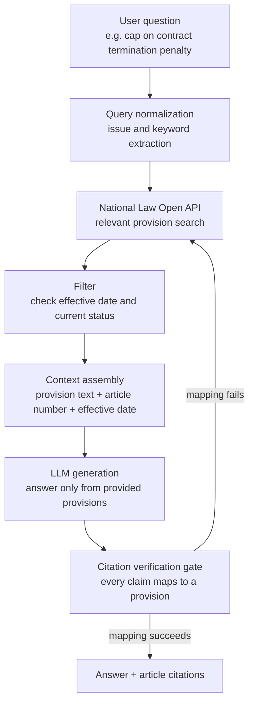

## Why read this

This is written for engineers who want to wire an LLM to legal or regulatory questions, and for infrastructure owners who have to answer for answer quality in high-stakes domains. The conclusion first: when an LLM invents statutes in a legal query, you do not fix it by swapping in a bigger model. You fix it with a grounded (RAG) design that binds the answer to verified statute text. Connect Korea's National Law Information Open API as the source of record, and the model cites real article numbers and effective dates instead of making them up.

## Overview

A tip made the rounds on social timelines: if you want legal help from ChatGPT or Claude but worry it will fabricate statutes, feed it domestic legal data. The worry is well founded. In the United States, a lawsuit was filed against OpenAI for allowing ChatGPT to provide legal advice without a licensed professional involved, and experts warn that simply discussing legal matters with a chatbot can be risky. The model is optimized to complete text plausibly, and it cannot, on its own, stop itself from writing a nonexistent provision as if it were real.

Yet the same market sends the opposite signal too. In South Korea, Claude overtook ChatGPT in the paid generative AI market for the first time, and the legal startup Law&Company reported that its Claude-powered AI legal assistant, SuperLawyer, reached 6,000 lawyers, about 20% of the country's practicing lawyers, within 180 days of launch. When the same technology is called dangerous by one side and landed in daily practice by the other, the difference is not the model but the design that handles the answer. This post takes that design apart, the grounded pipeline that binds an LLM's legal answer to verified source text, using the National Law Open API as the example.

## What this technique is

The core idea is simple. Instead of asking the model "do you know what the law says," you tell it to "first retrieve the relevant provisions, then answer using only that source text." Retrieval supplies the raw material for the answer, generation happens only within that material, and every claim carries a citation in the form of an article number and effective date. The blanks the model used to fill with imagination get replaced by verified text.

Here the trustworthiness of the material decides everything. A statute summary scraped from any web page might be a pre-amendment provision or of unknown origin. So the source of record must be the authoritative original. Korea's National Law Information Open API provides current statute text, article numbers, effective dates, revision history, and the responsible agency in structured form. It even lets you query the statutes that were in force on a given date, so you can cite "the provision valid now" separately from "the provision valid then." In legal queries, distinguishing the effective date is not a minor detail; it is the axis that separates a correct answer from a wrong one.

The full flow, laid out vertically:



The difference from a plain approach is the verification gate. Simple RAG stops at pasting retrieved documents into the prompt and taking the answer. In a high-stakes domain you add one more step. Code checks whether every legal claim in the generated answer maps to a provision that was actually retrieved, and if even one claim fails to map, that answer is never sent to the user. This gate is the last line that filters out sentences the model invented outside its evidence.

## Setup and integration

The first step in attaching the source of record is issuing an API key. You register at the National Law Information portal (open.law.go.kr) and receive an authentication key. Provision search and full-text lookup then happen over URL-based calls, and the official guide provides examples in several languages, including Python and Node.js.

Below is a minimal pattern that searches current statutes by an issue keyword and assembles only that source text as context. Treat the portal's usage guide as the reference for the actual response schema and parameters.

```python
import requests

LAW_API = "https://www.law.go.kr/DRF/lawSearch.do"

def search_statutes(keyword: str, oc_key: str) -> list[dict]:
    """Search current statutes via the National Law Open API. Return provisions as the source of record."""
    params = {
        "OC": oc_key,          # issued authentication key
        "target": "law",       # statute search
        "type": "JSON",
        "query": keyword,
        "display": 5,
    }
    resp = requests.get(LAW_API, params=params, timeout=10)
    resp.raise_for_status()
    return resp.json().get("LawSearch", {}).get("law", [])

def build_context(hits: list[dict]) -> str:
    """Assemble retrieved provisions into citable context, carrying effective date and agency to make the basis explicit."""
    lines = []
    for h in hits:
        lines.append(
            f"[{h.get('법령명한글')}] "
            f"effective {h.get('시행일자')}, agency {h.get('소관부처명')}\n"
            f"{h.get('법령상세링크')}"
        )
    return "\n\n".join(lines)
```

When you load this context into the prompt, make the instruction explicit: "Answer only from the provisions provided below, do not cite provisions that were not provided, and if there is no relevant provision, say so." The instruction that makes the model say "there is none" when the basis is missing is the core of stopping hallucination. It makes the model leave the blank honestly rather than filling it in.

Finally, you own the verification gate in code. You extract the article numbers cited in the generated answer and compare them against the list of provisions actually loaded into the context. If it cites an article not in the list, that answer goes back into the retrieval loop. This judgment has to come from deterministic code, not the model's self-report, for it to be trustworthy.

## What grounded design changes

We did not run our own benchmark to produce new numbers. Instead, an already published operational metric shows the effect of grounded design. Law&Company's SuperLawyer runs on Claude but is designed to bind answers to case law and statutes, and according to the customer case Anthropic published, it reached 6,000 lawyers (about 20% of the country's practicing lawyers) within 180 days of launch, with a 60.2% free-to-paid conversion rate, a 79.1% second-month retention rate, and 2.3 million cumulative hours saved in the first 180 days. That a tool professionals verify every day sustains this kind of retention reads as a signal that the answers were not merely plausible but actually trustworthy.

On the other side is the cost of letting the law be answered without grounding. The OpenAI lawsuit in the United States and the warning not to discuss legal matters with a chatbot show that ungrounded legal answers can escalate into questions of legal liability. Even with the same model, binding it to source text or not splits the outcome this sharply. The lesson the metrics teach is clear: in a high-stakes domain, the lever that lifts quality is not model tier but grounding design.

## What this means for ThakiCloud's products

This pattern fits naturally into ThakiCloud's two products.

From the Paxis angle, grounded legal answering is a typical workload for an Agent-Native Cloud. Paxis treats Skills, Tools, Policies, and Audit Logs as first-class resources. Statute search is a Tool that runs in an isolated sandbox, the citation verification gate is a Policy that an answer must pass before it leaves, and which provisions grounded which answer is left in the Audit Log. In a domain where accountability matters, like law, you have to be able to trace after the fact why an answer came out the way it did, and policy gates plus audit logs provide that traceability by default. If you bundle the grounding gate that forces a citation on every claim into a reusable skill, you can carry it over as-is to other high-stakes domains that need source citations, such as medicine, finance, and regulatory compliance.

There is an ai-platform angle too. Data such as statutes and case law can be sensitive to send out over an external API at all, and public and regulatory bodies often demand data sovereignty and on-prem serving. ThakiCloud's ai-platform serves models multi-tenant on K8s and Kueue-based GPU scheduling, and is designed to operate the source of record and the model together on your own infrastructure. Keep the legal data in-house and run both retrieval and generation on top of it, and you preserve grounded accuracy and data sovereignty at once. Low serving cost is the precondition that lets you run such a domain-specific pipeline continuously.

## Limits and counterarguments

Grounded design is not a cure-all. First, if the source of record is not current, the answer is wrong too. Even if the National Law data reflects amendments immediately, an old snapshot cached by the pipeline can cite a repealed provision. Effective-date filters and regular synchronization have to back it up. Second, citing a provision accurately does not guarantee the interpretation is correct. The essence of legal advice is not statute search but application to the facts, and that judgment still belongs to a qualified professional. This pipeline should be seen as an aid that builds a draft on top of the evidence, not a replacement for the expert. Third, if the verification gate only checks citation mapping, it can pass an answer that cites the provision correctly but reasons wrongly. The gate holds the floor on hallucination; it does not guarantee the quality of the argument.

## Wrapping up

When an LLM produces fabricated statutes on a legal question, the problem is not the model's limit but a gap in the design. Bind the answer to verified source text, make it say "there is none" when there is no basis, and own in code a gate that forces a citation on every claim, and the same model delivers an entirely different level of trust. That is exactly where the gap lies between a Claude-powered legal tool landing in practice in Korea and an ungrounded chatbot consultation escalating into a lawsuit. The next move is clear. If you are attaching an LLM to a high-stakes domain, connect an authoritative source of record like the National Law Open API before you go looking for a bigger model, and stand up a citation verification gate first. The lever is always on the side of the evidence.

## Sources

- [National Law Information Open API portal](https://open.law.go.kr/LSO/openApi/guideList.do)
- [National Law Information sharing service (Public Data Portal)](https://www.data.go.kr/data/15000115/openapi.do)
- [Anthropic customer story: Law&Company](https://www.anthropic.com/customers/law-and-company)
- [KED Global: Claude overtakes ChatGPT in South Korea's paid generative AI market](https://www.kedglobal.com/artificial-intelligence/newsView/ked202604270002)
- [Forbes: Lawsuit against OpenAI over legal advice](https://www.forbes.com/sites/lanceeliot/2026/03/09/landmark-lawsuit-against-openai-for-allowing-chatgpt-to-provide-legal-advice-could-be-a-huge-game-changer-for-all-ai-makers/)
