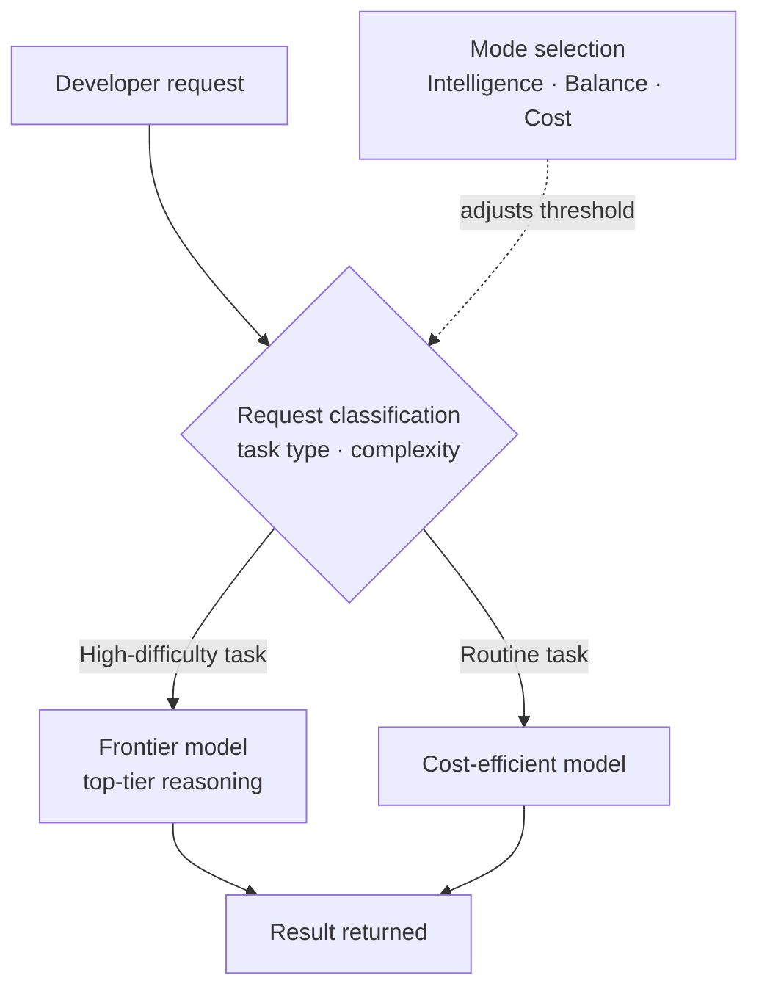

If your team runs a multi-model AI coding setup and keeps getting surprised by the monthly inference bill, this is for you. The conclusion up front: routing that classifies each request and assigns exactly as much intelligence as it needs is a practical lever that cuts cost by 30 to 60 percent while holding quality nearly steady. Cursor Router, which Cursor released in July 2026, proved this at scale with real usage data. And the same principle is a pattern ThakiCloud already runs every day inside its own agent stack.

*An illustration of routing that assigns exactly as much intelligence as each request needs.*

## Why read this

This is written for platform owners who serve multiple LLMs together or have rolled out AI coding tools across a team, and for engineers who need to cut inference cost without giving up quality. There is one core takeaway: sending every request to the most expensive frontier model is wasteful in most cases, and classifying each request's difficulty first, then routing it to the right model, cuts cost substantially without losing quality. Cursor Router validated this claim on more than 600,000 real requests. We will break down how it works, then set it side by side with how ThakiCloud implements routing.

## Overview

For the past two years, the LLM performance race has largely played out along one axis: bigger model, better model. But once you actually run several models side by side in production, one fact becomes obvious fast. Roughly 90 percent of requests do not need the top model. Calling a top-tier reasoning model to rename a variable or fill in a short function is like chartering a cargo jet to mail a single letter.

This is where routing enters as a new axis. When a request comes in, the system first judges how hard it is, then sends the hard ones to a frontier model and the easy ones to a cheaper model. The judging step itself is handled by a small, fast model, so the overhead stays low. Cursor turned this approach into a product called Cursor Router, and says it delivers frontier-grade quality at 60 percent lower cost.

What stands out is that this is not just a cost-cutting feature. In its announcement, Cursor argued that over the long run a router will push frontier capability itself past what any single model can reach on its own. The view is that combining the strengths of multiple models on a per-request basis can produce results that no single model could deliver alone.

## What this technology is

Cursor Router is a routing layer that analyzes the task type and complexity of every incoming coding request and sends it to the most effective model. If the work demands it, it calls a frontier model; otherwise it hands the request to a more cost-efficient model.

Here is the overall flow.

The dial users can turn is three modes: Intelligence, Balance, and Cost. These decide where you stand on the Pareto frontier between cost and intelligence. Intelligence mode pushes the routing threshold toward quality, Cost mode pushes it toward price, and Balance sits in between. The same router is designed to behave differently depending on an organization's priorities.

The router's classification ability comes from data. Cursor says it trained the router on more than 600,000 real-world requests and further validated it on millions more. It learned which requests actually need a frontier model and which do not from real developers' coding behavior, not synthetic data. This is the crux of routing quality. Get the difficulty call wrong, and you either waste an expensive model on an easy request or dump a hard request onto a cheap model and degrade the output.

## Reported results

The numbers Cursor published come in two flavors. One is an aggregate figure: the router delivers frontier-grade quality at 60 percent lower cost. The other is real account data from the early access phase. Three large accounts, each with thousands of users, compared routing everything to Opus 4.8 against Auto routing, and cut costs by 30 to 50 percent with no drop in quality.

These figures are Cursor's own numbers about its own product, not an independently verified benchmark. Still, the scale of training on 600,000 requests and validating on millions, combined with a real-usage comparison across three large accounts, is more credible than a single marketing anecdote. The core message is clear: 30 to 50 percent of cost disappeared through routing alone, while quality held.

The rollout also reflects operational reality. Cursor Router ships on the Teams and Enterprise plans, with controls that let admins allow or block specific models, set defaults, and turn off the optimization mode. Treating routing as a policy an organization can control, rather than a black-box automation feature, gives this an operational point of view.

## Implications for ThakiCloud's products

Routing is not a new concept for us. Paxis, ThakiCloud's Agent-Native Cloud, already runs per-request routing at two layers.

The first is skill routing. Paxis's Skill Harness selects among more than 960 skills using BM25 search. Instead of loading every skill on every request, it matches the request's vocabulary against skill descriptions and runs only the handful most relevant ones in an isolated sandbox. Where Cursor Router routes a request to a model, Paxis routes a request to a skill. Both address the same problem: the waste of always calling everything.

The second is model-tier routing. When we spin up a subagent, we assign a model tier based on the nature of the task. Exploration work like reading files and searching goes to a cheap model, writing and reviewing code goes to a mid-tier model, and architectural decisions and complex multi-step reasoning go to the top tier. The orchestration layer runs on a low-cost model, and an expensive model is called for a single shot only at the step that needs heavy reasoning. It is exactly the same idea as Cursor's Intelligence, Balance, and Cost modes choosing a position on the Pareto frontier.

Take this one step further and you get retrospective-driven escalation. Paxis's scheduled skills start out on a cheap model by default, and if a particular skill repeatedly underperforms, only that skill gets automatically escalated to a higher tier. Routing is not fixed statically; it keeps adjusting based on failure data. Just as Cursor Router learned its classification ability from 600,000 real requests, we learn our routing policy from operational retrospectives.

There is also an infrastructure angle. ThakiCloud's ai-platform serves models to multiple customer environments on top of K8s and Kueue GPU scheduling. Routing that cuts inference cost by 30 to 50 percent means the same GPU budget can handle more requests, or serve them at a lower unit cost. Low-cost serving (ai-platform) is what makes agent economics (Paxis) work. Only routing that conserves frontier-model usage makes it economically viable to run agent workloads continuously at scale.

## Limits and counterarguments

Routing is not a cure-all. It has a few clear weaknesses.

First, the difficulty classifier itself can be wrong. Because it judges a request's difficulty from surface signals, it risks misrouting something that looks short but actually needs subtle reasoning to a cheap model. A misclassification translates directly into a quality drop, and this failure only shows up after the user has seen the result. Cursor's emphasis on "no quality loss" is aimed precisely at this concern.

Second, a router adds one more layer of indirection. If you cannot trace which request went to which model, it becomes hard to pin down the cause when a result looks off. Observability has to come with routing. Without a layer that logs which request went to which model and why, debugging becomes impossible.

Third, there is a vendor lock-in concern. Cursor Router's routing logic and training data are closed assets. Hand routing over to a specific product, and it becomes hard to control how its classification criteria change. For an organization running its own infrastructure, owning the routing policy is safer in the long run. This is also why ThakiCloud treats routing as a deterministic policy owned by code.

## Wrap-up

Cursor Router showed at real-world scale that the path to holding down cost and quality together is not "a better single model" but "the right model for each request." Training on 600,000 requests, cost cuts of 30 to 50 percent, and lossless validation across three large accounts together suggest routing is a new axis of frontier performance. This confirms the conclusion this article opened with: sending every request to the top model is wasteful, and difficulty-based routing eliminates that waste.

If you are applying this in practice right away, we recommend covering three things: put a classification layer in place that sorts requests by difficulty, attach observability that logs which request went to which model, and own your routing policy rather than leaving it to a vendor. ThakiCloud already runs all three through skill routing, model-tier routing, and retrospective-driven escalation. Routing is not primarily a cost-cutting feature; it is a precondition for running agents at scale.

## Sources

- [Introducing Cursor Router (Cursor Blog)](https://cursor.com/blog/router)
- [Cursor Router Changelog (Cursor)](https://cursor.com/changelog/router)
- [Official Cursor Announcement (X)](https://x.com/cursor_ai/status/2079993729532989500)
