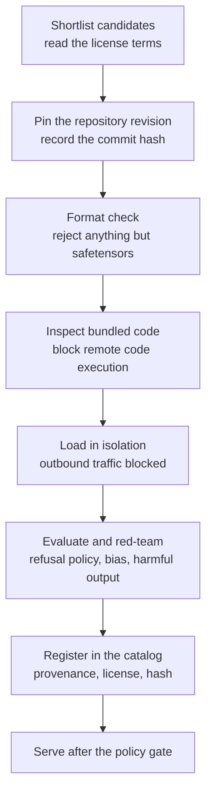

*A depiction of the idea that safety is decided by the intake procedure wrapped around the weights rather than by the weights themselves.*

## Why This Is Worth Reading

This piece is written for the MLOps engineers and platform operators who have to decide whether to bring an open-weight model into an on-premises or sovereign environment, and for the security staff who have to approve that decision. If you want to answer the question "can we use a Chinese model" with a procedure rather than a political impression, this is for you.

Let me give you the conclusion first. The common belief that a backdoor is planted inside the weight files rests on weak technical ground. On that point Jensen Huang is mostly right. But this does not mean there is no risk, it means the risk lives elsewhere. The real attack surface is not the numbers in the weights but the loader format wrapping them, the Python code shipped alongside them in the repository, and the network boundary of the runtime. So the decision to adopt should turn on the intake procedure, not on the model's nationality.

## What Happened

On July 22, 2026, NVIDIA CEO Jensen Huang made an unusually blunt set of remarks about Chinese open-source models. As reported across several outlets, the substance was this.

His first claim was that American companies should be allowed to use Chinese AI models. He said the notion that there are backdoors connected to China in some way is a misconception, explaining that you download the models, fine-tune them, and guardrail them any way you want. He added that the Chinese open-source models are excellent, and pointed out that just as the market misread the impact of DeepSeek the first time, it is misreading the impact of Kimi this time.

His second claim inverted the usual security logic. Because outside researchers can inspect an open model and expose its weaknesses, he argued, openness makes it safer rather than less safe. If everything converges into one single model, he said, you get one single point of attack and one single source of failure, and the world becomes much more vulnerable.

There is a backdrop to these remarks. On the same day, Treasury Secretary Scott Bessent told Fox Business that the administration was examining whether Chinese AI models had been built on stolen American intellectual property, and noted that if theft were confirmed there is authority to sanction. So at the very moment Washington was weighing a block on Chinese models, the CEO of the company standing to benefit most took the opposite position in public.

The model at the center of the discussion, Kimi K3, was released by Moonshot AI on July 16. It is a mixture-of-experts model with 2.8 trillion total parameters, activating 16 of 896 experts, supporting a one-million-token context and multimodal input. The weights were announced for release under a modified MIT license by July 27.

## How Far Does "There Is No Backdoor" Hold

This needs to be split carefully.

The weight file itself is a collection of numeric tensors. The safetensors format is a serialization that stores only tensor names, dtypes, shapes, and byte offsets, and it cannot carry executable code. Reading weights distributed in that format does not by itself execute arbitrary code. To this point the statement is accurate. You cannot put a capability like "phone home to a server" into the parameters.

The problem is everything around them.

First, the format. The older PyTorch pickle-based files can execute arbitrary code during deserialization. This risk has nothing to do with a model's nationality and has been known for years. So refusing any weight file other than safetensors becomes the first line of defense.

Second, the Python code bundled into the repository. New architectures are frequently unsupported by the library proper, so the model repository ships its own modeling code, and using it requires enabling the option that permits remote code execution. The moment that option is on, arbitrary Python files from the repository run inside your inference server process. This is where the real attack surface is. Do not suspect the weights, suspect that flag.

Third, the runtime environment. Even if the model cannot communicate, the container image around it, the inference server, and whatever outbound paths that server leaves open certainly can. Data exfiltration happens at the network boundary, not in the parameters. Put the other way round, in an isolated environment with outbound traffic blocked, that path is structurally closed.

In short, Huang's argument is correct at the first layer and silent about the second and third. And in practice, incidents almost always originate in the second and third.

## The Real Risks That Remain, None of Which Are Backdoors

Supply chain integrity comes first. If you do not pin which revision of which repository you pulled, a model with the same name can quietly become different content over time. Without pinning by commit hash and recording file checksums, you have neither reproducibility nor auditability.

The state of the safety layer comes second. In the open-weight ecosystem, derivatives multiply far faster than originals. During fine-tuning, refusal policies and safety layers often weaken or come off entirely, and those checkpoints then circulate under names similar to the original. This is a far more realistic risk than country of origin. Recent months have brought continuing controversy over distillation, where large volumes of a commercial model's outputs were harvested to train a derivative, and models created that way do not inherit the safety layer the original carried.

Legal and policy exposure comes third. You have to actually read the license terms, and you have to price in the possibility that disputes over intellectual property provenance turn into sanctions. This item cannot be controlled with technology, so the only real hedge is to keep the ability to swap models. A design that does not weld your pipeline to one specific model is itself the policy risk hedge.

## The On-Premises Intake Procedure

Translating the analysis above into an executable sequence:



*Instead of asking about nationality, ask whether these eight steps were cleared.*

At download time, pin the revision and constrain the format. The Hugging Face CLI lets you specify a commit and limit which file patterns you retrieve, so you can prevent pickle-family files from ever arriving.

```bash
hf download <org>/<model> \
  --revision <commit-sha> \
  --include "*.safetensors" "*.json" "tokenizer*" \
  --local-dir /srv/models/<model>
```

After the download, confirm that no pickle-family files slipped in, and record hashes for the file list.

```bash
find /srv/models/<model> -name "*.bin" -o -name "*.pt" -o -name "*.pkl"
sha256sum /srv/models/<model>/*.safetensors > /srv/models/<model>/SHA256SUMS
```

At serving time, the rule is to not enable remote code execution. Either wait until the inference server supports the architecture officially, or, if you truly must, read and review the bundled modeling code yourself and then fork the repository internally so you serve a pinned copy. Flipping that flag out of habit while rushing to stand up a new architecture is the single most common mistake.

```bash
# start without enabling remote code execution
vllm serve /srv/models/<model> \
  --served-model-name <alias> \
  --tensor-parallel-size 8
```

Finally, isolate the runtime. Block outbound traffic from the inference pod by default and allow only the destinations you need, and even if something is wrong somewhere the data cannot leave. On Kubernetes you can fix that boundary in code with a network policy.

## What to Measure After Intake

Intake being complete does not mean validation is complete. Many teams check a standard benchmark score and move on, but a public leaderboard number tells you less than half of what an adoption decision requires. Before attaching an open-weight model to a real service, measure at least four things against your own data.

The first is the shape of the refusal policy. Where a model stops and where it answers, given the same harmful request, varies enormously with fine-tuning history. Running the original and the derivative side by side on the same prompt set reveals how much of the safety layer survives. If the derivative answers far more readily than the original, that may not be better performance, it may be a stripped safety layer.

The second is variance by language and domain. Even models labeled as multilingual often degrade sharply on Korean business documents or domestic regulatory vocabulary. Adopting on the strength of English-language benchmarks and then being disappointed by production traffic is a well-worn path. A small evaluation set built from your own data is far more useful than a public benchmark.

The third is response tendency on politically sensitive topics. A tendency injected during training by a state or a company is not fully covered over by a system prompt. For customer-facing services, that tendency becomes brand risk directly, so sample responses in the relevant area before adoption and add a separate output filter if needed.

The fourth is throughput on your actual hardware. Because large mixture-of-experts models have total and active parameter counts that differ sharply, memory requirements and effective throughput are hard to estimate from published specs alone. Fix a target concurrency and context length, then measure directly on your own GPU configuration before you quote an adoption cost.

## What This Means for ThakiCloud's Products

We approach this problem in two layers.

At the ai-platform layer, we control execution itself. Model serving workloads are isolated per namespace on Kubernetes, outbound traffic is blocked by default through network policy, and vLLM-based serving configuration is standardized so individual teams cannot casually enable remote code execution. Because it was designed for on-premises and sovereign environments, the condition that data does not cross borders is built into the deployment shape. Telling a regulated-industry customer that they may use a given model, Chinese or American, requires that condition to hold first.

At the Paxis layer, we control what gets brought in and what gets executed. Paxis is ThakiCloud's agent-native cloud, and it treats skills, tools, policies, and audit logs as first-class resources. The model catalog stores provenance, license, and revision hash together, which turns the last two steps of the intake procedure above into something the system enforces. The policy gate keeps unvetted checkpoints out of agent execution paths, and audit logs make it possible to trace after the fact which model did what and when. The ability to swap models also comes from here. When you have the option to pick a fitting model per task, a shift in the policy environment does not force you to rebuild the pipeline.

## Limits and Counterarguments

This piece has weaknesses of its own.

Some risks are not caught by procedure. A backdoor planted through training data, which makes a model respond differently only to a specific trigger input, will not be filtered by a file format check. This class is hard to detect completely with current public evaluations, and the checklist offered here does not claim to cover it. That said, this risk is not exclusive to models from any one country. It exists in every checkpoint whose provenance has not been verified.

There is a counterargument in the opposite direction too: the fact that a risk is manageable is no reason to hurry adoption. For some organizations, using only domestic models or vetted commercial models is the more sensible choice on total cost, and if procurement requirements impose an origin constraint the technical safety discussion is moot from the start. This piece is not an encouragement to adopt. Its purpose is to supply the criteria for deciding whether to.

Finally, weigh the speaker's interests. These are the claims of someone positioned to see accelerator demand rise as open-weight models spread, and indeed he said openly that open models benefit the whole industry and that usage growth means more computing demand. An argument being sound and a speaker being neutral are separate matters.

## Wrapping Up

Sorting what to take and what to leave from Huang's remarks: the point that the common belief in a communicating backdoor inside weight files rests on weak ground is worth accepting. The summary that you simply download, fine-tune, and guardrail, on the other hand, oversimplifies what actually has to be checked during intake.

The standard a practitioner should carry away is a single one. Instead of asking about a model's nationality, ask whether it cleared the intake procedure. Did you take only safetensors, did you pin the revision by hash, did you leave remote code execution off, does it run in an environment with outbound traffic blocked, and are provenance and license recorded in the catalog. If you can answer those five, that model is a controllable asset regardless of where it came from. If you cannot, an American model is exactly as dangerous.

## Sources

- Axios, [Exclusive: Nvidia's Jensen Huang defends Chinese AI amid Kimi panic](https://www.axios.com/2026/07/22/nvidia-jensen-huang-china-open-source-ai)
- Fortune, [As Washington panics about Chinese AI, Jensen Huang says open-source models like Kimi are 'excellent' and should be embraced, not banned](https://fortune.com/2026/07/22/jensen-huang-chinese-open-source-ai-models-kimi-deepseek-washington-ban-nvidia-chips-data-centers-security/)
- Cybernews, [Nvidia's Jensen Huang defends China's open-source models](https://cybernews.com/ai-news/nvidia-china-models/)
- Quartz, [Jensen Huang says U.S. firms should use Chinese AI models](https://qz.com/jensen-huang-chinese-open-source-ai-models-072226)
- Moonshot AI, [Kimi K3 Tech Blog: Open Frontier Intelligence](https://www.kimi.com/blog/kimi-k3)
- Interconnects, [Kimi K3: The open-weights escalation](https://www.interconnects.ai/p/kimi-k3-the-open-weights-escalation)
