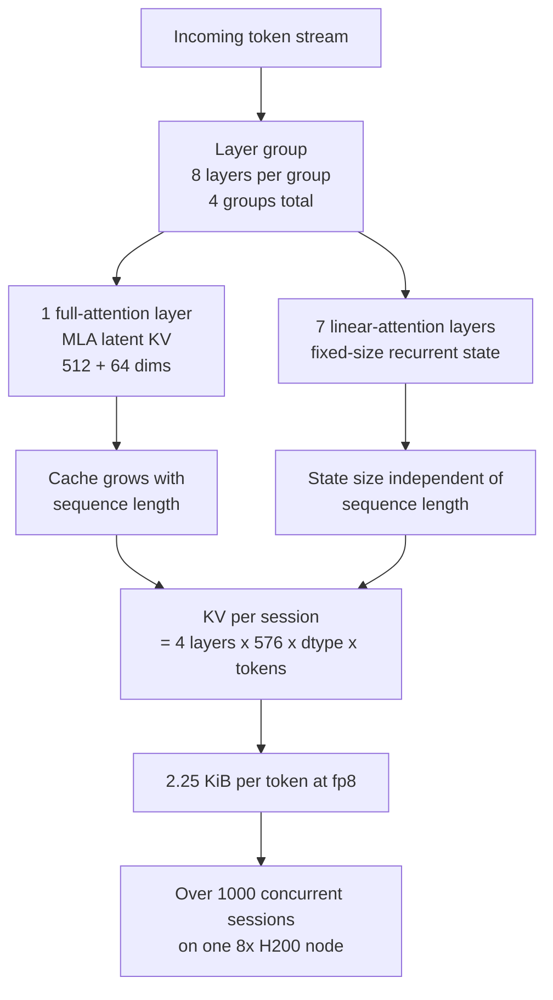

*A visual for the MoE pattern of holding enormous capacity while activating only a sliver of it per token.*

## Why this matters to you

This post is written for the infrastructure engineers who have to decide whether a newly announced open-weight model belongs on the company GPU cluster, and for the platform operators who have to answer how many nodes that will take. The conclusion first: you cannot plan a Ling-3.0-flash deployment today because you cannot download it, but if you measure the released previous generation now, you can schedule it the day the weights open without a fresh review. Along the way that measurement showed something worth knowing on its own. The KV cache formula most capacity plans rely on overstates memory by 113x on this model family.

## Overview

On 23 July, Ant Group's inclusionAI announced Ling-3.0-flash. It is a Mixture-of-Experts model with 124 billion total parameters, of which only 5.1 billion activate for any given token. The announcement claims that with one eighth of the total parameters and one twelfth of the active parameters, it matches or beats the team's own one-trillion-parameter flagship on most of the benchmarks shown. It also claims 256K native context with a path toward one million tokens.

Specifications like that get immediate attention from anyone evaluating on-premise serving. Five billion active parameters means the compute profile of a small model, and for token-hungry agent workloads that changes the cost curve entirely. The SGLang team announced day-0 support work on the day of release, and vLLM posted congratulations. The previous generation, Ling-2.6-flash and Ling-2.6-1T, both received day-0 vLLM support.

Then we tried to actually pull it, and hit a wall. There are no weights.

## What this model actually is

We checked first. Querying the HuggingFace API for every model under the inclusionAI organization, sorted by last modified, returned no repository beginning with Ling-3.0. The most recent entry was Ling-2.6-flash-base from 22 June. Requesting `inclusionAI/Ling-3.0-flash/config.json` returns 401 anonymously and 404 with a valid token. That combination means the repository is not private, it does not exist.

So Ling-3.0-flash shipped through inference-provider integrations first. You can call it free on OpenRouter through 3 August, but there is no model card, no technical report, and no downloadable checkpoint. The announcement and much of the coverage frame this as an open-weight release, yet the only thing you can do right now is call an API. For an on-premise evaluation that distinction is decisive. If keeping data inside your own perimeter was the reason to look at the model, the requirement does not hold in its current state.

We changed approach. We measured Ling-2.6-flash, which the same team published on the same architecture family, and treated the result as preparation for the day Ling-3.0-flash opens. The generations differ, so the numbers do not transfer directly, but the cache structure and the node math carry over intact.

Ling-2.6-flash's config.json shows the family's signature clearly. The model type is `bailing_hybrid`, there are 32 layers, and `layer_group_size` is 8. Eight layers form one group, and within each group exactly one layer runs full attention while the other seven run linear attention. Across all 32 layers, only 4 are full attention. Those four are not conventional either. `kv_lora_rank` is 512 and `qk_rope_head_dim` is 64, which is the MLA pattern of compressing keys and values into a latent representation rather than storing them per head.

Expert routing is equally aggressive. There are 256 routed experts and 8 are selected per token, so one in 32 fires. Public summaries state that Ling-3.0-flash stacks KDA and MLA layers in a 5:1 ratio and pushes expert sparsity to one in 64 [estimated]. Both figures rest on secondary sources because no primary document exists yet. The direction is unambiguous, though: fewer full-attention layers and sparser experts.



The numbers in the next section show why that structure matters.

## Installation and integration

The experiment ran in two stages. First find out which checkpoints actually exist, then read the real byte counts and configuration of the ones that do. Both scripts live in the repository and work on any model by changing the repository name.

```bash
# 1) Check which Ling repositories are actually published
.venv/bin/python scripts/experiments/ling3-flash-serving/probe_repo.py

# 2) Compute real footprint and cache structure for the published checkpoints
.venv/bin/python scripts/experiments/ling3-flash-serving/fetch_and_size.py
```

The second script does not multiply parameter counts by bytes per parameter. It sums the actual sizes of every safetensors shard through the HuggingFace file tree API. Quantized checkpoints keep tensors like embeddings and gates at higher precision, so multiplication estimates and reality drift apart routinely.

For the KV cache it computes two formulas side by side: the GQA formula operators reach for out of habit, and the one this architecture actually obeys.

```python
# The habitual formula: assumes every layer stores full per-head K and V
naive = 2 * layers * kv_heads * head_dim * bytes_per_element

# The real structure: only full-attention layers cache, and only a latent projection
mla = full_attention_layers * (kv_lora_rank + qk_rope_head_dim) * bytes_per_element
```

When it comes to actually pulling weights, we do not hit HuggingFace directly. Our cluster's external egress is slow enough that tens of gigabytes take hours. We check the internally staged registry first and only fetch externally when the model is missing, then stage it.

```bash
python3 scripts/skills/model_registry.py --from-secret tkai-stage <ns> ls
python3 scripts/skills/model_registry.py pull inclusionAI/Ling-2.6-flash /work/models/ling-2.6-flash
```

## Measured results

Every number below comes straight from the run log at `outputs/blog-impl/ling-3-0-flash-moe-serving/run-5.log`, and the chart is rendered by parsing that same log.


*Left: real safetensors bytes per published checkpoint. Right: KV cache per session under the habitual formula versus the actual structure.*

Start with weights. The bf16 original is 200.2 GiB across 27 shards. The fp8 build is 101.5 GiB, and the int4 build is 60.4 GiB across 26 shards. At int4 the weights fit inside a single H200's 141 GiB, but KV cache and activations have to live there too, so we would not recommend a single-card configuration.

The KV cache is where it gets interesting. The habitual formula produces 512 KiB per token, assuming all 32 layers store 32 KV heads at 128 dimensions. In reality only 4 layers cache anything, and they store a 576-dimensional latent. The real figure is 4.5 KiB per token, a factor of 113.8.

Per session the gap lands harder. With an fp8 cache, one 128K-context session costs 32 GiB under the habitual formula and 0.295 GiB under the real structure. The 28 linear-attention layers hold a fixed state estimated at roughly 14 MiB per session, derived from head count and head dimension because the config does not state it directly [estimated]. That part does not grow with context.

At node scale the conclusion flips. An eight-card H200 node has 1128 GiB of HBM, and reserving 10 percent for activations and fragmentation leaves 954.8 GiB after int4 weights. Under the habitual formula that node cannot hold 15 sessions at 256K context. Under the real structure it holds 1657.

The point is not the number 1657. It is that the bottleneck moves. Trust the habitual formula and this model looks memory bound, which leads to buying more nodes or shortening context. In reality memory is comfortable and the constraint shifts to compute and scheduling. One wrong formula can rewrite a procurement decision.

One caveat belongs here. The 256K column exceeds Ling-2.6-flash's native window of 131072 tokens. It projects the 256K target Ling-3.0-flash announced onto the previous generation's geometry, so it has to be re-measured once a real 3.0 checkpoint exists. What we are banking is not the numbers but the method.

## What this means for ThakiCloud

ThakiCloud's ai-platform schedules GPUs with Kueue on Kubernetes and serves models with vLLM. When a customer asks for a new open-weight model, the first question we have to answer is not how good it is but how many cards it takes. This measurement tightened that procedure by one step: instead of answering with multiplication from the parameter count on the model card, read the attention structure in config.json first, then pick the cache formula. Models mixing MLA and linear attention are becoming common, so this gap will come up more often.

In a multi-tenant environment the difference converts straight into unit cost. When concurrent sessions per node move by two orders of magnitude, per-tenant quota policy and the billing model move with them. This is also where we compete in on-premise and sovereign deployments. Being able to answer how many users fit on given hardware, with measurements, shortens the evaluation.

For agent workloads the Paxis lens applies. Paxis is ThakiCloud's Agent-Native Cloud control plane running on top of ai-platform, treating skills, tools, and policies as first-class resources. Agents consume far more tokens over far longer contexts than people do. A model with small active parameters and cheap long-context cache changes agent economics directly. When cost per token falls, skill combinations that were too expensive to run continuously become always-on. Cheap serving is the precondition for agents that never stop.

At this stage our recommendation to customers is unambiguous, though. Ling-3.0-flash is not an on-premise candidate yet. Until the weights open it is an API evaluation, and for customers constrained by data residency we would not recommend even that.

## Limits and counterarguments

These numbers are not benchmarks. Nothing here measures throughput or latency on a running model. They are capacity calculations derived from published file sizes and configuration. Real serving adds internal fragmentation from paged allocation, CUDA graph buffers, and prefill activation memory, all of which cut concurrent sessions below the calculated figure. Treat 1657 as close to an upper bound.

The linear-attention state size is also derived. We computed it from head count and head dimension, but an implementation may hold state in a different shape, which would change the fixed per-session cost. That term shrinks as a share of the total as context grows, so the long-context conclusion holds either way.

Most of the architectural detail about Ling-3.0-flash itself is secondary sourcing. The 5:1 KDA to MLA stacking and the one-in-64 expert sparsity need confirmation when a technical report appears. The performance claims are vendor-published and independently unverified.

One counterargument deserves a straight answer. Sizing a model you cannot download may look like wasted effort, and the release could slip by months or never happen. But the output of this work is not tied to one model. The scripts run against any repository by changing a name, and the habit of reading attention structure before estimating memory holds everywhere.

## Wrapping up

Ling-3.0-flash has been announced but cannot be downloaded. We verified directly that no repository exists on HuggingFace, and the only available path today is an API call. If you are evaluating on-premise deployment, that fact is the first decision criterion.

So we measured the previous generation instead. Weights came to 200.2 GiB at bf16, 101.5 GiB at fp8, and 60.4 GiB at int4, and the habitual KV cache formula overstated memory by 113.8x. Computed against the real structure, a single eight-card H200 node absorbs 256K sessions by the thousand. The bottleneck sits in compute, not memory.

Two things to carry into your next open-weight evaluation. First, verify through the API that the weights are genuinely published, because announcements and release state can diverge. Second, read the attention structure in config.json before you size anything. When MLA or linear attention is in the mix, the familiar formula is wrong by two orders of magnitude.

## Sources

- Ant Ling, [Ling-3.0-flash announcement](https://x.com/AntLingAGI/status/2080351022028095681)
- SGLang, [day-0 support notice for Ling-3.0-flash](https://x.com/sgl_project/status/2080372971219415458)
- inclusionAI, [Ling-2.6-flash model card](https://huggingface.co/inclusionAI/Ling-2.6-flash)
- inclusionAI, [Ling-2.6-flash-int4 checkpoint](https://huggingface.co/inclusionAI/Ling-2.6-flash-int4)
- OpenRouter, [Ling-3.0-flash availability](https://openrouter.ai/inclusionai/ling-3.0-flash)
