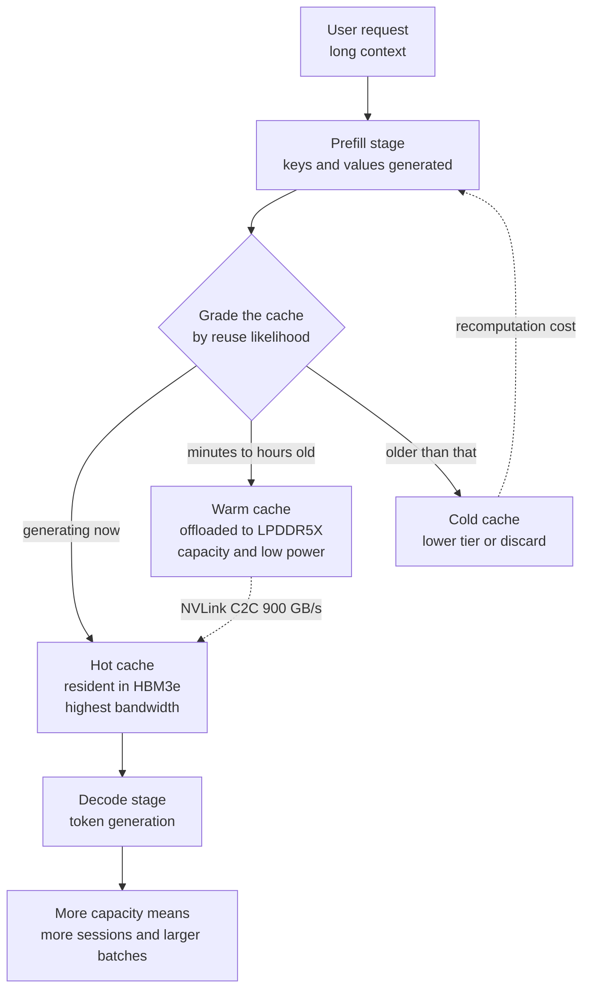

*A visual for the structure at the heart of this white paper: a narrow hot HBM core and wide cool LPDDR tiers.*

## Why this matters to you

This post is written for the infrastructure engineers who need to put a long-context service on premises but cannot yet decide how many GPUs to buy, and for the platform operators who have to explain why the memory line on that quote grew so large. The conclusion first: the bottleneck in long-context inference is not the space to load the model, it is the space to hold the KV cache the conversation has piled up, and the moment you move that cache to low-power memory outside the GPU, the number of concurrent users the same GPU can carry changes. Micron published a white paper measuring that difference, and we redid the arithmetic behind its premise ourselves.

## Overview

Late in July the timeline carried a claim that Micron and Meta had published a white paper together. Checking it turned up two separate threads. One is a white paper Micron published on its own, [LPDDR at Scale: Enabling Efficient LLM Inference Through High-Capacity Memory](https://www.micron.com/content/dam/micron/global/public/products/memory/mobile-dram/lpddr5/documents/lpddr-at-scale-llm-inference-white-paper.pdf). The other is joint work in which Micron and Meta engineers sat down together and ran LPDDR against hyperscale workloads using DCPerf, Meta's open-source benchmark suite. The first one is the document you can read in full today, and most of the numbers in this post come from it.

Reading it, one sentence is hard to dismiss as vendor marketing. It states that the dominant driver of memory demand in inference is not the model's parameter count but the growth of the KV cache. As context lengths stretch to hundreds of thousands of tokens, KV cache requirements climb into hundreds of gigabytes or terabytes and overwhelm conventional system memory configurations. That is a claim that capacity planning has to change at the root, and when we ran the numbers it was not an exaggeration.

There is a reason the topic bites harder in Korea. Most teams running their own GPU clusters here are short on cards, and the requests to extend context keep coming. If the same problem can be solved by growing the memory next to the card instead of buying more cards, the shape of the quote itself changes.

## What the technique is

The KV cache stores attention keys and values that have already been computed so they can be reused. Without it, every generated token would require recomputing keys and values for all preceding tokens, which is why essentially every serving engine keeps one. The problem is that the cache grows in direct proportion to sequence length and concurrent request count. Model weights are fixed once loaded, but the cache keeps swelling as users continue their conversations.

The white paper sorts that cache into three grades by likelihood of reuse. The active working set of a session generating right now is the hot cache and sits in HBM, where bandwidth is highest. Cache created minutes to hours earlier counts as warm and moves down to LPDDR5X. Anything older is cold and goes to a lower tier or gets dropped. On the software side, layers like LMCache push cache from GPU memory to CPU memory and then to SSD on the same idea. What differs here is that Micron pinned that second step into a hardware specification and made it much larger.

The hardware setup is unusual too. The test platform is the NVIDIA GH200 Grace Hopper Superchip. LPDDR5X is attached to the Grace CPU and HBM3e to the Hopper GPU, and the two are joined over NVLink C2C with cache coherence. In that arrangement a framework can treat LPDDR as an extension of GPU memory. The paper uses a single superchip configuration and a pair of superchips with 512GB LPDDR5X each to emulate 1TB, then projects from there to 1.5TB per CPU using eight 192GB LPDDR5X SOCAMM2 modules. The model is Llama 3 70B in FP16, served through TensorRT-LLM and vLLM.

## We checked the numbers ourselves

To test whether the paper's premise holds, doing the arithmetic beats reading someone else's chart. Llama 3 70B uses 80 layers, 8 KV heads, and a head dimension of 128 in its published config. Holding both keys and values in FP16 means a single token occupies 2 times 80 times 8 times 128 times 2 bytes, which is 320KiB. Multiply by context length and you have one session's footprint.

*One session's KV footprint plotted against tier capacity lines. At 500K tokens it already sits far above the HBM capacity of a single H100.*

The results follow. At 8K context a session is a light 2.7GB. At 128K it becomes 42.9GB, and at the 500K context the paper used for its real-time test, one session demands 163.8GB. At one million tokens it is 327.7GB. Set that beside the 141.2GB of FP16 weights for the same model and the paper's claim confirms itself. At 500K context, a single user's cache is larger than the entire model.

That reframes the fact that the test platform's H100 carries 96GB of HBM3. This GPU cannot hold even the FP16 weights of Llama 3 70B by itself. Without pulling the Grace-side LPDDR in as unified memory, the experiment would not run at all. By our math, assuming everything left after weights goes to cache, the 512GB configuration holds two 500K sessions and the 1.5TB configuration holds eight. Drop to 128K context and those become eight and thirty-one. This calculation ignores framework overhead and activation memory, so treat it as an upper bound and plan batches below it.

## What Micron measured

The white paper reports two strands of results. In real-time long-context inference, raising LPDRAM capacity per CPU from 512GB to 1.5TB cut time to first token by up to 98 percent. That was measured on Llama 3 70B in FP16 at 500K context, and the paper notes the improvement let a single system support up to 16 users. For offline batch inference, the sort of job that transcribes conference calls in bulk, the same capacity increase doubled the batch size, defined as concurrent request capacity. The explanation attached is that configurations short on capacity must repeatedly recompute keys and values, which slows request processing.

The 98 percent figure looks dramatic, but the mechanism is simple. When there is nowhere to keep the cache, recomputation happens, and recomputation means running the whole prefill again, which lands directly on first-token latency. Give it room and that work disappears. It reads more accurately as waste removed than as performance gained.

The second strand lives in the earlier technical brief, [The role of low-power (LP) memory in data center workloads](https://assets.micron.com/adobe/assets/urn:aaid:aem:5a10a15d-ae6c-40f9-8fc2-e522e7c6749f/renditions/original/as/lp-in-data-center-technical-brief.pdf). Micron put the GH200 LPDDR5X system against an x86 DDR5 server from the 2022 to 2023 generation. In the mixed read and write case of the multichase microbenchmark, LPDDR5X delivered 293GB/s against DDR5's 215GB/s, a 36 percent gap. Memory power ran up to 77 percent lower depending on conditions. On Llama 3 8B, performance per watt was 10 percent better, and on 70B the report gives more than five times the throughput, roughly 80 percent lower latency, and 73 percent less energy consumed.

The caveat Micron attaches itself matters here. The five times figure on 70B is credited not to memory type alone but to the combination of the Grace CPU, low-power memory, and NVLink. The two systems differ in CPU architecture, and the GPU attachment is 900GB/s bidirectional NVLink C2C on one side against 128GB/s PCIe on the other. Since the experiment moves KV cache across a link that differs by a factor of seven, citing the result as a clean LPDDR versus DDR5 comparison would be wrong.

## The part validated with Meta

The Micron and Meta collaboration has a different character. According to the summary written by Khayam Anjam of Micron's data center workload engineering team, engineers from both companies used [DCPerf](https://engineering.fb.com/2024/08/05/data-center-engineering/dcperf-open-source-benchmark-suite-for-hyperscale-compute-applications/), Meta's open-source benchmark suite, to measure how LPDDR behaves on real hyperscale workloads. DCPerf was built by referencing large applications in Meta's production server fleet and is designed to reproduce the power and frequency characteristics of data center applications more closely than synthetic workloads do.

That combination matters because it splits who does the validating. When a memory vendor measures its own product with its own benchmark, nobody believes it. When an operator running one of the largest fleets in the world measures it with a tool modeled on its own workloads and released publicly, the result carries differently. That said, we could not obtain the full document of this joint work at the time of writing. We verified the summary text on Micron's product pages and the DCPerf documentation itself, and we cite no individual numbers from it. When the document is published we will cover those numbers separately.

## What this means for ThakiCloud

ThakiCloud's ai-platform shares customer GPU resources on Kubernetes and runs vLLM-based serving. Translated into our terms, three things stand out.

First, the capacity formula has to change. Sizing nodes by whether the model fits on the GPU will always miss on long-context services. As the math above shows, at 500K context a single session demands more cache than the weights occupy, so it is better to fix the target concurrent session count and target context length first and work backward to the memory that requires. It is the same exercise as the [KV cache sizing for MoE models](/tech-blog/en/llmops/ling-3-0-flash-moe-serving/) we covered recently, and skipping it means repeatedly cutting batch size on deployment day.

Second, you can move in the same direction without changing hardware. Even without a GH200, tiering that pushes KV cache from GPU memory to CPU memory and then to NVMe is available today through LMCache-class configurations. It amounts to imitating in software the second step Micron widened in hardware, with the caveat that when link bandwidth is at PCIe level the window where offload beats recomputation narrows. Measuring that crossover per workload is the homework that remains in real operations.

Third, power enters the quote. For customers evaluating on-premises and sovereign builds, rack power and cooling often decide whether adoption is possible at all. An option that sharply lowers memory subsystem power means more tokens produced within the same power budget, which connects directly to the total cost of ownership argument we keep making in proposals.

For agent workloads the emphasis shifts. ThakiCloud's Paxis is an Agent-Native Cloud that treats skills, tools, policies, and audit logs as first-class resources, and agents run far longer contexts and reuse them far more often than people do. They reread the same system prompt and the same document bundle hundreds of times, so their KV cache reuse rate runs higher than human conversation. That is why widening the space to hold cache shows up directly in agent economics, and why infrastructure choices that lower serving cost also lower the unit cost of the agent platform running on top.

## Limits and counterarguments

The largest limit is the nature of the source. This white paper comes from a company that sells LPDDR, and the x86 DDR5 server chosen for comparison is a 2022 to 2023 generation machine. Whether the same gap appears against a current x86 platform or an MRDIMM configuration cannot be determined from this document. Independent third-party replication is also not yet visible.

Second, figures like 98 percent and five times are best-case values. The 98 percent comes from removing recomputation that occurred through capacity starvation at the extreme length of 500K context, and the benefit shrinks as context shortens. The five times, as noted, is a comparison in which the CPU and the link changed as well.

Third, offload is not free. Cache held outside the GPU has to be pulled back when needed, and there is always a point where that transfer time exceeds recomputation time. The lower the link bandwidth, the sooner that crossover arrives. Carrying a conclusion obtained on NVLink C2C into a PCIe environment can make things slower instead.

Finally there is a procurement problem. LPDDR5X is soldered onto the board, which makes field expansion or replacement difficult. Modular formats like SOCAMM2 target exactly this, but the form factor is new and its supply and maintenance paths are not as familiar as conventional RDIMMs.

## Wrapping up

Capacity in long-context inference is not a question of where to put the model, it is a question of where to put the cache the conversation built. The arithmetic shows it plainly: running Llama 3 70B in FP16, one token demands 320KiB, and at 500K context a single session takes 163.8GB, more than the weights themselves. Micron widened that space with low-power memory and reported up to a 98 percent cut in first-token latency and a doubled batch size, with the Grace CPU and NVLink attached to the result as conditions.

The immediate task is clear. Fix your target context and target concurrent session count on the serving configuration you run today, then calculate the KV footprint. If that number exceeds GPU memory, cache tiering deserves a look before more cards do. Changing hardware generation is a decision that can wait until after that.

## Sources

- [LPDDR at Scale: Enabling Efficient LLM Inference Through High-Capacity Memory](https://www.micron.com/content/dam/micron/global/public/products/memory/mobile-dram/lpddr5/documents/lpddr-at-scale-llm-inference-white-paper.pdf), Micron White Paper, February 2026
- [The role of low-power (LP) memory in data center workloads](https://assets.micron.com/adobe/assets/urn:aaid:aem:5a10a15d-ae6c-40f9-8fc2-e522e7c6749f/renditions/original/as/lp-in-data-center-technical-brief.pdf), Micron Technical Brief
- [Every watt matters: How low-power memory is transforming data centers](https://www.micron.com/about/blog/applications/data-center/every-watt-matters-how-low-power-memory-is-transforming-data-centers), Micron Blog
- [DCPerf: An open source benchmark suite for hyperscale compute applications](https://engineering.fb.com/2024/08/05/data-center-engineering/dcperf-open-source-benchmark-suite-for-hyperscale-compute-applications/), Engineering at Meta
- KV footprint calculation script: `scripts/blog/kv_cache_calc.py`, based on the published Llama 3 70B config
