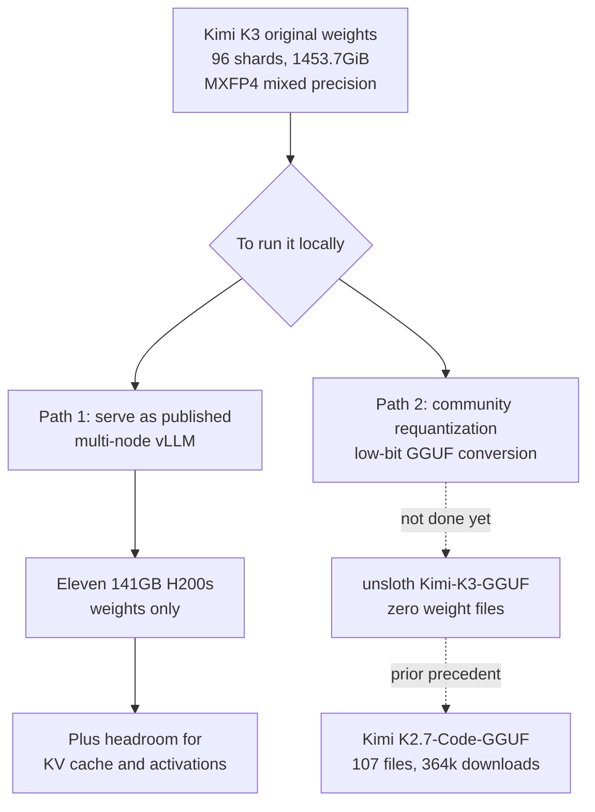

When an open-weight model drops, posts about running it locally usually appear within half a day. Kimi K3 is a different case. Summing every published weight file through the HuggingFace API gives 1,453.7GiB across 96 shards. That takes eleven 141GB H200s just to hold the weights, and that figure includes neither KV cache nor activations.


## Why this matters

This post is for infrastructure leads deciding whether to bring an open-weight model in-house, and for platform engineers who size GPU budgets. It is less useful for comparing benchmark scores and more useful if you want the numbers behind actually serving published weights. The conclusion up front: between "a frontier-class open-weight model exists" and "we can run it here" there is currently a gap eleven cards wide, and closing that gap is work done by the quantization community and the serving stack rather than by the model's authors. So the thing to check on release day is not the model card but the file listing of the GGUF repository.

## Overview

Moonshot AI has released Kimi K3. By its model card it is a Mixture-of-Experts model with 2.8T total parameters and 104B activated, natively multimodal, with a 1,000,000 token context window. The card introduces it as the world's first open 3T-class model.

The reason we wrote this is fairly small. Unsloth, which builds quantization tooling, posted a short note thanking Moonshot and saying they would try to make it work locally. Normally that is a pleasantry you scroll past, but in this case we were curious how much work that one sentence actually points at. So instead of reacting, we went and checked the numbers.

At the time we checked, the three repositories stood as follows. The original, `moonshotai/Kimi-K3`, had 6,064 likes and 2,850 downloads, last modified 27 July 2026. Unsloth's mirror `unsloth/Kimi-K3` was created that same afternoon and held identical weights. And `unsloth/Kimi-K3-GGUF`, created the same day, contained exactly two files: a README and a gitattributes. Not a single weight file had been uploaded yet.

## What this model is

Taking the structure straight from the model card and the published config file:

| Item | Value |
|---|---|
| Total parameters | 2.8T |
| Activated parameters | 104B |
| Layers | 93 (including 1 dense layer) |
| Attention composition | 69 KDA + 24 Gated MLA |
| Experts | 16 active out of 896 |
| Attention hidden dimension | 7168 |
| Attention heads | 96 |
| Context length | 1,048,576 tokens |
| Vocabulary size | 163,840 |
| Release format | MXFP4 compressed-tensors |

Several architecture names are new. Kimi Delta Attention and Attention Residuals sit underneath a framework called Stable LatentMoE that scales sparsity up, and the model card says this combination improves overall scaling efficiency by roughly 2.5x over K2. That is a claim from the authors, so it is worth holding loosely until independently verified.

The part with direct operational consequences is the release format. The quantization section of the config shows `mxfp4-pack-quantized` at 4 bits, group size 32, symmetric. But the exclusion list is long. Self-attention, shared experts, the gate, up and down projections of the dense MLP, the language model head, the vision tower and the multimodal projector are all excluded from 4-bit quantization. This release is therefore not a model compressed wholesale to 4 bits. It is a mixed-precision distribution where only the routed expert weights are pushed to 4 bits and the rest stays at higher precision.

That fact connects straight to the size calculation. Holding 2.8T parameters purely at 4 bits would take roughly 1.27TiB in theory. What we actually measured is 1,453.7GiB, about 1.42TiB. The difference of roughly 150GiB is what the unquantized portions and the scale tensors occupy. The numbers reconcile, so we are reasonably confident the accounting is sound.



## Pulling and serving

Downloading the weights is unremarkable in itself.

```bash
# Original weights (you need well over 1.4TiB free)
hf download moonshotai/Kimi-K3 --local-dir ./Kimi-K3

# To check the file list and total size first
curl -s "https://huggingface.co/api/models/moonshotai/Kimi-K3?blobs=true" \
  | python3 -c "import json,sys; d=json.load(sys.stdin); \
print(sum((s.get('lfs') or {}).get('size',0) for s in d['siblings'])/1024**3, 'GiB')"
```

The second command is what we used. Without downloading 1.4TiB you can add up the LFS blob sizes the HuggingFace API reports and get the exact distribution size. For capacity planning this is far quicker, and it also shows you how the repository is composed.

Serving does not work on a single node. Even with 141GB of HBM per H200, the weights alone need eleven cards, so tensor and pipeline parallelism have to be combined across nodes.

```bash
# Conceptual. Actual parallel layout and node count depend on your cluster.
vllm serve moonshotai/Kimi-K3 \
  --tensor-parallel-size 8 \
  --pipeline-parallel-size 2 \
  --max-model-len 131072 \
  --trust-remote-code
```

We trimmed the context length rather than opening the full million tokens because of KV cache. On a model with 93 attention layers and 96 heads, opening a million-token window costs substantial memory on top of the weights. In production it is safer to decide the maximum length you actually need first and budget cache against that.

One more thing to check is the license. The previous generation, `moonshotai/Kimi-K2.7-Code`, carried a modified MIT license. K3 ships under a separate set of terms called the Kimi K3 License. The text opens with an MIT-like grant, but two conditions follow. If you operate a model-as-a-service business whose revenue exceeds twenty million US dollars over any consecutive twelve months, you must enter a separate agreement with Moonshot AI before any commercial use. And if you use it in a product with more than 100 million monthly active users or more than twenty million US dollars in monthly revenue, "Kimi K3" must be displayed prominently in the user interface. Neither condition applies to internal use, defined as use that does not make the software, its outputs or its capabilities available to third parties. Most in-house adoption falls there, but if you sell inference to customers, get legal review before you commit.

## What we measured

We measured by summing every LFS blob size for each repository through the HuggingFace model API, restricted to weight file extensions. Nothing was downloaded, so the network cost was a handful of API calls.


| Repository | Weight files | Total size | Downloads |
|---|---:|---:|---:|
| moonshotai/Kimi-K3 | 96 | 1,453.7 GiB | 2,850 |
| unsloth/Kimi-K3 | 96 | 1,453.7 GiB | 0 |
| unsloth/Kimi-K3-GGUF | 0 | 0 GiB | 0 |
| moonshotai/Kimi-K2.7-Code | 64 | 554.3 GiB | 695,744 |
| unsloth/Kimi-K2.7-Code-GGUF | 107 | 4,007.1 GiB | 364,041 |

Three things stand out in this table.

First, the generational jump is large. K2.7-Code was 554.3GiB and K3 is 1,453.7GiB, a factor of 2.6. A team equipped for the previous generation cannot take this one on the same hardware.

Do not plug that multiple straight into a budget, though. A 2.6x increase in size does not mean exactly 2.6x the cards, because crossing a node boundary introduces communication cost as a separate line item. A configuration solved by eight cards in one node and a configuration that requires two or more nodes are different operational problems.

Second, mirroring and quantizing are entirely different jobs. Unsloth mirrored the identical 1,453.7GiB on release day, yet the GGUF repository created the same day held no weight files at all. Copying files is a bandwidth problem. Recompressing to low bit widths is a separate process that needs calibration and validation.

Third, the previous generation shows what a finished pipeline looks like. `unsloth/Kimi-K2.7-Code-GGUF` holds 107 files totalling 4,007.1GiB. It exceeds the original because a single repository carries conversions at several bit levels rather than one model. Cumulative downloads reach 364,041, more than half the original's. What people actually pull is the requantized build, not the original.

We also worked out the GPU conversion. 1,453.7GiB is about 1,560GB, so holding weights alone takes eleven 141GB H200s, twenty 80GB H100s, or forty-nine 32GB RTX 5090s. To repeat, that excludes KV cache, activations and fragmentation headroom. Real serving configurations grow from there.

There is an easy misreading to head off here. The fact that 104B parameters are activated does not reduce the memory requirement to 104B. MoE computes with only 16 of 896 experts per token, but which experts get selected is not known until the token arrives, so every expert weight must be resident somewhere. What the activated parameter count reduces is compute, not memory. Miss that distinction and your capacity estimate is off by an order of magnitude.

The KV cache side deserves a look at the structure too. This model's 93 attention layers split into 69 KDA and 24 Gated MLA. MLA-family attention compresses its cache into a latent space, so cache pressure at a given context length is lower than with standard attention. Estimating cache size by simply multiplying context length by layer count and head count therefore overestimates. We did not run the model, so we cannot give you the exact figure, and we will leave it at this: back-of-envelope multiplication does not fit this architecture.

## What this means for ThakiCloud

This measurement overlaps precisely with the problem ThakiCloud's ai-platform solves. ai-platform allocates GPUs on Kubernetes and Kueue and serves models with vLLM, running models inside the customer boundary for environments with on-premises and sovereignty requirements.

For customers with sovereignty requirements in particular, these numbers are not abstract. Deciding to run a model inside your own boundary rather than calling an external API becomes a decision about where and how to place eleven to twenty GPUs. Power, cooling and inter-node bandwidth all arrive with them. Adoption discussions really do start at model quality and end at data centre facilities.

The most practical implication is that automating capacity estimation on release day is worth doing. The method we used here is a handful of API calls, so computing total weight size and required card count automatically whenever a new open-weight model appears clears the first gate of adoption review without human effort. Learning that you cannot host a 1.4TiB model after downloading it costs a great deal more than knowing beforehand that it takes eleven cards.

Second is scheduling. A single inference workload occupying eleven to twenty cards is awkward in a multi-tenant environment. Even with separate Kueue queues, a job this size effectively claims a whole section of the cluster. On a shared cluster, models at this scale are more realistic in a reserved partition than in always-on serving.

Third is the operating policy while waiting for a requantized build. As the previous generation's statistics show, what gets used in practice is the community conversion rather than the original. But conversions have distributed provenance, so unless you decide internally which bit level and which build is your standard, different teams end up on different files. Our practice is to narrow the candidate conversions, compare them against one evaluation set, and fix a single internal standard. In a situation like this one, where no conversion exists just after release, you cannot even start that process, so it is more realistic to schedule adoption from the conversion release date rather than the model release date.

Fourth is model selection itself. Self-serving a frontier-class open-weight model is always an option, but far smaller models suit most internal work. What we keep confirming in customer environments is that competitiveness comes from the low-serving-cost regime. A 2.8T model is impressive on its own terms, but the adoption decision should start from whether there is actually work that nothing smaller can do. If there is, we can bring it up in a multi-node configuration. If there is not, the same budget serves far more concurrent users.

## Limits and counterarguments

The numbers in this post concern size, not performance. We did not run the model and measured neither quality nor latency. Downloading 1.4TiB and bringing it up across nodes is separate work, and this post covers only the capacity estimation that precedes it.

The observation that the GGUF repository is empty is also a point-in-time fact. What we checked was the state on the evening of 27 July 2026, and by the time you read this, conversions have most likely appeared. Unsloth filled 107 files for the previous generation, so the direction is clear. Our point is not that the repository is deficient but that a structural lag exists between release and runnability.

The GPU count is a simplified figure too. In practice weights do not divide evenly across cards, parallelism strategies introduce duplication, and communication buffers are needed. Eleven is a floor, and real configurations need margin above it.

Finally, low-bit quantization is not a free lunch. A conversion appearing does not mean quality is preserved, and long-horizon agentic work in particular tends to accumulate degradation at low bit widths. Evaluate each conversion against your own workload before adopting it.

## Wrapping up

Kimi K3 is 1,453.7GiB as published, and holding the weights alone takes eleven 141GB H200s. That is 2.6x the previous generation, and the license moved from a modified MIT to separate terms with revenue conditions attached. As of release day, no low-bit conversion existed.

What to take from this is not one model's size but one habit. When a new open-weight model is published, check total weight size and whether a requantized build exists before you read the benchmark table. It takes a few API calls, and the answer decides half of the adoption review. We have attached this check to our own release-detection pipeline so that card count gets computed the moment a new model appears.

## Sources

- Kimi K3 model card: <https://huggingface.co/moonshotai/Kimi-K3>
- Kimi K3 license text: <https://huggingface.co/moonshotai/Kimi-K3/blob/main/LICENSE>
- Kimi K3 tech blog: <https://www.kimi.com/blog/kimi-k3>
- Unsloth mirrors: <https://huggingface.co/unsloth/Kimi-K3>, <https://huggingface.co/unsloth/Kimi-K3-GGUF>
- Previous generation comparison: <https://huggingface.co/unsloth/Kimi-K2.7-Code-GGUF>
- Size figures are our own full enumeration via the HuggingFace model API on 28 July 2026.
