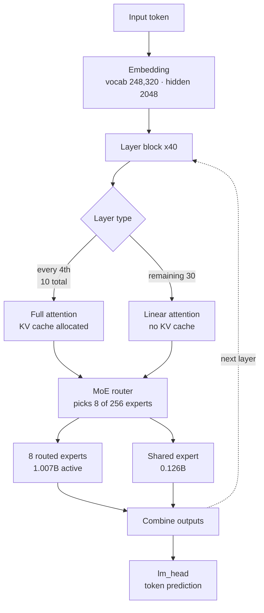

A 35B model usually brings several GPUs to mind. KAT-Coder-V2.5-Dev, newly released by Kwaipilot, is built differently: of its 35B total parameters, only 3B activate per token. We pulled the published `config.json` and safetensors index and tallied them ourselves. Of 256 experts, 8 activate, and of the 32.2B parameters held in routed experts, only 1.007B take part in any given token. That is 3.12%.


## Why this matters

This post is written for platform engineers standing up an in-house coding agent, and for infrastructure leads deciding which open-weight model deserves GPU budget. It is not another entry in the benchmark leaderboard. The conclusion first: KAT-Coder-V2.5-Dev suits on-premises deployment not because it demands fewer resources, but because **the shape of those resources is different**. The weights take 65.2GiB in bf16, which fits on a single H200, and a 262K-token context adds only 5GiB of KV cache. The rest of this post explains where those two numbers come from.

## Overview

Kwaipilot released KAT-Coder-V2.5 in July, then published the open-weight KAT-Coder-V2.5-Dev on Hugging Face. The license is Apache-2.0 and the base model is Qwen3.6-35B-A3B. This is not a model trained from scratch: it is the KAT-V2.5 post-training recipe applied on top of an already proven MoE backbone.

That makes it interesting for two reasons. First, it shows cleanly how much post-training alone buys you within a fixed architecture. On the model card's table, the base Qwen3.6-35B-A3B scores 64.40 on SWE-bench Verified while KAT-Coder-V2.5-Dev scores 69.40. That five-point gap comes purely from SFT and RL. Second, a shared base means your serving stack has almost nothing new to accommodate.

One caveat up front. This release ships language-model weights only, with the vision tower omitted; the model card states plainly that it operates as text-only. When we bucketed tensor names from the checkpoint index, not a single vision tensor turned up. That fact connects directly to the serving flags below.

## What this model is

Taken verbatim from `text_config` in the published `config.json`:

| Item | Value |
|---|---|
| Total parameters | 35B (3B active) |
| Layers | 40 |
| Hidden size | 2048 |
| Experts | 8 active out of 256 |
| Expert intermediate size | 512 |
| Attention heads | 16 (2 KV heads, head dim 256) |
| Layer composition | 10 full attention + 30 linear attention |
| Context length | 262,144 tokens |
| Vocabulary | 248,320 |
| License | Apache-2.0 |

Two rows deserve attention.

First, the expert configuration. Each expert is a very small FFN moving from hidden size 2048 to an intermediate size of 512, so individual experts are light and there are many of them. This is where MoE design has been heading generally: the finer you slice experts, the more combinations the router can compose, which buys broader representation at the same active parameter count.

Second, the attention layout. The 40 layers do not all use the same attention. Only every fourth layer is full attention; the rest are linear attention. Counting the `layer_types` array gives 10 full attention and 30 linear attention layers. KV cache grows with sequence length only in full-attention layers, so this layout directly sets the cost of long contexts.

Putting the two together:



## Installation and integration

Here are the serving commands from the model card, plus one gotcha worth stating explicitly.

vLLM 0.19.0 or newer is recommended.

```shell
uv pip install vllm --torch-backend=auto

vllm serve Kwaipilot/KAT-Coder-V2.5-Dev \
    --port 8000 \
    --tensor-parallel-size 8 \
    --max-model-len 262144 \
    --reasoning-parser qwen3 \
    --enable-auto-tool-choice \
    --tool-call-parser qwen3_coder \
    --language-model-only
```

That last flag, `--language-model-only`, is required rather than optional. As noted above, this release carries no vision-tower weights, and without the flag vLLM tries to initialize a vision encoder that is not in the checkpoint and fails at startup. The model card carries the same warning.

SGLang 0.5.10 or newer is recommended, with a parser specified for tool use.

```shell
uv pip install sglang[all]

python -m sglang.launch_server \
    --model-path Kwaipilot/KAT-Coder-V2.5-Dev \
    --port 8000 \
    --tp-size 8 \
    --mem-fraction-static 0.8 \
    --context-length 262144 \
    --reasoning-parser qwen3 \
    --tool-call-parser qwen3_coder
```

SGLang has no single flag matching vLLM's `--language-model-only`. Depending on the version, startup may fail while trying to build multimodal components; the model card's guidance is to check `--help` for that version's language-model-only option.

One more option matters when you run this as an agent. By default the model keeps only the thinking block for the latest user message, but `preserve_thinking` carries reasoning traces forward from earlier turns.

```python
chat_response = client.chat.completions.create(
    model="Kwaipilot/KAT-Coder-V2.5-Dev",
    messages=messages,
    max_tokens=32768,
    temperature=0.7,
    top_p=0.8,
    presence_penalty=1.5,
    extra_body={
        "top_k": 20,
        "chat_template_kwargs": {"preserve_thinking": True},
    },
)
```

The model card describes this as improving decision consistency in agent scenarios while often reducing total token consumption, since the model stops re-deriving the same reasoning. KV cache utilization improves alongside it.

## What we actually measured

An honest disclosure first. We did not serve the model to measure inference latency or throughput. A configuration calling for eight-way tensor parallelism was not something this environment could stand up, and some steps such as installing the MCP SDK required separate approval. So we tallied **everything that can be verified without downloading the weights**: we fetched the published `config.json` and `model.safetensors.index.json` and derived the parameter distribution and memory requirements from real tensor names and shapes. The script lives at `scripts/experiments/kat-coder-v25-dev/analyze_checkpoint.py`.

Checkpoint structure first:

```
tensors=31333 shards=13
tensor counts by bucket: {"backbone": 451, "embedding": 2,
                          "routed_expert": 30720, "shared_expert": 160}
```

Of 31,333 tensors, 30,720 are routed expert weights, or 98% of the total. With 40 layers, 256 experts, and three matrices per expert for gate, up, and down, 40 times 256 times 3 gives exactly 30,720. Once that arithmetic checks out, the remaining figures can be trusted too.

Splitting parameters by role:

| Role | Parameters |
|---|---|
| Routed experts (total) | 32.212B |
| Routed experts (active per token) | 1.007B |
| Shared expert | 0.126B |
| Router | 0.021B |
| Embeddings + lm_head | 1.017B |
| **Expert sparsity** | **3.12%** |

One thing becomes clear. This model is almost entirely experts, and only 3.12% of them join the computation for any token. But **the remainder still has to sit in memory**. This is where MoE is commonly misread: 3B active parameters does not mean the model uses memory like a 3B model.

Weight footprint by precision:

| Precision | All weights resident | (Reference) active only |
|---|---|---|
| bf16 | 65.2 GiB | 5.6 GiB |
| fp8 | 32.6 GiB | 2.8 GiB |
| int4 | 16.3 GiB | 1.4 GiB |

The right column is theoretical and not reachable in real serving, because the router cannot be known in advance. The column that matters operationally is the left one.

And here is the most practical number in this post.


A single sequence filling all 262,144 tokens holds 5.00GiB of KV cache in bf16. Had all 40 layers been full attention, the same sequence would need 20.00GiB. One attention layout decision cuts long-context cost by 75%. Coding agents routinely push whole repositories into context, which makes concurrent session count effectively equal to total KV cache, so this structure lets the same GPU carry four times as many sessions.

Counting GPUs for weights alone, assuming 85% usable memory:

| GPU | bf16 (65.2GiB) | fp8 (32.6GiB) | int4 (16.3GiB) |
|---|---|---|---|
| H200 NVL 141GB | 1 | 1 | 1 |
| H100 / A100 80GB | 1 | 1 | 1 |
| RTX 5090 32GB | 3 | 2 | 1 |
| RTX 4090 24GB | 4 | 2 | 1 |

The model card's `--tensor-parallel-size 8` example assumes maximum throughput across many concurrent 262K-token sessions. For weights plus a single sequence's KV cache, 65.2 plus 5.0 gives 70.2GiB, which leaves headroom on one H200. If you are running a team-scale internal coding assistant with tens of concurrent users, eight GPUs is not where you need to start.

## What this means for ThakiCloud

This model touches both of our products.

**Through the ai-platform lens.** ThakiCloud's ai-platform is multi-tenant AI/ML infrastructure that shares GPUs through Kubernetes and Kueue. That is exactly where the arithmetic above pays off. Since 65.2GiB in bf16 fits inside a single H200 NVL, this model can be scheduled as a one-GPU workload for a per-team coding assistant instead of occupying a whole node, leaving the remaining GPUs to other tenants' training jobs. On top of that, the base Qwen3.6-35B-A3B is already staged in our internal model registry, so pulling weights inside the cluster is far faster than fetching them externally. For customers who must run a coding assistant without sending source code to an external API, particularly in air-gapped or sovereign environments, the combination of an Apache-2.0 license and this footprint is a realistic option.

**Through the Paxis lens.** Paxis is the Agent-Native Cloud control plane running on top of ai-platform, treating Skills, Tools, Policies, and Audit Logs as first-class resources. So the figure that caught our attention was not a benchmark score but an anomaly rate. The model card reports that RL training cut abnormal tool labels from 9.34% to 0.28% and single-turn repetition from 0.34% to 0%. Anyone who has operated an agent harness knows that a model whose tool calls break nine times in a hundred cannot go into automation no matter how good its reasoning, because retries and parse-exception handling eat the pipeline. In a system where Paxis selects from over 960 skills via BM25, executes them in isolated sandboxes, and puts every action through policy gates and audit logs, tool-call reliability is harness reliability. An improvement that looks like a rounding detail changes what operations feel like.

The training recipe holds a lesson too. Kwaipilot describes building hierarchical rewards from harness execution feedback, granting partial credit when a failed attempt still made meaningful progress. That produces a denser learning signal than a binary pass-fail reward, and it mirrors how we record not just pass or fail but how far a run got when attaching verification gates to agent loops.

## Limits and counterarguments

The biggest caveat is that every benchmark figure here comes from the model's authors. Treat SWE-bench Verified 69.40 as a reference point until independently reproduced. Agentic coding benchmarks in particular swing hard with harness configuration and attempt budget. That KAT-Coder-V2.5-Dev's Terminal-Bench 2.1 average of 41.02 is printed alongside per-harness values of 32.60 and 49.44 is itself a demonstration of that variance.

Second, every number in this post comes from static analysis. Real serving adds activation memory, CUDA graph buffers, and fragmentation, so budget above the tables here. MoE brings the additional problem of uneven expert load across batches, which means actual throughput depends heavily on how you mix tensor parallelism with expert parallelism. What we computed is a floor, not an operating specification.

Third, the missing vision tower reaches further than it first appears. Reading a screenshot to fix a UI, or interpreting a diagram, is out of scope for this release. If your coding agent stays within text repository work that is fine, but if frontend automation is on your roadmap you should evaluate alternatives alongside it.

Finally, the counterargument. Three billion active parameters does not translate into cheap. Memory demand matches a 35B model; what you save is compute. If GPU memory is already your bottleneck, the benefit here is smaller than it looks. If you have GPUs but lack throughput, the benefit is large. Determine which situation you are in first.

## Wrapping up

Three things came out of examining KAT-Coder-V2.5-Dev. Lighting 8 of 256 experts gives 3.12% sparsity and cuts compute; keeping only 10 of 40 layers on full attention holds a 262K-token KV cache to 5GiB; and together those put 65.2GiB of bf16 weights inside a single H200. That recovers the conclusion from the opening: this model fits on-premises not because it is small, but because its resources sit in different places.

So the next step is clear. If you are evaluating an in-house coding assistant, do not take the eight-GPU example command as your baseline. Fix your concurrent session count first, work backward from KV cache, and derive the GPU count from there. The analysis script used here runs the same way against any other MoE model. And before committing, measure tool-call failure rate before benchmark scores. For anyone operating agents, that is the far more honest metric.

## Sources

- [Kwaipilot/KAT-Coder-V2.5-Dev model card](https://huggingface.co/Kwaipilot/KAT-Coder-V2.5-Dev)
- [KAT-Coder technical report](https://huggingface.co/papers/2607.05471)
- [KAT-Coder project page](https://kwaipilot.github.io/KAT-Coder/)
