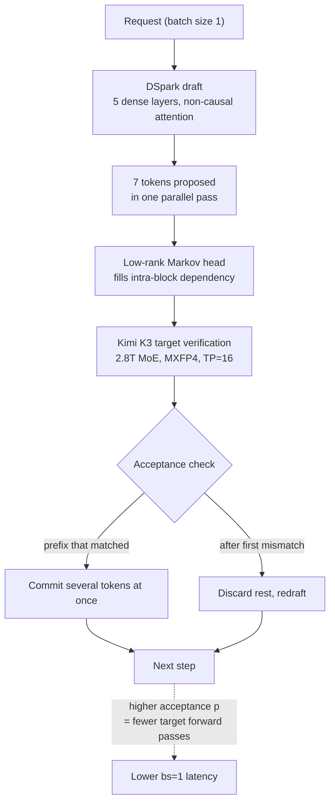

Most serving benchmarks brag about throughput. Raise the batch, add concurrent requests, report total tokens per second. That number lands poorly with anyone attaching a coding agent or a reasoning model, because the user is waiting on exactly one response and the next tool call cannot start until it finishes. The figure vLLM just published aims squarely at that spot: 464 tok/s at batch size 1.


## Why read this

This post is for platform engineers self-hosting reasoning models or coding agents, and for anyone accountable for perceived response speed per GPU spent. It is less useful for comparing which model is smarter and more useful if you want to know how to cut single-stream latency on hardware you already have. The conclusion first: what sets single-stream speed is not how many GPUs you attached but how many draft tokens get accepted, which makes the payoff from speculative decoding directly proportional to how predictable your workload is. Working backwards from the published figures, a 3.14x speedup sits on a per-token acceptance rate around 0.73, and letting acceptance fall from 0.9 to 0.6 cuts speed by more than half on identical hardware.

## Overview

Moonshot AI's Kimi K3 is a Mixture-of-Experts model with 2.8T total parameters. It activates 16 of 896 experts per token, supports up to a one-million-token context, and handles native multimodal input including vision. Attention is Kimi Delta Attention, a hybrid of linear and full attention, and the weights ship in native MXFP4.

vLLM supported the model from day zero. The release notes published on 27 July 2026 list FlashKDA integration, fused KDA decode, fused KDA projections and convolution, fused AttnRes, a reimplemented MLA module, SiTU-enabled MXFP4 MoE execution, and optimized expert routing. Validation ran on a 16-GPU DP16 and EP16 configuration.

The single-stream numbers in that same post are where this article starts. Without speculative decoding, 118 tok/s. With the DSpark draft model attached, 370 tok/s, a 3.14x gain. Two days later, on 29 July, the vLLM team announced a new peak of 464 tok/s from the same combination. The conditions were a low-entropy reasoning workload, batch size 1, and tensor parallel 16. They state it is reproducible with the public `vllm/vllm-openai:kimi-k3` image and Inferact's DSpark draft model.

## What the technique is

Speculative decoding itself is not new. A small fast draft model proposes several next tokens, and the large accurate target model verifies those candidates in a single forward pass. Whatever matched is committed at once, and everything from the first mismatch onward is discarded. You gain exactly as much as you reduce target forward passes.

Where DSpark departs from earlier work is how it produces the draft. EAGLE-family methods take the target's last hidden state and extend it one token at a time, autoregressively. DSpark uses a block-diffusion backbone of five dense layers with non-causal attention to emit seven tokens in a single parallel pass. A low-rank sequential Markov head supplies the intra-block dependency the parallel pass cannot, and a confidence head produces a signal for resource-aware scheduling. The number of sequential steps needed to build a draft is what shrinks.

There is a pragmatic choice in the training setup as well. The draft is trained on target hidden states extracted from vLLM itself, so the numerics it learns from are the numerics it meets at inference. In a serving stack layered with quantization and fused kernels, a mismatch between draft and target distributions shows up directly as lower acceptance, and training inside the serving engine removes that mismatch up front. The model card states acceptance holds at long context, verified on AA-LCR with multi-document prompts around 95,000 tokens.



## Measured results

One thing needs stating plainly first. We did not reproduce this benchmark. Reproduction needs 16 GB300 GPUs and our internal cluster has no such configuration. What follows is arithmetic anchored on the published figures under an explicitly stated cost model. It is a derivation, not a measurement.

Three published figures serve as anchors.

| Configuration | bs=1 decode | Source |
|---|---:|---|
| Kimi K3, no speculative decoding | 118 tok/s | vLLM blog (2026-07-27) |
| Kimi K3 + DSpark | 370 tok/s (3.14x) | vLLM blog (2026-07-27) |
| Kimi K3 + DSpark, later peak | 464 tok/s | vLLM announcement (2026-07-29) |

Hardware wording differs slightly across sources. The blog says 16 GB300 NVL72 GPUs, the announcement says 4x4 GB300, and the model card says 4 x GB300 with tensor parallel 16. We read all three as tensor parallel 16, meaning 16 GPUs. Note however that 464 tok/s came from a different announcement on a different day than 118 tok/s, so the 3.93x you get by dividing them is not a controlled within-experiment comparison. Read it with that caveat.

The model used for the derivation is the standard one for single-stream speculative decoding. In one step the target verifies `1 + gamma` candidates in a single pass, and the draft pass costs `r` times the target pass. Treating per-token acceptance `p` as independent, the expected number of committed tokens per step is `(1 - p^(gamma+1)) / (1 - p)`, and the speedup is that value divided by `1 + r`. We took `gamma` as 7, the value stated on the model card, and assumed `r` of 0.10 on the grounds that a five-layer dense draft sits against a 2.8T MoE target. That 0.10 is our assumption, not a published figure.

```
=== implied per-token acceptance p ===
p implied by 3.14x        0.7347   E[accepted]/step 3.45
p implied by 3.93x        0.8129   E[accepted]/step 4.33
```

Behind 3.14x sits a per-token acceptance of 0.73 and 3.45 committed tokens per step. Seven proposals, roughly three and a half kept. The 3.93x corresponding to 464 tok/s implies acceptance of 0.81 and 4.33 tokens per step. In other words, two days of work is explained by roughly 0.07 of acceptance. In this regime, whether the work happens in the draft model or the kernels, it is a fight for a few percentage points of acceptance.


Unrolling the sensitivity makes it obvious why vLLM specified a low-entropy reasoning workload.

| Acceptance p | Speedup | Implied tok/s |
|---:|---:|---:|
| 0.95 | 6.12x | 722.1 |
| 0.90 | 5.18x | 611.0 |
| 0.80 | 3.78x | 446.4 |
| 0.70 | 2.86x | 337.0 |
| 0.60 | 2.23x | 263.7 |
| 0.50 | 1.81x | 213.7 |

Dropping acceptance from 0.9 to 0.6 turns 611 tok/s into 264 tok/s on the same 16 GPUs. Nothing about the hardware changed and perceived speed more than halved. That is what workload dependence means in practice. Structured reasoning chains and repetitive code generation, where the next token is predictable, let the draft land. Creative writing and open-ended conversation, where the branching factor is wide, give far less back from the same configuration.

One practical implication follows. When deciding whether to adopt speculative decoding, copying a vendor's speedup multiple is almost always wrong. That multiple is the consequence of an acceptance rate observed on one workload, not a fixed property of the technique. What you need is your own traffic's acceptance rate, and you cannot borrow it from someone else's benchmark. Fortunately it is not hard to measure. With speculative decoding enabled, vLLM emits proposed and accepted token counts as metrics, so running real traffic through and aggregating that ratio is enough. Our suggested order is to measure acceptance first rather than targeting a speedup, then read the corresponding row in the table above. At that point adoption becomes a calculation rather than a hope.

The draft token count `gamma` deserves a look alongside it. On a low-acceptance workload, raising `gamma` mostly increases discarded candidates and draft cost. When acceptance is high enough, raising `gamma` increases committed tokens per step. DSpark settling on 7 reads as a choice about that balance.

## What this means for ThakiCloud

These numbers matter to us for two reasons.

First, the ai-platform angle. We schedule GPUs with Kueue on Kubernetes and serve models with vLLM. The usual way to add serving capacity is to raise the batch and pool concurrent requests, which lifts aggregate throughput but does nothing for the latency of any individual response. Speculative decoding is the knob on the other side: it reduces single-stream latency at a fixed GPU count, which is worth the most in environments where adding GPUs is not an option, exactly the situation for on-premises customers. Because the payoff varies by workload, splitting serving profiles per workload is the better structure, in the same direction as the dual-pool token budget routing we already run.

Second, the Paxis angle. Paxis is the Agent-Native Cloud control plane running on top of ai-platform, and agent loops are its real workload. Agent execution is batch size 1 by nature. Choosing a skill, calling a tool, reading the result, and deciding the next action each wait on the previous step. Parallelizing multiple agents as a DAG does not change that an individual node still runs one stream. So on an agent platform, single-stream decode speed translates directly into user-perceived time.

A piece of good news overlaps here. Agent workloads are mostly low-entropy. They follow declared skill contracts, call tools against fixed schemas, and emit results in fixed formats. We designed our pipelines so that code owns the format, originally for output consistency, and that choice happens to help acceptance too. The more regular the output, the better the draft lands. On paths dominated by free-form prose, expect less.

## Limits and counterarguments

Start with objections to our own arithmetic. Treating per-token acceptance as independent does not match reality. Once a draft goes wrong, the tokens after it are much more likely to be wrong too, so real acceptance concentrates at the front of the block and falls off sharply. DSpark adding a dedicated head for intra-block dependency exists precisely to handle that correlation. So the 0.73 and 0.81 we derived are equivalent acceptance rates that produce the observed speedups, not measured acceptance rates.

The 0.10 draft cost ratio is also an assumption. The real ratio depends on kernel implementation, batch shape, and attention backend. Lowering it to 0.05 lowers the acceptance that explains the same speedup; raising it to 0.2 raises it. The shape and slope of the curve hold, the absolute values shift.

The technique has limits of its own. Speculative decoding requires holding another model in memory, and here that draft must be aligned to the same serving stack as the target. Change the target model and you have to prepare a new draft. As the batch grows, the target forward pass is already well filled, so the relative gain from speculation shrinks. These figures came from batch size 1 and should be taken as such; they do not transfer to a service with many concurrent users.

Finally there is accessibility. The premise of this benchmark is that you can place a 2.8T model on 16 GB300 GPUs. For most on-premises customers that configuration is out of reach, the same point we made when we tallied K3 weights and found they alone need 11 H200s. What transfers from this post is not the number 464 but the structural fact that acceptance is the knob.

## Wrapping up

The bs=1 decode figures vLLM published for Kimi K3 start at 118 tok/s, reach 370 tok/s with DSpark attached, and hit 464 tok/s two days later. Working backwards under the cost model we stated, that spread is explained by per-token acceptance moving between roughly 0.73 and 0.81. Let acceptance slip from 0.9 to 0.6 and the same hardware loses more than half its speed.

The conclusion from the top, restated: single-stream speed is set by how many draft tokens get accepted, not by GPU count. So the first question to ask before adopting speculative decoding is not how many times faster it goes but how predictable your workload is.

If you serve agents, the next step is straightforward. Split your traffic into low-entropy paths and open-ended paths and measure acceptance on each. Once you have those numbers, how much to invest in speculative decoding and which paths to enable it on become calculations. We plan to work in that order too, starting with the structured output paths of our agent loops.

## Sources

- [vLLM announcement: Kimi-K3 bs=1 decode at 464 tok/s (2026-07-29)](https://x.com/vllm_project/status/2082267336279814173)
- [vLLM blog: Kimi K3 Is Here, Efficient Day-0 Support on vLLM (2026-07-27)](https://vllm.ai/blog/2026-07-27-k3)
- [vLLM blog: A Preview of Production-Scale Kimi K3 Support on vLLM](https://vllm.ai/blog/2026-07-22-kimi-k3-preview)
- [Inferact/Kimi-K3-DSpark model card](https://huggingface.co/Inferact/Kimi-K3-DSpark)
- [moonshotai/Kimi-K3 model card](https://huggingface.co/moonshotai/Kimi-K3)
- [vLLM recipes: moonshotai/Kimi-K3](https://recipes.vllm.ai/moonshotai/Kimi-K3)
- Derivation script and raw log: `scripts/experiments/kimi-k3-dspark-bs1-decode/spec_decode_acceptance.py`, `outputs/blog-impl/kimi-k3-dspark-bs1-decode/run-1.log`
