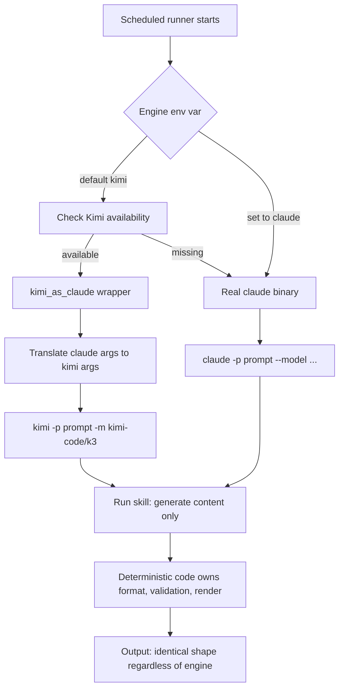

> 📊 **Slide summary (NotebookLM)**: For a slide-first walkthrough of this post, see the [three-layer cost-cut slide deck (PDF)](/assets/images/2026-07-30-launchd-fleet-model-cost-kimi-nlm-en.pdf).

If dozens of automations wake up on the Claude API every morning, dropping one model tier alone erases 40 to 60 percent of the bill. The more surprising fact is that even Kimi K3, widely marketed as the cheap alternative, lists the same output-token price as Claude Sonnet 5. So the heart of cost optimization is not "which model is cheaper" but the judgment call of "which job is safe to move down a tier."

On our Mac, 90 user-scope `launchd` jobs run every day. News digests, sales briefs, tweet posting, internal reports, overnight paper writing, stock monitors. Most of them make headless LLM calls. This post records what actually happened to the bill as we lowered the fleet's models step by step, and which jobs are safe to lower versus which ones must be left alone. The goal is numbers and guardrails an operator can apply directly.

## First, the conclusion: the cost map has three layers

Move the jobs for real and the savings do not arrive in one shot. They stack in three layers. The first layer is dropping from Opus to Sonnet, where 40 to 60 percent falls off at once. The second layer is moving from Sonnet to Kimi K3, where, surprisingly, metered API list price yields almost no extra savings. K3's real worth lies in flat-rate subscription, cache discounts, and not touching the Claude weekly quota. The third layer is mostly untouched: pushing light classification and summarization jobs down to smaller models like Haiku or Kimi K2.5 sheds another 80 to 89 percent.

The order matters. Many teams reach first for "switch to a cheaper model," but the biggest single cut to the bill is lowering one tier, then per-job rightsizing, and vendor swaps are the last polish on top.

## Layer one: the savings already banked by going Opus to Sonnet

Pin the reference prices first. As of July 2026, Anthropic's per-million-token API list prices are: Opus 5 at 5 dollars input and 25 output; Sonnet 5 at 3 dollars input and 15 output (with a promotional 2 and 10 through August 31, 2026); Haiku 4.5 at 1 and 5; and the top-end Fable 5 at 10 and 50.

One rule is worth noticing here: across every tier, output tokens are priced at 5 times input. Automation jobs usually read long context and decide briefly, but agentic jobs inflate output with reasoning and tool calls. So the felt savings from lowering a tier show up most on output-heavy jobs.

Assume one mid-size agentic job uses 300K input and 80K output tokens (an estimate tuned to our fleet average [estimate]). On Opus 5 that is about 3.5 dollars per run, on Sonnet 5 standard about 2.1, and on the promo rate about 1.4. That is 40 percent gone at standard and 60 percent at promo versus Opus. At 30 runs a day, 900 a month, monthly cost drops from 3,150 dollars to 1,890 or 1,260 [estimate]. For orchestration jobs where code owns format and validation, this downgrade happens with almost no quality loss.

## Layer two: Kimi K3's real worth is not its list price

Here is the most common misconception to correct. Kimi K3's API list price is 3 dollars per million input tokens (cache miss) and 15 output. That number is exactly Sonnet 5's standard rate, and higher than Sonnet 5's promo rate. On top of that, K3 always thinks, so reasoning tokens bill as output, and the thinking trace can cost more than the visible answer.

So "K3 is cheap" is not accurate on a metered API basis. The accurate sentence is this: "K3 can run on a flat subscription, so it does not consume Claude's weekly quota, and its cache-hit input is 0.3 dollars per million, 10 times cheaper." As long as our fleet runs on the Kimi Code subscription's headless token, each call is effectively absorbed inside the flat plan and is fully decoupled from Claude's metered and weekly limits. The problem of 90 jobs waking at 8 a.m. and burning one account's weekly quota disappears just by splitting load across two vendors.

Caching matters too. Headless jobs that repeatedly load the same system prompt and skill definitions see much of their input land as cache hits. If K3's cache-hit input is 0.3 dollars and 80 percent of input is cached in the earlier example, a run falls to about 1.45 dollars, close to Sonnet's promo rate [estimate]. So the honest reading of Sonnet-to-K3 is not "cheaper still" but "similar cost, while freeing Claude quota and spreading vendor risk."

## Layer three: the biggest untapped lever is rightsizing

The real savings are not in vendor swaps but in per-job rightsizing. Many of the fleet's 60 candidates are light-judgment, code-fixed-format jobs like health checks, state diffs, news classification, and digest summaries. Push these to Haiku 4.5 (1 dollar input, 5 output) or Kimi K2.5 (0.6 input, 2.5 output) and a run in the earlier example falls to about 0.7 and 0.38 dollars respectively. That is 80 to 89 percent off Opus [estimate].

There is a trap here too. Many of the 60 candidates are actually pure Python monitors with no LLM call at all. Those have "nothing to move" and should be excluded from the cost math. The real stage for savings is the report, digest, and orchestration jobs that call an LLM, and within those, assigning tiers precisely by judgment difficulty.

## Six guardrails that keep output stable when the model changes

The biggest fear when lowering a model or switching vendors is that output quality degrades silently. Our way of managing that fear reduces to one idea: let the model generate only content, and let deterministic code own format, numbers, validation, and rendering. Then the model becomes a free variable and the six devices below become the safety belt for swaps.

First, code owns the format. The worker returns body text only, and rendering like character counts, status enums, priority, headers, and emoji is attached by deterministic scripts. Whatever the model writes, the final shape is identical, so lowering a tier does not shake the format.

Capability lives in skills, not the harness. Keep the runner thin and put domain knowledge and procedure in the skill. Then the engine becomes a swappable variable outside the runner. We left the `claude -p` calls in place and built a thin wrapper plus a shared resolver that translate the engine into `kimi -p`. Not a single line of the skill or prompt changed.

The validation gate is decided by code. The tweet author measures character counts and source counts with regex and `len()` to decide pass or fail, and code jobs judge pass by the test exit code. Because quality is asserted by deterministic checks rather than the model's self-report, a weaker model that passes the gate is used as is, and one that fails is re-dispatched automatically.

Fallback and reversibility are the defaults. The engine resolver falls back to Claude automatically when Kimi is missing or cannot run. Reverting a specific job takes a single environment variable. The principle is that a swap must never halt the fleet.

The swap is scoped. We do not blindly move the whole fleet to one model. Only the cheap worker stage drops to K3, while the stage where quality is the deliverable stays pinned to a higher model. In tweet automation, for example, the per-tweet author dropped to K3, but the blog drafting stage stayed pinned to Opus. Assigning different engines per stage inside one runner is the key.

Finally, escalation is retro-driven only. Every scheduled job starts on the cheap model and auto-escalates to a higher model for that job alone only when consecutive failures cross a threshold. On success it drops back. Cost rises only when data demands it, and stays at the lowest tier otherwise.

## How the engine swap flows

Below is how one runner picks its engine. The skill and prompt stay put while the resolver swaps only the engine binary.

The last two steps are the point. Whatever engine runs, the skill generates only content, and deterministic code owns format and validation, so the final output shape is identical regardless of engine. Without this, every model swap becomes a fight against format regression.

## The ThakiCloud view: implications for platform operations

This experiment reconfirms a principle we have held while operating the AI platform: quality is decided by the harness, not the model grade. When code owns format, validation, and rendering, the model becomes a variable you can choose freely on cost, availability, and sovereignty. This is exactly the routing philosophy of the multi-cluster inference platform we offer customers: assign models and GPU pools precisely by request difficulty, with the quality gate owned by the infrastructure.

The cost implication is just as clear. For an organization running a headless automation fleet, the first move ahead of vendor negotiation is per-job tier assignment, cache usage, and vendor load-splitting. Add the option of serving open-weight models directly on on-premise or private clusters, and the same workload runs at a far lower marginal cost. The way we have lowered inference unit cost on on-premise GPUs with vLLM-based serving and Kueue scheduling sits on exactly this line.

We are also clear about what not to lower. Jobs where the deliverable itself is the quality of long human-read prose, such as public paper writing or tech-blog authoring, stay on the higher model. Jobs tied to trading and investment likewise keep a human approval gate and are excluded from automatic swaps. Cost optimization is aggressive only where it is reversible and clearly beneficial, and conservative in quality and risk areas that are hard to undo.

## Wrap-up

The model cost diet stacks in three layers: drop Opus to Sonnet to bank 40 to 60 percent, spread load to Kimi K3 to free Claude quota and gain cache discounts, and finally rightsize light jobs to Haiku or K2.5 to push toward 80 to 89 percent. What makes all of these swaps safe is ultimately the harness. Leave content to the model and let code own format, validation, and rendering, and the model becomes a part you can swap anytime. Raise cost only when data demands it, and defend only the places where quality is the deliverable.

---

*Price sources: Anthropic and Moonshot public API rates (as of July 2026). Claude rates via [BenchLM](https://benchlm.ai/anthropic/api-pricing), Kimi K3 rate via [BenchLM](https://benchlm.ai/moonshot/api-pricing), Kimi K2-family rates via [OpenRouter](https://openrouter.ai/moonshotai/kimi-k2), Moonshot official [platform.moonshot.ai](https://platform.moonshot.ai/). Savings figures based on fleet size and token volume are estimates from our environment.*
