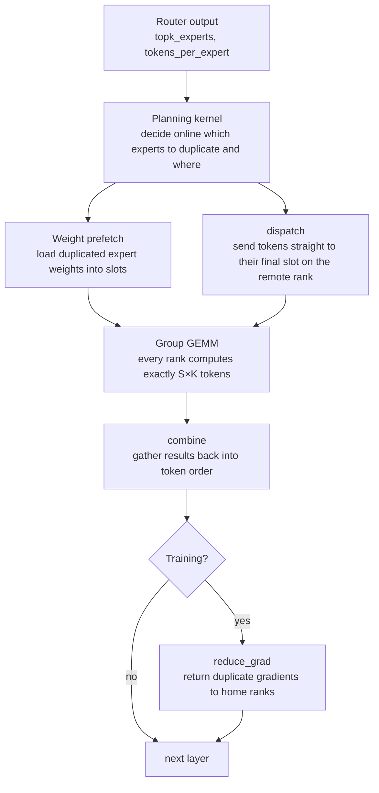
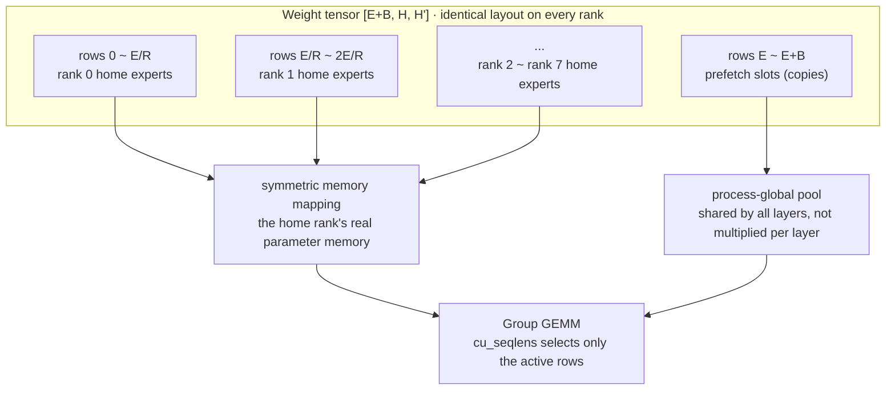

## Why this matters

This post is for infrastructure engineers who split a MoE model across several GPUs and cannot work out why utilisation falls short of expectations. It will help less if you are new to expert parallelism, and more if you already have something like DeepEP wired in and have to explain why iteration times keep moving. The short version: what MoonEP sells is not communication speed, it is **predictability**. When we ran the planning code from the repository ourselves, every rank received exactly the same number of tokens even under extreme routing skew, and the price was that roughly 30% of tokens left the rank they belonged to. Below are the numbers you need to judge whether that trade works on your cluster.

## Overview

Moonshot AI has released MoonEP under the MIT licence. It is an expert-parallel communication library, and the one-line pitch is that it "keeps token loads perfectly balanced across ranks via dynamic redundant experts."

To see why that matters, look at where time leaks in MoE training. In a MoE layer the router picks a few experts per token, and each token travels to whichever GPU holds those experts. The catch is that routers are not fair. Tokens crowding onto particular experts is common at any stage of training, and the rank holding a hot expert ends up computing far more tokens than its neighbours.

In distributed training a step ends when the slowest rank finishes. The other seven wait. In other words, **step time is set by peak load, not average load.** A second problem rides along with the first. Because the token count per rank changes every step, activation tensor shapes change too, and GPU memory fragments. Moonshot reports that this fragmentation is what eventually drives DeepEP into an out-of-memory failure under heavy skew.

MoonEP solves both with one move: make every rank receive exactly `S × K` tokens, where `S` is input tokens per rank and `K` is routed top-k per token. Fix that value and peak load equals average load, and because tensor shapes become constant the fragmentation disappears as well.

## What the technique is

The core device is the **dynamic redundant expert**. When tokens crowd onto an expert, a temporary copy of that expert is placed on a rank with spare room and the overflow is routed there. The copies are not decided in advance; they are **planned online from the current step's router output.** In training, gradients produced by a copy are reduced back to their home rank during the backward pass.

The overall flow looks like this.



Two implementation decisions sit on top of that. The first is **zero copy**. Normally you receive tokens into a communication buffer, then re-sort them by expert into a compute buffer. MoonEP computes the receiving rank's final per-expert position on the sending side and writes directly there. The sort and the copy vanish entirely, and the compute kernel reads the communication buffer in place.

The second is **static shapes**. Because the buffer is always fixed at `S × K`, shapes are known ahead of time and there is no need for the host and GPU to synchronise every layer to ask how many tokens arrived. In MoE training that host synchronisation costs more than people expect.

Moonshot's published benchmarks run on H20 with 8 ranks, sweeping a router imbalance metric called maxvio against DeepEP v2. MoonEP's communication time is lower across every imbalance level and stays almost flat as imbalance grows, while DeepEP degrades steadily because its latency is set by the hottest rank. Moonshot states these figures already include MoonEP's extra planning and prefetch kernels.

## Installation and integration

Installing is straightforward.

```bash
git clone https://github.com/MoonshotAI/MoonEP.git
cd MoonEP
pip install -e .
```

Running the tests, however, needs several GPUs joined by NVLink.

```bash
torchrun --nproc_per_node=8 -m pytest tests/test_planning.py
torchrun --nproc_per_node=8 -m pytest tests/test_dispatch.py
torchrun --nproc_per_node=8 -m pytest tests/test_e2e.py
```

The contract with your framework has two parts. Each expert projection holds **one contiguous symmetric-memory weight tensor**, and the `cu_seqlens` produced by planning selects which expert rows are active this step. The weight tensor is shaped `[E+B, H, H']` and must be laid out identically on every rank. Rows `[0, E)` are each rank's real expert parameter memory mapped through symmetric memory, and rows `[E, E+B)` are the prefetch slots that hold copies.



The value that matters most in practice is `B`, the prefetch slots per rank. The documentation is firm that **training must use `B = E/R`**. Planning duplicates experts from at most one remote home group per rank, so covering every expert the group GEMM touches locally requires that many slots. For inference there are no gradients, so `B` of 3 or 4 is fine; if slots run short, the group GEMM reads the home rank's weights remotely through the symmetric mapping. That is slightly slower and equally correct.

## What we measured

First, what we could not do. **We did not run the communication kernels.** They need CUDA and several NVLink-connected GPUs, which this environment does not have. Instead we ran the **torch reference implementation of the planning stage** included in the repository, on CPU. `tests/planning_reference.py` is written to reproduce the planning kernel's result, and `tests/generate_topk_routing.py` is the same skewed-routing generator the benchmarks use. Both are the project's own code; we added only the measurement around them.

The setup is 256 experts, 8 EP ranks, 2048 tokens per rank, top-8. Rank capacity is therefore `S × K`, or 16,384 tokens. Router skew is controlled by the sigma of the lognormal distribution the generator uses: 0 is perfectly balanced, 1 is what the docs call typical dropless-MoE skew, and 5 is near-degenerate routing.


| Bias sigma | Baseline peak load | Baseline min load | Peak/mean | MoonEP peak/mean | Migrated tokens | Copy slots |
|---|---|---|---|---|---|---|
| 0.0 | 16,384 | 16,384 | 1.000 | 1.000000 | 0.00% | 0 |
| 0.5 | 20,343 | 14,168 | 1.242 | 1.000000 | 3.65% | 9 |
| 1.0 | 25,525 | 11,282 | 1.558 | 1.000000 | 8.95% | 9 |
| 2.0 | 35,864 | 5,335 | 2.189 | 1.000000 | 20.81% | 8 |
| 5.0 | 44,929 | 747 | 2.742 | 1.000000 | 29.82% | 7 |

The baseline pins experts to their home rank. At sigma 1, an ordinary case, the busiest rank already takes 1.56 times the average while the quietest gets only 11,282 tokens. At sigma 5 one side computes 44,929 tokens while another computes 747, a factor of sixty. Train in that state and seven of your eight GPUs spend most of their time waiting.

Push the same routing through MoonEP's planner and all eight ranks received exactly 16,384 tokens at **every one of the five skew levels**. Not approximately, exactly. The code even raises if `alloc.sum(dim=0) > CAP`, so exceeding capacity is structurally impossible. The phrase "perfect balance" turns out to be literal rather than promotional.

The right-hand column is the bill. Balancing means tokens leave the rank they were headed for, and that share grows with skew: 8.95% at sigma 1 and 29.82% at sigma 5. Those tokens cross NVLink, so communication volume rises accordingly. The trade only works because MoonEP made the communication itself cheap with zero copy first.

One more thing stood out. The number of copy slots stayed between **seven and nine** no matter how severe the skew. Out of 256 experts, fewer than ten copies suffice. Heavy skew concentrates tokens on a few experts, so duplicating just those few carries the rest. The documentation's "small number of redundant experts" is confirmed by that column.

We also worked out the memory cost from the shapes given in the docs, assuming `S=4096`, `H=7168`, three projections, and an expert FFN intermediate dimension of 2048. That last value varies by model, so treat it as an estimate.

| Mode | B | Prefetch weights | Grad reduce buffer | Dispatch buffer | Total |
|---|---|---|---|---|---|
| Inference | 4 | 0.33 GiB | none | 0.44 GiB | 0.77 GiB |
| Training | 32 | 2.62 GiB | 5.25 GiB | 0.44 GiB | 8.31 GiB |

Under 1 GiB per rank for inference is negligible. Training exceeds 8 GiB, which is not small next to the 2.6 GiB of home expert weights a rank already carries. That said, the docs state the prefetch pool and reduce buffer come from a **process-global pool shared across all layers**. They are not multiplied by layer count, so in a real model with dozens of layers the relative weight is far smaller.

## What this means for ThakiCloud

ThakiCloud's **ai-platform** schedules GPU workloads on Kubernetes and trains and serves models on top of them. Because Kueue queues the GPUs and several tenants share one cluster, utilisation is a cost metric for us before it is a performance metric. Every idle card is capacity we could have sold to another tenant.

Seen that way, the problem MoonEP targets is precisely ours. Most of the open-weight models we have covered recently are MoE, and configurations with 256 experts and top-8 routing are common, which is why we used exactly that setup. Train such a model across 8 expert-parallel ranks with sigma-1 router skew and, per the measurements above, the busiest rank takes 1.56 times the average. Since iteration time follows peak load, in theory more than a third of the cluster is sitting in a wait state.

Memory fragmentation matters just as much. In a multi-tenant environment the worst failure is not a slow job but **an overnight job that dies out of memory**. Activation tensors whose shapes shift every step cause fragmentation, and fragmentation is expensive to debug because it reproduces poorly. A structure with constant tensor shapes removes that failure class outright. It also lets us size capacity as "always this much" rather than "this much in the worst case", which makes GPU allocation policy far tighter.

It is not a production candidate today, though. It assumes symmetric memory and NVLink, so GPUs must be NVLink-connected within a node, and our training pipeline does not touch the expert-parallel communication layer directly. The realistic next step is reproducing the benchmark above on a single H200 node to see whether communication time stays flat on our hardware too. What this post establishes is the correctness of the planning stage; we have not yet measured the communication gain ourselves.

## Limits and counterarguments

First, this verification covers the planning stage only. MoonEP makes two value claims, balance and fast communication, and we confirmed only the first. The second rests on Moonshot's published H20 benchmark figures, which we did not reproduce independently.

Second, perfect balance is not always a win. Heavier skew means more migrated tokens and more communication. Nearly 30% of tokens moving at sigma 5 implies that in a configuration dominated by communication rather than computation, balancing could cost more than it saves. Which side wins depends on model size, hidden dimension, and interconnect bandwidth, so it does not generalise.

Third, router skew normally shrinks during training. Most MoE runs spread load with an auxiliary loss or a bias term, and where that works sigma never reaches 2 or 5. MoonEP's benefit is largest when such mechanisms are absent or weak, or early in training while the router is still unstable. Bolt it onto an already well-balanced run and all that remains is the zero-copy communication gain.

Fourth, integration is not cheap. Expert weights must be rearranged into one contiguous symmetric-memory tensor per projection, which changes how existing training code manages parameters. Gradient reduction has to be separated so it does not collide with the framework's own reduce. This is not an import and a one-line swap.

Fifth, the hardware options are narrow. Support today is NVIDIA GPUs, with Zhenwu PPU under review. In a fleet running mixed accelerators the applicable surface is limited.

## Wrapping up

What MoonEP actually does is not make communication faster but **decouple step time from the router**. Running the repository's planning code as-is, we saw all eight ranks receive exactly 16,384 tokens regardless of how the router skewed. In exchange, 8.95% of tokens left their home rank under typical skew and 29.82% under extreme skew, and building that balance took fewer than ten expert copies out of 256.

If you run MoE across multiple cards, log the tokens received per rank on your next training job. A peak-to-mean ratio above 1.5 means you are not using the GPUs you paid for, and MoonEP aims at exactly that gap. Reproducing the communication benchmark on an H200 node is next on our list.

The measurements here call `tests/planning_reference.py` and `tests/generate_topk_routing.py` from the MoonEP repository directly; the only thing we added was the load tallying.

## Sources

- [MoonEP: A Perfectly Balanced Expert Parallelism Library via Dynamic Redundant Experts (GitHub)](https://github.com/MoonshotAI/MoonEP)
- [DeepEP (comparison baseline)](https://github.com/deepseek-ai/DeepEP)
- [Echo (arXiv 2603.07685)](https://arxiv.org/abs/2603.07685)
- [UltraEP](https://github.com/Dots-Infra/UltraEP)
