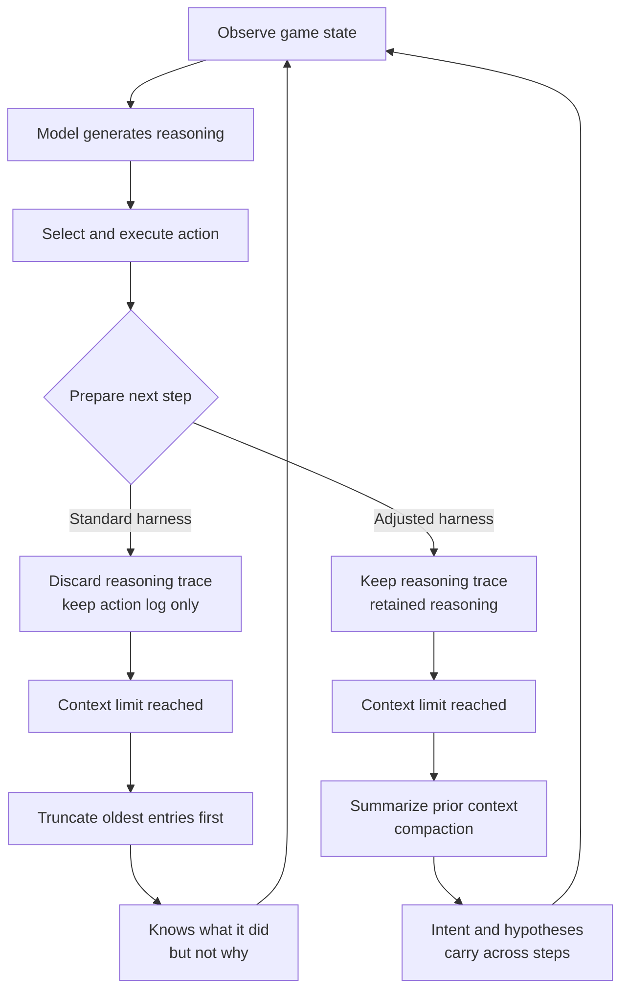

Anyone who has run an agent across many steps knows the symptom. The first few steps look sharp, then the agent starts forgetting what it figured out earlier and repeats the same mistakes. Upgrading to a bigger model rarely fixes it. The ARC-AGI-3 re-measurement OpenAI published in July 2026 shows, with fairly dramatic numbers, that the cause may sit outside the model entirely.

## Why this matters to you

This post is for engineers who operate multi-step agents, who own the inference bill, or who pick models based on benchmark numbers. Here is the conclusion up front: **the gap between 13.3% and 38.3% for the same model came from how the harness handled the model's working memory, not from model capability.** Whether reasoning traces are discarded or carried between steps, and whether an overflowing context is truncated or summarized. Those two choices moved accuracy and token cost at the same time. That fact is far more actionable than the leaderboard ranking itself.

## Overview

ARC-AGI-3 is a benchmark run by the ARC Prize foundation that tests whether a model can learn unfamiliar 2D puzzle games through trial and error. Where ARC-AGI-1 and 2 asked for a one-shot answer on a static grid transformation, version 3 is an agentic task: the model must take many moves and infer the rules itself. What gets evaluated is not a single correct answer but learning and memory sustained across dozens of steps.

On this benchmark GPT-5.6 Sol scored 7.78% on the official leaderboard. That was the first meaningful progress on ARC-AGI-3, given that the previous generation GPT-5.5 managed only 0.4%, but it sat far below the 30.2% Opus 5 recorded on the same leaderboard. A model being used on open problems in mathematics landing in single digits on 2D puzzle games looked odd to everyone.

Why GPT-5.6 Sol broke through this benchmark at all was covered in [an earlier post](/tech-blog/en/research/gpt-5-6-sol-arc-agi-3/) through the lens of orientation. This post covers the measurement dispute that followed.

OpenAI treated the gap as a measurement-environment problem rather than a capability ceiling, investigated, and published [its findings](https://openai.com/index/how-two-settings-tripled-our-arc-agi-3-scores/) in July. The finding: the standard harness discarded the model's internal reasoning after every action, and truncated older actions once the context filled. The model remembered what it had done but had lost most of why it did it before choosing the next move.

*What you keep and what you drop between steps decides how a multi-step agent performs.*

## What a harness is, and why it changes results

The harness is the outer software that actually runs the model. It shows the model the current game state, receives the response, extracts an action, executes it, and returns the changed state. The prompt template, how much conversation history to attach, whether reasoning tokens carry into the next turn, and what to drop when the context limit is hit all live here.

Benchmarks normally pin the harness to one implementation so models can be compared. That is a reasonable choice for fairness. The problem appears when the fixed harness does not fit how a particular model works. Reasoning models generate a substantial amount of internal thought before answering, and whether that thought can be forwarded to the next step differs between implementations. If it cannot, the model effectively restarts from a blank page every step.

*The same model travels two branches. The fork is what survives between steps.*

## What the two settings actually do

OpenAI turned on two things.

**Retained reasoning** forwards the reasoning trace the model produced into the next turn. In the standard implementation the action is extracted and the thinking behind it is thrown away. The history keeps "moved the purple block to the right" but loses "moved it to test whether blocks landing on same-colored tiles score points." In a task where rules must be discovered by trial and error, losing the hypothesis means the model re-forms hypotheses it already rejected and reruns the same experiments.

**Compaction** summarizes older content when the context hits its limit instead of cutting it. Truncation is simple and predictable, but the trouble is that the core rule discovered in the early steps sits exactly in the region that gets cut. The longer the game runs, the earlier the most important discovery is discarded. Compaction keeps that information in a denser form.

Both settings are exposed through OpenAI's Responses API. The older Chat Completions interface treats each request as independent, so there is no notion of the server carrying reasoning traces forward. OpenAI's recommendation to developers therefore reduces to three sentences: use the Responses API rather than Chat Completions, keep reasoning retained across turns, and enable compaction for long-running tasks.

## Reading the numbers precisely

Here is the published data, laid out so the comparisons stay honest.

| Model | Harness | Set | Score |
|---|---|---|---|
| GPT-5.6 Sol | Official standard | Semi-private | 7.78% |
| GPT-5.6 Sol | Official standard | Public | 13.33% |
| GPT-5.6 Sol | Responses API + both settings | Public | 38.3% |
| Opus 5 | Official standard | Semi-private | 30.2% |
| GPT-5.5 | Official standard | Semi-private | 0.4% |

The meaningful comparison is row three against row two. Same model, same public set, 13.33% to 38.3%, a relative increase of about 188%. And there is a detail people often skip. **While accuracy nearly tripled, output tokens per game fell to roughly one sixth.** Normally you buy reasoning quality with more tokens; here both moved in the same direction.

The reason makes sense on reflection. A model that lost its prior thinking has to reason the situation out from scratch every step. It re-verifies rules it already confirmed and re-examines options it already rejected. All of that repeated reasoning is output tokens. When context carries, the model can decide briefly: this was checked last time, move to the next hypothesis. Accuracy and cost improving together is a rare and welcome shape of improvement from an LLMOps standpoint.

The last row and row three, however, should not be set side by side casually. Opus 5's 30.2% comes from the official standard harness on the semi-private set, while GPT-5.6 Sol's 38.3% comes from an adjusted harness on the public set. Different harness, different dataset. On the official leaderboard Opus 5 remains the leader, and whether OpenAI's re-run belongs in the same table is an open question until independent replication happens.

## A checklist for porting this to your own stack

If you are not on the Responses API, for example serving open-weight models yourself with vLLM or SGLang, you have to build the same effect. Four things to check.

**One, do reasoning blocks survive in the history?** Most agent frameworks parse only tool calls and final text out of a model response and drop the thinking. Opening the parsing code usually makes this obvious in a glance. Feeding the thinking block into the next turn's prompt is a few lines of change, but it raises input tokens, so treat it together with the three items below.

**Two, how is the context limit handled?** Check whether you cut from the front, from the back, or insert a summary. The most common implementation cuts from the front, and that is precisely what loses early discoveries. When adding summarization, explicitly name what must be preserved. Confirmed rules, rejected hypotheses, and the current objective are a reasonable minimum.

**Three, where does the summarization cost land?** Compaction requires a summarization call, which adds latency and cost. There is no reason to use the same model tier for it. Summarization is comparatively easy and a small model is often enough, and that choice largely determines the overall economics.

**Four, what counts as an improvement?** Applying the lesson from this episode directly: judge on accuracy and output tokens together. Looking at one alone creates an illusion. If retained reasoning raises input tokens more than it lowers output tokens, total cost rises. Measuring both on your real workload is the only trustworthy verdict.

## What this means for ThakiCloud

This episode touches both products ThakiCloud operates.

**The ai-platform lens.** ThakiCloud's ai-platform is AI/ML infrastructure that serves customer workloads on Kubernetes and Kueue. The practical implication is clear: in multi-step workloads, the context management policy is not a tuning parameter but performance itself. Before adding GPU hours or moving up a model tier, look at what is being discarded between steps. The sixfold drop in output tokens matters especially here. For customers self-serving with vLLM in on-premises or sovereign environments, output tokens are GPU occupancy time, and the decode phase batches poorly, so it dominates real cost. Treating context compaction as a first-class serving-layer feature lets the same hardware carry more concurrent sessions.

**The Paxis lens.** Paxis is ThakiCloud's Agent-Native Cloud control plane running on top of ai-platform, treating skills, tools, policies, and audit logs as first-class resources. Here the harness is not a benchmark topic but a core component of the product. The skill harness selects candidates from over 960 skills with BM25, executes them in an isolated sandbox, and feeds results back into the loop. What survives between steps in that loop is something we design ourselves. Keep only tool-call results and drop why a tool was chosen, and you land in exactly the state of the standard harness in this story. Preserve intent and rejected hypotheses in compressed form and the same model produces better results. The principle of inspecting the harness before raising the model tier already appears, in almost the same wording, in our internal operating rules.

The two lenses complement each other. Cheap serving creates the economics of agents, and a well-designed harness converts that economics into actual quality.

## Limits and counterarguments

Summarizing this as "just turn on two settings" misses several things.

First, **there is no independent replication yet.** The 38.3% is OpenAI measuring its own model through its own API, not a third party reproducing it on the semi-private set. Divergence between vendor-reported and independent numbers is not unusual in benchmarks. Until ARC Prize verification appears, reading it as directional is safer.

Second, **calling the standard harness defective is too strong.** Benchmarks fix a harness to make cross-model comparison possible. If every vendor brings a harness tuned for itself, the leaderboard stops meaning anything. It is equally fair to note that a fixed harness can undersell a particular model. That tension does not resolve into "who is right"; reporting a standard track and a best-configuration track side by side is the more realistic direction.

Third, **retained reasoning and compaction are not free.** Keeping reasoning traces raises input tokens. Total cost fell here because the output-token drop was larger, not because that happens automatically on every workload. On short tasks you may pay the retention cost for little gain. Compaction also risks losing information during summarization, which makes the summarization policy itself a new tuning surface.

Fourth, **there is vendor lock-in.** Both settings are features of OpenAI's Responses API. If you self-host with vLLM or SGLang you must implement the equivalent yourself. Preserving reasoning traces is feasible at the prompt-assembly stage, but compaction requires attaching a separate summarization model, adding latency and cost.

## Wrapping up

The takeaway here is not the leaderboard order. It is that **one harness setting moved the same model across a threefold accuracy range and a sixfold output-token range at once.** In multi-step agents, performance does not live only inside the model; a large share of it rides on who manages memory between steps, and how.

The immediate action is simple. Open your production agent loop and see what gets discarded between steps. If you keep only tool-call results and drop the reasoning behind those choices, and if you truncate the oldest entries when context fills, you have the same structure as the standard harness in this story. Fixing those two points first is usually a better return than moving up a model tier. And when you read benchmark numbers, read the harness next to the model name. Without it you cannot even tell whether two numbers are measuring the same thing.

## Sources

- [How enabling two settings tripled our scores on the ARC-AGI-3 benchmark, OpenAI](https://openai.com/index/how-two-settings-tripled-our-arc-agi-3-scores/)
- [GPT-5.6 Sol, ARC-AGI Results](https://arcprize.org/results/openai-gpt-5-6-sol)
- [OpenAI on X](https://x.com/OpenAI/status/2082616636989952217)
