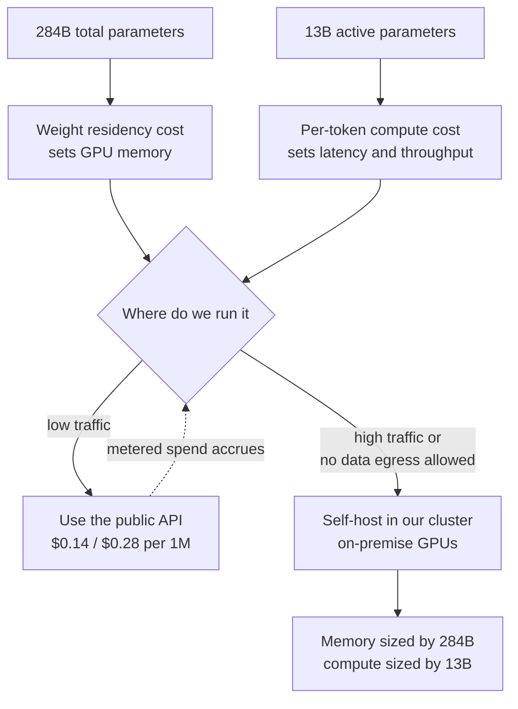

The first number people look at in a model announcement is usually the parameter count. But once you are the one who has to put that model on your own GPUs, a different number matters far more. DeepSeek-V4-Flash, opened in public beta on 31 July 2026, is a good case for explaining the difference. The total is 284B. What actually switches on to produce a token is 13B.

*Most of it stays dark and only part lights up. That is sparse expert routing in one picture.*

## Why this is worth reading

This piece is written for ML engineers choosing a model for agent workloads, and for infrastructure owners deciding whether to stay on a commercial API or bring the model into their own cluster. The conclusion first: **what deserves attention in this release is not the benchmark ranking but two things — that agent performance rose through post-training alone with the architecture untouched, and that a 13B active footprint pulls the break-even point for self-hosting much closer.** Rather than skimming the score table, we look at what each of those changes for pipeline design and for a GPU budget.

## Overview

DeepSeek announced the official V4-Flash API entering public beta on 31 July 2026. [Bloomberg](https://www.bloomberg.com/news/articles/2026-07-31/deepseek-unveils-public-beta-api-for-flagship-ai-model) and [TechNode](https://technode.com/2026/07/31/deepseek-puts-v4-flash-api-into-public-beta/) covered it the same day, and the company stated through its official account that agent capabilities had been substantially upgraded.

The most striking part of the announcement is an inversion of the usual hierarchy. The official V4-Flash build reportedly passes the higher-tier V4-Pro-Preview on several code benchmarks. A Flash line normally trades performance for speed and price, and this time it stepped over the tier above it.

The specifications: a 284B-parameter Mixture-of-Experts model, 13B active parameters per token, and a 1M-token context window. Public API pricing is listed at $0.14 per 1M input tokens and $0.28 per 1M output tokens. On aggregate indices, an Artificial Analysis Intelligence Index score of 50 is recorded.

One more item rides along: format compatibility. The model natively supports the Responses API format and is compatible with Codex, meaning applications using structured JSON output schemas can attach without an adapter layer.

## What actually changed

The technically most interesting statement in this release is not a performance figure but this one: the architecture is identical to the preview and only the post-training stage was iterated.

If the skeleton and the size are the same and agent performance still rose sharply, the cause sits in the training signal rather than in model capacity. Behavioral patterns like when to call a tool and when to stop, how to recover from a failed command, and how to carry a task across many steps are not bought by adding parameters. They are learned from data that contains those behaviors.

This observation points the same direction as recent harness research. The [paper on the interplay between harness design and post-training (arXiv:2606.25447)](https://arxiv.org/abs/2606.25447) showed that how well performance survives a shift in the tool environment depends heavily on which harness the post-training assumed. Improving agent performance from the model side and from the harness side are not separate efforts but a pair. We saw the same pattern in [the case where harness settings split the ARC-AGI-3 score](/tech-blog/en/llmops/arc-agi-3-harness-settings-context-memory/).

## How to read the benchmark numbers

Per press coverage relaying the announcement, the official build scores as follows.

*Vendor-announced figures as relayed by press coverage, not independently verified here.*

| Benchmark | Score | What it measures |
|---|---|---|
| Terminal Bench 2.1 | 82.7 | Completing multi-step work in a terminal |
| Cybergym | 76.7 | Security task solving |
| DSBench-FullStack | 68.7 | Full-stack data work |
| DeepSWE | 54.4 | Real software repair |
| NL2Repo | 54.2 | Building a repository from natural-language requirements |

Two things are worth holding in mind while reading. First, these are vendor-published values rather than independent measurements. Second, as noted above, agent benchmark scores are sensitive to harness configuration. The same model wrapped in a different tool set and context policy can move substantially. So this table is safer used to narrow a candidate list than as a ranking. The final choice has to be measured again on your own harness with your own tasks.

That the Terminal Bench family sits noticeably higher than the rest is also worth noting. Terminal work is a repeating loop of running a command, reading the output, and choosing the next action, which is among the easiest patterns to improve through post-training. Conversely, DeepSWE and NL2Repo remaining in the mid-50s signals that tasks requiring whole-repository understanding are still hard.

## A 284B MoE seen from the serving side

This is the part that matters practically for infrastructure owners. The cost structure of an MoE model hangs on two different numbers.

Memory is set by the total. Loading 284B in FP8 puts roughly 284GB in weights alone; BF16 roughly 568GB. KV cache and execution overhead stack on top. If you intend to actually use a 1M-token context, expect the KV cache to rival the weights. This calculation is derived directly from the parameter count and is not a measurement.

Compute is set by the active parameters. Only 13B participates in producing a token, so on raw arithmetic the model has speed characteristics close to a 13B dense model. It eats a lot of memory but is fast relative to that memory.

This asymmetry changes the self-hosting decision. A dense 284B model would have been off the list outright, unaffordable in both memory and compute. With 13B active the story differs. Secure enough memory and throughput comes out respectable. The question drops from "can we run this at all" to "which is cheaper, fixed GPU cost or metered API spend."

The break-even arithmetic is simple. With the public API at roughly $0.4 per 1M tokens combined, the API stays cheaper unless you process billions of tokens a day. Conversely, in an environment where data egress is prohibited, the calculation is unnecessary. There the question is feasibility rather than cost, and a 13B active footprint pushes feasibility toward yes.

## Working the sizing by hand

Pushing the numbers a little further. What follows is arithmetic derived from published specifications, not a benchmark. Replace it with measurements before making a decision.

Start with weights. At one byte per parameter, 284B in FP8 is about 284GB, and embeddings plus alignment overhead mean you should budget above that. Against an H200 card with 141GB, weights alone need at least three cards, and once KV cache and activation memory are included, tensor parallelism across eight cards is a realistic starting point. In BF16 the roughly 568GB makes even eight tight. In practice a MoE of this size is operated on the assumption of FP8 or lower quantization.

Next, the KV cache. A 1M-token ceiling also means the cache grows to match when you actually use that length. Hold long contexts across several concurrent requests and there is a regime where the cache, not the weights, is what exhausts memory first. In production it is safer to split context ceilings per workload rather than leaving the maximum open, and that decision belongs to operating policy rather than to the model spec.

Compute is far more comfortable. With 13B active per token, raw floating-point work resembles a 13B dense model. The bottleneck shows up first in memory bandwidth and expert-routing overhead rather than in arithmetic. Growing the batch to raise throughput works well on this class of model; driving single-request latency to a minimum does not.

Put the three together and the operating picture appears. This is a model that occupies a node for a long time and only pays for itself if that node serves many concurrent requests. Dedicate this size to sporadic low-frequency calls and the GPUs idle most of the time. If you are considering self-hosting, the right first step is checking whether your traffic is steady enough to fill a batch.

## What this means for ThakiCloud

Through the **ai-platform** lens, this release widens the on-premise serving candidate list by one slot. ThakiCloud's ai-platform runs vLLM serving on Kubernetes and Kueue-based GPU scheduling, hosting several models at once in a multi-tenant setup. MoE models are awkward in that structure: the weights are large enough to hold a node for a long time, yet the small active footprint leaves the GPU idle between bursts. MoE serving therefore suits scheduling that layers multiple workloads onto shared capacity better than dedicating a node to a single model. Coordinating training and inference jobs out of the same queued pool is where the gain shows up.

For customers in finance and the public sector where data egress is restricted, the options differ in kind. However low the public API price falls, in an environment where it cannot be used at all, the existence of a self-hostable high-performance model is the difference between a viable business and none. Large MoE models with small active footprints fit that requirement particularly well.

Through the **Paxis** lens, native Responses API support matters more. Paxis is the Agent-Native Cloud control plane running on ai-platform, treating Skills, Tools, Policies, and Audit Logs as first-class resources. From a control plane's point of view, most of the cost of swapping a model comes from interface differences rather than model quality. When tool-call formats and structured-output schemas differ per model, you maintain an adapter per model, and those adapters quietly rot. The more models support widely used formats natively, the closer a control plane gets to treating a model swap as a configuration change. Cheap serving creates agent economics, and standard interfaces make those economics actually swappable.

## Limitations and counterarguments

There is no reason to read this release optimistically only.

First, it is a public beta. Stability during beta and the terms after general availability can differ. This is not the moment to raise production dependence sharply.

Second, the scores are vendor-published. As noted, agent benchmarks are sensitive to harness configuration, and we cannot rule out that the announcing party selected the configuration best suited to its own model. Until verified on your own tasks, these are reference values.

Third, the 1M-token context is where advertising and real usage diverge most. Actually filling a long context grows KV cache memory and latency together, and whether accuracy holds over long inputs needs separate verification. Mistaking a context ceiling for a throughput guarantee wrecks capacity planning.

Fourth, the serving arithmetic in this post is derived from parameter counts, not measured. Required GPU count shifts with batch size, quantization scheme, and parallelism strategy. If you are evaluating adoption, stand up a small deployment on your own cluster first and collect real numbers.

## Wrapping up

If you take one sentence from the announcement, take this one rather than a benchmark score: agent performance was lifted through post-training alone, with the architecture untouched. That points in exactly the same direction as recent findings that agent performance depends more on behavioral learning and the harness wrapped around it than on model size.

Returning to the conclusion stated at the top, the practical meaning of this release for infrastructure owners is the 13B active footprint. If you crossed it off the list on seeing 284B, it is worth putting back on. Memory demands like a large model, speed behaves like a small one, and that combination is precisely what creates options in environments where data cannot leave the building.

If we suggest one next action, count how many adapters your current agent pipeline binds its model interface to. That count is the price of moving to the next model, and every time a candidate this good appears, the bill is presented again.

## Sources

- [DeepSeek unveils public beta API for flagship AI model (Bloomberg)](https://www.bloomberg.com/news/articles/2026-07-31/deepseek-unveils-public-beta-api-for-flagship-ai-model)
- [DeepSeek puts V4-Flash API into public beta (TechNode)](https://technode.com/2026/07/31/deepseek-puts-v4-flash-api-into-public-beta/)
- [DeepSeek Launches V4-Flash API Public Beta with Major Agent Capability Leap (BigGo Finance)](https://finance.biggo.com/news/a9264fb5-e34c-4455-acfa-6ca8f82db46b)
- [DeepSeek V4 Flash: 284B MoE, 1M Context, Benchmarks, Pricing](https://www.morphllm.com/deepseek-v4-flash)
- [DeepSeek V4 Flash 0731 Intelligence, Performance & Price Analysis (Artificial Analysis)](https://artificialanalysis.ai/models/deepseek-v4-flash)
- [DeepSeek V4 Flash API Pricing & Benchmarks (OpenRouter)](https://openrouter.ai/deepseek/deepseek-v4-flash)
- [DeepSeek API Change Log](https://api-docs.deepseek.com/updates/)
- [The Interplay of Harness Design and Post-Training in LLM Agents (arXiv:2606.25447)](https://arxiv.org/abs/2606.25447)
