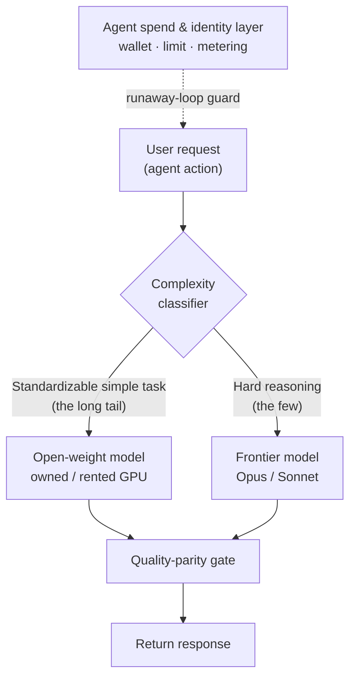

*Most traffic goes to the cheap lane, a few to the premium lane. The cost structure of an agentic product is decided at that sorting step.*

## Why read this

This post is for engineers running an agentic product who watch the inference bill grow faster than revenue, and for infrastructure owners deciding whether to keep paying a commercial API or move workloads onto their own cluster. The short version is that the cost of an agentic product is decided not by which model you use, but by **which request you send to which model**. A recent founder interview shows this with unusual clarity. A product that routed every agent action to a frontier model pushed its bill to $1.2M a month, then brought it down to about $100K after two months of redesign. We look at what changed to produce a twelvefold difference, and where the same judgment lands inside our own platform.

## A product whose bill broke first

The subject is a product called Polsia. Its founder, Ben Broca, runs it solo, and the goal is that a user supplies only an idea while a fleet of AI agents runs an entire company on their behalf: coding, marketing, customer acquisition, support. It drew attention when it raised $30M at a $250M valuation with zero employees, with agents even handling the data room and investor briefings. The interesting part is not the success story but the fact that the cost structure broke first.

The numbers the founder gives in the [interview](https://www.youtube.com/watch?v=bzf2YZa0Vkg) run like this. In March, paying users grew from 500 to 5,000, and the inference bill hit $500K in a single month, then crossed a million, peaking at $1.2M a month. The cause is simple. Every time something happened inside the product, the thing doing it was an agent, and that agent mostly called a frontier model like Opus or Sonnet. The more automation was added, and the more complex the tasks users asked for, the faster the call volume grew, more than linearly.

Here is the first lesson. Adding money does not fix the product. The founder bought himself room to absorb the cost by raising a round, but he says it plainly: cash gave breathing space, it did not solve the product. The math showed that going from 5,000 to 50,000 users would burn the entire raise within a few months, so the structure had to change before scaling. Recognizing this as an architecture problem while the bill was still affordable is the most important call in the whole story.

## What changed: split the requests, build a cheap lane

The redesign started from an honest look at the traffic. In the founder's own words, most users "ask rather simple things and have rather simple codebases, so you can standardize all of that." The lever was the fact that requests are not uniform. A small number of hard requests and a large number of standardizable simple ones were mixed together, and processing both through the same frontier model was the real source of waste.

So the new structure is this. The standardizable long tail is pushed down to open-weight models running on rented GPUs, and only the genuinely hard reasoning stays on frontier models. When a request comes in, its complexity is classified first, and the destination model is chosen from that classification. Configuring this took about two months, and in June the bill dropped from $1.2M to roughly $100K. The twelvefold gap did not come from picking one cheaper model. It came from pulling most of the traffic out of the expensive lane in the first place.

I want to stress the second lesson here. This is not free. Those two months were real engineering: building the classifier, serving the open models, and above all verifying that the quality of requests sent to the cheaper model did not hurt the user experience. Routing without a quality-parity gate reduces cost by increasing churn. For the cheap lane to hold, you need a mechanism that decides deterministically whether "this request produces the same result on the cheaper model."

What the classifier keys on is the hardest part of the design. Request text alone is not enough. Whether the task is generation, edit, or lookup; how large and structured the target codebase is; how deep the expected tool-call chain runs; how similar past requests were handled; these signals together decide whether a request is standardizable. And this judgment cannot be left to the model's self-report. Not the model's claim that "this is an easy request," but a gate where code deterministically measures whether the output passes the same bar as the frontier model, is what earns the router trust. A classifier that quietly passes failures on the cheap lane does not reduce cost; it defers a quality incident.

<figure style="max-width:720px;margin:0 auto">

<figcaption>Complexity-based routing sends the standardizable many to the cheap lane and only the hard few to the premium lane. Without a quality-parity gate, the cost saving turns into churn.</figcaption>
</figure>

## Not one case, but a whole layer forming

Reading this only as one product's war story is reading half of it. Three companies appear in the interview, and overlaying them shows how the layer that handles cost in the agent era is splitting apart.

At the top is the product layer. This is where a fleet of agents runs a 24-hour loop doing real work, as in Polsia. The defining trait of this layer is that every action is a model call, so cost explodes along with usage.

Below it is the spend and identity layer. Sapiom, which Polsia named as its agent infrastructure in the interview, sits here. Sapiom aims to give an agent a unique identity and wallet the way a person has KYC, to let it pay for external tools, APIs, and compute on a usage basis through a single API, and to stop runaway loops with spend limits and risk detection. Founded by former Shopify engineering director Ilan Zerbib, it raised a $15.75M seed according to [SiliconANGLE](https://siliconangle.com/2026/02/06/sapiom-reels-15-75m-equip-ai-agents-payment-features/). The moment autonomous agents buy their own resources, a mechanism that meters who spent how much at the identity level and applies limits becomes one axis of the infrastructure.

At the bottom is the serving layer. Sciforium, backed by AMD and SignalFire with roughly $12M raised, is a clear example. While most AI clouds depend on Nvidia, Sciforium puts its own high-efficiency serving stack on AMD hardware and offers multimodal inference at lower cost than the norm. With AMD engineers directly helping tune the runtime, it shows that a heterogeneous-accelerator strategy for routing around single-vendor premium is becoming real, with capital and talent behind it.

The logic running through all three companies is one thing. The moment you make a frontier model the default, the unit cost of an agentic product becomes unsustainable, and so the layers that split requests, meter spend, and push serving onto cheaper hardware are each growing large enough to be a standalone business.

## What this means for ThakiCloud's products

Overlaying this case on our own stack, we do not find an unfamiliar new demand so much as confirmation of where we already stand. This section is not about building something new; it maps where the pattern lands in our platform.

The serving and platform layer overlaps precisely with the Metis value proposition. If Polsia spent two months arriving at the conclusion "rent GPUs and serve open models behind OpenAI-compatible endpoints," then Metis Serve and ML Studio, together with Kueue-based GPU scheduling and the model registry, are that conclusion turned into product. In particular, the heterogeneous-accelerator serving that Sciforium is trying to prove, running the same models behind the same API not only on Nvidia but on AMD or domestic NPUs, looks at the same place Metis was designed to look, as an accelerator-agnostic platform. This case is external confirmation of the market demand for the serving layer we are building.

The agent runtime layer touches the problem space of Praxis. When a fleet of agents runs continuously and every action is a model call, there are two ways to control cost: per-node complexity-based model routing, and budget caps with spend guardrails. The spend governance that Sapiom wants to hold with identity, wallet, and limits is the same kind of control layer that Praxis agents need in production. This case proves, with a bill, that a mechanism stopping an autonomous loop from calling expensive models without limit is not optional but a precondition.

To add one more note, starting on a cheaper tier by complexity and escalating to a higher model only when needed is a discipline we already follow in our own automation. Exploration and simple lookups go to lighter models, only steps that need real reasoning go to higher ones, and retro-driven escalation raises the tier only when repeated failures are observed. The conclusion Polsia reached from the outside and the routing discipline we run on the inside say the same sentence: cost is decided by which request goes where, not by model price.

## Wrapping up

The most expensive mistake in building an agentic product is leaving the default that routes every action to a frontier model unexamined. Polsia's case shows, with a bill, how that default becomes a $1.2M-a-month invoice, and how a redesign that splits requests by complexity and pushes the standardizable many onto open-weight models produces a twelvefold difference. That saving came with the price of two months of engineering and a quality-parity gate, not from picking one cheaper model. And the three layers this redesign needs, the agent runtime, spend governance, and heterogeneous serving, are splitting into a market large enough for each to be its own business, with the serving and routing layers being exactly where we already stand with Metis and Praxis.
