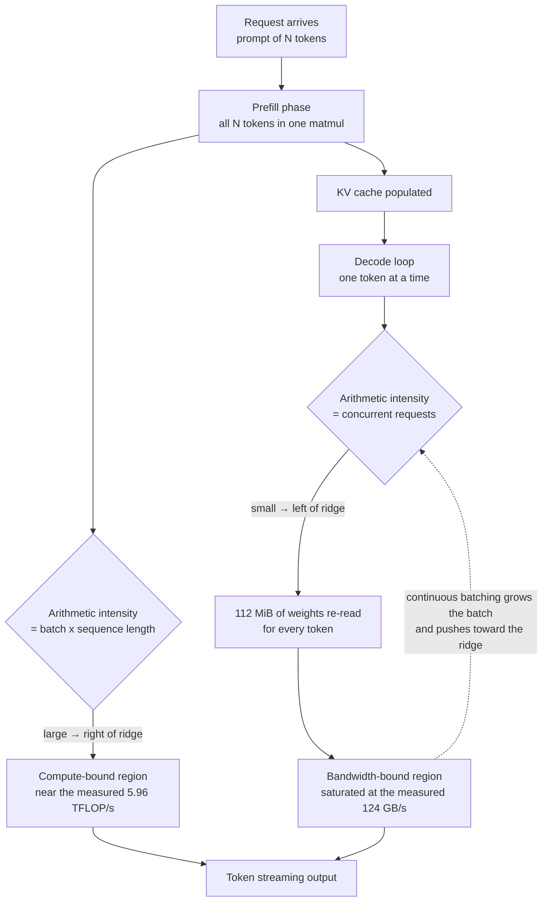

*Wide compute, one narrow pipe. That is the exact shape of an LLM decode step.*

## Why this matters

This post is for infrastructure owners who have to buy GPUs and put models on them, and for ML engineers deciding how hard to push their serving parameters. The conclusion first: **a decode step serving a single request uses roughly 2% of the accelerator's compute and spends the rest of its time reading weights out of memory. What you need to increase in inference serving is not GPU compute but the number of requests handled concurrently, and the threshold where that stops paying off can be computed for any device.** Below we measure that threshold directly.

The topic came out of a timeline post listing [what an AI engineer should learn](https://x.com/hjguyhan/status/2084039209313350116). Near the top of that list sat two items side by side: learn the roofline model and why decode is memory-bound, and go deploy vLLM and SGLang. Those are really one story. Understand the first and the design of the second explains itself.

## Overview

LLM inference splits into two phases with completely different characters. Prefill pushes the whole prompt through at once; decode produces one token at a time. Most of what a user perceives as response speed comes from decode. A 500-token answer means 500 decode steps, and the sum of those 500 is the response time.

This is where intuition breaks. A single decode step needs very little arithmetic. You push one token through each matrix multiply and you are done. Yet it is slow. The reason is not the arithmetic but **the volume of weights you must read to perform it**. For an 8B model in fp16 that is 16 GB pulled out of memory for every single token. The arithmetic units spend most of their time idle, waiting for data to arrive.

The tool that draws this relationship on one chart is the roofline model. Formalised by Williams, Waterman and Patterson in CACM 2009, it explains a kernel's performance ceiling using two hardware constants: peak compute and peak memory bandwidth. Compute a kernel's **arithmetic intensity**, meaning the number of floating point operations performed per byte read from memory, and you know whether it is compute-bound or bandwidth-bound.

The key result is what that number becomes for LLM decode. Take one weight matrix and push B tokens through it: the arithmetic scales with the batch, but the weight bytes you must read stay the same. In other words, **the arithmetic intensity of decode is simply the batch size**. At batch 1 the intensity is 1, which is dismally low on any accelerator you can buy.

## What the model actually says

The roofline coordinate system is simple. Arithmetic intensity on the x-axis, achieved performance on the y-axis. The ceiling is a roof formed by two lines: a slope on the left whose gradient is the memory bandwidth, and a flat line on the right at peak compute. Where they meet is the ridge point, and its x-coordinate is peak compute divided by peak bandwidth.

Anything to the left of the ridge is bandwidth-bound. In that region, swapping in a faster arithmetic unit changes nothing. To the right of the ridge the kernel is compute-bound and widening memory does nothing. Few compasses point at the right optimisation this clearly.



The dashed feedback edge is the essence of what serving engines like vLLM and SGLang do. The arithmetic intensity of an individual request is not set by the user, it is set by the scheduler. Group the requests in flight at the same moment into one batch and a single weight read advances all of them, raising intensity by the number you grouped. vLLM makes this practical by splitting the KV cache into fixed-size blocks that need not be physically contiguous ([PagedAttention](https://docs.vllm.ai/en/v0.4.2/models/performance.html)), and its chunked prefill slices long prompts so they can be interleaved between decode steps instead of monopolising an iteration. [SGLang](https://github.com/sgl-project/sglang) adds [RadixAttention](https://arxiv.org/pdf/2312.07104), sharing common prefixes across requests through a radix tree to cut the prefill work itself. The three techniques are not mutually exclusive and are [used together](https://github.com/vllm-project/vllm/issues/2560).

## Setup and integration

Let us measure it. All you need is PyTorch, and we used the version already present in the repository's shared virtual environment.

```bash
# repository shared .venv (Python 3.12.8)
VIRTUAL_ENV="$PWD/.venv" uv pip install torch matplotlib
.venv/bin/python -c "import torch; print(torch.__version__, torch.backends.mps.is_available())"
# 2.13.0 True
```

The benchmark has three parts. First, copy a 256 MiB fp16 buffer device-to-device and derive effective bandwidth from the combined read and write traffic. Second, run a 4096 square fp16 matmul to find the compute ceiling. Third, take a `4096 x 14336` weight, the same shape as the Llama-3-8B FFN up projection, and sweep batch size from 1 to 512.

```python
K, N = 4096, 14336          # Llama-3-8B hidden / intermediate
w = torch.empty(K, N, dtype=torch.float16, device="mps").uniform_(-0.02, 0.02)

for b in [1, 2, 4, 8, 16, 32, 64, 128, 256, 512]:
    x = torch.empty(b, K, dtype=torch.float16, device="mps").uniform_(-1, 1)
    secs = timed(lambda: torch.matmul(x, w), "mps")   # 3 warmup + mean of 20
    flops = 2.0 * b * K * N
    total_bytes = w.numel() * 2 + (x.numel() + b * N) * 2
    # arithmetic intensity = flops / total_bytes ≈ b
```

It is worth pausing on why the third part is shaped like this. The arithmetic is `2 x B x K x N` and the bytes read are dominated by the weight at `K x N x 2`. Divide one by the other and exactly `B` remains. This sweep is therefore **a walk along the x-axis of the roofline, driven by batch size**. No model checkpoint to download, no serving engine to bring up.

Everything ran inside an isolated worktree.

```bash
bash scripts/blog/impl_sandbox.sh setup llm-decode-roofline
bash scripts/blog/impl_sandbox.sh run  llm-decode-roofline -- .venv/bin/python roofline_bench.py
bash scripts/blog/impl_sandbox.sh teardown llm-decode-roofline
```

## Measured results

The environment was macOS 26.5.2 arm64, PyTorch 2.13.0, MPS backend. Every number below is taken verbatim from `run-1.log`. None of it is estimated.

The two hardware constants first.

| Metric | Measured |
|---|---|
| Effective memory bandwidth (copy) | 124.4 GB/s |
| fp16 4096³ matmul | 5.96 TFLOP/s |
| Roofline ridge point | 48.0 FLOP/byte |

A ridge at 48 means that unless you perform at least 48 operations per byte read from memory, you cannot fill this device's arithmetic units. And as established, the arithmetic intensity of decode equals the batch size. So **until the batch reaches 48, decode is bandwidth-bound without exception.**

The sweep shows exactly that.

| Batch | Step time | Achieved compute | Time per token |
|---|---|---|---|
| 1 | 0.834 ms | 140.8 GFLOP/s | 834.2 µs |
| 8 | 0.904 ms | 1,038.8 GFLOP/s | 113.1 µs |
| 16 | 0.920 ms | 2,042.9 GFLOP/s | 57.5 µs |
| 32 | 1.033 ms | 3,637.6 GFLOP/s | 32.3 µs |
| 64 | 1.413 ms | 5,317.9 GFLOP/s | 22.1 µs |
| 512 | 10.015 ms | 6,003.9 GFLOP/s | 19.6 µs |

The interval worth staring at is batch 1 through 16. Sixteen times as many tokens, and step time moved from 0.834 ms to 0.920 ms, a rise of about 10%. Fifteen of those tokens were effectively free. Reading the 112 MiB of weights dominates everything, so it barely matters how many tokens ride along on that one read.

Past batch 64 the character changes. Step time starts growing in proportion to the batch while time per token barely moves, from 22.1 µs to 19.6 µs. We have crossed the ridge into the compute-bound region. The calculated ridge of 48 sitting between the observed inflection at 32 and 64 is a clean agreement.


*The measured points sit precisely on the slope. Growing the batch is not an optimisation, it is a move to the right along the axis.*

Batch 1 summarised in two ratios: compute utilisation is **2.36%** of peak, while effective bandwidth reads as **113.2%** of the copy-based ceiling. Exceeding 100% is not an error, it is a property of the baseline. The copy benchmark includes writes, and writes carry extra traffic to fill the cache line first. A read-only matmul avoids that overhead and therefore achieves higher effective bandwidth. The conclusion is unambiguous: batch-1 decode saturates the memory bus completely while the arithmetic units idle.

The gap in per-token time between batch 1 and batch 512 is **42.6x**. Same hardware, same kernel, same precision. Scheduling alone.

## What this means for ThakiCloud

ThakiCloud's ai-platform runs tenant-isolated inference workloads on Kubernetes. The measurement above compresses the reasoning we apply when sizing GPU capacity.

First, **it changes how you pick a GPU.** For decode-heavy workloads, memory bandwidth and capacity determine throughput far more directly than the TFLOPS figure in the catalogue. At a fixed budget there is a real region where a device with lower peak compute but wider bandwidth wins on cost per token. Which side you are on is not a matter of taste; a fifteen-line sweep answers it per device.

Second, **how you partition tenants drives cost.** Handing each customer a dedicated GPU is operationally simple, but it leaves every GPU running near batch 1, using a couple of percent of its arithmetic units. That is why we shard queues with Kueue and funnel requests that share a model into a single serving instance. Filling the batch toward the ridge is the same thing as reducing GPU count.

Third, **it moves the break-even point for on-premise deployments.** Cost per token on your own cluster is GPU hourly cost divided by actual achieved throughput. If the batch never fills, that denominator is forty times smaller and no self-hosted setup will beat a commercial API. Once traffic is dense enough for batches to fill, the cost curve of the same hardware drops sharply. Traffic density is the first thing we check with customers evaluating on-premise for regulatory or data sovereignty reasons.

Agent workloads have a convenient property here. Paxis, ThakiCloud's Agent-Native Cloud, runs a skill harness that selects from more than 960 skills and executes them in isolated sandboxes, and that process generates many short concurrent inference requests. Unlike traffic from humans sitting one at a time in front of a chat box, agent traffic is naturally concurrent. As the curve above shows, high concurrency means operating in the low cost-per-token region. That is the advantage of running the agent platform and the inference infrastructure under one roof.

## Limits and counterarguments

This was measured on a laptop-class accelerator with unified memory. Datacentre GPUs such as the H100 or H200 use HBM, with bandwidth in the single-digit TB/s range and correspondingly larger compute. The absolute numbers differ, obviously. What holds regardless of hardware is that a ridge exists and that decode's arithmetic intensity equals batch size. In practice, compute on high-bandwidth datacentre parts has grown faster than bandwidth, so their ridge often sits further right, meaning you need an even larger batch to fill the arithmetic units.

Narrowing the measurement to a single FFN matmul is also a limitation. A real decode step includes attention kernels, and attention reads the KV cache rather than weights, so the bytes grow with sequence length. Growing the batch grows the KV cache with it, and memory capacity frequently binds before the ridge does. In production, the batch ceiling is usually set by free memory for the KV cache rather than by the roofline. That is precisely why PagedAttention concentrates on reducing fragmentation waste.

It should also be clear that growing the batch is not free. Step time at batch 512 is 10 ms against 0.834 ms at batch 1, twelve times longer. Throughput is at its best but inter-token latency for an individual user gets worse. For a conversational product, decide where you stand between throughput and latency as a service level objective first, then pick the maximum batch inside that constraint. The ridge tells you the ceiling; it does not tell you the target.

## Wrapping up

Batch-1 decode uses 2.36% of the arithmetic units while completely saturating the memory bus, and growing the batch from there cuts time per token by 42.6x. Those two measured facts are the whole story. Once you know them, it becomes obvious why vLLM's continuous batching and chunked prefill and SGLang's prefix sharing all converged on filling the batch. They are not different optimisations; they are different ways of pushing requests rightward along the same axis.

So the next time you need to improve inference performance, add one step before you go shopping for a faster GPU. Measure bandwidth and compute on the device you intend to use, derive the ridge, and check whether your current batch sits to its left or its right. If it sits to the left, the answer is in your scheduler configuration, not in new hardware. The sweep in this post needs no model weights and no serving engine, and finishes in fifteen minutes with PyTorch alone.

## Sources

- Original discussion: [what an AI engineer should learn (timeline)](https://x.com/hjguyhan/status/2084039209313350116)
- Roofline: An Insightful Visual Performance Model for Multicore Architectures, Williams, Waterman and Patterson, CACM 2009
- [vLLM performance and tuning docs (chunked prefill, PagedAttention)](https://docs.vllm.ai/en/v0.4.2/models/performance.html)
- [SGLang repository](https://github.com/sgl-project/sglang) · [SGLang paper (RadixAttention)](https://arxiv.org/pdf/2312.07104)
- [vLLM issue #2560: compatibility of RadixAttention with existing techniques](https://github.com/vllm-project/vllm/issues/2560)
- Measurement log: every figure comes from `outputs/blog-impl/llm-decode-roofline/run-1.log`.
