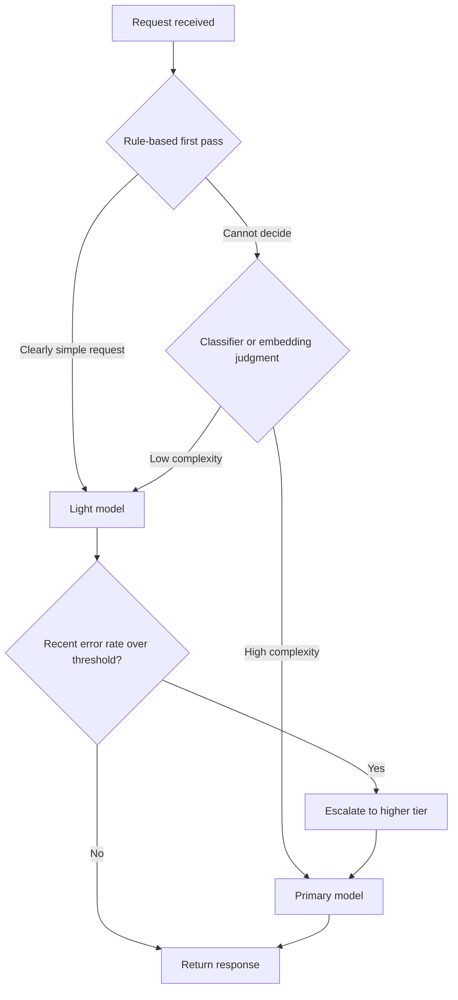

Any engineer who has shipped an LLM feature into production knows this scene. In the beginning, a single top-tier model handles every request. As traffic grows, the bill balloons faster than expected, and only then does the question surface: did this request really need to go to the best model? This post covers model routing, the practical answer to that question. We walk through how to split models into tiers, what criteria to use when assigning requests to those tiers, and why that judgment so often goes wrong.

Routing is not a standalone cost-cutting device the way caching or token budgets are. It is an economic judgment about which model a given request deserves. Get the judgment right and costs drop sharply with no loss of quality. Get it wrong and quality suffers while the savings stay marginal. Knowing where that line sits is the goal of this post.

## Routing Doesn't Work Until You Define Tiers First

If you've decided to mix models, the first task is not writing routing logic but defining tiers. Without tiers, deciding "which model should handle this request" case by case means the criteria drift from one request to the next, and later, when you analyze costs, you won't be able to explain what was expensive or why.

Tiers usually come in three layers. The first is the primary model: the most expensive, most capable model, reserved for work where a mistake is costly, such as complex reasoning or creative generation. Keeping its call frequency as low as possible is the design goal. The second is the routing model, whose job is to gauge a request's difficulty first and decide whether to escalate it to the primary model or filter it out. Because this model isn't producing the final answer but classifying, a model cheaper than the primary tier is often enough. The third is the light model, which handles work where a mistake is easy to undo: simple classification, formulaic summarization, repetitive fact lookups. It gets called most often and costs the least per call.

The core of this structure is inverting the shape of your traffic. Without tiers, every request funnels toward the primary model, forming a pyramid. With tiers, most requests get resolved at the light-model layer, and only the fraction that genuinely needs it climbs to the primary model, forming an inverted pyramid. That inversion is where the actual savings come from. If caching works by eliminating repeated requests, routing works by reducing, from the outset, how many requests ever reach the expensive model. The two operate on different axes, so it's natural to run them together.

A common mistake when splitting tiers is basing the split purely on a model's raw size. The real dividing line is role, not size. Because the routing model's job is to render a verdict, not produce the final answer, a smaller model is fine as long as its verdict accuracy holds up. Conversely, asking a light model to generate final responses while expecting primary-model-level quality breaks the whole tier design. The order matters: define the role first, then assign the model that fits it.

## What Grounds a Routing Decision

Once tiers are set, the next question is what determines which tier a given request goes to. In practice there are three broad approaches, each with different implementation difficulty and coverage.

The simplest is rule-based decisions: branching on surface attributes like request length, keywords present, or request type. It's easy to implement, and a human can explain the reasoning behind any decision immediately. The drawback is that some fraction of requests will always fall outside what the rules can explain.

```python
def rule_based_route(request: str) -> str:
    length = len(request)
    if any(k in request for k in ("classify", "summarize")) and length < 500:
        return "light"
    if any(k in request for k in ("analyze", "draft", "strategy")) and length >= 1000:
        return "primary"
    return "router"  # Hand off to the routing model when no rule matches
```

The second approach is classifier-based. You accumulate past requests and the quality level each one actually needed as labels, then train a small classification model on them. This catches nuance that rules miss. For example, two requests can share the same word yet require very different depths of reasoning: "explore the concept of love philosophically" versus "what's the English word for love." Rules struggle to tell these apart, but a classifier can learn the distinction from context and tone. The cost is labeled training data and the ongoing maintenance of the classifier itself.

The third is embedding-based similarity. You embed the new request and measure its distance to requests previously handled by each tier. If it's close to past primary-model traffic, it goes to the primary model; if it's close to past light-model traffic, it goes there instead. The advantage over a classifier is that it needs no labeled training data.

```python
import numpy as np

def embedding_route(query_vec, primary_vecs, light_vecs, threshold=0.82):
    def max_sim(vecs):
        sims = query_vec @ np.array(vecs).T
        return float(sims.max()) if len(vecs) else 0.0

    if max_sim(primary_vecs) >= threshold:
        return "primary"
    if max_sim(light_vecs) >= threshold:
        return "light"
    return "router"  # Hand off the verdict when neither tier is close enough
```

That single threshold decides the fate of embedding-based routing. Raise it and more borderline requests flow to the routing model, which is safer but shrinks the savings. Lower it and more requests get an immediate verdict, which grows the savings but also the risk of a wrong call. This isn't a value you set from theory; you tune it by watching the misclassification rate on real traffic.

Don't treat this as a question of picking the one correct method among the three. In practice, teams commonly combine them: rules filter out the obvious cases first, and only what the rules can't resolve gets passed to a classifier or embedding lookup. Since rules are fast, cheap, and explainable, it makes sense to keep them as the first filter and reserve the costlier methods for the cases that genuinely need finer judgment.

When setting routing criteria, you also need to account for two separate axes of judgment. One is decision routing, which asks whether the request demands complex reasoning. The other is quality routing, which asks what level of quality the response requires. The first looks at the difficulty of the request itself; the second looks at the required standard in the business context. This is why a customer-facing response and an internal log summary should go to different tiers even when they're equally difficult as requests. If you collapse these two axes into one when designing routing logic, your criteria blur, so it's better to decide upfront which axis takes priority.

## Why the Middle Tier Goes to Waste on the Cost-Quality Curve

There's one thing you have to check before introducing routing: whether the tier structure you're about to adopt actually produces savings, or whether it's just adding complexity. The way to check is the cost-quality tradeoff curve.

This curve plots cost on the horizontal axis and a quality score on the vertical axis, and you plot where each tier actually falls. With three tiers, in theory you'd expect three points lined up along a diagonal: low cost/low quality, medium cost/medium quality, high cost/high quality.

| Tier | Cost profile | Quality profile |
|---|---|---|
| Light model | Lowest | Often higher than expected on simple tasks |
| Routing model | Medium | Frequently lands in an ambiguous spot |
| Primary model | Highest | Highest overall, but gains taper off sharply past a certain point |

When you actually plot this curve, the shape often diverges from expectations. There are stretches where the light model's quality is higher than you'd think, and past a certain point the primary model's quality gains flatten noticeably relative to its added cost. The spot that causes trouble most often on this curve is the middle tier. It frequently sits in a region where the cost is clearly higher but the quality isn't much different from the light model. In other words, you're spending more money for a result that barely improves.

This happens for two reasons in short. First, when teams build the routing model, they typically pick a "reasonably good" model, and that reasonableness fails to produce a perceptible quality gap over the light model for certain task types. Second, request distributions are often polarized to begin with. Look at real traffic and it's mostly genuinely simple requests and genuinely complex requests, with fewer ambiguous requests in between than you'd expect. When mid-difficulty requests are scarce, the middle tier's reason for existing weakens along with them.

The practical conclusion this curve points to is clear: a simple binary split, high-quality-demand requests to the primary model and low-demand ones to the light model, already captures most of the achievable savings. Keep the middle tier only after you've plotted the curve and confirmed it's genuinely needed. Plotting the curve itself isn't hard. Run a sample of past requests through both the primary and light models simultaneously and compare response quality. The share of requests where the two responses show negligible quality difference is exactly the scale of savings a pure binary routing scheme can capture. Only when that share comes out low do you have grounds to add a middle tier.

## Two Side Effects Routing Creates

Introducing routing does reduce cost, but not for free. There are two notable side effects, and if you don't address them at the design stage, they come back as reliability problems in production.

The first is unhandled edge cases. The routing engine judges a request as ambiguous difficulty and sends it to the routing model, and the routing model produces a wrong answer for it. The problem is that, from the user's perspective, this failure doesn't register as a routing error, it registers as the service's quality declining overall. Users don't know which model answered, so a mistake by the routing model reads as a mistake by the service.

There are two ways to handle this. One is to continuously monitor the routing model's error rate broken down by tier and request type, watching for whether errors cluster around a particular pattern. The other is building an escalation path: prepare a flow in advance that resends a request to the primary model whenever the user expresses dissatisfaction or asks for a rewrite.

```python
def route_with_escalation(request_id, tier, error_tracker):
    error_rate = error_tracker.recent_error_rate(tier, window=100)
    if tier != "primary" and error_rate > ERROR_RATE_THRESHOLD:
        # If the recent error rate crosses the threshold, pause routing to this tier
        return "primary"
    return tier
```

The second side effect is quality instability. A light model can produce a different response to the same request sent twice. The more nondeterministic a model's output, the more this variance stands out. For features where consistency matters, say, a classification feature that must return the same result for the same data every time, this variance goes beyond a simple quality drop and turns into a trust problem.

Mitigation depends on the situation. The most direct fix is lowering the generation temperature or choosing a model that supports a deterministic mode. For features where consistency is especially critical, it's also worth caching the light model's responses themselves so the same request always returns the same answer. That said, using a cache to enforce consistency doesn't fit requests whose responses are supposed to change over time, so you need to first sort out which features genuinely require deterministic answers.

Drawn out end to end, the routing system looks like the flow below: rules filter the obvious requests first, only the remainder passes to more sophisticated judgment, and even after that judgment the error rate keeps getting monitored so requests can be escalated back to a higher tier when needed.



The important detail in this diagram is that the arrows don't all flow in one direction. Without a path back from the light model to the primary model, routing stops being a savings mechanism and becomes a quality-degradation mechanism. Building that return path costs far less than sending every request to the primary model from the start, so skipping it is a risk you don't need to take in the name of savings.

## From ThakiCloud's Perspective

Because we serve models directly in our clients' on-prem environments, our view of routing differs somewhat from a team paying by the API call. In an API-based service, routing is purely a matter of reducing the bill. In a self-served environment, on the other hand, each model tier exists as an actual serving instance on a GPU node, and the resources that instance occupies are the raw cost. Steering a request to the light model directly translates into handling more concurrent requests within a smaller GPU pool, while keeping primary-model instances from over-scaling relative to traffic feeds directly into resource efficiency.

For this reason, we recommend designing routing decisions together with the scheduling layer rather than keeping them confined to application code. Assigning different priority queues and GPU resource pools per tier keeps traffic flooding into the light model from encroaching on resources reserved for the primary model, and it also cuts down on cases where requests that need the primary model get delayed behind a backed-up queue. This is one of the reasons our platform applies Kueue-based priority scheduling to the GPU serving layer. No matter how sophisticated the routing logic is, if that judgment is out of step with actual resource placement, the savings stay on paper.

## Summary

Model routing should be designed in order: start by splitting tiers, then set the criteria that assign requests to those tiers, then confirm with a cost-quality curve whether that judgment actually produces savings. Rules, classifiers, and embeddings each have different strengths and weaknesses, so rather than committing to just one, a combination that handles the obvious cases with rules and hands only the ambiguous ones to a more sophisticated method tends to work well in practice. It's worth remembering that a middle tier's reason for existing stays unproven until you've actually plotted the curve. And whatever routing system you build, you need to design for both side effects, unhandled edge cases and quality instability, together, so the savings don't come back around and eat into reliability.

This post is a blog rewrite of a section from our ebook "AI Cost Engineering: Designing Tokens, Routing, and Caching for Production LLM Apps," compiled while we operated our internal automation pipelines.

## References

- [Kueue: Kubernetes SIG job queueing for batch, HPC, and AI/ML workloads, with priority-based preemption in the scheduling layer](https://kueue.sigs.k8s.io/)
- [RouteLLM: Learning to Route LLMs with Preference Data (arXiv 2406.18665; routers that dynamically select between a stronger and a weaker LLM at inference to cut cost without compromising response quality)](https://arxiv.org/abs/2406.18665)
