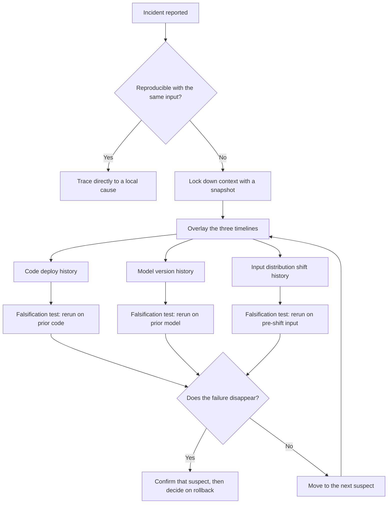

This post is for engineers who've hit an AI feature outage with no stack trace to work from. If you've reentered the same input only to have it not reproduce, watched error logs stay clean while user complaints pile up, this should help. We cover how to capture a failure that won't reproduce, the order for narrowing the cause across three branches, input distribution, model changes, and code changes, how to notice quality that's quietly degrading during an incident investigation, and the criteria for deciding on a rollback.

## The Fact That It Won't Reproduce Is Itself the First Clue

Ordinary software debugging assumes reproducibility. Feed it the same input, get the same output, plant a breakpoint somewhere in between, and the cause reveals itself. In AI systems, that assumption breaks down often. With a sampling temperature in play, the same input yields a different output every time. During batch processing, subtle differences in GPU kernel execution order can shift floating-point results. In a retrieval-augmented setup, the reference documents themselves can change out from under you when the index refreshes. And above all, models served through an API get swapped behind the scenes without our knowing.

So when a report comes in, if your first move is trying to reproduce it with the same input, you're likely burning time. What you should do instead is capture the entire context of that moment intact, because the conditions that produced the failure are unlikely to return.

Context here means more than the input text. It includes which model version answered, which prompt template version was in use, the commit hash of the code that was running, the sampling parameters, the results of any retrieval or tool calls, and the raw response before post-processing. If you plan to look any of these up separately after the fact, there's a good chance they'll already be gone. Models get updated to new versions, indexes get rebuilt, caches expire.

```python
def capture_failure_snapshot(request_id, prompt, raw_response, metadata):
    """Captures the full context intact at the moment of failure or escalation."""
    snapshot = {
        "request_id": request_id,
        "timestamp": metadata["timestamp"],
        "model_version": metadata["model_version"],
        "prompt_template_version": metadata["prompt_template_version"],
        "code_revision": metadata["git_sha"],
        "sampling_params": metadata["sampling_params"],
        "retrieved_context": metadata.get("retrieved_context"),
        "raw_response": raw_response,
        "postprocessed_response": metadata.get("postprocessed_response"),
    }
    durable_store.put(f"snapshot/{request_id}", snapshot)
    return snapshot
```

This snapshot isn't for reproducing the failure later, it's for analyzing it later. When you narrow the cause down across three branches, this snapshot becomes the only evidence of that moment you have.

The problem grows for multi-turn conversational features. The failure might surface on the third turn while the cause is context that got attached wrong on the first turn. Unless you group snapshots by session rather than by individual request, looking only at the failed turn in isolation shows you nothing. You need to be able to restore the entire session in order to pinpoint where the conversation went off track. There's an extra layer to this when you're using a model served through an API: providers not infrequently adjust internal weights or system prompts without notice, so if a model version identifier ever rides along in the response headers, log that in the snapshot too. Otherwise, weeks later, you'll have no way to even know which model answered on a given day.

## Interrogate the Three Suspects in Order

When something goes wrong in an AI system, there are broadly only three things that can have changed: what people are sending, that is, the input distribution; what the model is doing, that is, the model version or weights; and what our own code is doing, that is, the prompt template or post-processing logic. Dig into all three at once and your time scatters. You need an order.



The most efficient order isn't reasoning through the mechanism first, it's overlaying the timelines first. Lay the code deploy history, the model version change history, and the moments where input distribution shifted noticeably side by side on a single timeline. Whatever change lines up exactly with when the incident started is the leading suspect. If a quiet quality degradation started at 3 a.m., a post-processing regex change made at 2:58 is a far stronger suspect than a coincidental shift in traffic patterns.

Don't lock in a verdict just because the timing overlaps, though. There's a trap here: code deploys, config changes, and a scheduled model swap can all cluster around a similar time. If you view the three timelines on three separate dashboards, this clustering won't stand out. When you start an incident investigation, get in the habit of merging all three histories into one unified table first.

The fastest way to confirm which of the three suspects is the real cause isn't confirmation, it's falsification. Take the snapshot you captured earlier as a fixed input, roll back one variable at a time to its prior state, rerun, and watch whether the failure disappears. Roll back all three variables at once and you lose the ability to tell which one was the cause all over again.

| Suspect | Falsification test | Rough time |
|---|---|---|
| Input distribution | Rerun a sample of recent requests on the pre-change code and model | Minutes |
| Model version | Rerun the same snapshot input on the prior model version and compare output | Minutes to tens of minutes |
| Code change | Rerun the same snapshot in an environment rolled back to the previous commit | Depends on the deploy pipeline |

Whichever of the three tests makes the failure disappear is the closest thing you have to the real cause. If none of the three reproduces the failure, it only shows up in some combination of the three variables, so you need to move on to combined testing.

## Catch Silently Degrading Quality With Incident Statistics

What we've covered so far is a failure that's visible. The trickier kind is quality that degrades gradually with no errors and no crashes. This investigation isn't the place to design new instrumentation. You use what's already accumulated, things like the rate of negative user feedback, the rate of escalation to a human, or the share of outputs your existing validation logic filtered out. What you can newly add at the diagnostic stage isn't more dashboard metrics, it's a blind comparison using the snapshots you already collected.

Concretely, you pull equal-sized snapshot samples from before and after the suspected change point. Pair up requests of the same type, place the before and after responses side by side, and compare them blind. This review needs to be run by a third party, not the person who made the change; judging your own code, you tend to go unconsciously easy on it. A human eye still catches semantic degradation that automated metrics miss.

```python
def sample_before_after_pairs(store, cutover_time, cluster_key, n=40):
    """Samples similar requests before and after the suspected point for a blind comparison."""
    before = store.query(before=cutover_time, cluster=cluster_key, limit=n)
    after = store.query(after=cutover_time, cluster=cluster_key, limit=n)
    pairs = match_by_input_similarity(before, after)
    return [
        {"pair_id": i, "left": p.before.response, "right": p.after.response}
        for i, p in enumerate(pairs)
    ]
```

`cluster_key` matters here. If the previous section narrowed things down to a specific suspect, the comparison sample should be limited to the request group that suspect touches, not the full traffic. A low-frequency degradation, diluted across all traffic, won't turn up even in a blind comparison.

It's also common to see teams take comfort in numeric metrics alone. Surface statistics like response length or response time stay flat while the accuracy of the content quietly slips, and this happens more often than you'd think. If a summarization feature keeps the same sentence structure and length while quietly pulling the wrong key figure, length distribution and response-time metrics will never catch it. This is exactly the kind of degradation that only surfaces when a human actually reads the content in a blind comparison. Which is why a blind comparison during an incident investigation is needed more, not less, when the surface metrics look fine. Metrics reporting no anomaly is not grounds for ruling out a silent degradation.

## Decide a Rollback by Comparing Losses, Not by Waiting for Certainty

The most common reason a rollback decision gets delayed is that the team wants to be fully certain of the cause before acting. But an outage won't wait for certainty to arrive. Deciding on a rollback doesn't require fully confirming the cause, it requires only two judgments: that the recent change is a plausible suspect, and that the cost of rolling back is lower than the cost of leaving the degradation in place.

```python
def should_rollback(time_overlap, impact_per_hour, rollback_cost_min, elapsed_min):
    """Recommends a rollback when the suspect overlaps in time and the ongoing cost exceeds the rollback cost."""
    if not time_overlap:
        return False
    ongoing_cost = impact_per_hour * (elapsed_min / 60)
    return ongoing_cost > rollback_cost_min * 2
```

Understanding this asymmetry is the key. Rolling back a code deploy or a pinned model version generally finishes within a few minutes and is itself reversible. Running an unconfirmed suspect in production, on the other hand, keeps accumulating damage in proportion to time and traffic. So the default posture during diagnosis should be to roll back first and keep investigating afterward. The exception is only when the rollback itself carries a comparable risk, for instance when it would also revert a data schema, or when the previous version already had a separate known defect.

Deciding in advance which conditions warrant a reflexive rollback and which don't cuts down on debate in the middle of an incident. If the suspect and the incident's start time overlap clearly, and the version you'd roll back to has a long, stable operating history, go ahead and roll back reflexively. Conversely, if the rollback would also need to revert a database migration or schema change, or if the previous version itself carried a separate known defect, pause the reflex and think it through first. Writing these two conditions into your incident response docs ahead of time means the on-call engineer doesn't have to carry the full weight of that judgment alone in the middle of an incident.

A rollback doesn't end with the decision. Record the decision's timestamp and rationale, and set a clear point to re-check. If metrics recover after the rollback, that's strong circumstantial evidence the suspect was right, not definitive proof. If they don't recover, move on to the next suspect. Treat the rollback not as a failure but as the outcome of cheaply testing one hypothesis.

## From ThakiCloud's Perspective

We serve models directly in our clients' on-prem Kubernetes environments. That means we can't lean on a single shared external logging or tracing service, and multiple client clusters run simultaneously on slightly different combinations of code, model, and data versions. For us, merging those three timelines mentioned earlier is a per-cluster task, not a company-wide one.

There's one more falsification test we reach for often in practice. When an incident hits one cluster, we first check whether the same code and model version is running stably at the same time on a different client cluster. If it is, the odds that the defect lies in the code or model itself drop, and the input distribution or environment configuration feeding that specific cluster becomes the stronger suspect. It's a falsification test you can run in a few minutes without building any new instrumentation.

We also factor in that rollback cost differs by environment. Reverting a model version pointer is light, but reverting a deployment tied into GPU scheduling comes with queue wait time attached. Because we schedule GPU jobs on Kueue, we account for that wait time up front when making a rollback decision.

Session-level snapshots carry particular value in an on-prem environment, too. Since we serve under the condition that client data never leaves the premises, the only thing we can directly examine when an incident hits is the context we saved at that moment. Our room to go back and reproduce something with the same input after the fact is narrower than in a typical cloud service. So the habit of capturing failure-time context without letting anything slip is, for us, closer to a prerequisite than a choice.

## Summary

Faced with an AI outage that won't reproduce, the first move is not to try to reproduce it but to capture the entire context of that moment intact. Next, overlay the three timelines, input, model, and code, to find the change that lines up in time, then narrow it down with falsification tests that roll back one variable at a time. Quality that degrades quietly without errors gets caught with a blind comparison, using signals that are already stockpiled as material. And rollback gets decided not by full certainty but by comparing the cost of leaving it in place against the cost of rolling back. Without this order, a team can spend hours hunting for the cause and still end up leaving the outage unaddressed, unable to reach a decision.

This post is a blog rewrite of a section from our ebook 『AI Production Debugging』, compiled while we operated our internal automation pipelines.
