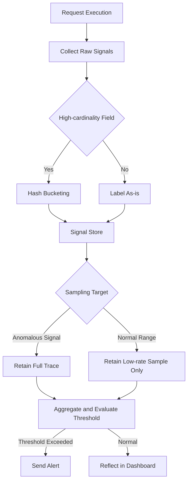

This post is for engineers already running an LLM feature in production who aren't sure whether it's actually working right now. When your latency and error rate graphs look no different than usual, but user complaints are climbing, this covers what you need to measure to make that gap visible on screen.

Existing APM (Application Performance Monitoring) tools are excellent at measuring how many milliseconds a request took and what response code came back. The problem is that in LLM systems, the real incidents mostly happen inside a 200 OK. The response arrives on time and the format is correct, but the content is wrong. So instead of the mechanics of measuring latency or token usage, this post focuses on what to extract as signal and by what criteria to put that signal on a dashboard or into an alert.

## Where Existing APM Metrics Fall Short

The set of metrics traditionally used to observe a backend service usually boils down to three: request rate, error rate, and latency. There's a clear reason this combination has survived so long. In these services, failure is almost always loud. A timed-out query throws a 500, a full disk breaks writes, and a dead dependency flips a health check to red. The boundary between failure and success is sharp enough that simply counting that boundary summarizes system state fairly accurately.

That premise collapses the moment you put an LLM into the call path. The model returns a slightly different sentence every time even for the same input, and whether that sentence matches the facts is something no HTTP status code can tell you. A request can finish in 800 milliseconds, the JSON can parse fine, and the summary can still have dropped the source's main point or cited a number that doesn't exist. This kind of failure never shows up as an error in the log. It passes through the system looking exactly like a normal response. So a dashboard that only watches latency and error rate can keep showing green for a service that's actually degrading.

Closing this gap requires widening what you observe in the first place. You need a proxy metric that captures not whether a request succeeded, but how trustworthy that success actually is. The next section is about where to pull that proxy metric from. Note that the methodology for scoring that trustworthiness, meaning how to build a golden set and design an LLM judge, is a separate topic in its own right and isn't covered here; instead, the focus is on how to route the scored result into a signal.

## How to Turn Quality Degradation Into a Signal

The word quality can't be measured on its own. You have to break it down into measurable proxy metrics before it can go on a dashboard. Fortunately, several structural signals that correlate with quality degradation already exist inside the LLM pipeline. There's no need to build anything new, you just have to pull them out of the pipeline that's already running.

The cheapest signal is the distribution of `finish_reason`. If the rate of normal completion (stop) suddenly drops while hitting the max length (length) or getting blocked by a content filter rises, it means the model is failing to finish its answer, or that the input distribution has shifted toward triggering the filter. This value is already in the API response, so all you need to do is aggregate it, no extra computation required.

Retry rate is similarly cheap. If the share of requests retried due to schema validation failures or output format errors rises above the usual level, that's a signal the model is misinterpreting instructions more often. Layering validation success rate on top makes this even tighter. In a system that parses responses into structured fields, keeping a per-field validation function and stacking the pass rate as a time series lets you narrow down which field is generating more errors.

The third is link integrity between tool call results and generated text. In a structure where an agent calls an external API and generates a sentence based on the result, you can insert code that checks whether the value the tool returned actually matches the value that shows up in the final sentence. Targeting only exactly-comparable fields, like numbers or proper nouns, is already enough to produce a useful signal.

Below is an example of pulling these signals out of a single request log stream. The key is not to build complicated judgment logic, but to gather only the values the pipeline already knows and turn them into ratios.

```python
from collections import Counter
from dataclasses import dataclass

@dataclass
class RequestSignal:
    finish_reason: str
    schema_retry_count: int
    field_validation_passed: bool
    tool_result_matched: bool | None  # None if there was no tool call

def summarize(signals: list[RequestSignal]) -> dict:
    total = len(signals)
    reasons = Counter(s.finish_reason for s in signals)
    tool_calls = [s for s in signals if s.tool_result_matched is not None]

    return {
        "finish_reason_ratio": {k: v / total for k, v in reasons.items()},
        "retry_rate": sum(s.schema_retry_count > 0 for s in signals) / total,
        "field_validation_rate": sum(s.field_validation_passed for s in signals) / total,
        "tool_mismatch_rate": (
            sum(not s.tool_result_matched for s in tool_calls) / len(tool_calls)
            if tool_calls else None
        ),
    }
```

Just stacking these four ratios along a time axis turns a vague question like "why did the summary get weird" into a concrete one like "field validation rate dropped 12 percent starting yesterday afternoon." It doesn't fully explain the cause, but it does a solid job of telling you where to start looking.

## Tying the Three Layers of Signal Into One Language

The three kinds of signal, latency, tokens, and validation, tell different stories when viewed separately. A rise in latency doesn't necessarily mean quality dropped, and a rise in token consumption isn't necessarily a bad sign either. It's only when you tie these three layers together by request that they start explaining each other.

For example, if latency rises while output token count and the validation failure rate rise together with it, there's a good chance the model is dragging things out by repeating the same content. Conversely, if latency stays flat but only the validation failure rate rises, the cause is more likely in the input distribution or the prompt, not speed. Without tying the three layers to the same request ID, this kind of contrast is simply impossible.

Drawn out, this integration looks like the flow below. Multiple raw signals get pulled from a single request, labels get organized, what to keep and what to drop gets split apart, and after aggregation and threshold evaluation the flow branches into a dashboard or an alert.



What I want to emphasize here is the difference in storage form. Signals that summarize into numbers, like latency, token count, or validation pass rate, get stored as time-series metrics, which stay cheap to retain for a long time. On the other hand, when you need to reconstruct why a specific request produced a specific value, you need a trace that carries the full prompt and the order of tool calls. Because these two storage forms have different cost structures, it's better to route summary values into metrics and keep the raw form only when needed, rather than dumping every signal into a single trace. The cardinality and sampling covered in the next section are exactly how this distinction gets implemented in practice.

## Cardinality and Sampling: What to Keep, and How Much

In a metrics system, cardinality means the number of distinct label combinations. If you attach a field with effectively unlimited possible values, like `user_id`, a session identifier, or a prompt hash, directly as a label, the time-series database spawns a new time series for every combination. LLM systems are especially vulnerable to this as user count grows and conversations get longer, because every request spawns a new session, and every session spawns a new label combination.

The fix is not to erase unique values from the label, but to relocate them. Keep only low-cardinality fields on the metric labels used for aggregation, and either bucket unique values that identify a user or session with a hash, or keep them only as trace attributes. Since traces are stored per request, they never trigger label explosion.

```python
import hashlib

BUCKET_COUNT = 64

def bucket_label(raw_id: str) -> str:
    """Reduces a unique identifier to a bucket usable as a label.
    The original raw_id stays a trace attribute only, never a metric label."""
    digest = hashlib.sha256(raw_id.encode()).hexdigest()
    bucket = int(digest, 16) % BUCKET_COUNT
    return f"bucket_{bucket:02d}"

# metric labels: model, request_type, finish_reason, user_bucket
# trace attributes: user_id, session_id, prompt_hash (kept in full)
```

This way, you never fully lose an outlier caused by user variance, while the number of label combinations stays fixed at the bucket count regardless of user count. If a specific bucket's value spikes, you go back and find the traces belonging to that bucket to narrow down the actual cause, using both storage forms together.

Sampling is designed on the same principle. Storing the trace of every single request scales storage cost directly with traffic, but sampling uniformly at a low rate risks missing exactly the anomalous requests you need to see. A practical compromise is tail sampling: decide whether to retain a trace after seeing the outcome of the request. Requests where latency crossed a certain percentile, validation failed, or a tool result mismatch was detected get retained in full, while the rest of the normal-range requests get kept at a low rate.

```python
def should_retain(latency_ms: float, p95_ms: float,
                   validation_failed: bool, tool_mismatch: bool,
                   base_sample_rate: float = 0.02) -> bool:
    if validation_failed or tool_mismatch:
        return True
    if latency_ms > p95_ms:
        return True
    import random
    return random.random() < base_sample_rate
```

The advantage of this approach is that storage cost attaches to the rate of anomalous requests, not total traffic volume. As long as the proportion of normal requests holds steady even as the service grows, storage cost only rises gently, and you never miss the requests that actually deserve a look. That said, the threshold value itself, meaning what counts as anomalous, shouldn't stay statically fixed; it needs to be recalculated periodically based on the recent distribution. If traffic patterns are seasonal, or a new feature launch changes the prompt structure itself, yesterday's p95 stops being a valid baseline for anomalies today.

## Design Criteria for Dashboards and Alerts

Even with every signal collected, nobody looks at a cluttered dashboard. The most common mistake in dashboard design is laying out every collected signal on the same screen at the same size. When you do that, exactly the signal you need to see right now gets buried among twenty other panels. It's better to put just one summary for each of the three layers (latency, tokens, validation) at the top of the screen, and let detailed breakdowns unfold in a lower tier only when needed.

Latency signals should be viewed as percentiles, not averages. An average is easily hidden by a handful of very slow requests, and it's exactly that handful where users bounce. p50 shows the typical experience, while p95 or p99 shows what's happening at the tail, so plotting both together is what makes the picture meaningful.

For an alert threshold, setting it as a deviation from a recent baseline reduces false positives better than fixing it as a single static number. Since computing a baseline takes time, though, a new signal that hasn't accumulated enough data yet should keep an absolute threshold as a backup. And rather than firing an alert on a single spike, requiring a set proportion of a continuous observation window to cross the bar before firing significantly cuts alert fatigue from transient noise.

Alert priority should be split by the business risk the signal points to, not by the kind of signal. A slight rise in validation failure rate and a complete mismatch between a tool call result and the final answer can't be treated with the same weight. A signal like the latter, where users risk taking wrong information as fact, should go straight to a channel that reaches an owner immediately, while a signal like the former, where watching the trend is enough, should be bundled into a daily summary. Send every signal at the same alert intensity, and owners eventually respond by turning alerts off, at which point observability might as well not exist.

## From ThakiCloud's Perspective

We serve a Kubernetes-based AI platform inside customer on-premise environments. Under these conditions, one more constraint attaches to the signal design principles covered above: often, there isn't even the option of exporting prompts or traces as-is to an external managed observability service to begin with.

That makes cardinality and sampling design a near-necessity for us, not an option. We have to retain only as much trace data as the internal storage can carry, and within that limit, tail sampling based on anomaly signals is almost the only answer if we want to make sure not to miss the requests that genuinely need a look. Also, since multiple teams serve different models on the same platform, letting each team define its own label schema for signals makes cross-team comparison impossible down the road. In the end, it's simpler to define a single signal schema at the platform level and let each team's dashboard sit on top of it.

This post is a blog rewrite of part of our internal ebook, *AI Production Observability*, compiled while operating our internal automation pipelines.

## Chapter Illustrations


## Sources

- [Chat Completions API Reference, finish_reason field definition (OpenAI)](https://developers.openai.com/api/reference/resources/chat/subresources/completions/methods/retrieve)
- [Sampling Concepts, Tail Sampling explanation (OpenTelemetry)](https://opentelemetry.io/docs/concepts/sampling/)
- [Metric and Label Naming Guide, cardinality warning (Prometheus)](https://prometheus.io/docs/practices/naming/)

