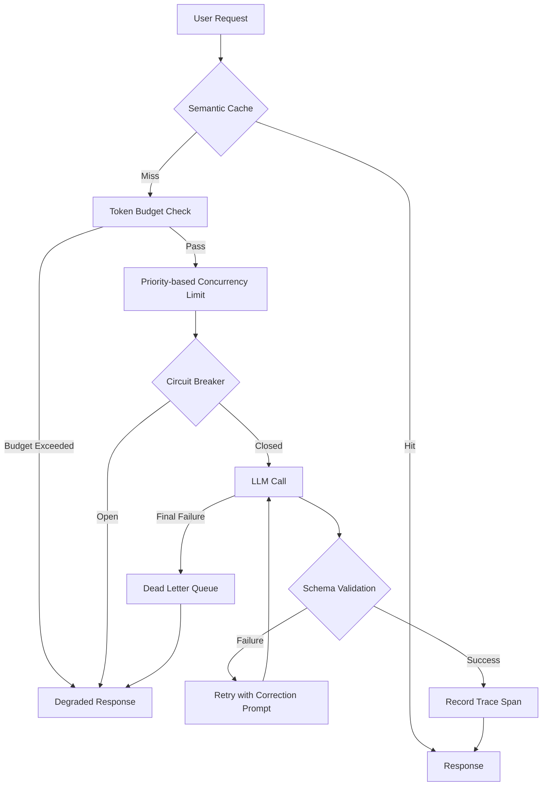

If you have ever put an LLM call in the middle of your service code, you have already lived this. A model that returned `{"result": "ok"}` yesterday returns `{"status": "success", "data": null}` today. This post is about **containing that volatility with structure** instead of just living with it. Put four control points in place, and an LLM stops being an external service you hope works out and becomes a component with a contract.

There is one decisive difference from a typical HTTP API. An ordinary API either fails or succeeds. An LLM API **succeeds while being wrong.** You get a 200 OK, the JSON parses fine, but the field names are different. That is why four separate control points are needed.

## The Path a Single Request Takes

Let's look at the full picture first. Below is the path a single request travels, and the four control points placed along it.



Cost increases as you move from the upper left to the lower right. A cutoff at the cache costs nothing. A cutoff at the budget check costs the price of one request. If a request makes it all the way to the model and then fails schema validation, you have effectively paid for that request twice. The order of the control points is itself a cost design.

## First, Enforce the Output Format Instead of Asking for It

Writing "respond only in JSON" in a prompt is not control, it is hope. What actually works is a schema, and a schema gives you three levers.

`enum` removes the options themselves. It works especially well for fields with a closed set of values, like status codes or classification labels, because it structurally eliminates any room for the model to invent `"status": "maybe"`.

`const` pins down a value that must always stay the same. This applies to fields like an API version or a delimiter.

`description` is a slightly different kind of lever. A schema is a machine-readable spec, but an LLM also reads the natural language inside it. Leave the description empty and the model interprets the field its own way; fill it in and you can steer that interpretation.

```python
from pydantic import BaseModel, Field
from openai import OpenAI
from instructor import from_openai

class ExtractionResult(BaseModel):
    name: str = Field(description="Company name")
    founded_year: int = Field(description="Year founded, numeric only")
    intent: str = Field(
        description="The intent of the user request in one sentence. Use 'unclear' if it cannot be interpreted."
    )

client = from_openai(OpenAI())
result = client.chat.completions.create(
    model="gpt-4o",
    messages=messages,
    response_model=ExtractionResult,
)
```

This is where it's easy to miss something: retries. When schema validation fails, **resending the exact same prompt is almost pointless.** If the model misinterpreted the spec once, it will repeat the same misunderstanding on the same input. A retry has to change the input.

```python
SCHEMA_RETRY_HINT = """The previous response did not follow the requested schema.
- Do not invent fields that are not in the schema
- Do not omit required fields
- Follow the type and description of each field"""

for attempt in range(MAX_RETRIES):
    try:
        return client.chat.completions.create(
            model="gpt-4o",
            messages=messages,
            response_model=ExtractionResult,
            max_retries=0,  # this loop owns the retries
        )
    except ValidationError:
        if attempt == MAX_RETRIES - 1:
            raise
        messages.append({"role": "user", "content": SCHEMA_RETRY_HINT})
```

Schemas also have a cost side. The more fields there are and the deeper the nesting, the more tokens the model spends filling in that structure. Simply not carrying temporary fields you added for debugging into production already cuts response tokens. Reducing the number of fields, flattening nesting, and keeping descriptions short are, directly, cost savings.

## Second, Stream by Meaning, Not by Token

The reason to add streaming is not raw speed, it's perceived speed. When the first character appears quickly, users feel like they waited less.

But if you flush tokens to the screen as they arrive, users see sentences get built halfway and then rewritten. It reads better to **batch output into units where meaning is complete**, like a sentence or paragraph. The implementation is simpler than it sounds: accumulate into a buffer and flush at sentence boundaries.

```python
async def semantic_chunks(stream, boundaries=(". ", ".\n", "?\n", "!\n"), cap=120):
    buf = ""
    async for chunk in stream:
        delta = chunk.choices[0].delta.content or ""
        buf += delta
        # Flush when a sentence closes or the buffer gets too long
        if any(buf.endswith(b) for b in boundaries) or len(buf) >= cap:
            yield buf
            buf = ""
    if buf:
        yield buf
```

There's a reason `cap` exists. When generating a code block or a table, punctuation marks don't show up for a long stretch, so if you only wait for a boundary, the screen looks frozen for several seconds. The length cap prevents that stall.

For the transport layer, Server-Sent Events is enough if the flow is one-directional, and WebSocket is only needed when you have to accept user input mid-stream. SSE carries less operational burden, since the browser handles reconnection logic on its own.

The genuinely hard part of streaming is state management. If you haven't decided how far you got when a connection drops, whether to keep or discard the partial result, and whether to stop generation on the server side, **tokens quietly leak out with every dropped connection.** Even if a user closes the tab, the server keeps generating to completion and you still get billed for it. I strongly recommend building a path that detects client disconnection and cancels generation.

One metric is not enough either. You need to measure TTFT (time to first token) and total completion time separately to see where the slowdown actually is. If you only look at an average response time that blends the two, you can't tell whether the model is slow or the queue is backed up.

## Third, Contain Failure Instead of Preventing It

LLM APIs fail. You hit rate limits, gateways get shaky, and sometimes things slow down for no clear reason. The goal is not to eliminate failure, it's **to keep failure from spreading.** Four mechanisms at different layers handle this.

**Exponential backoff with jitter.** Doubling the retry interval each time isn't enough on its own. Requests that fail together tend to retry together, so the same wave just crashes back in. You need to mix randomness into the wait time to spread the wave out.

```python
def backoff_with_jitter(attempt, base=1.0, cap=60.0, ratio=0.5):
    delay = min(base * (2 ** attempt), cap)
    half = delay * ratio
    return half + random.uniform(0, half)
```

**Circuit breaker.** A request that keeps failing loses you more the more you retry it. Once failures cross a threshold, open the circuit, return failure immediately, and after a set interval let only a small number of requests through to check for recovery. Because LLM APIs fail on rate limits fairly often, it's generally better to set the threshold low.

**Bulkhead.** If the first two are reactions after an incident, this one lowers the probability of the incident itself. The name comes from a ship's watertight compartments, a structure that keeps the whole ship from sinking even if one compartment floods. Splitting concurrency limits by priority keeps a large batch job from crowding out user-facing requests.

```python
class PrioritySemaphore:
    def __init__(self):
        self.high = asyncio.Semaphore(10)
        self.normal = asyncio.Semaphore(5)
        self.low = asyncio.Semaphore(2)
```

**Dead letter queue.** Requests that still fail after all of that get kept, not dropped. Recording the original message, the error type, and the retry count together lets you reprocess later. The real value of a DLQ is less about reprocessing and more about signal. The volume and kind of items that pile up here tell you the system's state.

## Fourth, Cost and Tracing Cannot Be Bolted On Later

LLM cost doesn't spike all at once, it builds up quietly. Conversation history grows longer, the same question gets recomputed over and over with no cache, and a generously set `max_tokens` stacks on top of both.

On the input side, the control with the biggest effect is limiting conversation history length. A simple rule that drops old messages tends to work better than a sophisticated prompt-compression technique. On the output side it's `max_tokens`: set it too high and you waste money, too low and outputs get truncated. It's safer to track the rate of `finish_reason` coming back as `length` as a metric and tune from there.

You also need to decide in advance what happens when the budget runs out. Rejecting everything just stops the service, so responses should vary by priority: let critical requests through no matter what, reroute normal requests to a cheaper model, and block only low-priority ones.

```python
TIERS = {                       # if the burn rate exceeds this value, take this action
    "critical": (1.00, "proceed"),
    "high":     (0.90, "warn"),
    "normal":   (0.80, "fallback"),   # reroute to a cheaper model
    "low":      (0.50, "reject"),
}

def decide(priority, used_ratio):
    limit, action = TIERS.get(priority, TIERS["normal"])
    return "proceed" if used_ratio < limit else action
```

What matters in this table isn't the specific numbers, it's **the order in which the lowest priority dies first.** A batch indexing job stalling at month-end and a summary on the checkout screen stalling are completely different events.

**Semantic caching** counts a hit even when the string isn't an exact match. It embeds the request and judges similarity, and the one value that matters here is the threshold. At 0.95 you get almost no hits; drop it to 0.85 and the hit rate rises, but so does the risk of returning someone else's answer to a different question. This number should be set by watching real traffic, not by theory.

**Tracing** has to go in from the start. Once a single request starts passing through a model call, a cache lookup, and a vector search, logs alone can't tell you where the slowdown is. There are three options. LangSmith is a managed service run by LangChain that's easy to wire up, LangFuse can be self-hosted so your data never has to leave your infrastructure, and OpenTelemetry is the industry standard, so you can swap the backend later.

```python
with tracer.start_as_current_span("llm_call") as span:
    span.set_attribute("llm.model", model)
    response = client.chat.completions.create(model=model, messages=messages)
    span.set_attribute("llm.tokens_used", response.usage.total_tokens)
    span.set_attribute("llm.ttft_ms", ttft * 1000)
```

What you record on a span determines what you can analyze later. At minimum, I'd recommend keeping the model name, input and output token counts, TTFT, total elapsed time, and, if it failed, the error type.

Last is the face the user sees. When retries have failed and the circuit is open, just showing "a temporary error occurred" leaves users with no idea what to do. It's better to tell them, if it's a rate limit, how long until they can try again, or if the input was too long, how much to trim. Building a degrade option in advance, like falling back to a keyword summary when an AI summary fails, instead of just turning the feature off, keeps failure from spreading into a full service outage.

## From ThakiCloud's Perspective

We serve models directly inside customer environments. Because of that, we've repeatedly confirmed that these four control points need to live in the platform, not in application code.

This is especially true for token budgets and priority isolation. If every team embeds its own budget logic in its own application code, the rules fracture into as many versions as there are teams. It's far simpler to define priority and concurrency once at the GPU scheduling layer. That's also why our platform handles priority queues on top of Kueue.

Tracing is no different. In on-premise environments, sending prompts out to an external managed tracing service often isn't an option to begin with. Conforming to the OpenTelemetry span spec while keeping the backend inside the perimeter is the realistic answer.

## Summary

Turning an LLM API into a reliable component isn't about picking the right model, it's about **what you put around the model.** Constrain format with a schema, chunk streaming by meaning, contain failure with circuits and bulkheads, and give cost and tracing a place from the very start. Only when all four are in place together does the failure of some requests stop shaking the whole system.

This post is a blog rewrite of part of our internal ebook, *AI API Engineering*, compiled while operating our internal automation pipelines.
